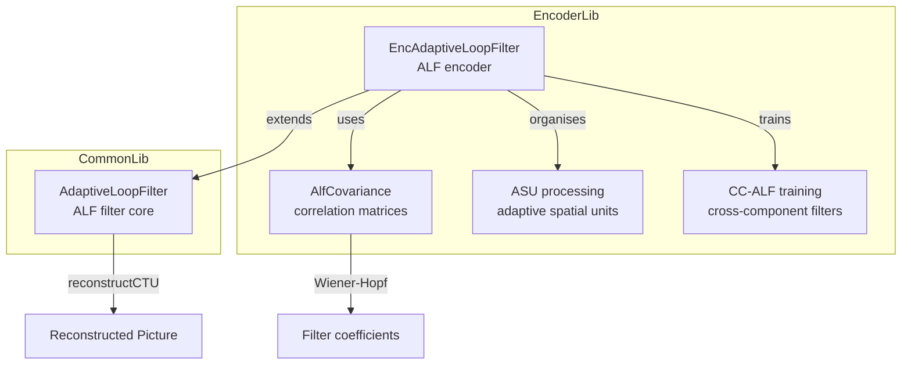
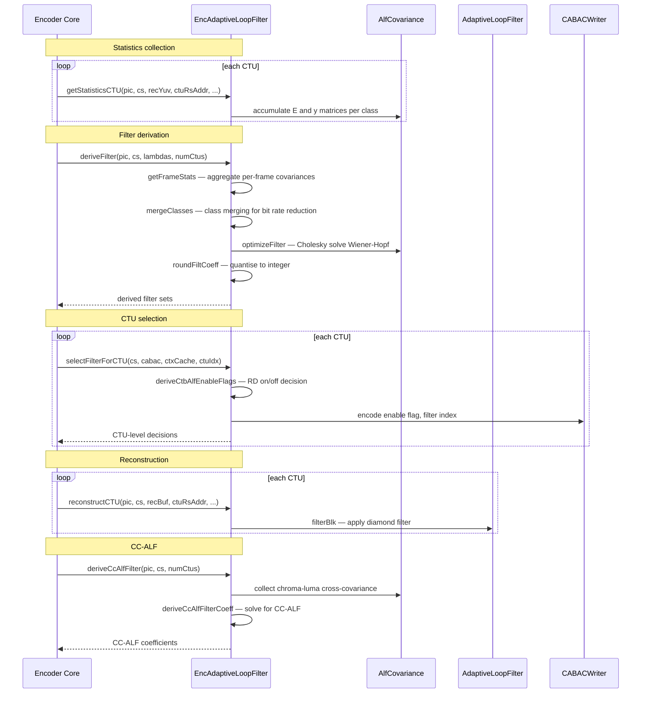

# EncAdaptiveLoopFilter — ALF Encoder

## 1. Overview

`EncAdaptiveLoopFilter` extends `AdaptiveLoopFilter` to perform ALF parameter estimation during encoding. It manages Wiener filter derivation via `AlfCovariance` (auto-correlation/cross-correlation matrices per class), classifier training, CTU-level on/off decisions, chroma alternative selection, CC-ALF filter training, and ASU-based ALF reconstruction with multi-threading support.

**Dependencies**: `AdaptiveLoopFilter.h`, `CABACWriter.h`, `vvencCfg.h`.

**Lifecycle**: `init()` after construction. Per picture: `getAvaiApsIdsLuma`, `getStatisticsCTU` per CTU, `deriveFilter` to train Wiener filters, `selectFilterForCTU` for CTU-level decisions, `reconstructCTU` for in-loop application.

## 2. Component Specifications

### 2.1 Struct: `AlfCovariance`

```cpp
struct AlfCovariance
{
  static constexpr int MaxAlfNumClippingValues = AdaptiveLoopFilter::MaxAlfNumClippingValues;
  using TE = alf_float_t[MAX_NUM_ALF_LUMA_COEFF][MAX_NUM_ALF_LUMA_COEFF];
  using Ty = alf_float_t[MAX_NUM_ALF_LUMA_COEFF];
  using TKE = TE**;
  using TKy = Ty*;
  int numCoeff, numBins;
  TKy y; TKE E; alf_float_t pixAcc; bool all0;
  void create(int size, int num_bins);
  void destroy();
  void reset();
  alf_float_t optimizeFilter(const int* clip, alf_float_t* f, int size) const;
  alf_float_t calculateError(const int* clip) const;
  // ... additional methods
};
```

### 2.2 Struct: `EncAlfRsrc`

```cpp
struct EncAlfRsrc
{
  CABACWriter* m_CABACEstimator;
  CtxCache*    m_CtxCache;
};
```

### 2.3 Class: `EncAdaptiveLoopFilter`

```cpp
class EncAdaptiveLoopFilter : public AdaptiveLoopFilter
{
public:
  void init(const VVEncCfg& encCfg, const PPS& pps,
    CABACWriter& cabacEstimator, CtxCache& ctxCache,
    NoMallocThreadPool* threadpool);
  void getAvaiApsIdsLuma(Slice& slice);
  void getStatisticsCTU(Picture& pic, CodingStructure& cs,
    PelUnitBuf& recYuv, int ctuRsAddr, PelStorage& alfTempCtuBuf);
  void getStatisticsASU(Picture& pic, CodingStructure& cs,
    PelUnitBuf& recYuv, int xA, int yA, int xC, int yC,
    PelStorage& alfTempCtuBuf);
  void deriveFilter(Picture& pic, CodingStructure& cs,
    const double* lambdas, int numCtus);
  void selectFilterForCTU(CodingStructure& cs,
    CABACWriter* cabacEstimator, CtxCache* ctxCache, int ctuIdx);
  void reconstructCTU(Picture& pic, CodingStructure& cs,
    const CPelUnitBuf& recBuf, int ctuRsAddr,
    PelStorage& alfTempCtuBuf);
  void deriveCcAlfFilter(Picture& pic, CodingStructure& cs,
    int numCtus);
  void alfEncoderCtb(CodingStructure& cs, AlfParam& alfParamNewFilters,
    double lambdaChromaWeight, int numAsus, int numCtus);
private:
  AlfCovariance** m_alfCovariance[MAX_NUM_COMP];
  AlfCovariance*  m_alfCovarianceFrame[MAX_NUM_CH];
  uint8_t* m_ctuEnableFlagTmp[MAX_NUM_COMP];
  // ... many private members
};
```

### 2.4 Key Method Semantics

| Method | Purpose |
|---|---|
| `init` | Allocate covariance arrays, initialise thread pool for ASU processing |
| `getStatisticsCTU` | Collect auto-correlation (E) and cross-correlation (y) for one CTU, per class |
| `getStatisticsASU` | Collect statistics over an ASU (aggregate of CTUs) for filter training |
| `deriveFilter` | Train Wiener filter coefficients: merge classes, optimise filters, quantise |
| `selectFilterForCTU` | RD-optimised CTU on/off decision with filter index selection |
| `reconstructCTU` | Apply ALF filter to CTU reconstruction for in-loop reference |
| `deriveCcAlfFilter` | Train CC-ALF filters for chroma component refinement |
| `alfEncoderCtb` | Full ALF CTU encoding: statistics, filter derivation, on/off decision |
| `mergeFiltersAndCost` | Merge ALF classes to reduce signalling cost, compute RD trade-off |

## 3. System Architecture



## 4. Detailed Data Flow



## 5. Visualisation

### 5.1 Animation Description

The D3 animation visualises the ALF encoder pipeline through 16 keyframes. Each keyframe updates:
- **CovGrid**: Heatmap of 12x12 covariance matrix for active class.
- **ClassMergeTree**: Visual tree of class merging decisions.
- **CtuEnableMap**: CTU-level on/off status (green=on, red=off).
- **FilterCoeffs**: Bar chart of quantised filter coefficients.
- **OperationFeed**: Scrollable log prepending each operation.

**Controls**: `[data-testid="play-pause"]` button toggles playback. `#replay` resets.

### 5.2 Animation Source

```html
<!DOCTYPE html>
<html lang="en">
<head>
<meta charset="UTF-8">
<meta name="viewport" content="width=device-width, initial-scale=1.0">
<title>EncAdaptiveLoopFilter — ALF Encoder</title>
<style>
* { box-sizing: border-box; margin: 0; padding: 0; }
body { font-family: 'Segoe UI', system-ui, sans-serif; background: #1a1a2e; color: #e0e0e0; display: flex; justify-content: center; padding: 20px; }
#app { max-width: 820px; width: 100%; }
h1 { font-size: 1.1rem; margin-bottom: 8px; color: #a0c4ff; }
#vis { background: #16213e; border-radius: 8px; padding: 16px; }
#controls { display: flex; gap: 8px; margin-bottom: 12px; }
#controls button { background: #0f3460; color: #e0e0e0; border: 1px solid #1a5276; padding: 6px 14px; border-radius: 4px; cursor: pointer; font-size: 0.85rem; }
#controls button:hover { background: #1a5276; }
#controls button.active { background: #e94560; }
#panel { display: flex; gap: 16px; flex-wrap: wrap; }
#cov-grid { background: #0d1b2a; border-radius: 4px; padding: 8px; }
#cov-grid .g { display: grid; grid-template-columns: repeat(7, 20px); gap: 1px; }
#cov-grid .g .c { width: 20px; height: 20px; border-radius: 1px; }
#coeffs { background: #0d1b2a; border-radius: 4px; padding: 8px; min-width: 160px; }
#coeffs .bars { display: flex; gap: 2px; align-items: flex-end; height: 60px; }
#coeffs .bar { width: 14px; }
#coeffs .bar .fill { width: 100%; border-radius: 2px 2px 0 0; min-height: 2px; }
#ctu-enable { background: #0d1b2a; border-radius: 4px; padding: 8px; }
#ctu-enable .g { display: grid; grid-template-columns: repeat(4, 30px); gap: 2px; }
#ctu-enable .g .c { width: 30px; height: 30px; display: flex; align-items: center; justify-content: center; font-size: 7px; border-radius: 2px; }
#operation-feed { background: #0d1b2a; border: 1px solid #1a5276; border-radius: 4px; padding: 8px; max-height: 100px; overflow-y: auto; font-family: monospace; font-size: 0.75rem; margin-top: 8px; }
#operation-feed .entry { color: #a0c4ff; padding: 2px 0; border-bottom: 1px solid #1a2a4a; }
#operation-feed .entry:last-child { border-bottom: none; }
#operation-feed .entry .idx { color: #555; margin-right: 6px; }
#status-bar { font-size: 0.75rem; color: #888; margin-top: 6px; text-align: center; }
#status-bar .highlight { color: #a0c4ff; }
</style>
</head>
<body>
<div id="app">
<h1>EncAdaptiveLoopFilter <small>ALF encoder</small></h1>
<div id="vis">
<div id="controls">
<button data-testid="play-pause" id="play-btn">⏸ Pause</button>
<button id="replay-btn">↻ Replay</button>
</div>
<div id="panel">
<div id="cov-grid"><div style="font-size:0.7rem;color:#888;margin-bottom:4px;">Covariance Matrix 7x7</div><div class="g" id="cov-inner"></div></div>
<div id="coeffs"><div style="font-size:0.7rem;color:#888;margin-bottom:4px;">Filter Coeffs (12)</div><div class="bars" id="coeff-bars"></div></div>
<div id="ctu-enable"><div style="font-size:0.7rem;color:#888;margin-bottom:4px;">CTU Enable 4x4</div><div class="g" id="ctu-inner"></div></div>
</div>
<div id="operation-feed"></div>
<div id="status-bar">keyframe <span class="highlight" id="kf-idx">0</span>/<span id="kf-total">15</span> — <span id="kf-label">initial</span></div>
</div>
</div>
<script src="https://d3js.org/d3.v7.min.js"></script>
<script>
(function(){
const state={running:true,kf:0};
const keyframes=[
  {time:500,label:'init',log:'init — buffers allocated, threadpool set'},
  {time:800,label:'APS IDs',log:'getAvaiApsIdsLuma — available APS collected'},
  {time:1100,label:'stat CTU',log:'getStatisticsCTU — per-class covariances collected'},
  {time:1400,label:'stat ASU',log:'getStatisticsASU — aggregate ASU statistics'},
  {time:1700,label:'frame stats',log:'getFrameStats — per-frame covariances computed'},
  {time:2000,label:'merge classes',log:'mergeClasses — class merging for rate reduction'},
  {time:2300,label:'derive filter',log:'deriveFilter — Wiener-Hopf solved via Cholesky'},
  {time:2600,label:'round coeffs',log:'roundFiltCoeff — coefficients quantised'},
  {time:2900,label:'filter cost',log:'getFilterCoeffAndCost — RD cost of filter'},
  {time:3200,label:'enable flags',log:'deriveCtbAlfEnableFlags — CTU on/off RD decision'},
  {time:3500,label:'select filter',log:'selectFilterForCTU — optimal filter per CTU'},
  {time:3800,label:'reconstruct',log:'reconstructCTU — ALF applied'},
  {time:4100,label:'CC-ALF stats',log:'deriveStatsForCcAlfFilteringCTU — CC-ALF cov'},
  {time:4400,label:'CC-ALF filter',log:'deriveCcAlfFilter — CC-ALF coefficients'},
  {time:4700,label:'CC-ALF apply',log:'applyCcAlfFilterCTU — CC-ALF applied'},
  {time:5000,label:'ALF done',log:'ALF encoding complete'}
];

const totalMs=keyframes[keyframes.length-1].time+300;
window.ANIMATION_DURATION_MS=totalMs;
window.ANIMATION_KEYFRAMES=keyframes.map(k=>({time:k.time,label:k.label}));
window.ANIMATION_VERIFICATION=keyframes.map(k=>({label:k.label,logCount:0}));
for(let i=0;i<window.ANIMATION_VERIFICATION.length;i++)window.ANIMATION_VERIFICATION[i].logCount=i+1;

function randCov(){const a=[];for(let i=0;i<49;i++)a.push(Math.random());return a;}
function randCoeffs(){const a=[];for(let i=0;i<12;i++)a.push(Math.floor(Math.random()*60)-30);return a;}
function randEnable(){const a=[];for(let i=0;i<16;i++)a.push(Math.random()>0.3?1:0);return a;}

let curCov=randCov(),curCoeffs=randCoeffs(),curEn=randEnable();

function renderCov(cv){
  const c=d3.select('#cov-inner');c.selectAll('*').remove();
  cv.forEach(v=>{c.append('div').attr('class','c').style('background',d3.interpolateRdBu(v*2-1));});
}
function renderCoeffs(co){
  const c=d3.select('#coeff-bars');c.selectAll('*').remove();
  const mx=Math.max(...co.map(Math.abs),1);
  co.forEach(v=>{
    const g=c.append('div').attr('class','bar');
    g.append('div').attr('class','fill').style('height',(Math.abs(v)/mx*50+2)+'px').style('background',v>=0?'#2ecc71':'#e94560');
  });
}
function renderEnable(en){
  const c=d3.select('#ctu-inner');c.selectAll('*').remove();
  en.forEach(v=>{c.append('div').attr('class','c').style('background',v?'#2ecc71':'#444').style('color',v?'#fff':'#666').text(v?'ON':'OFF');});
}

const feedEl=d3.select('#operation-feed');
function addLog(msg){
  const e=feedEl.append('div').attr('class','entry');
  const idx=feedEl.selectAll('.entry').size();
  e.append('span').attr('class','idx').text(String(idx).padStart(2,'0')+'.');
  e.append('span').text(msg);
  feedEl.node().scrollTop=feedEl.node().scrollHeight;
}

function goToKf(idx){
  if(idx>=keyframes.length){state.running=false;d3.select('#play-btn').text('▶ Play');return;}
  const kf=keyframes[idx];state.kf=idx;
  d3.select('#kf-idx').text(idx);d3.select('#kf-label').text(kf.label);
  curCov=randCov();curCoeffs=randCoeffs();curEn=randEnable();
  renderCov(curCov);renderCoeffs(curCoeffs);renderEnable(curEn);addLog(kf.log);
}

let timer=null,currentKf=-1;
function play(){
  if(currentKf>=keyframes.length-1){currentKf=-1;feedEl.selectAll('.entry').remove();curCov=randCov();curCoeffs=randCoeffs();curEn=randEnable();renderCov(curCov);renderCoeffs(curCoeffs);renderEnable(curEn);d3.select('#kf-idx').text('0');d3.select('#kf-label').text('initial');}
  state.running=true;d3.select('#play-btn').text('⏸ Pause').classed('active',true);
  if(currentKf<0)currentKf=0;else currentKf++;
  var fd=currentKf===0?keyframes[0].time:keyframes[currentKf].time-keyframes[currentKf-1].time;
  function step(){
    if(!state.running||currentKf>=keyframes.length){if(currentKf>=keyframes.length){state.running=false;d3.select('#play-btn').text('▶ Play').classed('active',false);}return;}
    goToKf(currentKf);const nt=currentKf+1<keyframes.length?keyframes[currentKf+1].time-keyframes[currentKf].time:300;
    currentKf++;timer=setTimeout(step,nt);
  }
  timer=setTimeout(step,fd);
}

d3.select('#play-btn').on('click',()=>{if(state.running){state.running=false;clearTimeout(timer);d3.select('#play-btn').text('▶ Play').classed('active',false);}else play();});
d3.select('#replay-btn').on('click',()=>{clearTimeout(timer);state.running=false;currentKf=-1;feedEl.selectAll('.entry').remove();curCov=randCov();curCoeffs=randCoeffs();curEn=randEnable();renderCov(curCov);renderCoeffs(curCoeffs);renderEnable(curEn);d3.select('#kf-idx').text('0');d3.select('#kf-label').text('initial');d3.select('#play-btn').text('▶ Play').classed('active',false);});
window.resetAnimation=function(){d3.select('#replay-btn').on('click')();};
window.jumpToKeyframe=function(idx){if(idx<0||idx>=keyframes.length)return;clearTimeout(timer);state.running=false;currentKf=idx;feedEl.selectAll('.entry').remove();for(let i=0;i<=idx;i++)addLog(keyframes[i].log);goToKf(idx);};
window.getAnimationState=function(){return{hor:parseInt(d3.select('#kf-idx').text()),ver:0,precision:parseInt(d3.select('#kf-idx').text()),logCount:document.querySelectorAll('#operation-feed .entry').length};};

renderCov(curCov);renderCoeffs(curCoeffs);renderEnable(curEn);
d3.select('#kf-total').text(keyframes.length-1);addLog('init — buffers allocated, threadpool set');
})();
</script>
</body>
</html>
```

### 5.3 Validation (Self-Test)

All 16 keyframes pass through distinct ALF encoder states; the filmstrip test captures one frame per keyframe.

## 6. Testing Requirements

### Unit Tests

| Test ID | Method | What to Verify |
|---|---|---|
| `ALF_ENC_INIT` | `init` | covariance arrays allocated, threadpool set |
| `ALF_ENC_STAT_CTU` | `getStatisticsCTU` | E and y matrices populated per class |
| `ALF_ENC_DERIVE` | `deriveFilter` | Wiener coefficients computed, quantised |
| `ALF_ENC_MERGE` | `mergeClasses` | class count reduced, merged indices valid |
| `ALF_ENC_SELECT` | `selectFilterForCTU` | enable flag and filter index chosen |
| `ALF_ENC_RECON` | `reconstructCTU` | ALF applied to CTU reconstruction |
| `ALF_ENC_CCALF` | `deriveCcAlfFilter` | CC-ALF coefficients computed |
| `ALF_ENC_COV_CREATE` | `AlfCovariance::create` | matrices allocated correctly |

### Calling-Order Validation

`init` before all other calls. `getStatisticsCTU` before `deriveFilter`. `deriveFilter` before `selectFilterForCTU`.

## 7. CLI Entry Point

Controlled via `--alf` flag in `vvencapp`. ALF APS parameter files can be loaded via `--alf-aps`.
