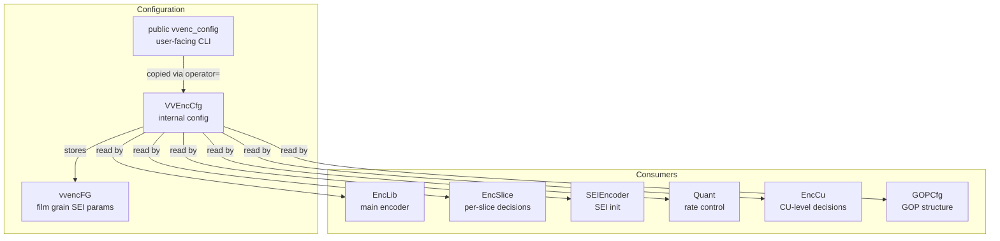
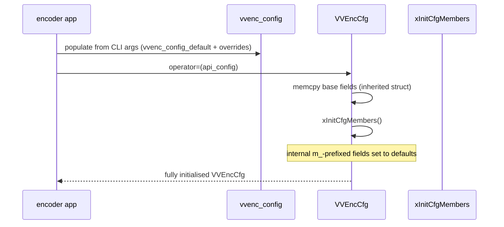
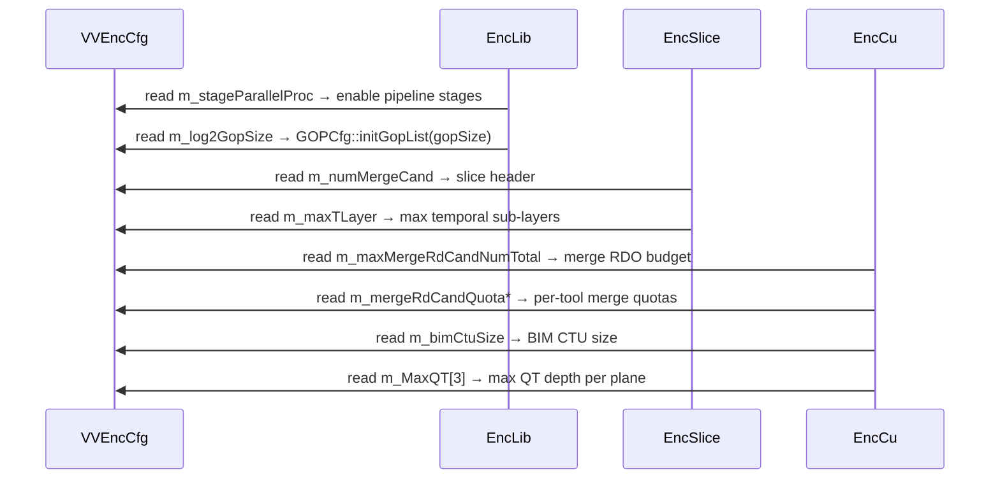

# EncCfg — Encoder Configuration Parameter Structure

## 1. Overview

The `EncCfg` module defines the internal encoder configuration struct `VVEncCfg`, which extends the public API config `vvenc_config` with additional encoder-internal parameters for rate control, parallel processing, GOP hierarchy, merge candidate budgets, and SEI configuration.

**Key types:**
- **`vvencFG`** — film grain characteristics (FGC) SEI configuration sub-struct
- **`VVEncCfg`** — extends `vvenc_config` with m_-prefixed internal parameters

**Dependencies**: `vvenc/vvencCfg.h` (public API config base).

**Lifecycle**: A single `VVEncCfg` instance is created in `EncLib` and initialised by copying from the public API `vvenc_config`. Internal parameters are set to defaults via `xInitCfgMembers()`. The instance lives for the entire encoder session.

## 2. Component Specifications

### 2.1 Struct: `vvencFG`

```cpp
typedef struct vvencFG
{
  bool      m_fgcSEIEnabled;
  bool      m_fgcSEICancelFlag;
  bool      m_fgcSEIPersistenceFlag;
  uint8_t   m_fgcSEIModelID;
  bool      m_fgcSEISepColourDescPresentFlag;
  uint8_t   m_fgcSEIBlendingModeID;
  uint8_t   m_fgcSEILog2ScaleFactor;
  bool      m_fgcSEICompModelPresent[VVENC_MAX_NUM_COMP];
  bool      m_fgcSEIPerPictureSEI;
  uint8_t   m_fgcSEINumModelValuesMinus1[VVENC_MAX_NUM_COMP];
  uint8_t   m_fgcSEINumIntensityIntervalMinus1[VVENC_MAX_NUM_COMP];
  uint8_t   m_fgcSEIIntensityIntervalLowerBound[VVENC_MAX_NUM_COMP][VVENC_MAX_NUM_INTENSITIES];
  uint8_t   m_fgcSEIIntensityIntervalUpperBound[VVENC_MAX_NUM_COMP][VVENC_MAX_NUM_INTENSITIES];
  uint32_t  m_fgcSEICompModelValue[VVENC_MAX_NUM_COMP][VVENC_MAX_NUM_INTENSITIES][VVENC_MAX_NUM_MODEL_VALUES];
} vvencFG;
```

### 2.2 Struct: `VVEncCfg`

```cpp
struct VVEncCfg : public vvenc_config
{
  VVEncCfg();
  VVEncCfg& operator= (const vvenc_config& extern_cfg);

  bool      m_stageParallelProc;
  bool      m_salienceBasedOpt;
  bool      m_rateCap;
  int       m_log2GopSize;
  int       m_maxTLayer;
  int       m_bimCtuSize;
  unsigned  m_MaxQT[3];
  int       m_maxMergeRdCandNumTotal;
  int       m_mergeRdCandQuotaRegular;
  int       m_mergeRdCandQuotaRegularSmallBlk;
  int       m_mergeRdCandQuotaSubBlk;
  int       m_mergeRdCandQuotaCiip;
  int       m_mergeRdCandQuotaGpm;
  bool      m_reuseCuResults;
  int       m_splitCostThrParamId;
  vvencFG   m_fg;
  int       m_internalUsePerceptQPATempFiltISlice;
  bool      m_disableForce2ndOderFilter;

private:
  void xInitCfgMembers();
};
```

## 3. System Architecture



## 4. Detailed Data Flow

### 4.1 Configuration Copy (Public → Internal)



### 4.2 Configuration Consumer Flow



## 5. Visualisation

No D3 animation — `VVEncCfg` is a flat configuration struct consumed at encoder startup. No runtime visualisation applies.

## 6. Testing Requirements

### Unit Tests (new file: `test/vvenc_unit_test/enccfg_test.cpp`)

| Test ID | Method | What to Verify |
|---|---|---|
| `CFG_CONSTRUCTOR` | `VVEncCfg()` | all m_-prefixed fields initialised to defaults |
| `CFG_COPY_ASSIGN` | `operator=(vvenc_config)` | inherited fields copied, internal fields default |
| `CFG_STAGE_PARALLEL` | `m_stageParallelProc` | default false, can be set true |
| `CFG_SALIENCE_OPT` | `m_salienceBasedOpt` | default false |
| `CFG_RATE_CAP` | `m_rateCap` | default false |
| `CFG_LOG2_GOP_SIZE` | `m_log2GopSize` | derived from public config gopSize |
| `CFG_MAX_TLAYER` | `m_maxTLayer` | computed from GOP depth |
| `CFG_BIM_CTU_SIZE` | `m_bimCtuSize` | default 64 or 32 |
| `CFG_MAX_QT` | `m_MaxQT[0..2]` | per-component max QT depth |
| `CFG_MERGE_RD_TOTAL` | `m_maxMergeRdCandNumTotal` | total merge RDO candidates |
| `CFG_MERGE_REGULAR` | `m_mergeRdCandQuotaRegular` | regular merge budget |
| `CFG_MERGE_REGULAR_SMALL` | `m_mergeRdCandQuotaRegularSmallBlk` | small-block regular budget |
| `CFG_MERGE_SUBBLK` | `m_mergeRdCandQuotaSubBlk` | sub-block merge budget |
| `CFG_MERGE_CIIP` | `m_mergeRdCandQuotaCiip` | CIIP merge budget |
| `CFG_MERGE_GPM` | `m_mergeRdCandQuotaGpm` | geometric merge budget |
| `CFG_REUSE_CU_RESULTS` | `m_reuseCuResults` | CU result reuse flag |
| `CFG_SPLIT_COST_THR` | `m_splitCostThrParamId` | split cost threshold param |
| `CFG_FGC_DEFAULTS` | `m_fg` | all vvencFG fields zero/invalid |
| `CFG_FGC_ENABLE` | `m_fg.m_fgcSEIEnabled` | set true via config |
| `CFG_FGC_MODEL` | `m_fg.m_fgcSEIModelID` | set via config |
| `CFG_PERCEPT_QPA_TEMP_FILT` | `m_internalUsePerceptQPATempFiltISlice` | percept QPA temp filter flag |
| `CFG_DISABLE_2ND_ORDER_FILTER` | `m_disableForce2ndOderFilter` | disable flag |

### Calling-Order Validation

- `VVEncCfg` must be fully initialised before any encoder module reads it. There is no runtime re-initialisation path.
- `operator=` must be called before `xInitCfgMembers()` (or init sets defaults that override API values — check implementation for order).

### Parameter Range Tests

- `m_log2GopSize`: 0 (intra-only) to 4 (gopSize=16).
- `m_maxTLayer`: 0 (no hierarchy) to 6.
- `m_bimCtuSize`: must match CTU size (32, 64, 128).
- `m_MaxQT[plane]`: 0..5 (log2 of min QT size).
- `m_maxMergeRdCandNumTotal`: 0..MAX_MERGE_RD_CAND.
- `m_fgcSEIModelID`: 0..255 (uint8_t range).
- `m_fgcSEILog2ScaleFactor`: 0..255.

### Integration Tests

- Set via CLI, verify internal VVEncCfg fields via debug logging.
- Full encode with different config values (merge quotas, GOP size, rate cap) and verify output bitstream characteristics.
- Verify FGC SEI presence when `m_fgcSEIEnabled = true`.

## 7. CLI Entry Point

Not directly exposed via CLI. `VVEncCfg` is populated through the public `vvenc_config` which is the C-API structure filled by `vvenc_init_config()` + CLI option parsing in the encoder application. The `m_`-prefixed internal fields are derived from the public config and cannot be directly set via CLI.
