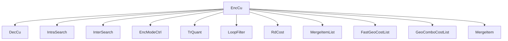
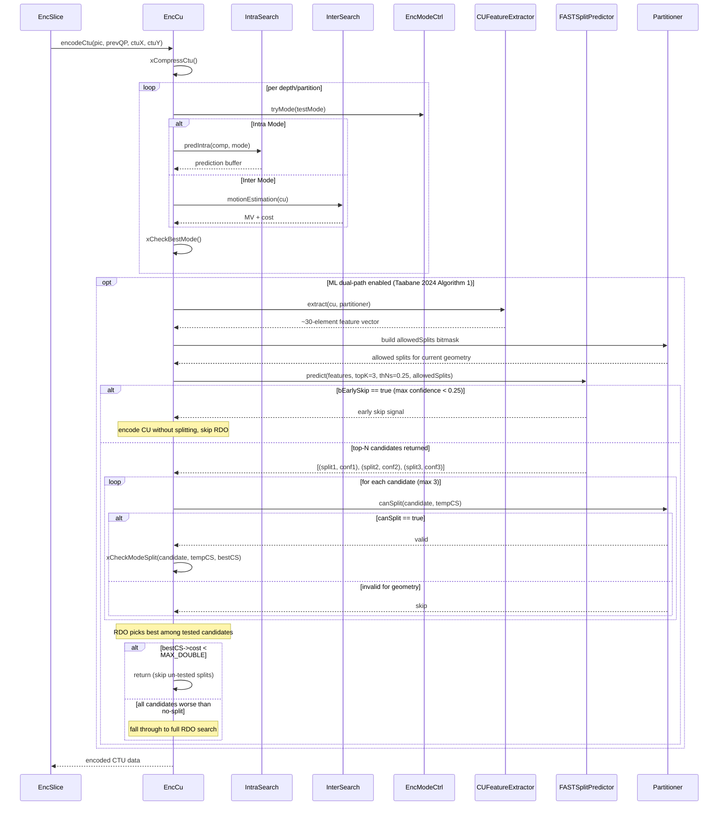

# EncCu — Coding Unit Encoder

## 1) Purpose

`EncCu` is the core CU-level encoding engine. It performs mode decision (intra, inter, merge/skip, IBC), split decision (QT/BT/TT), and manages the full CU encode pipeline for a single coding unit.

## 2) Class Diagram



## 3) Key Methods

| Method | Description |
|---|---|
| `init()` | Initialize with encoding config, SPS, QP vector, and rate control |
| `encodeCtu()` | Encode a single CTU at given tile-grid position |
| `xCompressCtu()` | Top-level CTU compression dispatcher |
| `xCompressCU()` | Recursive CU mode decision (split vs. no-split) |
| `xCheckRDCostIntra()` | RD-cost check for intra prediction modes |
| `xCheckRDCostInter()` | RD-cost check for inter prediction modes |
| `xCheckRDCostUnifiedMerge()` | Unified merge/skip mode RD-cost check |
| `xCheckRDCostIBCMode()` | Intra-block copy mode RD-cost check |
| `xCheckModeSplit()` | Evaluate whether to split current CU |

## 4) Dependencies

- **Inherits**: `DecCu` (decoder CU helper)
- **Owns**: `IntraSearch`, `InterSearch`, `EncModeCtrl`, `TrQuant`, `RdCost`, `LoopFilter`
- **Uses**: `CABACWriter`, `RateCtrl`, `Picture`, `CodingStructure`, `UnitPartitioner`
- **Optional**: `CUFeatureExtractor`, `FASTSplitPredictor` (from `MLTools`, conditional on `VVENC_ENABLE_ML_LIGHTGBM`)
- **Config**: `mlEnable`, `mlThNs` (no-skip threshold, default 0.25), `mlTopK` (candidates, default 3), `mlModelDir`

## 5) Data Flow



## 6) Configuration

| Field | Source | Effect |
|---|---|---|---|
| `VVEncCfg::m_QP` | Encoder config | Base quantization parameter |
| `VVEncCfg::m_IntraPeriod` | Encoder config | Intra frame refresh period |
| `VVEncCfg::m_MaxMergeNum` | Encoder config | Maximum merge candidates |
| `VVEncCfg::m_BiPred` | Encoder config | Enable bi-predictive inter |
| `VVEncCfg::m_mlEnable` | Encoder config | Enable ML-guided CU split prediction (0/1) |
| `VVEncCfg::m_mlThNs` | Encoder config | No-skip confidence threshold (default 0.25) |
| `VVEncCfg::m_mlTopK` | Encoder config | Top-K candidates to evaluate (default 3) |
| `VVEncCfg::m_mlModelDir` | Encoder config | Path to LightGBM model files |
| `SPS::maxCuDepth` | Sequence params | Max CU split depth |

## 7) Lifecycle

```
init() → [initPic() / initSlice() per picture/slice]
  → setUpLambda() for each slice
    → encodeCtu() for each CTU in raster order
      → xCompressCtu() → xCompressCU() recursive split
destroy()
```
