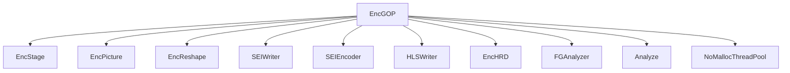
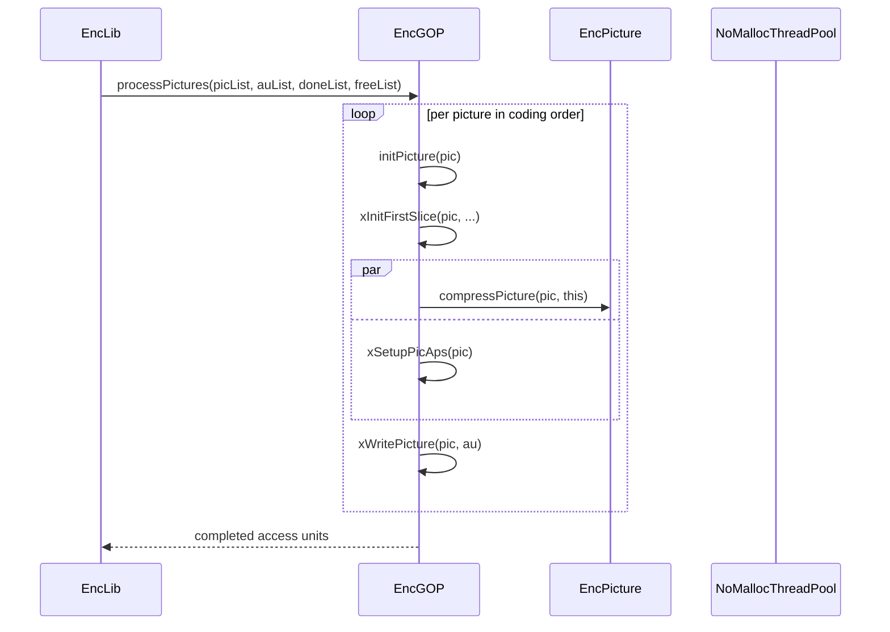

# EncGOP — Group-of-Pictures Encoder

## 1) Purpose

`EncGOP` manages GOP-level encoding: picture encoding loop in coding order, MCTF (motion-compensated temporal filtering), wavefront parallelism across pictures, parameter set management, SEI writing, and rate control across the GOP.

## 2) Class Diagram



## 3) Key Methods

| Method | Description |
|---|---|
| `init()` | Initialize GOP encoder with config, GOP structure, rate control, thread pool |
| `processPictures()` | Main encoding loop — processes pictures in coding order |
| `initPicture()` | Prepare a picture for encoding (reference lists, LMCS, etc.) |
| `xEncodePicture()` | Encode a single picture using `EncPicture` |
| `xWritePicture()` | Write encoded picture to access unit (VCL + non-VCL NALs) |
| `xWriteParameterSets()` | Write VPS/DCI/SPS/PPS NAL units |
| `xWritePictureSlices()` | Write slice NAL units to access unit |
| `xWriteLeadingSEIs()` / `xWriteTrailingSEIs()` | Write SEI messages |
| `xUpdateRateCap()` | Rate cap enforcement across GOP |
| `printOutSummary()` | Print encoding summary statistics |

## 4) Dependencies

- **Inherits**: `EncStage` (pipeline stage base)
- **Owns**: `EncPicture` (pool), `EncReshape`, `HLSWriter`, `SEIWriter`, `SEIEncoder`, `EncHRD`, `FGAnalyzer`, `Analyze`
- **Uses**: `NoMallocThreadPool`, `RateCtrl`, `PicList`, `AccessUnitList`, `ParameterSetMap`

## 5) Data Flow



## 6) Configuration

| Field | Source | Effect |
|---|---|---|
| `GOPCfg` | GOP configuration | GOP size, picture types, reference structure |
| `VVEncCfg::m_maxParallelFrames` | Encoder config | Max parallel picture encoders |
| `VVEncCfg::m_IntraPeriod` | Encoder config | IDR/CRA frame interval |
| `VVEncCfg::m_RCEnable` | Encoder config | Rate control enable |
| `RateCapParam` | Internal | Rate cap accounting across GOP |

## 7) Lifecycle

```
init() per encoder init
  → processPictures() per batch of input pictures
    → waitForFreeEncoders() (block until encoder available)
    → initPicture(pic) per picture
    → xEncodePicture(pic, encPic) [calls EncPicture::compressPicture]
    → xWritePicture(pic, au) [assembles bitstream]
    → xReleasePictures() [return to free list]
  → printOutSummary() at end of encoding
```
