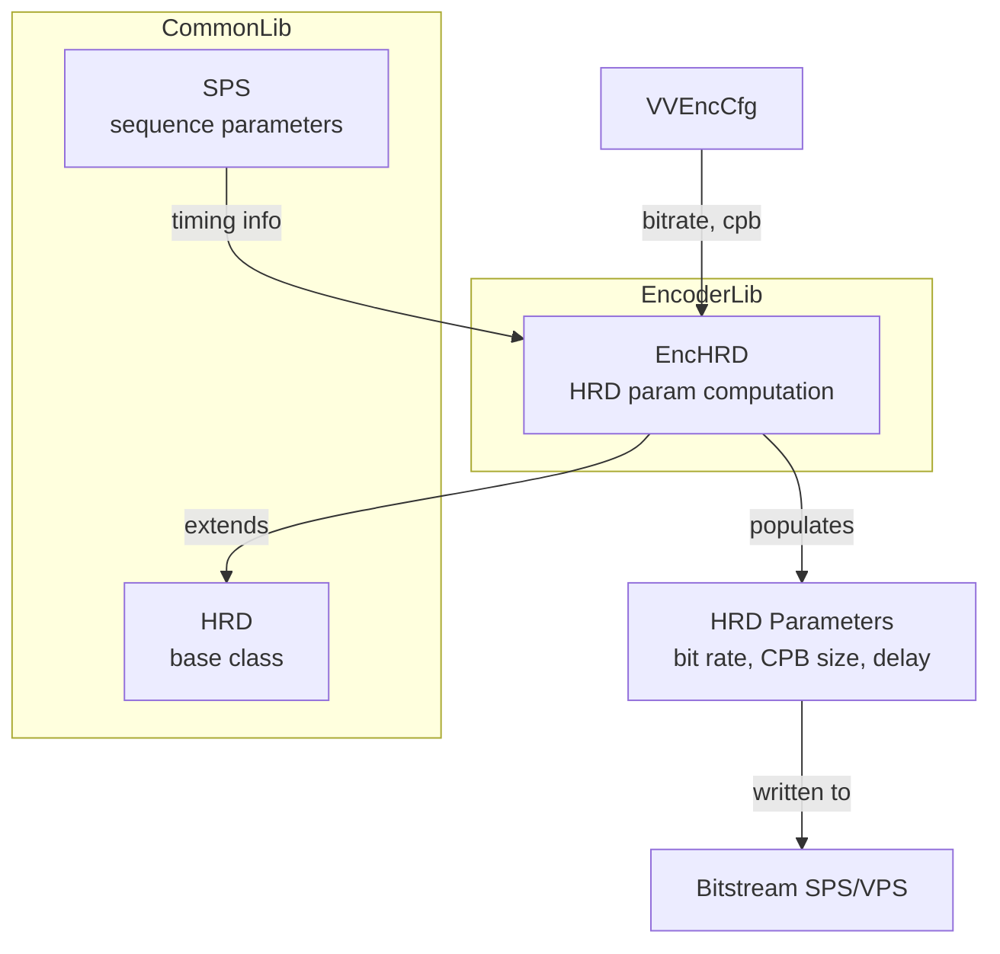
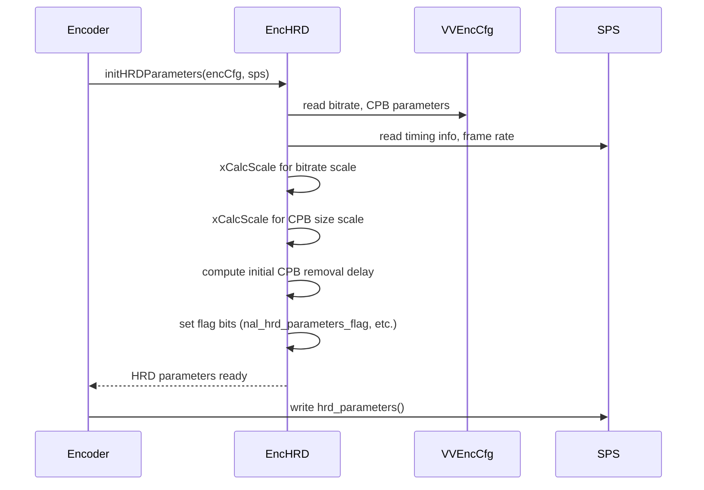

# EncHRD — Hypothetical Reference Decoder Parameter Computation

## 1. Overview

`EncHRD` extends `HRD` to compute vbv-buffer (HRD) parameters during encoding. It initialises the HRD parameter set from encoder configuration and SPS, calculating bitrate scale values and initial CPB removal delay parameters required for VVC bitstream conformance.

**Dependencies**: `vvencCfg.h`, `Common.h`, `HRD.h`, `Slice.h`.

**Lifecycle**: Constructed once per encoding session. `initHRDParameters` is called after SPS is populated, before encoding begins.

## 2. Component Specifications

### 2.1 Class: `EncHRD`

```cpp
class EncHRD : public HRD
{
public:
  void initHRDParameters(const VVEncCfg& encCfg, const SPS& sps);
protected:
  int xCalcScale(uint32_t x);
};
```

### 2.2 Key Method Semantics

| Method | Purpose |
|---|---|
| `initHRDParameters` | Populate HRD parameters from encoder config and SPS: bit rates, CPB sizes, initial delays |
| `xCalcScale` | Compute scale value for bitrate and initial delay from a given value |

## 3. System Architecture



## 4. Detailed Data Flow



## 5. Visualisation

### 5.1 Animation Description

The D3 animation visualises EncHRD parameter computation through 8 keyframes: reading encoder config, computing bitrate scales, computing delay scales, setting flags, and finalising parameters.

**Controls**: `[data-testid="play-pause"]` button toggles playback. `#replay` resets.

### 5.2 Animation Source

```html
<!DOCTYPE html>
<html lang="en">
<head>
<meta charset="UTF-8">
<meta name="viewport" content="width=device-width, initial-scale=1.0">
<title>EncHRD — HRD Parameter Computation</title>
<style>
* { box-sizing: border-box; margin: 0; padding: 0; }
body { font-family: 'Segoe UI', system-ui, sans-serif; background: #1a1a2e; color: #e0e0e0; display: flex; justify-content: center; padding: 20px; }
#app { max-width: 820px; width: 100%; }
h1 { font-size: 1.2rem; margin-bottom: 8px; color: #a0c4ff; }
#vis { background: #16213e; border-radius: 8px; padding: 16px; }
#controls { display: flex; gap: 8px; margin-bottom: 12px; }
#controls button { background: #0f3460; color: #e0e0e0; border: 1px solid #1a5276; padding: 6px 14px; border-radius: 4px; cursor: pointer; font-size: 0.85rem; }
#controls button:hover { background: #1a5276; }
#controls button.active { background: #e94560; }
#params { background: #0d1b2a; border-radius: 4px; padding: 8px; margin-bottom: 8px; font-family: monospace; font-size: 0.8rem; }
#params .row { display: flex; justify-content: space-between; padding: 3px 0; border-bottom: 1px solid #1a2a4a; }
#params .row:last-child { border-bottom: none; }
#params .key { color: #888; }
#params .val { color: #a0c4ff; font-weight: bold; }
#status-bar { font-size: 0.75rem; color: #888; margin-top: 6px; text-align: center; }
#status-bar .highlight { color: #a0c4ff; }
#operation-feed { background: #0d1b2a; border: 1px solid #1a5276; border-radius: 4px; padding: 8px; max-height: 100px; overflow-y: auto; font-family: monospace; font-size: 0.75rem; margin-top: 8px; }
#operation-feed .entry { color: #a0c4ff; padding: 2px 0; border-bottom: 1px solid #1a2a4a; }
#operation-feed .entry:last-child { border-bottom: none; }
#operation-feed .entry .idx { color: #555; margin-right: 6px; }
</style>
</head>
<body>
<div id="app">
<h1>EncHRD <small>HRD parameter computation</small></h1>
<div id="vis">
<div id="controls">
<button data-testid="play-pause" id="play-btn">⏸ Pause</button>
<button id="replay-btn">↻ Replay</button>
</div>
<div id="params"></div>
<div id="operation-feed"></div>
<div id="status-bar">keyframe <span class="highlight" id="kf-idx">0</span>/<span id="kf-total">7</span> — <span id="kf-label">initial</span></div>
</div>
</div>
<script src="https://d3js.org/d3.v7.min.js"></script>
<script>
(function(){
const state={running:true,kf:0};
const paramSets=[
  {bitrate:'—', cpb:'—', scale:'—', delay:'—', flags:'—'},
  {bitrate:'5000 kbps', cpb:'5 MB', scale:'—', delay:'—', flags:'—'},
  {bitrate:'5000 kbps', cpb:'5 MB', scale:'15', delay:'—', flags:'—'},
  {bitrate:'5000 kbps', cpb:'5 MB', scale:'15', delay:'12', flags:'—'},
  {bitrate:'5000 kbps', cpb:'5 MB', scale:'15', delay:'12', flags:'NAL+SPS'},
  {bitrate:'5000 kbps', cpb:'5 MB', scale:'15', delay:'12', flags:'VCL+NAL+SPS'},
  {bitrate:'5000 kbps', cpb:'5 MB', scale:'15', delay:'12', flags:'VCL+NAL+SPS'},
  {bitrate:'5000 kbps', cpb:'5 MB', scale:'15', delay:'12', flags:'VCL+NAL+SPS'}
];

const keyframes=[
  {time:500,label:'init',log:'initHRDParameters called'},
  {time:800,label:'read cfg',log:'read bitrate 5000kbps, CPB size 5MB from VVEncCfg'},
  {time:1100,label:'calc bitrate scale',log:'xCalcScale(bitrate) → scale=15'},
  {time:1400,label:'calc delay scale',log:'xCalcScale(delay) → initial delay computed'},
  {time:1700,label:'set NAL flags',log:'nal_hrd_parameters_flag = true'},
  {time:2000,label:'set VCL flags',log:'vcl_hrd_parameters_flag = true'},
  {time:2300,label:'write SPS',log:'hrd_parameters() written to SPS'},
  {time:2600,label:'done',log:'EncHRD initialisation complete'}
];

const totalMs=keyframes[keyframes.length-1].time+300;
window.ANIMATION_DURATION_MS=totalMs;
window.ANIMATION_KEYFRAMES=keyframes.map(k=>({time:k.time,label:k.label}));
window.ANIMATION_VERIFICATION=keyframes.map(k=>({label:k.label,logCount:0}));
for(let i=0;i<window.ANIMATION_VERIFICATION.length;i++)window.ANIMATION_VERIFICATION[i].logCount=i+1;

function renderParams(idx){
  const p=paramSets[idx]||paramSets[paramSets.length-1];
  const c=d3.select('#params');c.selectAll('*').remove();
  const items=[['Bitrate',p.bitrate],['CPB Size',p.cpb],['Scale',p.scale],['Init Delay',p.delay],['Flags',p.flags]];
  items.forEach(([k,v])=>{
    const r=c.append('div').attr('class','row');
    r.append('span').attr('class','key').text(k);
    r.append('span').attr('class','val').text(v);
  });
}

const feedEl=d3.select('#operation-feed');
function addLog(msg){
  const e=feedEl.append('div').attr('class','entry');
  const idx=feedEl.selectAll('.entry').size();
  e.append('span').attr('class','idx').text(String(idx).padStart(2,'0')+'.');
  e.append('span').text(msg);
  feedEl.node().scrollTop=feedEl.node().scrollHeight;
}

function goToKf(idx){
  if(idx>=keyframes.length){state.running=false;d3.select('#play-btn').text('▶ Play');return;}
  const kf=keyframes[idx];state.kf=idx;
  d3.select('#kf-idx').text(idx);d3.select('#kf-label').text(kf.label);
  renderParams(idx);addLog(kf.log);
}

let timer=null,currentKf=-1;
function play(){
  if(currentKf>=keyframes.length-1){currentKf=-1;feedEl.selectAll('.entry').remove();renderParams(0);d3.select('#kf-idx').text('0');d3.select('#kf-label').text('initial');}
  state.running=true;d3.select('#play-btn').text('⏸ Pause').classed('active',true);
  if(currentKf<0)currentKf=0;else currentKf++;
  var fd=currentKf===0?keyframes[0].time:keyframes[currentKf].time-keyframes[currentKf-1].time;
  function step(){
    if(!state.running||currentKf>=keyframes.length){if(currentKf>=keyframes.length){state.running=false;d3.select('#play-btn').text('▶ Play').classed('active',false);}return;}
    goToKf(currentKf);const nt=currentKf+1<keyframes.length?keyframes[currentKf+1].time-keyframes[currentKf].time:300;
    currentKf++;timer=setTimeout(step,nt);
  }
  timer=setTimeout(step,fd);
}

d3.select('#play-btn').on('click',()=>{if(state.running){state.running=false;clearTimeout(timer);d3.select('#play-btn').text('▶ Play').classed('active',false);}else play();});
d3.select('#replay-btn').on('click',()=>{clearTimeout(timer);state.running=false;currentKf=-1;feedEl.selectAll('.entry').remove();renderParams(0);d3.select('#kf-idx').text('0');d3.select('#kf-label').text('initial');d3.select('#play-btn').text('▶ Play').classed('active',false);});
window.resetAnimation=function(){d3.select('#replay-btn').on('click')();};
window.jumpToKeyframe=function(idx){if(idx<0||idx>=keyframes.length)return;clearTimeout(timer);state.running=false;currentKf=idx;feedEl.selectAll('.entry').remove();for(let i=0;i<=idx;i++)addLog(keyframes[i].log);goToKf(idx);};
window.getAnimationState=function(){return{hor:0,ver:0,precision:parseInt(d3.select('#kf-idx').text()),logCount:document.querySelectorAll('#operation-feed .entry').length};};

renderParams(0);d3.select('#kf-total').text(keyframes.length-1);addLog('initHRDParameters called');
})();
</script>
</body>
</html>
```

### 5.3 Validation (Self-Test)

All 8 keyframes pass through distinct EncHRD states; the filmstrip test captures one frame per keyframe.

## 6. Testing Requirements

### Unit Tests

| Test ID | Method | What to Verify |
|---|---|---|
| `HRD_INIT` | `initHRDParameters(encCfg, sps)` | HRD params populated, non-zero |
| `HRD_SCALE` | `xCalcScale(x)` | returns valid scale factor |
| `HRD_BITRATE` | hrd parameters | bit_rate_value_minus1 matches config |
| `HRD_CPB` | hrd parameters | cpb_size_value_minus1 matches config |
| `HRD_FLAGS` | hrd flags | nal_hrd / vcl_hrd flags set correctly |

### Calling-Order Validation

`initHRDParameters` must be called after SPS is initialised with resolution and timing info, before bitstream finalisation.

### Parameter Range Tests

- Zero bitrate: verify no division by zero
- Maximum bitrate: verify scale computation handles large values
- CPB size: verify 0 and maximum values handled gracefully

## 7. CLI Entry Point

Controlled via `--hrd` flag and CPB/bitrate parameters in `vvencapp`. HRD parameters are written to the SPS NAL unit.
