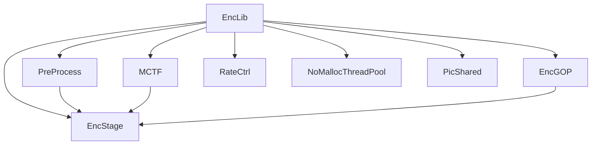
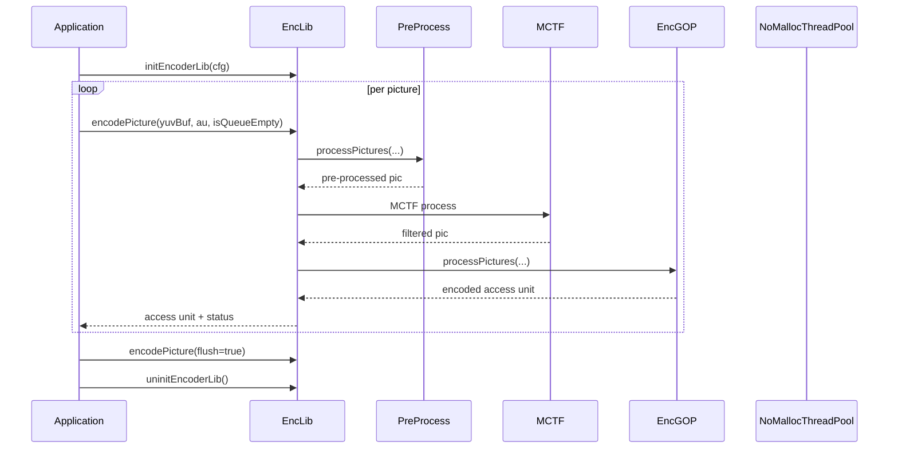

# EncLib — Top-Level Encoder Library

## 1) Purpose

`EncLib` is the top-level encoder library class. It owns all encoder sub-modules (`PreProcess`, `MCTF`, `EncGOP`, `RateCtrl`), manages the encoding pipeline lifecycle (init → encode → uninit), and drives the multi-stage encoding pipeline.

## 2) Class Diagram



## 3) Key Methods

| Method | Description |
|---|---|
| `initEncoderLib()` | Initialize encoder library with config — creates all sub-modules |
| `initPass()` | Initialize a specific encoding pass (multi-pass rate control) |
| `encodePicture()` | Encode one input picture (or flush remaining) |
| `uninitEncoderLib()` | Destroy all encoder resources |
| `printSummary()` | Print final encoding statistics |
| `getParameterSets()` | Retrieve parameter set NAL units |
| `getCurPass()` | Return current encoding pass index |

## 4) Dependencies

- **Owns**: `PreProcess`, `MCTF`, `EncGOP` (×2: pre-encoder + main encoder), `RateCtrl`
- **Owns**: `NoMallocThreadPool`, `PicShared` pool, `AccessUnitList` queue
- **Uses**: `vvenc_config`, `vvencYUVBuffer`, `MsgLog`
- **Pipeline**: `EncStage` chain — `PreProcess → MCTF → EncGOP (pre) → EncGOP (main)`

## 5) Data Flow



## 6) Configuration

| Field | Source | Effect |
|---|---|---|
| `VVEncCfg` | Application config | Full encoder configuration |
| `m_orgCfg` | Internal | Original config backup |
| `m_firstPassCfg` | Internal | First-pass config for multi-pass |
| `m_maxNumPicShared` | Internal | Max shared picture objects |
| `m_passInitialized` | Internal | Current pass initialization state |
| `m_encStages` | Internal | Pipeline stage vector |

## 7) Lifecycle

```
EncLib(msgLog)
  → initEncoderLib(cfg)
    → create PreProcess, MCTF, EncGOP (pre + main), RateCtrl
    → initPass(pass, statsFile) [0, 1, or 2 for multi-pass RC]
      → encodePicture() loop
        → pipeline: PreProcess → MCTF → EncGOP
        → output: AccessUnitList
    → uninitEncoderLib()
  → ~EncLib()
```

```html
<!DOCTYPE html>
<html lang="en">
<head>
<meta charset="UTF-8">
<meta name="viewport" content="width=device-width, initial-scale=1.0">
<title>EncLib Pipeline Animation</title>
<script src="https://d3js.org/d3.v7.min.js"></script>
<style>
  body { margin: 0; overflow: hidden; background: #1a1a2e; font-family: 'Courier New', monospace; }
  #container { width: 720px; height: 480px; position: relative; }
  .stage-box { stroke: #e94560; stroke-width: 2; fill: #16213e; rx: 6; ry: 6; }
  .stage-label { fill: #e94560; font-size: 11px; text-anchor: middle; dominant-baseline: middle; }
  .arrow { stroke: #0f3460; stroke-width: 2; fill: none; marker-end: url(#arrowhead); }
  .data-particle { fill: #00ff88; opacity: 0.8; }
  .count-label { fill: #aaa; font-size: 10px; text-anchor: middle; }
</style>
</head>
<body>
<div id="container">
  <svg width="720" height="480">
    <defs>
      <marker id="arrowhead" viewBox="0 0 10 10" refX="9" refY="5" markerWidth="6" markerHeight="6" orient="auto">
        <path d="M 0 0 L 10 5 L 0 10 z" fill="#0f3460"/>
      </marker>
    </defs>
  </svg>
</div>
<script>
(function() {
  const width = 720, height = 480;
  const svg = d3.select("#container svg");

  const stages = [
    { id: "preproc", x: 40, y: 200, w: 80, h: 50, label: "PreProcess" },
    { id: "mctf",    x: 170, y: 200, w: 60, h: 50, label: "MCTF" },
    { id: "pregop",  x: 280, y: 160, w: 80, h: 50, label: "Pre-Enc\nGOP" },
    { id: "gopenc",  x: 280, y: 260, w: 80, h: 50, label: "Main\nEncGOP" },
    { id: "output",  x: 430, y: 200, w: 80, h: 50, label: "AU\nOutput" },
  ];

  const conns = [
    { from: "preproc", to: "mctf" },
    { from: "mctf", to: "pregop" },
    { from: "mctf", to: "gopenc" },
    { from: "pregop", to: "output" },
    { from: "gopenc", to: "output" },
  ];

  // Draw stages
  stages.forEach(s => {
    const g = svg.append("g").attr("class", "stage-group");
    g.append("rect")
      .attr("class", "stage-box")
      .attr("x", s.x).attr("y", s.y)
      .attr("width", s.w).attr("height", s.h);
      
    const lbl = s.label.split("\n");
    g.selectAll(".stage-label")
      .data(lbl).enter()
      .append("text")
      .attr("class", "stage-label")
      .attr("x", s.x + s.w/2)
      .attr("y", (d,i) => s.y + s.h/2 - (lbl.length-1)*7 + i*14)
      .text(d => d);
  });

  // Draw arrows
  conns.forEach(c => {
    const src = stages.find(s => s.id === c.from);
    const dst = stages.find(s => s.id === c.to);
    svg.append("line")
      .attr("class", "arrow")
      .attr("x1", src.x + src.w)
      .attr("y1", src.y + src.h/2)
      .attr("x2", dst.x)
      .attr("y2", dst.y + dst.h/2);
  });

  // Data particles
  const particles = [];
  const numParticles = 20;

  for (let i = 0; i < numParticles; i++) {
    const srcIdx = Math.floor(Math.random() * (stages.length - 1));
    const src = stages[srcIdx];
    const dst = stages[Math.min(srcIdx + 1 + Math.floor(Math.random() * 2), stages.length - 1)];
    particles.push({
      cx: src.x + src.w/2,
      cy: src.y + src.h/2,
      tx: dst.x + dst.w/2,
      ty: dst.y + dst.h/2,
      r: 2 + Math.random() * 3,
      speed: 0.005 + Math.random() * 0.015,
      t: Math.random()
    });
  }

  const particleGroup = svg.append("g");

  function animateParticles() {
    const circles = particleGroup.selectAll("circle")
      .data(particles);

    circles.enter()
      .append("circle")
      .attr("class", "data-particle")
      .attr("r", d => d.r)
      .merge(circles)
      .attr("cx", d => {
        d.t += d.speed;
        if (d.t > 1) {
          d.t = 0;
          const srcIdx = Math.floor(Math.random() * (stages.length - 1));
          const src = stages[srcIdx];
          const dst = stages[Math.min(srcIdx + 1 + Math.floor(Math.random() * 2), stages.length - 1)];
          d.cx = src.x + src.w/2;
          d.cy = src.y + src.h/2;
          d.tx = dst.x + dst.w/2;
          d.ty = dst.y + dst.h/2;
        }
        return d.cx + (d.tx - d.cx) * d.t;
      })
      .attr("cy", d => d.cy + (d.ty - d.cy) * d.t);

    requestAnimationFrame(animateParticles);
  }

  // Frame counter
  let frameCount = 0;
  const frameLabel = svg.append("text")
    .attr("class", "count-label")
    .attr("x", 600).attr("y", 30)
    .text("Frames: 0");

  setInterval(() => {
    frameCount++;
    frameLabel.text(`Frames: ${frameCount}`);
  }, 100);

  window.ANIMATION_KEYFRAMES = [
    { time: 0, label: "init" },
    { time: 2000, label: "preproc" },
    { time: 4000, label: "mctf" },
    { time: 6000, label: "encgop" },
    { time: 8000, label: "output" },
    { time: 10000, label: "complete" },
  ];

  window.ANIMATION_DURATION_MS = 10000;

  animateParticles();
})();
</script>
</body>
</html>
```
