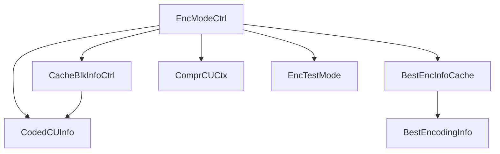
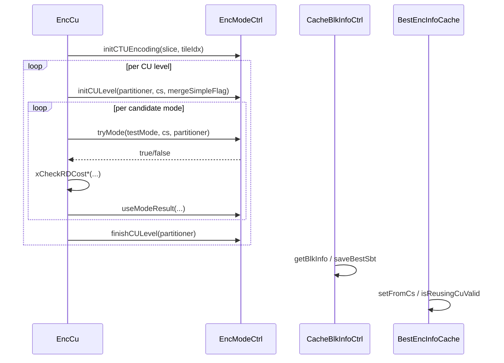

# EncModeCtrl — Mode Decision Controller

## 1) Purpose

`EncModeCtrl` controls which encoding modes are tested during CU-level mode decision. It implements early termination heuristics and adaptive mode pruning to reduce encoding complexity.

## 2) Class Diagram



## 3) Key Methods

| Method | Description |
|---|---|
| `init()` | Initialize with encoder config and RD-cost pointer |
| `initCTUEncoding()` | Prepare state for a new CTU encoding |
| `initCULevel()` | Reset per-CU tracking at the start of each CU |
| `finishCULevel()` | Clean up per-CU state after CU decision |
| `tryMode()` | Query whether a given mode should be tested |
| `trySplit()` | Query whether a given split type should be tested |
| `useModeResult()` | Update internal state with the result of a tested mode |
| `beforeSplit()` | Pre-split hook to update CU-level statistics |

## 4) Dependencies

- **Inherits**: `CacheBlkInfoCtrl`, `BestEncInfoCache`
- **Uses**: `VVEncCfg`, `RdCost`, `CodingStructure`, `Partitioner`, `Slice`, `EncTestMode`
- **Helper types**: `ComprCUCtx`, `CodedCUInfo`, `BestEncodingInfo`
- **ML gate**: `m_bMLSkipSplit` flag (set by `EncCu` when ML predictor has chosen the split)

## 5) Data Flow



## 6) Configuration

| Field | Source | Effect |
|---|---|---|
| `VVEncCfg::m_QP` | Encoder config | Base QP for mode pruning thresholds |
| `m_skipThresholdE0023FastEnc` | Internal | Fast-enc early-skip threshold |
| `m_tileIdx` | Internal | Current tile index for context tracking |
| `ComprCUCtx::bestCostBeforeSplit` | Per-CU | Cost threshold for split/no-split decisions |
| `ComprCUCtx::qtBeforeBt` | Per-CU | Quad-tree before binary/ternary split hint |
| `m_bMLSkipSplit` | ML gate | When true, `trySplit()` returns false for all candidates — bypasses RDO split search |

## 7) Lifecycle

```
init() per EncoderLib
  → initCTUEncoding() per CTU (called from EncCu::encodeCtu)
    → initCULevel() per CU recursion level
      → tryMode() / trySplit() for each candidate
      → useModeResult() on candidate acceptance
      → [setMLSkipSplit(true) if ML predicted split]
      → [trySplit() returns false when m_bMLSkipSplit is true]
    → finishCULevel() per CU recursion level
initCTUEncoding() for next CTU
destroy()
```
