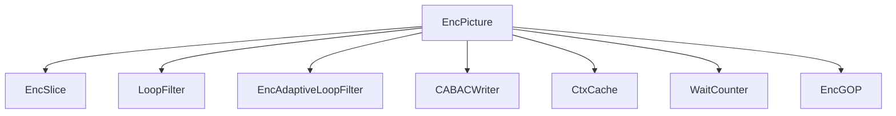
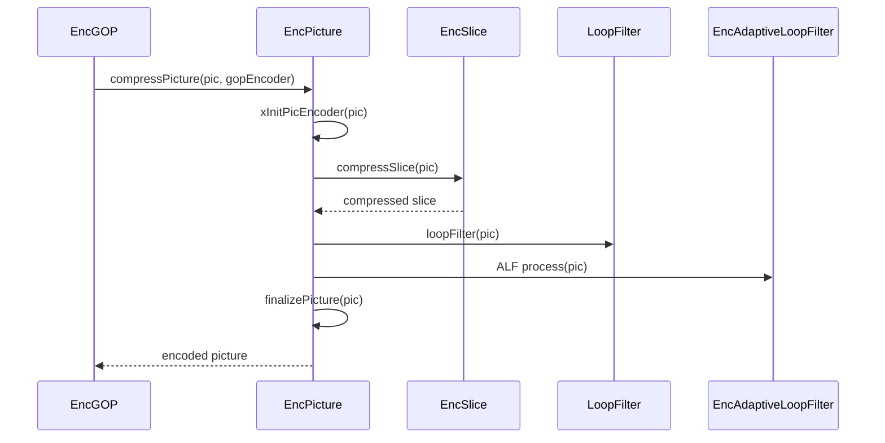

# EncPicture — Picture Encoder

## 1) Purpose

`EncPicture` orchestrates picture-level encoding: CTU loop dispatch, loop filters (deblocking, SAO, ALF), reference picture marking, and per-picture rate control.

## 2) Class Diagram



## 3) Key Methods

| Method | Description |
|---|---|
| `init()` | Initialize picture encoder with config, SPS, PPS, rate control, thread pool |
| `compressPicture()` | Full RD analysis of the picture (delegates to EncSlice) |
| `finalizePicture()` | Post-compression finalization and reference picture handling |
| `xInitPicEncoder()` | Initialize encoder state for the current picture |
| `xWriteSliceData()` | Write CABAC-encoded slice data to bitstream |
| `xCalcDistortion()` | Compute picture-level distortion metrics |
| `xInitSliceColFromL0Flag()` | Initialize slice collocated-from-L0 flag |
| `xInitSliceCheckLDC()` | Check low-delay constraints for slices |

## 4) Dependencies

- **Owns**: `EncSlice`, `LoopFilter`, `EncAdaptiveLoopFilter`
- **Owns**: `BitEstimator`, `CABACWriter`, `CtxCache`
- **Uses**: `RateCtrl`, `WaitCounter`, `NoMallocThreadPool`
- **Called by**: `EncGOP::xEncodePicture()`

## 5) Data Flow



## 6) Configuration

| Field | Source | Effect |
|---|---|---|
| `VVEncCfg::m_QP` | Encoder config | Base picture QP |
| `VVEncCfg::m_loopFilterOffset` | Encoder config | Deblocking filter offset |
| `VVEncCfg::m_saoEnabled` | Encoder config | Enable/disable SAO |
| `VVEncCfg::m_alfEnabled` | Encoder config | Enable/disable ALF |
| `m_pcRateCtrl` | External | Per-picture rate control state |

## 7) Lifecycle

```
init() per encoder init
  → compressPicture(pic, gopEncoder) per picture
    → xInitPicEncoder(pic)
    → EncSlice::compressSlice(pic) [multi-threaded CTU loop]
    → loop filtering (deblock, SAO, ALF)
    → finalizePicture(pic)
  → xWriteSliceData(pic) [bitstream output]
```
