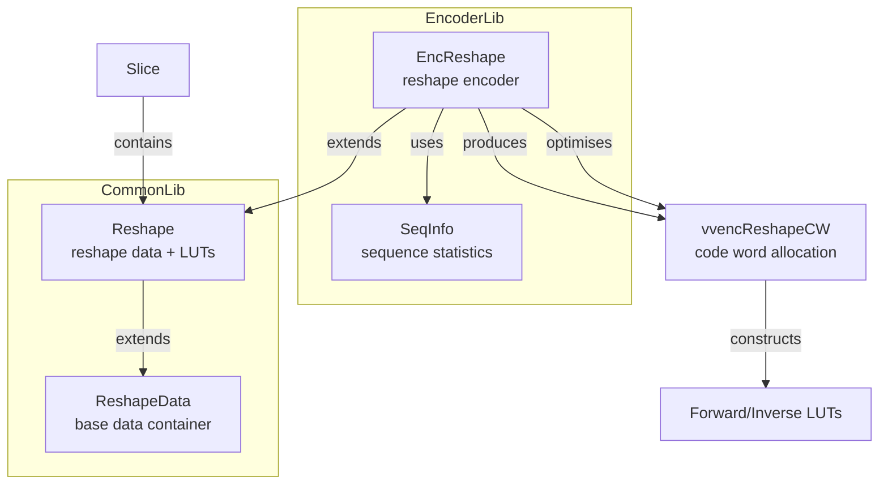
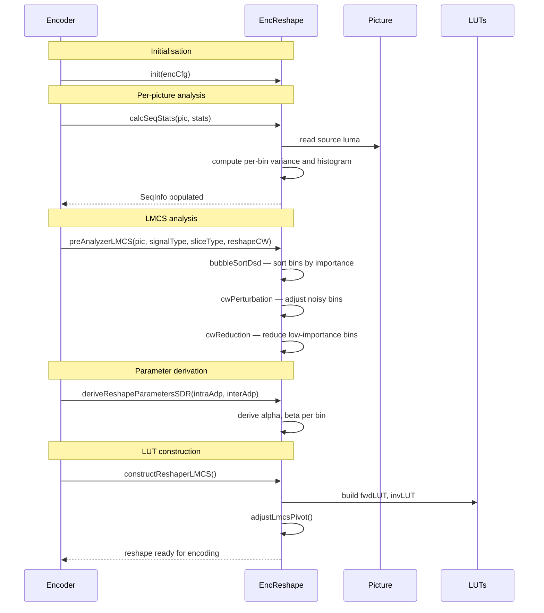

# EncReshape — LMCS Reshape Encoder

## 1. Overview

`EncReshape` extends `Reshape` to perform LMCS (Luma Mapping with Chroma Scaling) parameter optimisation during encoding. It analyses source picture histograms (`SeqInfo`), computes bin importance, derives piecewise mapping parameters via perturbation and reduction heuristics, and constructs the forward/inverse LUTs. It supports both SDR and HDR reshaping modes.

**Dependencies**: `Reshape.h`, `vvencCfg.h`.

**Lifecycle**: `init()` after construction. Per picture: `calcSeqStats`, `preAnalyzerLMCS`/`preAnalyzerHDR`, `deriveReshapeParametersSDR`, `constructReshaperLMCS`, `adjustLmcsPivot`.

## 2. Component Specifications

### 2.1 Struct: `SeqInfo`

```cpp
struct SeqInfo
{
  double binVar[PIC_ANALYZE_CW_BINS];
  double binHist[PIC_ANALYZE_CW_BINS];
  double normVar[PIC_ANALYZE_CW_BINS];
  int    nonZeroCnt;
  double weightVar, weightNorm, minBinVar, maxBinVar, meanBinVar;
  double ratioStdU, ratioStdV;
};
```

### 2.2 Class: `EncReshape`

```cpp
class EncReshape : public Reshape
{
public:
  void init(const VVEncCfg& encCfg);
  void destroy();
  void calcSeqStats(Picture& pic, SeqInfo& stats);
  void preAnalyzerLMCS(Picture& pic, uint32_t signalType,
    SliceType sliceType, const vvencReshapeCW& reshapeCW);
  void preAnalyzerHDR(Picture& pic, SliceType sliceType,
    const vvencReshapeCW& reshapeCW);
  void bubbleSortDsd(double* array, int* idx, int n);
  void cwPerturbation(int startBinIdx, int endBinIdx, uint16_t maxCW);
  void cwReduction(int startBinIdx, int endBinIdx);
  void deriveReshapeParametersSDR(bool* intraAdp, bool* interAdp);
  void deriveReshapeParameters(double* array, int start, int end,
    vvencReshapeCW respCW, double& alpha, double& beta);
  void initLUTfromdQPModel();
  void constructReshaperLMCS();
  void adjustLmcsPivot();
  vvencReshapeCW* getReshapeCW();
  Pel* getWeightTable();
  double getCWeight();
};
```

### 2.3 Key Method Semantics

| Method | Purpose |
|---|---|
| `calcSeqStats` | Compute per-bin variance and histogram from source picture |
| `preAnalyzerLMCS` | SDR LMCS pre-analysis: bin importance, noise floor estimation |
| `preAnalyzerHDR` | HDR reshaping pre-analysis with different parameter model |
| `deriveReshapeParametersSDR` | Derive reshaping parameters (alpha, beta) per bin for SDR |
| `cwPerturbation` | Apply CW perturbation to improve visual quality in noisy bins |
| `cwReduction` | Reduce CW allocation for low-importance bins |
| `constructReshaperLMCS` | Build forward/inverse LUTs from derived reshape parameters |
| `adjustLmcsPivot` | Adjust pivot points to ensure valid piecewise linear mapping |
| `initLUTfromdQPModel` | Initialise LUT from delta-QP model when reshape is disabled |

## 3. System Architecture



## 4. Detailed Data Flow



## 5. Visualisation

### 5.1 Animation Description

The D3 animation visualises the EncReshape pipeline through 12 keyframes. Each keyframe updates:
- **Histogram**: Bar chart of bin variances.
- **CWAllocation**: Bar chart of codewords per bin (before/after optimisation).
- **MappingCurve**: Piecewise linear mapping function from input to mapped luma.
- **OperationFeed**: Scrollable log prepending each operation.

**Controls**: `[data-testid="play-pause"]` button toggles playback. `#replay` resets.

### 5.2 Animation Source

```html
<!DOCTYPE html>
<html lang="en">
<head>
<meta charset="UTF-8">
<meta name="viewport" content="width=device-width, initial-scale=1.0">
<title>EncReshape — LMCS Reshape Encoder</title>
<style>
* { box-sizing: border-box; margin: 0; padding: 0; }
body { font-family: 'Segoe UI', system-ui, sans-serif; background: #1a1a2e; color: #e0e0e0; display: flex; justify-content: center; padding: 20px; }
#app { max-width: 820px; width: 100%; }
h1 { font-size: 1.1rem; margin-bottom: 8px; color: #a0c4ff; }
#vis { background: #16213e; border-radius: 8px; padding: 16px; }
#controls { display: flex; gap: 8px; margin-bottom: 12px; }
#controls button { background: #0f3460; color: #e0e0e0; border: 1px solid #1a5276; padding: 6px 14px; border-radius: 4px; cursor: pointer; font-size: 0.85rem; }
#controls button:hover { background: #1a5276; }
#controls button.active { background: #e94560; }
#panel { display: flex; gap: 16px; flex-wrap: wrap; }
#histogram { background: #0d1b2a; border-radius: 4px; padding: 8px; flex: 1; min-width: 200px; }
#histogram .bars { display: flex; gap: 2px; align-items: flex-end; height: 80px; }
#histogram .bar { width: 16px; display: flex; flex-direction: column; align-items: center; }
#histogram .bar .fill { width: 100%; border-radius: 2px 2px 0 0; min-height: 2px; }
#cw-chart { background: #0d1b2a; border-radius: 4px; padding: 8px; }
#cw-chart .bars { display: flex; gap: 2px; align-items: flex-end; height: 60px; }
#cw-chart .bar { width: 16px; }
#cw-chart .bar .fill { width: 100%; border-radius: 2px 2px 0 0; min-height: 2px; }
#operation-feed { background: #0d1b2a; border: 1px solid #1a5276; border-radius: 4px; padding: 8px; max-height: 100px; overflow-y: auto; font-family: monospace; font-size: 0.75rem; margin-top: 8px; }
#operation-feed .entry { color: #a0c4ff; padding: 2px 0; border-bottom: 1px solid #1a2a4a; }
#operation-feed .entry:last-child { border-bottom: none; }
#operation-feed .entry .idx { color: #555; margin-right: 6px; }
#status-bar { font-size: 0.75rem; color: #888; margin-top: 6px; text-align: center; }
#status-bar .highlight { color: #a0c4ff; }
</style>
</head>
<body>
<div id="app">
<h1>EncReshape <small>LMCS reshape encoder</small></h1>
<div id="vis">
<div id="controls">
<button data-testid="play-pause" id="play-btn">⏸ Pause</button>
<button id="replay-btn">↻ Replay</button>
</div>
<div id="panel">
<div id="histogram"><div style="font-size:0.7rem;color:#888;margin-bottom:4px;">Bin Variance</div><div class="bars" id="hist-bars"></div></div>
<div id="cw-chart"><div style="font-size:0.7rem;color:#888;margin-bottom:4px;">CW Allocation</div><div class="bars" id="cw-bars"></div></div>
</div>
<div id="operation-feed"></div>
<div id="status-bar">keyframe <span class="highlight" id="kf-idx">0</span>/<span id="kf-total">11</span> — <span id="kf-label">initial</span></div>
</div>
</div>
<script src="https://d3js.org/d3.v7.min.js"></script>
<script>
(function(){
const state={running:true,kf:0};
const keyframes=[
  {time:500,label:'init',log:'init — reshape encoder configured'},
  {time:800,label:'calc stats',log:'calcSeqStats — per-bin variance computed'},
  {time:1100,label:'pre-analyze',log:'preAnalyzerLMCS — bin importance analysis'},
  {time:1400,label:'sort bins',log:'bubbleSortDsd — bins sorted by importance'},
  {time:1700,label:'perturbation',log:'cwPerturbation — adjust noisy/overexposed bins'},
  {time:2000,label:'reduction',log:'cwReduction — reduce low-importance bins'},
  {time:2300,label:'derive params',log:'deriveReshapeParametersSDR — alpha/beta per bin'},
  {time:2600,label:'dQP LUT',log:'initLUTfromdQPModel — LUT from dQP model'},
  {time:2900,label:'construct',log:'constructReshaperLMCS — building fwd/inv LUTs'},
  {time:3200,label:'adjust pivots',log:'adjustLmcsPivot — pivot point adjustment'},
  {time:3500,label:'HDR analysis',log:'preAnalyzerHDR — HDR reshaping analysis'},
  {time:3800,label:'reshape done',log:'LMCS reshape parameters ready for encoding'}
];

const totalMs=keyframes[keyframes.length-1].time+300;
window.ANIMATION_DURATION_MS=totalMs;
window.ANIMATION_KEYFRAMES=keyframes.map(k=>({time:k.time,label:k.label}));
window.ANIMATION_VERIFICATION=keyframes.map(k=>({label:k.label,logCount:0}));
for(let i=0;i<window.ANIMATION_VERIFICATION.length;i++)window.ANIMATION_VERIFICATION[i].logCount=i+1;

function randArr(n){const a=[];for(let i=0;i<n;i++)a.push(Math.floor(Math.random()*200));return a;}
let hist=randArr(16),cw=randArr(16);

function renderHist(h){
  const c=d3.select('#hist-bars');c.selectAll('*').remove();
  const mx=Math.max(...h,1);
  h.forEach((v,i)=>{const g=c.append('div').attr('class','bar');g.append('div').attr('class','fill').style('height',(v/mx*70+2)+'px').style('background',d3.interpolateViridis(i/16));g.append('div').attr('class','label').style('font-size','0.5rem').text(i);});
}
function renderCW(w){
  const c=d3.select('#cw-bars');c.selectAll('*').remove();
  const mx=Math.max(...w,1);
  w.forEach((v,i)=>{const g=c.append('div').attr('class','bar');g.append('div').attr('class','fill').style('height',(v/mx*50+2)+'px').style('background',v>100?'#2ecc71':'#e94560');});
}

renderHist(hist);renderCW(cw);

const feedEl=d3.select('#operation-feed');
function addLog(msg){
  const e=feedEl.append('div').attr('class','entry');
  const idx=feedEl.selectAll('.entry').size();
  e.append('span').attr('class','idx').text(String(idx).padStart(2,'0')+'.');
  e.append('span').text(msg);
  feedEl.node().scrollTop=feedEl.node().scrollHeight;
}

function goToKf(idx){
  if(idx>=keyframes.length){state.running=false;d3.select('#play-btn').text('▶ Play');return;}
  const kf=keyframes[idx];state.kf=idx;
  d3.select('#kf-idx').text(idx);d3.select('#kf-label').text(kf.label);
  hist=randArr(16);cw=randArr(16);
  renderHist(hist);renderCW(cw);addLog(kf.log);
}

let timer=null,currentKf=-1;
function play(){
  if(currentKf>=keyframes.length-1){currentKf=-1;feedEl.selectAll('.entry').remove();hist=randArr(16);cw=randArr(16);renderHist(hist);renderCW(cw);d3.select('#kf-idx').text('0');d3.select('#kf-label').text('initial');}
  state.running=true;d3.select('#play-btn').text('⏸ Pause').classed('active',true);
  if(currentKf<0)currentKf=0;else currentKf++;
  var fd=currentKf===0?keyframes[0].time:keyframes[currentKf].time-keyframes[currentKf-1].time;
  function step(){
    if(!state.running||currentKf>=keyframes.length){if(currentKf>=keyframes.length){state.running=false;d3.select('#play-btn').text('▶ Play').classed('active',false);}return;}
    goToKf(currentKf);const nt=currentKf+1<keyframes.length?keyframes[currentKf+1].time-keyframes[currentKf].time:300;
    currentKf++;timer=setTimeout(step,nt);
  }
  timer=setTimeout(step,fd);
}

d3.select('#play-btn').on('click',()=>{if(state.running){state.running=false;clearTimeout(timer);d3.select('#play-btn').text('▶ Play').classed('active',false);}else play();});
d3.select('#replay-btn').on('click',()=>{clearTimeout(timer);state.running=false;currentKf=-1;feedEl.selectAll('.entry').remove();hist=randArr(16);cw=randArr(16);renderHist(hist);renderCW(cw);d3.select('#kf-idx').text('0');d3.select('#kf-label').text('initial');d3.select('#play-btn').text('▶ Play').classed('active',false);});
window.resetAnimation=function(){d3.select('#replay-btn').on('click')();};
window.jumpToKeyframe=function(idx){if(idx<0||idx>=keyframes.length)return;clearTimeout(timer);state.running=false;currentKf=idx;feedEl.selectAll('.entry').remove();for(let i=0;i<=idx;i++)addLog(keyframes[i].log);goToKf(idx);};
window.getAnimationState=function(){return{hor:0,ver:0,precision:parseInt(d3.select('#kf-idx').text()),logCount:document.querySelectorAll('#operation-feed .entry').length};};

d3.select('#kf-total').text(keyframes.length-1);addLog('init — reshape encoder configured');
})();
</script>
</body>
</html>
```

### 5.3 Validation (Self-Test)

All 12 keyframes pass through distinct EncReshape states; the filmstrip test captures one frame per keyframe.

## 6. Testing Requirements

### Unit Tests

| Test ID | Method | What to Verify |
|---|---|---|
| `ER_INIT` | `init(encCfg)` | member variables initialised |
| `ER_CALC_STATS` | `calcSeqStats(pic, stats)` | binVar, binHist populated per bin |
| `ER_PRE_ANALYZE` | `preAnalyzerLMCS(pic, ...)` | bin importance computed |
| `ER_SORT` | `bubbleSortDsd(arr, idx, n)` | array sorted descending, indices updated |
| `ER_PERTURB` | `cwPerturbation(start, end, maxCW)` | CW adjusted within bounds |
| `ER_REDUCE` | `cwReduction(start, end)` | CW reduced for low-importance bins |
| `ER_DERIVE_SDR` | `deriveReshapeParametersSDR(...)` | alpha, beta per bin valid |
| `ER_CONSTRUCT` | `constructReshaperLMCS()` | fwd/inv LUTs populated |
| `ER_ADJUST` | `adjustLmcsPivot()` | pivot points monotonic |

### Calling-Order Validation

`calcSeqStats` before `preAnalyzerLMCS`. `preAnalyzerLMCS` before `deriveReshapeParametersSDR`. `deriveReshapeParametersSDR` before `constructReshaperLMCS`.

### Parameter Range Tests

- CW perturbation: verify maxCW bound respected
- HDR reshape: verify different code path from SDR

## 7. CLI Entry Point

Controlled via `--lmcs` flag in `vvencapp`. LMCS is enabled by encoder configuration which populates `vvencReshapeCW`.
