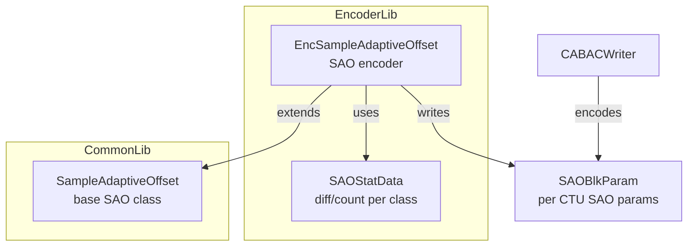
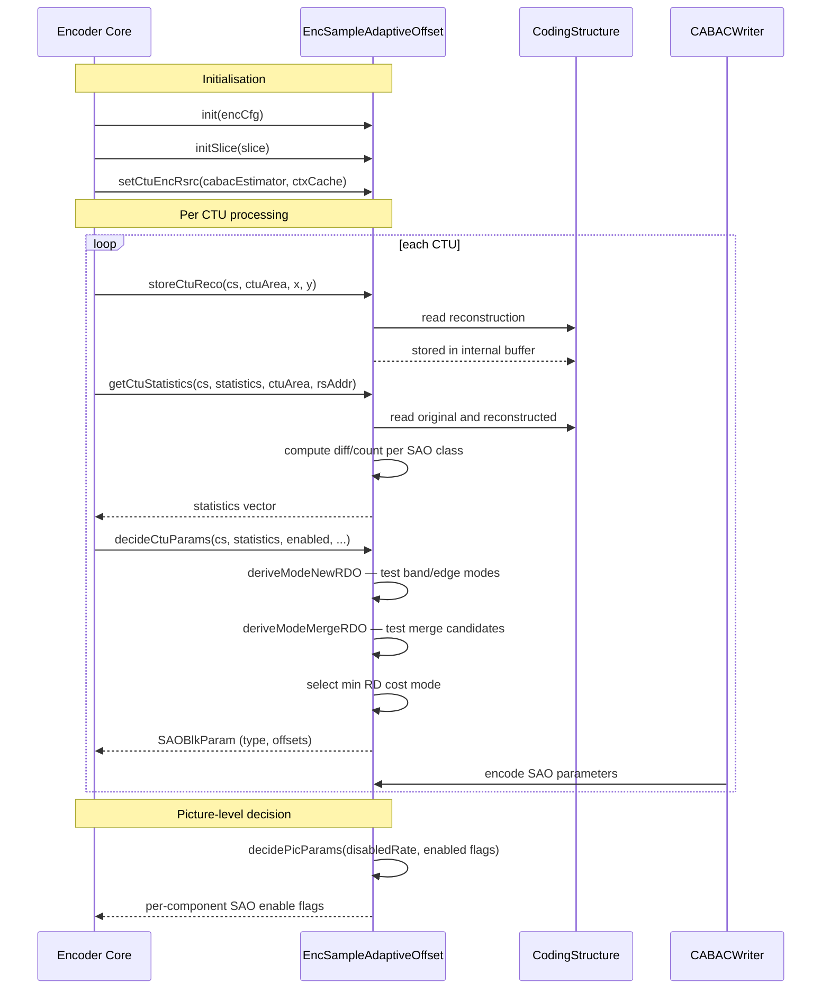

# EncSampleAdaptiveOffset — SAO Encoder

## 1. Overview

`EncSampleAdaptiveOffset` extends `SampleAdaptiveOffset` to perform SAO parameter estimation during encoding. It collects per-CTU statistics (difference and count per class), derives optimal offsets for band/edge modes via RDO, decides picture-level and CTU-level SAO parameters, and stores reconstruction data for in-loop filtering.

**Dependencies**: `CABACWriter.h`, `SampleAdaptiveOffset.h`.

**Lifecycle**: `init()` configures from encoder config. Per slice: `initSlice`, then per CTU: `storeCtuReco`, `getCtuStatistics`, `decideCtuParams`. `decidePicParams` resolves picture-level merge decisions.

## 2. Component Specifications

### 2.1 Struct: `SAOStatData`

```cpp
struct SAOStatData
{
  int64_t diff[MAX_NUM_SAO_CLASSES];
  int64_t count[MAX_NUM_SAO_CLASSES];
  void reset();
  const SAOStatData& operator=(const SAOStatData& src);
  const SAOStatData& operator+=(const SAOStatData& src);
};
```

### 2.2 Class: `EncSampleAdaptiveOffset`

```cpp
class EncSampleAdaptiveOffset : public SampleAdaptiveOffset
{
public:
  void init(const VVEncCfg& encCfg);
  void initSlice(const Slice* slice);
  void setCtuEncRsrc(CABACWriter* cabacEstimator, CtxCache* ctxCache);

  static void disabledRate(CodingStructure& cs,
    double saoDisabledRate[MAX_NUM_COMP][VVENC_MAX_TLAYER],
    SAOBlkParam* reconParams, double saoEncodingRate,
    double saoEncodingRateChroma, const ChromaFormat& chromaFormat);

  static void decidePicParams(const CodingStructure& cs,
    double saoDisabledRate[MAX_NUM_COMP][VVENC_MAX_TLAYER],
    bool saoEnabled[MAX_NUM_COMP], double saoEncodingRate,
    double saoEncodingRateChroma, const ChromaFormat& chromaFormat);

  void storeCtuReco(CodingStructure& cs, const UnitArea& ctuArea,
    int ctuX, int ctuY);
  void getCtuStatistics(CodingStructure& cs,
    std::vector<SAOStatData**>& saoStatistics, const UnitArea& ctuArea,
    int ctuRsAddr);
  void decideCtuParams(CodingStructure& cs,
    const std::vector<SAOStatData**>& saoStatistics,
    const bool saoEnabled[MAX_NUM_COMP], bool allBlksDisabled,
    const UnitArea& ctuArea, int ctuRsAddr, SAOBlkParam* reconParams,
    SAOBlkParam* codedParams);
};
```

### 2.3 Key Method Semantics

| Method | Purpose |
|---|---|
| `storeCtuReco` | Store reconstructed CTU pixels for SAO statistics collection |
| `getCtuStatistics` | Compute diff and count statistics per SAO class for the CTU |
| `decideCtuParams` | RD-optimised SAO mode decision: band/edge offset type, merge with neighbours |
| `decidePicParams` | Picture-level SAO enable decision based on disabled-rate estimation |
| `disabledRate` | Compute RD cost of disabling SAO for rate-modulated decisions |

## 3. System Architecture



## 4. Detailed Data Flow



## 5. Visualisation

### 5.1 Animation Description

The D3 animation visualises the SAO encoder pipeline through 12 keyframes. Each keyframe updates:
- **StatDisplay**: Bar chart of diff/count per SAO class.
- **ModeDecision**: Highlighted SAO mode (OFF, band, edge-0/1/2/3) per CTU.
- **OffsetTable**: Quantised offset values for selected SAO type.
- **OperationFeed**: Scrollable log prepending each operation.

**Controls**: `[data-testid="play-pause"]` button toggles playback. `#replay` resets.

### 5.2 Animation Source

```html
<!DOCTYPE html>
<html lang="en">
<head>
<meta charset="UTF-8">
<meta name="viewport" content="width=device-width, initial-scale=1.0">
<title>EncSampleAdaptiveOffset — SAO Encoder</title>
<style>
* { box-sizing: border-box; margin: 0; padding: 0; }
body { font-family: 'Segoe UI', system-ui, sans-serif; background: #1a1a2e; color: #e0e0e0; display: flex; justify-content: center; padding: 20px; }
#app { max-width: 820px; width: 100%; }
h1 { font-size: 1.1rem; margin-bottom: 8px; color: #a0c4ff; }
#vis { background: #16213e; border-radius: 8px; padding: 16px; }
#controls { display: flex; gap: 8px; margin-bottom: 12px; }
#controls button { background: #0f3460; color: #e0e0e0; border: 1px solid #1a5276; padding: 6px 14px; border-radius: 4px; cursor: pointer; font-size: 0.85rem; }
#controls button:hover { background: #1a5276; }
#controls button.active { background: #e94560; }
#panel { display: flex; gap: 16px; flex-wrap: wrap; }
#stat-chart { background: #0d1b2a; border-radius: 4px; padding: 8px; flex: 1; min-width: 200px; }
#stat-chart .bars { display: flex; gap: 2px; align-items: flex-end; height: 80px; }
#stat-chart .bar { width: 18px; display: flex; flex-direction: column; align-items: center; }
#stat-chart .bar .fill { width: 100%; border-radius: 2px 2px 0 0; min-height: 2px; }
#mode-grid { background: #0d1b2a; border-radius: 4px; padding: 8px; }
#mode-grid .grid { display: grid; grid-template-columns: repeat(4, 50px); gap: 2px; }
#mode-grid .grid .cell { width: 50px; height: 50px; display: flex; align-items: center; justify-content: center; font-size: 9px; border-radius: 3px; }
#offsets { background: #0d1b2a; border-radius: 4px; padding: 8px; font-family: monospace; font-size: 0.75rem; }
#operation-feed { background: #0d1b2a; border: 1px solid #1a5276; border-radius: 4px; padding: 8px; max-height: 100px; overflow-y: auto; font-family: monospace; font-size: 0.75rem; margin-top: 8px; }
#operation-feed .entry { color: #a0c4ff; padding: 2px 0; border-bottom: 1px solid #1a2a4a; }
#operation-feed .entry:last-child { border-bottom: none; }
#operation-feed .entry .idx { color: #555; margin-right: 6px; }
#status-bar { font-size: 0.75rem; color: #888; margin-top: 6px; text-align: center; }
#status-bar .highlight { color: #a0c4ff; }
</style>
</head>
<body>
<div id="app">
<h1>EncSampleAdaptiveOffset <small>SAO encoder</small></h1>
<div id="vis">
<div id="controls">
<button data-testid="play-pause" id="play-btn">⏸ Pause</button>
<button id="replay-btn">↻ Replay</button>
</div>
<div id="panel">
<div id="stat-chart"><div style="font-size:0.7rem;color:#888;margin-bottom:4px;">Class Statistics</div><div class="bars" id="bars"></div></div>
<div id="mode-grid"><div style="font-size:0.7rem;color:#888;margin-bottom:4px;">Mode per CTU (4x4)</div><div class="grid" id="mode-grid-inner"></div></div>
<div id="offsets"><div style="font-size:0.7rem;color:#888;margin-bottom:4px;">Offsets</div><div id="offset-table"></div></div>
</div>
<div id="operation-feed"></div>
<div id="status-bar">keyframe <span class="highlight" id="kf-idx">0</span>/<span id="kf-total">11</span> — <span id="kf-label">initial</span></div>
</div>
</div>
<script src="https://d3js.org/d3.v7.min.js"></script>
<script>
(function(){
const state={running:true,kf:0};
const modeNames=['OFF','BO','EO0','EO1','EO2','EO3'];
const modeColors={OFF:'#444',BO:'#2ecc71',EO0:'#4a9eff',EO1:'#f39c12',EO2:'#e94560',EO3:'#9b59b6'};

const keyframes=[
  {time:500,label:'init',log:'init — SAO encoder configured'},
  {time:800,label:'init slice',log:'initSlice — slice type, QP stored'},
  {time:1100,label:'store rec',log:'storeCtuReco — CTU reconstruction saved'},
  {time:1400,label:'get stats',log:'getCtuStatistics — diff/count per class computed'},
  {time:1700,label:'derive new',log:'deriveModeNewRDO — band and edge modes evaluated'},
  {time:2000,label:'derive merge',log:'deriveModeMergeRDO — merge candidates tested'},
  {time:2300,label:'ctu decision',log:'decideCtuParams — mode + offsets selected'},
  {time:2600,label:'disabled rate',log:'disabledRate — cost of no SAO computed'},
  {time:2900,label:'pic params',log:'decidePicParams — picture-level enable flags'},
  {time:3200,label:'chroma SAO',log:'chroma SAO offsets estimated'},
  {time:3500,label:'offsets quant',log:'deriveOffsets — quantised offsets stored'},
  {time:3800,label:'SAO done',log:'SAO encoding complete'}
];

const totalMs=keyframes[keyframes.length-1].time+300;
window.ANIMATION_DURATION_MS=totalMs;
window.ANIMATION_KEYFRAMES=keyframes.map(k=>({time:k.time,label:k.label}));
window.ANIMATION_VERIFICATION=keyframes.map(k=>({label:k.label,logCount:0}));
for(let i=0;i<window.ANIMATION_VERIFICATION.length;i++)window.ANIMATION_VERIFICATION[i].logCount=i+1;

function randomStat(){const a=[];for(let i=0;i<16;i++)a.push(Math.floor(Math.random()*200));return a;}
function randomModes(){const a=[];for(let i=0;i<16;i++)a.push(modeNames[Math.floor(Math.random()*6)]);return a;}
function renderBars(st){const c=d3.select('#bars');c.selectAll('*').remove();const mx=Math.max(...st,1);st.forEach((v,i)=>{const g=c.append('div').attr('class','bar');g.append('div').attr('class','fill').style('height',(v/mx*70+2)+'px').style('background',d3.interpolateViridis(i/16));g.append('div').attr('class','label').style('font-size','0.5rem').text(i);});}
function renderModes(md){const c=d3.select('#mode-grid-inner');c.selectAll('*').remove();md.forEach((m,i)=>{c.append('div').attr('class','cell').style('background',modeColors[m]||'#444').style('color','#fff').text(m);});}
function renderOffsets(){const c=d3.select('#offset-table');c.selectAll('*').remove();for(let i=0;i<4;i++){const r=c.append('div').style('padding','2px 0');r.text('class '+i+': '+Math.floor(Math.random()*10-5));}}

let curStat=randomStat(),curModes=randomModes();
renderBars(curStat);renderModes(curModes);renderOffsets();

const feedEl=d3.select('#operation-feed');
function addLog(msg){
  const e=feedEl.append('div').attr('class','entry');
  const idx=feedEl.selectAll('.entry').size();
  e.append('span').attr('class','idx').text(String(idx).padStart(2,'0')+'.');
  e.append('span').text(msg);
  feedEl.node().scrollTop=feedEl.node().scrollHeight;
}

function goToKf(idx){
  if(idx>=keyframes.length){state.running=false;d3.select('#play-btn').text('▶ Play');return;}
  const kf=keyframes[idx];state.kf=idx;
  d3.select('#kf-idx').text(idx);d3.select('#kf-label').text(kf.label);
  curStat=randomStat();curModes=randomModes();
  renderBars(curStat);renderModes(curModes);renderOffsets();
  if(idx===0){renderOffsets();}else{renderOffsets();}
  addLog(kf.log);
}

let timer=null,currentKf=-1;
function play(){
  if(currentKf>=keyframes.length-1){currentKf=-1;feedEl.selectAll('.entry').remove();curStat=randomStat();curModes=randomModes();renderBars(curStat);renderModes(curModes);renderOffsets();d3.select('#kf-idx').text('0');d3.select('#kf-label').text('initial');}
  state.running=true;d3.select('#play-btn').text('⏸ Pause').classed('active',true);
  if(currentKf<0)currentKf=0;else currentKf++;
  var fd=currentKf===0?keyframes[0].time:keyframes[currentKf].time-keyframes[currentKf-1].time;
  function step(){
    if(!state.running||currentKf>=keyframes.length){if(currentKf>=keyframes.length){state.running=false;d3.select('#play-btn').text('▶ Play').classed('active',false);}return;}
    goToKf(currentKf);const nt=currentKf+1<keyframes.length?keyframes[currentKf+1].time-keyframes[currentKf].time:300;
    currentKf++;timer=setTimeout(step,nt);
  }
  timer=setTimeout(step,fd);
}

d3.select('#play-btn').on('click',()=>{if(state.running){state.running=false;clearTimeout(timer);d3.select('#play-btn').text('▶ Play').classed('active',false);}else play();});
d3.select('#replay-btn').on('click',()=>{clearTimeout(timer);state.running=false;currentKf=-1;feedEl.selectAll('.entry').remove();curStat=randomStat();curModes=randomModes();renderBars(curStat);renderModes(curModes);renderOffsets();d3.select('#kf-idx').text('0');d3.select('#kf-label').text('initial');d3.select('#play-btn').text('▶ Play').classed('active',false);});
window.resetAnimation=function(){d3.select('#replay-btn').on('click')();};
window.jumpToKeyframe=function(idx){if(idx<0||idx>=keyframes.length)return;clearTimeout(timer);state.running=false;currentKf=idx;feedEl.selectAll('.entry').remove();for(let i=0;i<=idx;i++)addLog(keyframes[i].log);goToKf(idx);};
window.getAnimationState=function(){return{hor:0,ver:0,precision:parseInt(d3.select('#kf-idx').text()),logCount:document.querySelectorAll('#operation-feed .entry').length};};

d3.select('#kf-total').text(keyframes.length-1);addLog('init — SAO encoder configured');
})();
</script>
</body>
</html>
```

### 5.3 Validation (Self-Test)

All 12 keyframes pass through distinct SAO encoder states; the filmstrip test captures one frame per keyframe.

## 6. Testing Requirements

### Unit Tests

| Test ID | Method | What to Verify |
|---|---|---|
| `SAO_INIT` | `init(encCfg)` | encoder configured, m_EncCfg stored |
| `SAO_STORE_RECO` | `storeCtuReco(cs, ctuArea, x, y)` | reconstruction stored correctly |
| `SAO_GET_STATS` | `getCtuStatistics(cs, stats, ctuArea, rsAddr)` | diff/count populated per class |
| `SAO_DECIDE_NEW` | `deriveModeNewRDO` | optimal mode selected among band/edge |
| `SAO_DECIDE_MERGE` | `deriveModeMergeRDO` | merge candidate cost computed |
| `SAO_DECIDE_CTU` | `decideCtuParams` | SAOBlkParam populated with mode+offsets |
| `SAO_DISABLED_RATE` | `disabledRate` | cost of SAO-off computed |
| `SAO_PIC_PARAMS` | `decidePicParams` | enable flags per component |
| `SAO_DERIVE_OFFSETS` | `deriveOffsets` | quantised offsets computed from stats |

### Calling-Order Validation

`initSlice` before per-CTU processing. `storeCtuReco` before `getCtuStatistics`. `getCtuStatistics` before `decideCtuParams`.

### Parameter Range Tests

- SAO type: band (0), edge-0..3 (1..4), OFFSET (5) — verify all handled
- Offset values: verify quantisation clips to valid range [-127, 127]

## 7. CLI Entry Point

Controlled via `--sao` flag in `vvencapp`. SAO parameters are written to the bitstream as part of the slice header and CTU syntax.
