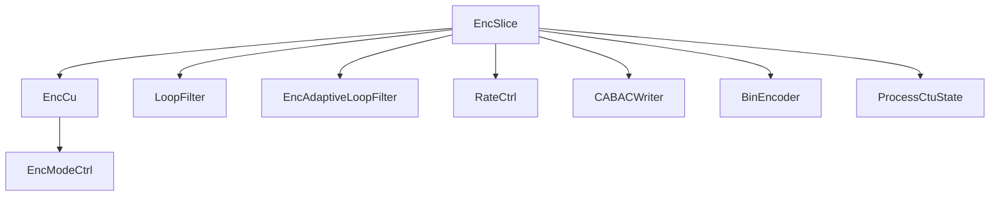
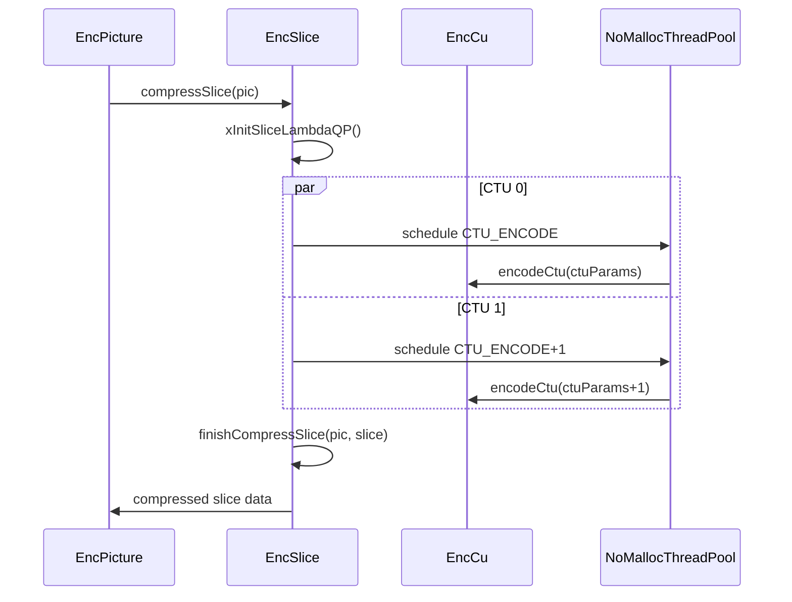

# EncSlice — Slice Encoder

## 1) Purpose

`EncSlice` manages slice-level encoding: compress slice data, CABAC initialization, deblocking control, SAO/ALF parameter derivation, and slice-level rate control.

## 2) Class Diagram



## 3) Key Methods

| Method | Description |
|---|---|
| `init()` | Initialize slice encoder with all sub-modules and thread pool |
| `initPic()` | Prepare per-picture state |
| `compressSlice()` | RD analysis of the entire slice (multi-threaded CTU encode) |
| `encodeSliceData()` | CABAC encoding pass for the slice |
| `saoDisabledRate()` | Compute SAO disabled rate statistics |
| `finishCompressSlice()` | Finalize slice: deblocking, SAO, ALF parameter decision |
| `xProcessCtus()` | Multi-threaded CTU processing loop |

## 4) Dependencies

- **Owns**: `EncCu`, `LoopFilter`, `EncAdaptiveLoopFilter`, `CABACWriter`, `BinEncoder`
- **Uses**: `NoMallocThreadPool`, `WaitCounter`, `RateCtrl`, `Picture`, `Slice`
- **Threading**: per-CTU `ProcessCtuState` atomic state machine for wavefront parallelism

## 5) Data Flow



## 6) Configuration

| Field | Source | Effect |
|---|---|---|
| `VVEncCfg::m_QP` | Encoder config | Base slice QP |
| `VVEncCfg::m_maxParallelFrames` | Encoder config | Thread pool size |
| `m_ctuEncDelay` | Internal | WPP wavefront delay in CTUs |
| `m_alfDeriveCtu` | Internal | CTU where ALF derivation starts |
| `m_saoDisabledRate` | Internal | Per-component SAO disable rate table |

## 7) Lifecycle

```
init(cfg, sps, pps, ...) per encoder init
  → initPic(pic) per picture
    → compressSlice(pic)
      → xInitSliceLambdaQP()
      → xProcessCtus() (multi-threaded CTU encode)
      → finishCompressSlice() (deblock, SAO, ALF)
    → encodeSliceData(pic) (CABAC bitstream output)
```
