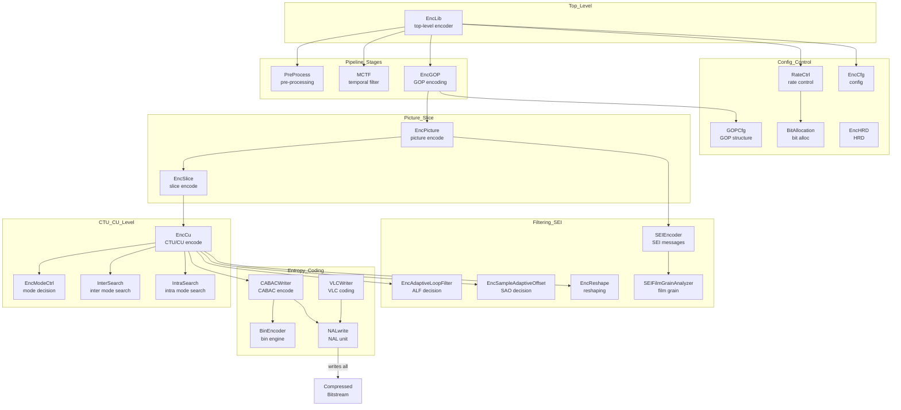
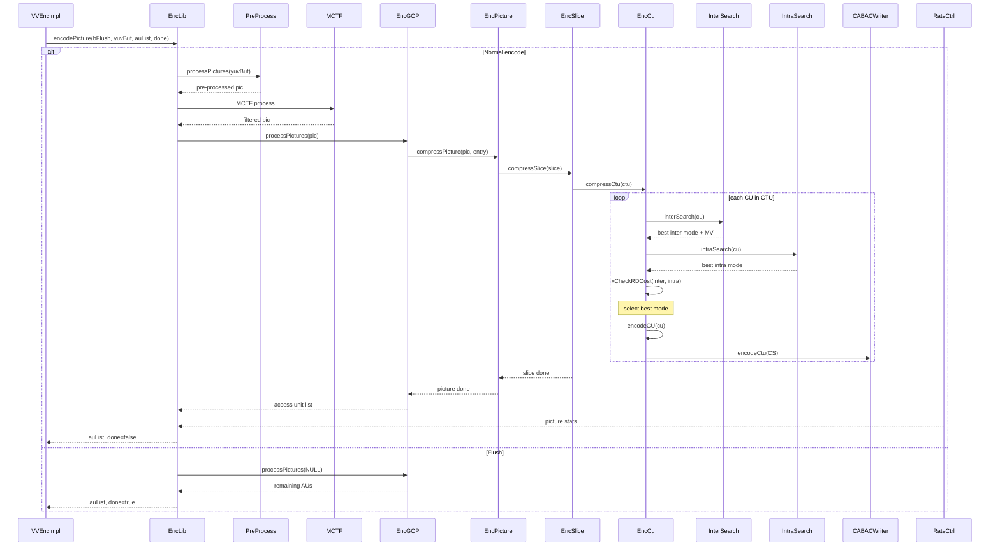

# EncoderLib — VVenC Encoder Library

## 1. Overview

EncoderLib implements the full VVC/H.266 encoding pipeline: picture preprocessing, motion-compensated temporal filtering, GOP-level encoding, slice coding, CTU/CU-level mode decision, entropy coding, and rate control. It is owned and driven by `EncLib` and consumed by `VVEncImpl` in the `vvenc` module.

**Dependencies**: `CommonLib` (all data types, coding tools, transforms, filters). No dependency on `DecoderLib`.

**Lifecycle**: `EncLib::initEncoderLib(cfg)` → `encodePicture()` loop → `EncLib::uninitEncoderLib()`.

## 2. Component Specifications

| # | Spec File | Role |
|---|-----------|------|
| 1 | `EncLib.spec.md` | Top-level encoder library — owns pipeline, sub-modules, lifecycle |
| 2 | `EncPicture.spec.md` | Picture-level encoding — manages CTU processing order |
| 3 | `EncSlice.spec.md` | Slice-level encoding — header writing, initialisation |
| 4 | `EncGOP.spec.md` | GOP-level encoding — picture reordering, reference management |
| 5 | `EncCu.spec.md` | CTU/CU encoding — mode decision, RD-opt CU partitioning |
| 6 | `InterSearch.spec.md` | Inter mode search — ME, merge/skip/affine/MMVD/SMVD |
| 7 | `IntraSearch.spec.md` | Intra mode search — angular/DC/Planar/MIP mode selection |
| 8 | `EncModeCtrl.spec.md` | Mode decision controller — early termination, fast algorithms |
| 9 | `EncCfg.spec.md` | Internal encoder config — derived from vvenc_config |
| 10 | `GOPCfg.spec.md` | GOP structure configuration — hierarchical B-frame patterns |
| 11 | `PreProcess.spec.md` | Pre-processing — colour conversion, padding, downsampling |
| 12 | `RateCtrl.spec.md` | Rate control — constant/VBR/ABR, intra-frame, multi-pass |
| 13 | `BitAllocation.spec.md` | Bit allocation across pictures in a GOP |
| 14 | `CABACWriter.spec.md` | CABAC entropy encoder — all syntax element coding methods |
| 15 | `BinEncoder.spec.md` | Binary arithmetic encoder backend |
| 16 | `VLCWriter.spec.md` | Variable-length coding writer |
| 17 | `NALwrite.spec.md` | NAL unit writing — header, RBSP, emulation prevention |
| 18 | `EncAdaptiveLoopFilter.spec.md` | Encoder-side ALF decision — filter coefficients, block classification |
| 19 | `EncSampleAdaptiveOffset.spec.md` | Encoder-side SAO decision — band/edge offset selection |
| 20 | `EncReshape.spec.md` | Encoder-side reshaping — luma mapping curve computation |
| 21 | `SEIEncoder.spec.md` | SEI message encoder — buffering, timing, HDR metadata |
| 22 | `SEIwrite.spec.md` | SEI NAL unit writing |
| 23 | `SEIFilmGrainAnalyzer.spec.md` | Film grain analysis and SEI parameter estimation |
| 24 | `EncHRD.spec.md` | Hypothetical reference decoder — HRD conformance |

## 3. System Architecture

## 4. Detailed Data Flow

## 5. Visualisation

No D3 animation — the full pipeline animation is covered in `EncLib.spec.md` which includes a D3 animation of the pipeline stages.

## 6. Testing Requirements

### Unit Tests (new file: `test/vvenc_unit_test/encoderlib_test.cpp`)

| Test ID | Scope | What to Verify |
|---------|-------|---------------|
| `EL_ENCLIB_INIT_UNINIT` | EncLib | initEncoderLib + uninitEncoderLib produces clean lifecycle |
| `EL_ENCLIB_ENCODE_IFRAME` | EncLib | Single I-frame encode produces non-zero AU |
| `EL_ENCLIB_ENCODE_BFRAME` | EncLib | P/B frame encode in contiguous sequence |
| `EL_ENCCU_MODE_DECISION` | EncCu | CU partitioning respects CTU size limits |
| `EL_INTERSEARCH_ME` | InterSearch | Motion estimation finds valid MV within search range |
| `EL_INTRASEARCH_SEARCH` | IntraSearch | Intra mode search selects valid mode |
| `EL_CABAC_WRITER` | CABACWriter | CABAC encode produces decodable bitstream |
| `EL_RATECTRL_QP` | RateCtrl | QP assigned within valid range per picture |
| `EL_GOP_STRUCTURE` | EncGOP | GOP picture order matches configuration |
| `EL_NAL_OUTPUT` | NALwrite | NAL unit headers have correct type and layer ID |

### Integration Tests

- Encode 16 frames with default preset, verify PSNR > 35 dB
- Encode with all presets (faster → slower), verify monotonic quality increase
- Two-pass rate control: pass 1 → pass 2, verify target bitrate within 5%

## 7. CLI Entry Point

Not directly exposed. EncoderLib is consumed by `VVEncImpl` in the `vvenc` module, which is in turn called by the C API (`vvenc.h`). CLI applications (`vvencapp`, `vvencFFapp`) link against `libvvenc` and call the C API.
