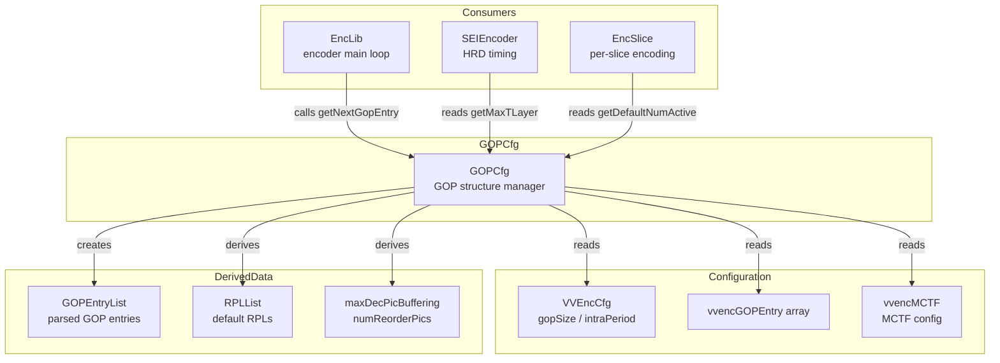
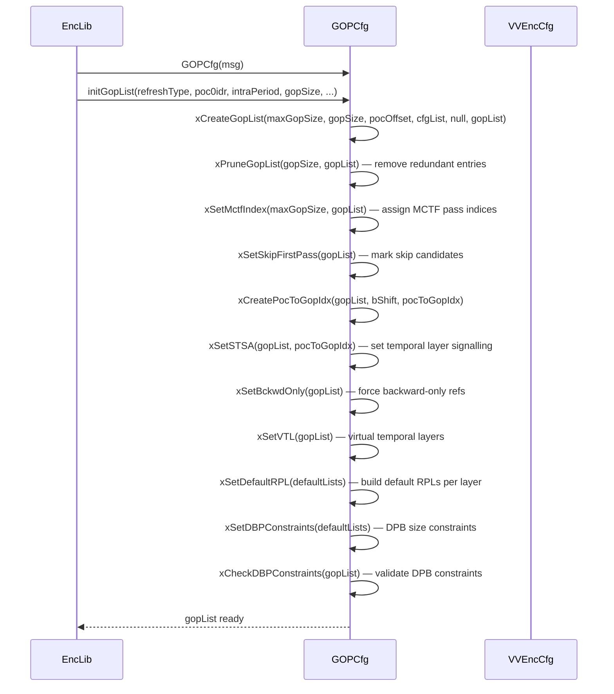
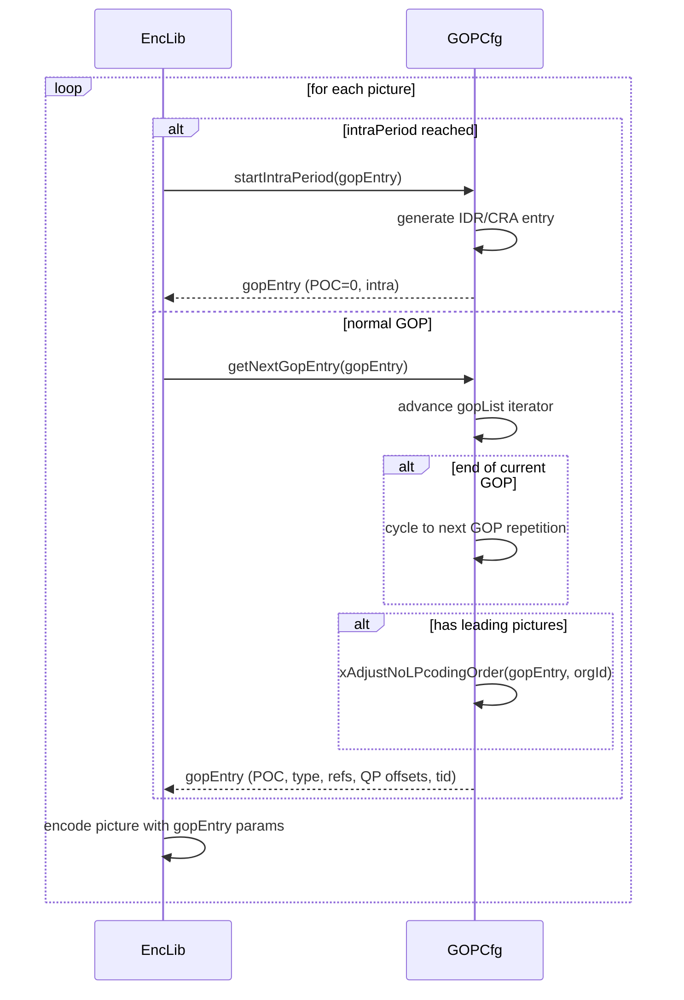
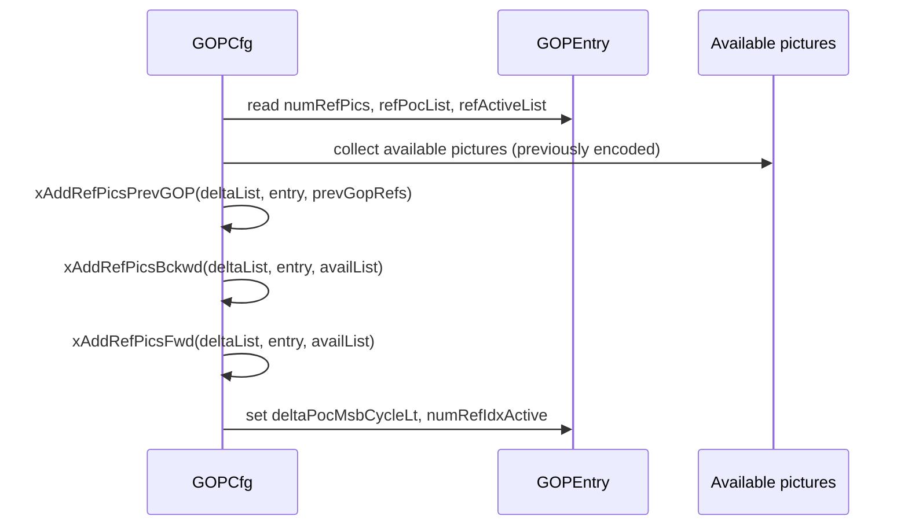

# GOPCfg — GOP Structure Configuration and Hierarchical B-Frame Patterns

## 1. Overview

The `GOPCfg` class manages the Group-of-Pictures (GOP) structure for the VVenC encoder. It defines the temporal coding hierarchy, reference picture lists, POC ordering, and encoding order for hierarchical B-frame and P-frame patterns.

**Key class:**
- **`GOPCfg`** — parses a GOP entry list from config, generates next GOP entries on demand, and provides RPL and DPB parameters

**Dependencies**: `CommonDef.h`, `Slice.h` (`GOPEntry`), `Utilities/MsgLog.h`.

**Lifecycle**: Created in `EncLib` during initialisation. `initGopList()` is called once with the config-specified GOP structure. The encoder calls `getNextGopEntry()` per picture to obtain the next GOP entry with its POC, slice type, QP offsets, reference indices, and temporal ID.

## 2. Component Specifications

### 2.1 Class: `GOPCfg`

```cpp
class GOPCfg
{
  typedef std::vector<GOPEntry> GOPEntryList;

public:
  GOPCfg(MsgLog& _m);
  ~GOPCfg();

  void initGopList(int refreshType, bool poc0idr, int intraPeriod, int gopSize,
                   int leadFrames, bool bPicReordering,
                   const vvencGOPEntry cfgGopList[VVENC_MAX_GOP],
                   const vvencMCTF& mctfCfg, int firstPassMode, int minIntraDist);
  void getNextGopEntry(GOPEntry& gopEntry);
  void startIntraPeriod(GOPEntry& gopEntry);
  void fixStartOfLastGop(GOPEntry& gopEntry);
  void getDefaultRPLLists(RPLList& rpl0, RPLList& rpl1) const;
  void setLastIntraSTA(int poc) { m_lastIntraPOC = poc; }

  int  getMaxTLayer() const;
  const std::vector<int>& getMaxDecPicBuffering() const;
  const std::vector<int>& getNumReorderPics() const;
  int  getDefaultNumActive(int l) const;

  bool isSTAallowed(int poc) const;
  bool hasNonZeroTemporalId() const;
  bool hasLeadingPictures() const;
  bool isChromaDeltaQPEnabled() const;

private:
  MsgLog&                      msg;
  std::vector<GOPEntryList>    m_defaultGopLists;
  GOPEntryList                 m_remainGopList;
  GOPEntryList*                m_gopList;
  std::vector<int>             m_pocToGopIdx;
  std::vector<const GOPEntry*> m_defaultRPLList;
  std::vector<int>             m_maxDecPicBuffering;
  std::vector<int>             m_numReorderPics;
  const vvencMCTF*             m_mctfCfg;
  bool m_picReordering;
  int  m_refreshType;
  int  m_fixIntraPeriod;
  bool m_poc0idr;
  int  m_maxGopSize;
  int  m_defGopSize;
  int  m_nextListIdx;
  int  m_gopNum;
  int  m_nextPoc;
  int  m_pocOffset;
  int  m_cnOffset;
  int  m_numTillGop;
  int  m_numTillIntra;
  int  m_maxTid;
  int  m_firstPassMode;
  int  m_defaultNumActive[2];
  int  m_minIntraDist;
  int  m_lastIntraPOC;
  bool m_adjustNoLPcodingOrder;

  int  xGetMinPoc(int maxGopSize, const vvencGOPEntry cfgGopList[VVENC_MAX_GOP]) const;
  void xCreateGopList(int maxGopSize, int gopSize, int pocOffset,
                      const vvencGOPEntry cfgGopList[VVENC_MAX_GOP],
                      const GOPEntryList* prevGopList, GOPEntryList& gopList) const;
  void xGetPrevGopRefs(const GOPEntryList* prevGopList,
                       std::vector< std::pair<int, int> >& prevGopRefs) const;
  void xPruneGopList(int gopSize, GOPEntryList& gopList) const;
  void xGetRefsOfNextGop(int gopSize,
                         const vvencGOPEntry cfgGopList[VVENC_MAX_GOP],
                         int pocOffset, std::vector<int>& pocList) const;
  void xSetMctfIndex(int maxGopSize, GOPEntryList& gopList) const;
  void xSetSkipFirstPass(GOPEntryList& gopList) const;
  void xCreatePocToGopIdx(const GOPEntryList& gopList, bool bShift,
                          std::vector<int>& pocToGopIdx) const;
  void xSetSTSA(GOPEntryList& gopList, const std::vector<int>& pocToGopIdx) const;
  void xSetBckwdOnly(GOPEntryList& gopList) const;
  void xSetVTL(GOPEntryList& gopList) const;
  void xSetDefaultRPL(std::vector<GOPEntryList>& defaultLists);
  void xSetDBPConstraints(std::vector<GOPEntryList>& defaultLists);
  bool xCheckDBPConstraints(const GOPEntryList& gopList) const;
  void xAddRefPicsBckwd(std::vector<int>& deltaList, const GOPEntry* gopEntry,
                        const std::vector<GOPEntry*>& availList) const;
  void xAddRefPicsFwd(std::vector<int>& deltaList, const GOPEntry* gopEntry,
                      const std::vector<GOPEntry*>& availList) const;
  void xAddRefPicsPrevGOP(std::vector<int>& deltaList, const GOPEntry* gopEntry,
                          const std::vector< std::pair<int, int> >& prevGopRefs) const;
  int  xGetMaxTid(const GOPEntryList& gopList) const;
  int  xGetMaxRefPics(const GOPEntry& gopEntry) const;
  int  xGetMaxNumReorder(const GOPEntry& gopEntry, const GOPEntryList& gopList) const;
  void xAdjustNoLPcodingOrder(GOPEntry& gopEntry, const int orgGopId) const;
};
```

## 3. System Architecture



## 4. Detailed Data Flow

### 4.1 GOP List Initialisation



### 4.2 Picture-Level GOP Iteration



### 4.3 RPL Construction for a GOP Entry



## 5. Visualisation

No D3 animation — GOP structure is a static configuration derived from input parameters. Temporal hierarchy can be visualised as a temporal-layer pyramid. The hierarchical B-frame pattern is well-documented in VVC standard.

## 6. Testing Requirements

### Unit Tests (new file: `test/vvenc_unit_test/gopcfg_test.cpp`)

| Test ID | Method | What to Verify |
|---|---|---|
| `GOP_INIT_8` | `initGopList(..., 8, ...)` | creates correct 8-entry GOP list |
| `GOP_INIT_16` | `initGopList(..., 16, ...)` | creates correct 16-entry GOP list |
| `GOP_INIT_INTRA_ONLY` | `initGopList(..., 1, ...)` | intra-only GOP (all I-slices) |
| `GOP_GET_NEXT_POC` | `getNextGopEntry(entry)` | POC advances correctly |
| `GOP_GET_NEXT_TYPE` | `getNextGopEntry(entry)` | slice type alternates per hierarchy |
| `GOP_GET_NEXT_TID` | `getNextGopEntry(entry)` | temporal ID increases with hierarchy |
| `GOP_GET_NEXT_QP_OFFSET` | `getNextGopEntry(entry)` | QP offset per temporal layer |
| `GOP_GET_NEXT_REFS` | `getNextGopEntry(entry)` | reference POCs correct for B-slices |
| `GOP_START_INTRA` | `startIntraPeriod(entry)` | resets to IDR/CRA entry |
| `GOP_START_INTRA_POC` | `startIntraPeriod(entry)` | POC=0 or next intra POC |
| `GOP_FIX_LAST` | `fixStartOfLastGop(entry)` | adjusts last GOP ending |
| `GOP_GET_RPL` | `getDefaultRPLLists(rpl0, rpl1)` | RPLs populated for each temporal layer |
| `GOP_MAX_TID` | `getMaxTLayer()` | layer count matches GOP depth |
| `GOP_DPB_SIZE` | `getMaxDecPicBuffering()` | DPB size per layer |
| `GOP_NUM_REORDER` | `getNumReorderPics()` | reorder count per layer |
| `GOP_DEFAULT_ACTIVE` | `getDefaultNumActive(0/1)` | active ref count per list |
| `GOP_STA_ALLOWED` | `isSTAallowed(poc)` | STA allowed for non-intra POC |
| `GOP_HAS_NONZERO_TID` | `hasNonZeroTemporalId()` | true for hierarchical GOP |
| `GOP_HAS_LEADING` | `hasLeadingPictures()` | true for CRA open-GOP |
| `GOP_CHROMA_DQP` | `isChromaDeltaQPEnabled()` | matches config chroma QP offset |
| `GOP_POC_TO_IDX` | internal `xCreatePocToGopIdx` | mapping correct for all POCs |
| `GOP_DBP_CONSTRAINT` | `xCheckDBPConstraints(list)` | no DPB overflow in hierarchical refs |

### Calling-Order Validation

- `initGopList()` must be called before `getNextGopEntry()`. If called without init, entry is undefined.
- `getNextGopEntry()` after `startIntraPeriod()` continues from the new intra position.
- `fixStartOfLastGop()` must be called after the last `getNextGopEntry()` to fix partial GOP.
- `getDefaultRPLLists()` must be called after `initGopList()`.

### Parameter Range Tests

- `gopSize = 0` (intra-only), `1`, `2`, `4`, `8`, `16` (max).
- `intraPeriod = -1` (all intra), `0` (no intra, each GOP closed by IDR), `N` (periodic).
- `leadFrames = 0` (closed GOP) vs. `> 0` (open GOP with leading pictures).
- `refreshType = 0` (IDR) vs. `1` (CRA) vs. `2` (GDR).
- `firstPassMode = 0, 1, 2` (no pass, single pass, multi-pass).

### Integration Tests

- Encode a sequence with hierarchical B-frame GOP (`gopSize=8`), verify frame types and temporal layers match expected pattern.
- Encode closed GOP vs. open GOP, verify leading picture presence in output.
- Encode with `poc0idr=true/false`, verify first picture NAL type.
- Encode with `picReordering` enabled/disabled, verify output POC order.

## 7. CLI Entry Point

Not directly exposed via CLI. Controlled through encoder configuration: `--gop-size`, `--intra-period`, `--refresh-type`, `--leading-pictures`, `--reorder-pics`, and the per-GOP-entry configuration options (`--gop-entry`).
