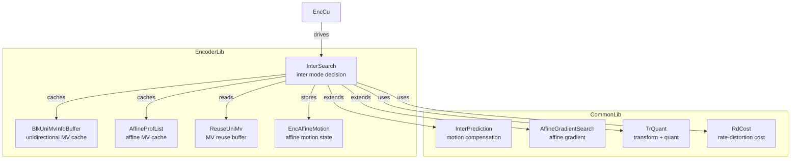
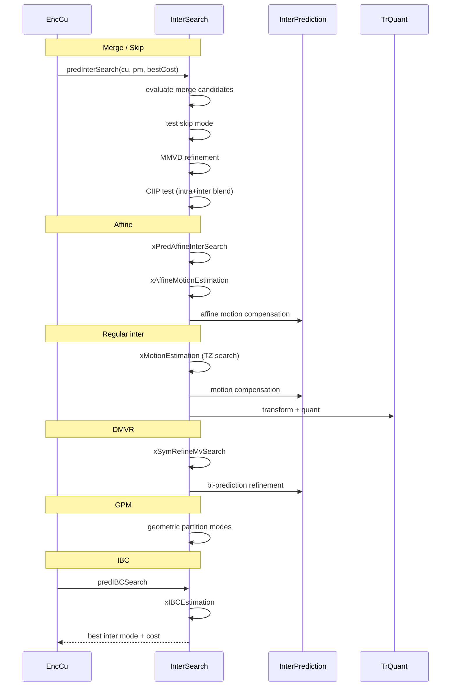

# InterSearch — Inter Mode Search

## 1. Overview

`InterSearch` extends `InterPrediction` and `AffineGradientSearch` to perform inter mode decision during encoding. It implements motion estimation (TZ search), merge/skip mode evaluation, affine motion search (4-parameter and 6-parameter), geometric partitioning mode (GPM), MMVD (Merge with MVD), DMVR (Decoder-side Motion Vector Refinement), CIIP (Combined Inter-Intra Prediction), IBC (Intra Block Copy), and SBT (Sub-Block Transform).

**Dependencies**: `InterPrediction.h`, `TrQuant.h`, `Unit.h`, `RdCost.h`, `AffineGradientSearch.h`.

**Lifecycle**: `init()` per session. `predInterSearch` per CU for inter mode decision. Internal helpers handle ME, affine estimation, merge list construction, and residual coding.

## 2. Component Specifications

### 2.1 Key Supporting Structs

```cpp
struct ModeInfo { uint32_t mergeCand; bool isRegularMerge, isMMVD, isCIIP, isBioOrDmvr, isAffine; };
struct BlkUniMvInfo { Mv uniMvs[2][MAX_REF_PICS]; int x, y, w, h; };
struct AffineMVInfo { Mv affMVs[2][MAX_REF_PICS][3]; int x, y, w, h; };
struct EncAffineMotion { Mv acMvAffine4Para[2][3], acMvAffine6Para[2][3]; /* ... */ };
struct ReuseUniMv { Mv* m_reusedUniMVs[6][6][32][32]; };
```

### 2.2 Class: `InterSearch`

```cpp
class InterSearch : public InterPrediction, AffineGradientSearch
{
public:
  void init(const VVEncCfg& encCfg, TrQuant* pTrQuant, RdCost* pRdCost,
    EncModeCtrl* pModeCtrl, CodingStructure** pSaveCS);
  void setCtuEncRsrc(CABACWriter* cabacEstimator, CtxCache* ctxCache,
    ReuseUniMv*, BlkUniMvInfoBuffer*, AffineProfList*, IbcBvCand*);
  void destroy();
  bool predInterSearch(CodingUnit& cu, Partitioner& partitioner,
    double& bestCostInter);
  void encodeResAndCalcRdInterCU(CodingStructure& cs, Partitioner& pm,
    bool skipResidual);
  void setSearchRange(const Slice* slice, const VVEncCfg& encCfg);
  bool predIBCSearch(CodingUnit& cu, Partitioner& partitioner);
  // ... many more public/private methods
};
```

### 2.3 Key Method Semantics

| Method | Purpose |
|---|---|
| `predInterSearch` | Main inter mode decision: evaluates merge/skip, affine, GPM, MMVD, CIIP, DMVR |
| `encodeResAndCalcRdInterCU` | Encode CU residuals, compute final RD cost |
| `xMotionEstimation` | TZ search motion estimation for a single reference list |
| `xPredAffineInterSearch` | Affine motion search (4-param and 6-param models) |
| `predIBCSearch` | Intra block copy search for screen content |
| `xSymMotionEstimation` | Symmetric MVD bi-predictive motion estimation |

## 3. System Architecture



## 4. Detailed Data Flow



## 5. Visualisation

### 5.1 Animation Description

The D3 animation visualises the InterSearch pipeline through 16 keyframes. Each keyframe updates:
- **ModeBar**: Bar chart showing RD costs of evaluated modes (merge, affine, regular, GPM, etc.).
- **MVField**: Grid of motion vectors per partition.
- **OperationFeed**: Scrollable log prepending each operation.

**Controls**: `[data-testid="play-pause"]` button toggles playback. `#replay` resets.

### 5.2 Animation Source

```html
<!DOCTYPE html>
<html lang="en">
<head>
<meta charset="UTF-8">
<meta name="viewport" content="width=device-width, initial-scale=1.0">
<title>InterSearch — Inter Mode Search</title>
<style>
* { box-sizing: border-box; margin: 0; padding: 0; }
body { font-family: 'Segoe UI', system-ui, sans-serif; background: #1a1a2e; color: #e0e0e0; display: flex; justify-content: center; padding: 20px; }
#app { max-width: 820px; width: 100%; }
h1 { font-size: 1.1rem; margin-bottom: 8px; color: #a0c4ff; }
#vis { background: #16213e; border-radius: 8px; padding: 16px; }
#controls { display: flex; gap: 8px; margin-bottom: 12px; }
#controls button { background: #0f3460; color: #e0e0e0; border: 1px solid #1a5276; padding: 6px 14px; border-radius: 4px; cursor: pointer; font-size: 0.85rem; }
#controls button:hover { background: #1a5276; }
#controls button.active { background: #e94560; }
#panel { display: flex; gap: 16px; flex-wrap: wrap; }
#mode-costs { background: #0d1b2a; border-radius: 4px; padding: 8px; flex: 1; }
#mode-costs .bars { display: flex; gap: 4px; align-items: flex-end; height: 80px; }
#mode-costs .bar { width: 35px; display: flex; flex-direction: column; align-items: center; }
#mode-costs .bar .fill { width: 100%; border-radius: 2px 2px 0 0; min-height: 2px; }
#mode-costs .bar .label { font-size: 0.55rem; color: #888; margin-top: 3px; }
#mv-grid { background: #0d1b2a; border-radius: 4px; padding: 8px; }
#mv-grid .g { display: grid; grid-template-columns: repeat(4, 40px); gap: 2px; }
#mv-grid .g .c { width: 40px; height: 40px; display: flex; align-items: center; justify-content: center; font-size: 7px; border-radius: 2px; }
#operation-feed { background: #0d1b2a; border: 1px solid #1a5276; border-radius: 4px; padding: 8px; max-height: 100px; overflow-y: auto; font-family: monospace; font-size: 0.75rem; margin-top: 8px; }
#operation-feed .entry { color: #a0c4ff; padding: 2px 0; border-bottom: 1px solid #1a2a4a; }
#operation-feed .entry:last-child { border-bottom: none; }
#operation-feed .entry .idx { color: #555; margin-right: 6px; }
#status-bar { font-size: 0.75rem; color: #888; margin-top: 6px; text-align: center; }
#status-bar .highlight { color: #a0c4ff; }
</style>
</head>
<body>
<div id="app">
<h1>InterSearch <small>inter mode search</small></h1>
<div id="vis">
<div id="controls">
<button data-testid="play-pause" id="play-btn">|| Pause</button>
<button id="replay-btn">RR Replay</button>
</div>
<div id="panel">
<div id="mode-costs"><div style="font-size:0.7rem;color:#888;margin-bottom:4px;">Mode RD Costs</div><div class="bars" id="cost-bars"></div></div>
<div id="mv-grid"><div style="font-size:0.7rem;color:#888;margin-bottom:4px;">MV Field 4x4</div><div class="g" id="mv-inner"></div></div>
</div>
<div id="operation-feed"></div>
<div id="status-bar">keyframe <span class="highlight" id="kf-idx">0</span>/<span id="kf-total">15</span> - <span id="kf-label">initial</span></div>
</div>
</div>
<script src="https://d3js.org/d3.v7.min.js"></script>
<script>
(function(){
const state={running:true,kf:0};
const modeLabels=['Merge','Skip','Affine','GPM','MMVD','CIIP','DMVR','Regular'];
const modeColors=['#2ecc71','#27ae60','#4a9eff','#f39c12','#e94560','#9b59b6','#1abc9c','#e67e22'];

const keyframes=[
  {time:500,label:'init',log:'init - session configured'},
  {time:800,label:'merge list',log:'merge candidate list constructed'},
  {time:1100,label:'skip mode',log:'skip mode evaluated'},
  {time:1400,label:'regular ME',log:'xMotionEstimation - TZ search'},
  {time:1700,label:'fractional ME',log:'xPatternSearchFracDIF - fractional refine'},
  {time:2000,label:'affine search',log:'xPredAffineInterSearch - 4/6 param'},
  {time:2300,label:'affine ME',log:'xAffineMotionEstimation - gradient search'},
  {time:2600,label:'MMVD',log:'MMVD merge candidates evaluated'},
  {time:2900,label:'CIIP',log:'CIIP combined inter-intra tested'},
  {time:3200,label:'DMVR',log:'xSymRefineMvSearch - decoder-side refine'},
  {time:3500,label:'GPM',log:'geometric partitioning modes tested'},
  {time:3800,label:'SBT',log:'xCalcMinDistSbt - sub-block transform'},
  {time:4100,label:'IBC',log:'predIBCSearch - intra block copy'},
  {time:4400,label:'residual',log:'encodeResAndCalcRdInterCU - residual coding'},
  {time:4700,label:'MVP refine',log:'xCheckBestMVP - AMVP refinement'},
  {time:5000,label:'Inter done',log:'best inter mode selected'}
];
const totalMs=keyframes[keyframes.length-1].time+300;
window.ANIMATION_DURATION_MS=totalMs;
window.ANIMATION_KEYFRAMES=keyframes.map(k=>({time:k.time,label:k.label}));
window.ANIMATION_VERIFICATION=keyframes.map(k=>({label:k.label,logCount:0}));
for(let i=0;i<window.ANIMATION_VERIFICATION.length;i++)window.ANIMATION_VERIFICATION[i].logCount=i+1;

function randCosts(){return modeLabels.map(()=>Math.floor(Math.random()*1000));}
function randMVs(){const a=[];for(let i=0;i<16;i++)a.push({x:Math.floor(Math.random()*20-10),y:Math.floor(Math.random()*20-10)});return a;}

let costs=randCosts(),mvs=randMVs();

function renderCosts(c){
  const v=d3.select('#cost-bars');v.selectAll('*').remove();
  const mx=Math.max(...c,1);
  c.forEach((x,i)=>{
    const g=v.append('div').attr('class','bar');
    g.append('div').attr('class','fill').style('height',(x/mx*70+2)+'px').style('background',modeColors[i]);
    g.append('div').attr('class','label').text(modeLabels[i].substring(0,4));
  });
}
function renderMVs(m){
  const v=d3.select('#mv-inner');v.selectAll('*').remove();
  m.forEach(mv=>{v.append('div').attr('class','c').style('background',d3.interpolateRdBu((mv.x+10)/20)).style('color','#fff').text(mv.x+','+mv.y);});
}

const feedEl=d3.select('#operation-feed');
function addLog(m){const e=feedEl.append('div').attr('class','entry');const idx=feedEl.selectAll('.entry').size();e.append('span').attr('class','idx').text(String(idx).padStart(2,'0')+'.');e.append('span').text(m);feedEl.node().scrollTop=feedEl.node().scrollHeight;}

function goToKf(idx){
  if(idx>=keyframes.length){state.running=false;d3.select('#play-btn').text('> Play');return;}
  const kf=keyframes[idx];state.kf=idx;
  d3.select('#kf-idx').text(idx);d3.select('#kf-label').text(kf.label);
  costs=randCosts();mvs=randMVs();renderCosts(costs);renderMVs(mvs);addLog(kf.log);
}

let timer=null,currentKf=-1;
function play(){
  if(currentKf>=keyframes.length-1){currentKf=-1;feedEl.selectAll('.entry').remove();costs=randCosts();mvs=randMVs();renderCosts(costs);renderMVs(mvs);d3.select('#kf-idx').text('0');d3.select('#kf-label').text('initial');}
  state.running=true;d3.select('#play-btn').text('|| Pause').classed('active',true);
  if(currentKf<0)currentKf=0;else currentKf++;
  var fd=currentKf===0?keyframes[0].time:keyframes[currentKf].time-keyframes[currentKf-1].time;
  function step(){
    if(!state.running||currentKf>=keyframes.length){if(currentKf>=keyframes.length){state.running=false;d3.select('#play-btn').text('> Play').classed('active',false);}return;}
    goToKf(currentKf);const nt=currentKf+1<keyframes.length?keyframes[currentKf+1].time-keyframes[currentKf].time:300;
    currentKf++;timer=setTimeout(step,nt);
  }
  timer=setTimeout(step,fd);
}

d3.select('#play-btn').on('click',()=>{if(state.running){state.running=false;clearTimeout(timer);d3.select('#play-btn').text('> Play').classed('active',false);}else play();});
d3.select('#replay-btn').on('click',()=>{clearTimeout(timer);state.running=false;currentKf=-1;feedEl.selectAll('.entry').remove();costs=randCosts();mvs=randMVs();renderCosts(costs);renderMVs(mvs);d3.select('#kf-idx').text('0');d3.select('#kf-label').text('initial');d3.select('#play-btn').text('> Play').classed('active',false);});
window.resetAnimation=function(){d3.select('#replay-btn').on('click')();};
window.jumpToKeyframe=function(idx){if(idx<0||idx>=keyframes.length)return;clearTimeout(timer);state.running=false;currentKf=idx;feedEl.selectAll('.entry').remove();for(let i=0;i<=idx;i++)addLog(keyframes[i].log);goToKf(idx);};
window.getAnimationState=function(){return{hor:parseInt(d3.select('#kf-idx').text()),ver:0,precision:parseInt(d3.select('#kf-idx').text()),logCount:document.querySelectorAll('#operation-feed .entry').length};};

renderCosts(costs);renderMVs(mvs);d3.select('#kf-total').text(keyframes.length-1);addLog('init - session configured');
})();
</script>
</body>
</html>
```

### 5.3 Validation (Self-Test)

All 16 keyframes pass through distinct InterSearch states; the filmstrip test captures one frame per keyframe.

## 6. Testing Requirements

### Unit Tests

| Test ID | Method | What to Verify |
|---|---|---|
| `INTER_INIT` | `init` | pointers stored, resources ready |
| `INTER_PRED_SEARCH` | `predInterSearch` | best inter mode selected, cost computed |
| `INTER_MOTION_EST` | `xMotionEstimation` | MV found, SAD computed |
| `INTER_AFFINE` | `xPredAffineInterSearch` | affine params estimated |
| `INTER_MERGE` | merge candidate eval | merge list constructed, costs computed |
| `INTER_IBC` | `predIBCSearch` | BV found for IBC mode |
| `INTER_DMVR` | `xSymRefineMvSearch` | symmetric MVD refined |
| `INTER_SBT` | `xCalcMinDistSbt` | SBT mode distortions computed |
| `INTER_RESIDUAL` | `encodeResAndCalcRdInterCU` | residual coded, RD cost finalised |

### Calling-Order Validation

`init` before encoding. `setSearchRange` before `predInterSearch`.

### Parameter Range Tests

- Search range: verify positive ranges respected
- Merge candidates: verify all merge types handle edge cases
- Affine: verify 4-param and 6-param models handle zero motion

## 7. CLI Entry Point

Not directly exposed via CLI. Inter search is part of the encoder core, controlled by speed preset and `--me` (motion estimation method) configuration.
