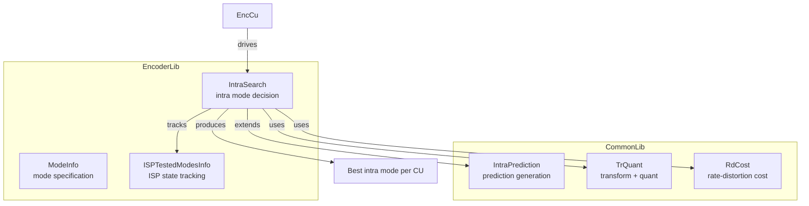
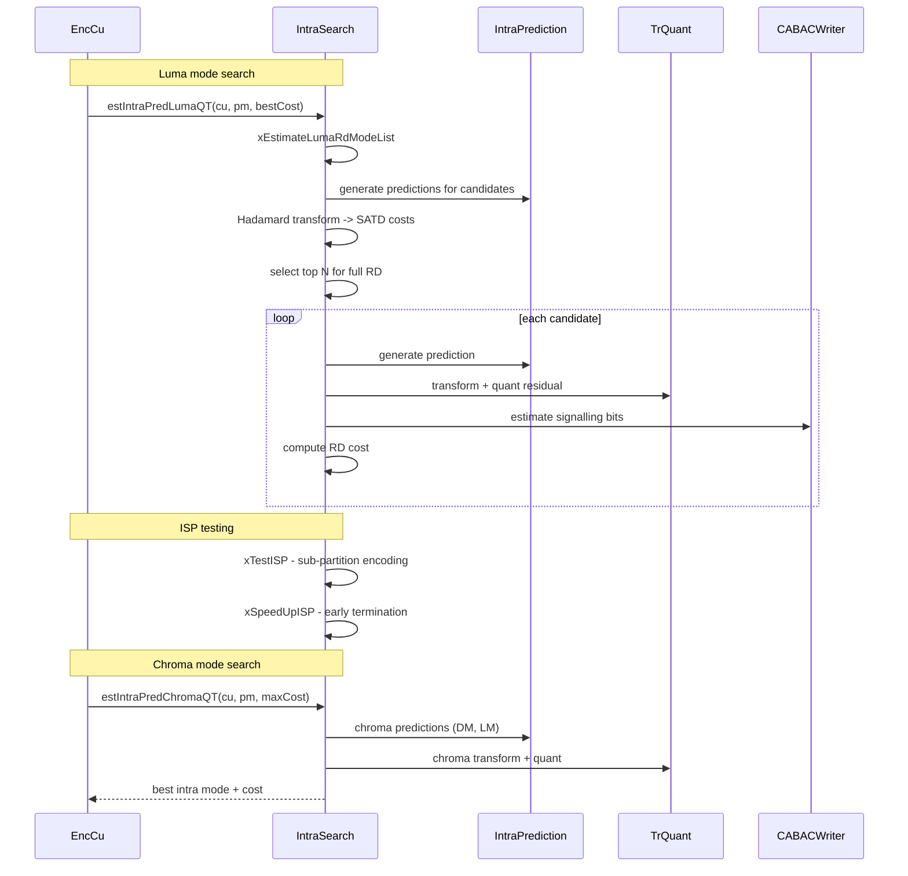

# IntraSearch — Intra Mode Search

## 1. Overview

`IntraSearch` extends `IntraPrediction` to perform intra mode decision during encoding. It implements rough mode decision (SATD-based candidate list), full RD-cost-based refinement, ISP (Intra Sub-Partitions) mode testing, MIP (Matrix-based Intra Prediction) search, chroma mode search with cross-component prediction, MTS (Multiple Transform Selection) pre-check, and SCIPU cost caching for inter-intra integration.

**Dependencies**: `IntraPrediction.h`, `TrQuant.h`, `Unit.h`, `RdCost.h`.

**Lifecycle**: `init()` per session. `estIntraPredLumaQT` per CU for luma mode decision. `estIntraPredChromaQT` per CU for chroma.

## 2. Component Specifications

### 2.1 Struct: `ModeInfo`

```cpp
struct ModeInfo
{
  bool mipFlg;
  bool mipTrFlg;
  int8_t mRefId;
  uint8_t ispMod;
  uint8_t modeId;
  bool operator==(const ModeInfo cmp) const;
};
```

### 2.2 Struct: `ISPTestedModesInfo`

```cpp
struct ISPTestedModesInfo
{
  int numTotalParts[2];
  int bestModeSoFar;
  ISPType bestSplitSoFar;
  double bestCost[2];
  bool splitIsFinished[2];
  int subTuCounter;
  PartSplit IspType;
  bool relatedCuIsValid, intraWasTested;
  int bestIntraMode;
  bool isIntra;
  int bestBefore[3];
  void clear();
  void init(int numTotalPartsHor, int numTotalPartsVer, bool n);
};
```

### 2.3 Class: `IntraSearch`

```cpp
class IntraSearch : public IntraPrediction
{
public:
  void init(const VVEncCfg& encCfg, TrQuant* pTrQuant, RdCost* pRdCost,
    SortedPelUnitBufs<SORTED_BUFS>* pSortedPelUnitBufs, XUCache& unitCache);
  void setCtuEncRsrc(CABACWriter* cabacEstimator, CtxCache* ctxCache);
  void destroy();
  bool estIntraPredLumaQT(CodingUnit& cu, Partitioner& pm,
    double bestCost = MAX_DOUBLE);
  void estIntraPredChromaQT(CodingUnit& cu, Partitioner& partitioner,
    double maxCostAllowed);
private:
  void xEstimateLumaRdModeList(int& numModesForFullRD,
    static_vector<ModeInfo, FAST_UDI_MAX_RDMODE_NUM>& RdModeList,
    static_vector<ModeInfo, FAST_UDI_MAX_RDMODE_NUM>& HadModeList,
    static_vector<double, FAST_UDI_MAX_RDMODE_NUM>& CandCostList,
    static_vector<double, FAST_UDI_MAX_RDMODE_NUM>& CandHadList,
    CodingUnit& cu, bool testMip);
  uint64_t xFracModeBitsIntraLuma(const CodingUnit& cu, const unsigned* mpmLst);
  void xEncIntraHeader(CodingStructure& cs, Partitioner& pm, bool luma);
  void xIntraCodingTUBlock(TransformUnit& tu, ComponentID compID,
    bool checkCrossCPrediction, Distortion& ruiDist,
    uint32_t* numSig, PelUnitBuf* pPred, bool loadTr);
  void xIntraCodingLumaQT(CodingStructure& cs, Partitioner& pm,
    PelUnitBuf* pPred, double bestCostSoFar, int numMode, bool disableMTS);
  double xTestISP(CodingStructure& cs, Partitioner& pm,
    double bestCostSoFar, PartSplit ispType, bool& splitcbf,
    uint64_t& singleFracBits, Distortion& singleDistLuma, CUCtx& cuCtx);
  int xSpeedUpISP(int speed, bool& testISP, int mode, int& noISP,
    int& endISP, CodingUnit& cu,
    static_vector<ModeInfo, FAST_UDI_MAX_RDMODE_NUM>& RdModeList,
    const ModeInfo& bestPUMode, int bestISP, int bestLfnstIdx);
  void xSpeedUpIntra(double bestcost, int& EndMode, int& speedIntra, CodingUnit& cu);
  template<typename T, size_t N, int M>
  void xReduceHadCandList(static_vector<T,N>& candModeList,
    static_vector<double,N>& candCostList, SortedPelUnitBufs<M>& sortedPelBuffer,
    int& numModesForFullRD, double thresholdHadCost,
    const double* mipHadCost, const CodingUnit& cu, bool fastMip);
};
```

### 2.4 Key Method Semantics

| Method | Purpose |
|---|---|
| `estIntraPredLumaQT` | Full luma intra mode decision: rough candidate list, full RD refinement, ISP/MIP |
| `estIntraPredChromaQT` | Chroma mode search including DM, LM modes, cross-component prediction |
| `xEstimateLumaRdModeList` | Build candidate list from rough SATD costs (Hadamard transform) |
| `xIntraCodingTUBlock` | Encode a single TU block with given intra mode, compute distortion and rate |
| `xIntraCodingLumaQT` | Iterate CU sub-partitions for RD-optimised transform decisions |
| `xTestISP` | Test ISP (Intra Sub-Partitions) for a given split direction |

## 3. System Architecture



## 4. Detailed Data Flow



## 5. Visualisation

### 5.1 Animation Description

The D3 animation visualises the IntraSearch pipeline through 14 keyframes. Each keyframe updates:
- **CandList**: Bar chart of candidate mode costs (SATD).
- **ModeGrid**: Visual grid of angular modes with selected mode highlighted.
- **IspSplit**: Visualisation of ISP partition structure.
- **OperationFeed**: Scrollable log prepending each operation.

**Controls**: `[data-testid="play-pause"]` button toggles playback. `#replay` resets.

### 5.2 Animation Source

```html
<!DOCTYPE html>
<html lang="en">
<head>
<meta charset="UTF-8">
<meta name="viewport" content="width=device-width, initial-scale=1.0">
<title>IntraSearch — Intra Mode Search</title>
<style>
* { box-sizing: border-box; margin: 0; padding: 0; }
body { font-family: 'Segoe UI', system-ui, sans-serif; background: #1a1a2e; color: #e0e0e0; display: flex; justify-content: center; padding: 20px; }
#app { max-width: 820px; width: 100%; }
h1 { font-size: 1.1rem; margin-bottom: 8px; color: #a0c4ff; }
#vis { background: #16213e; border-radius: 8px; padding: 16px; }
#controls { display: flex; gap: 8px; margin-bottom: 12px; }
#controls button { background: #0f3460; color: #e0e0e0; border: 1px solid #1a5276; padding: 6px 14px; border-radius: 4px; cursor: pointer; font-size: 0.85rem; }
#controls button:hover { background: #1a5276; }
#controls button.active { background: #e94560; }
#panel { display: flex; gap: 16px; flex-wrap: wrap; }
#cand-list { background: #0d1b2a; border-radius: 4px; padding: 8px; flex: 1; }
#cand-list .bars { display: flex; gap: 2px; align-items: flex-end; height: 80px; }
#cand-list .bar { width: 20px; display: flex; flex-direction: column; align-items: center; }
#cand-list .bar .fill { width: 100%; border-radius: 2px 2px 0 0; min-height: 2px; }
#mode-grid { background: #0d1b2a; border-radius: 4px; padding: 8px; }
#mode-grid .g { display: grid; grid-template-columns: repeat(8, 28px); gap: 2px; }
#mode-grid .g .c { width: 28px; height: 28px; display: flex; align-items: center; justify-content: center; font-size: 7px; border-radius: 2px; }
#operation-feed { background: #0d1b2a; border: 1px solid #1a5276; border-radius: 4px; padding: 8px; max-height: 100px; overflow-y: auto; font-family: monospace; font-size: 0.75rem; margin-top: 8px; }
#operation-feed .entry { color: #a0c4ff; padding: 2px 0; border-bottom: 1px solid #1a2a4a; }
#operation-feed .entry:last-child { border-bottom: none; }
#operation-feed .entry .idx { color: #555; margin-right: 6px; }
#status-bar { font-size: 0.75rem; color: #888; margin-top: 6px; text-align: center; }
#status-bar .highlight { color: #a0c4ff; }
</style>
</head>
<body>
<div id="app">
<h1>IntraSearch <small>intra mode search</small></h1>
<div id="vis">
<div id="controls">
<button data-testid="play-pause" id="play-btn">|| Pause</button>
<button id="replay-btn">RR Replay</button>
</div>
<div id="panel">
<div id="cand-list"><div style="font-size:0.7rem;color:#888;margin-bottom:4px;">Candidates (SATD)</div><div class="bars" id="cand-bars"></div></div>
<div id="mode-grid"><div style="font-size:0.7rem;color:#888;margin-bottom:4px;">Modes 8x8</div><div class="g" id="modes-inner"></div></div>
</div>
<div id="operation-feed"></div>
<div id="status-bar">keyframe <span class="highlight" id="kf-idx">0</span>/<span id="kf-total">13</span> - <span id="kf-label">initial</span></div>
</div>
</div>
<script src="https://d3js.org/d3.v7.min.js"></script>
<script>
(function(){
const state={running:true,kf:0};
const keyframes=[
  {time:500,label:'init',log:'init - session configured'},
  {time:800,label:'candidate list',log:'xEstimateLumaRdModeList - SATD costs'},
  {time:1100,label:'Hadamard',log:'Hadamard transform for 67 angular modes'},
  {time:1400,label:'reduce cand',log:'xReduceHadCandList - top N selected'},
  {time:1700,label:'full RD',log:'estIntraPredLumaQT - full RD refinement'},
  {time:2000,label:'MIP test',log:'MIP candidates evaluated'},
  {time:2300,label:'ISP test',log:'xTestISP - ISP sub-partitions'},
  {time:2600,label:'ISP speedup',log:'xSpeedUpISP - early termination'},
  {time:2900,label:'luma done',log:'best luma mode selected'},
  {time:3200,label:'chroma DM',log:'estIntraPredChromaQT - DM mode'},
  {time:3500,label:'chroma LM',log:'linear model chroma prediction'},
  {time:3800,label:'chroma done',log:'best chroma mode selected'},
  {time:4100,label:'SCIPU cache',log:'saveCuAreaCostInSCIPU - cost cached'},
  {time:4400,label:'Intra done',log:'intra mode search complete'}
];
const totalMs=keyframes[keyframes.length-1].time+300;
window.ANIMATION_DURATION_MS=totalMs;
window.ANIMATION_KEYFRAMES=keyframes.map(k=>({time:k.time,label:k.label}));
window.ANIMATION_VERIFICATION=keyframes.map(k=>({label:k.label,logCount:0}));
for(let i=0;i<window.ANIMATION_VERIFICATION.length;i++)window.ANIMATION_VERIFICATION[i].logCount=i+1;

function randArr(n){const a=[];for(let i=0;i<n;i++)a.push(Math.floor(Math.random()*500));return a;}
function randModes(){const a=[];for(let i=0;i<64;i++)a.push(Math.floor(Math.random()*67));return a;}

let cands=randArr(10),modes=randModes();

function renderCands(c){const v=d3.select('#cand-bars');v.selectAll('*').remove();const mx=Math.max(...c,1);c.forEach((x,i)=>{const g=v.append('div').attr('class','bar');g.append('div').attr('class','fill').style('height',(x/mx*70+2)+'px').style('background',d3.interpolateBlues(x/mx*0.7+0.3));g.append('div').attr('class','label').style('font-size','0.55rem').text(i);});}
function renderModes(m){const v=d3.select('#modes-inner');v.selectAll('*').remove();m.forEach(x=>{v.append('div').attr('class','c').style('background',d3.interpolateTurbo(x/67)).style('color','#fff').text(x);});}

const feedEl=d3.select('#operation-feed');
function addLog(m){const e=feedEl.append('div').attr('class','entry');const idx=feedEl.selectAll('.entry').size();e.append('span').attr('class','idx').text(String(idx).padStart(2,'0')+'.');e.append('span').text(m);feedEl.node().scrollTop=feedEl.node().scrollHeight;}

function goToKf(idx){
  if(idx>=keyframes.length){state.running=false;d3.select('#play-btn').text('> Play');return;}
  const kf=keyframes[idx];state.kf=idx;
  d3.select('#kf-idx').text(idx);d3.select('#kf-label').text(kf.label);
  cands=randArr(10);modes=randModes();renderCands(cands);renderModes(modes);addLog(kf.log);
}

let timer=null,currentKf=-1;
function play(){
  if(currentKf>=keyframes.length-1){currentKf=-1;feedEl.selectAll('.entry').remove();cands=randArr(10);modes=randModes();renderCands(cands);renderModes(modes);d3.select('#kf-idx').text('0');d3.select('#kf-label').text('initial');}
  state.running=true;d3.select('#play-btn').text('|| Pause').classed('active',true);
  if(currentKf<0)currentKf=0;else currentKf++;
  var fd=currentKf===0?keyframes[0].time:keyframes[currentKf].time-keyframes[currentKf-1].time;
  function step(){
    if(!state.running||currentKf>=keyframes.length){if(currentKf>=keyframes.length){state.running=false;d3.select('#play-btn').text('> Play').classed('active',false);}return;}
    goToKf(currentKf);const nt=currentKf+1<keyframes.length?keyframes[currentKf+1].time-keyframes[currentKf].time:300;
    currentKf++;timer=setTimeout(step,nt);
  }
  timer=setTimeout(step,fd);
}

d3.select('#play-btn').on('click',()=>{if(state.running){state.running=false;clearTimeout(timer);d3.select('#play-btn').text('> Play').classed('active',false);}else play();});
d3.select('#replay-btn').on('click',()=>{clearTimeout(timer);state.running=false;currentKf=-1;feedEl.selectAll('.entry').remove();cands=randArr(10);modes=randModes();renderCands(cands);renderModes(modes);d3.select('#kf-idx').text('0');d3.select('#kf-label').text('initial');d3.select('#play-btn').text('> Play').classed('active',false);});
window.resetAnimation=function(){d3.select('#replay-btn').on('click')();};
window.jumpToKeyframe=function(idx){if(idx<0||idx>=keyframes.length)return;clearTimeout(timer);state.running=false;currentKf=idx;feedEl.selectAll('.entry').remove();for(let i=0;i<=idx;i++)addLog(keyframes[i].log);goToKf(idx);};
window.getAnimationState=function(){return{hor:parseInt(d3.select('#kf-idx').text()),ver:0,precision:parseInt(d3.select('#kf-idx').text()),logCount:document.querySelectorAll('#operation-feed .entry').length};};

renderCands(cands);renderModes(modes);d3.select('#kf-total').text(keyframes.length-1);addLog('init - session configured');
})();
</script>
</body>
</html>
```

### 5.3 Validation (Self-Test)

All 14 keyframes pass through distinct IntraSearch states; the filmstrip test captures one frame per keyframe.

## 6. Testing Requirements

### Unit Tests

| Test ID | Method | What to Verify |
|---|---|---|
| `IS_INIT` | `init` | pointers stored, resources ready |
| `IS_LUMA_QT` | `estIntraPredLumaQT` | best mode selected, cost computed |
| `IS_CHROMA_QT` | `estIntraPredChromaQT` | chroma mode selected |
| `IS_MODE_LIST` | `xEstimateLumaRdModeList` | candidate list populated with costs |
| `IS_TU_BLOCK` | `xIntraCodingTUBlock` | distortion and bits computed |
| `IS_ISP` | `xTestISP` | ISP cost computed correctly |
| `IS_REDUCE` | `xReduceHadCandList` | candidate count reduced |
| `IS_SCIPU_SAVE` | `saveCuAreaCostInSCIPU` | cost cached in SCIPU array |

### Calling-Order Validation

`init` before encoding. `estIntraPredLumaQT` before `estIntraPredChromaQT` for the same CU.

### Parameter Range Tests

- Angular modes: verify all 67 modes reachable
- ISP: verify HOR and VER split directions
- MIP: verify MIP flag and transpose combinations

## 7. CLI Entry Point

Not directly exposed via CLI. Intra search is part of the encoder core, controlled indirectly by speed preset and `--intra-period` configuration.
