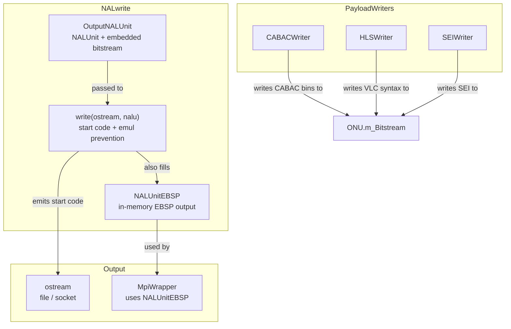
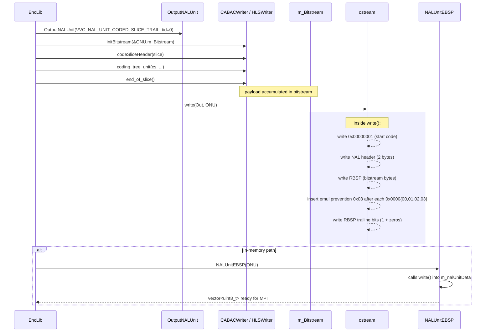
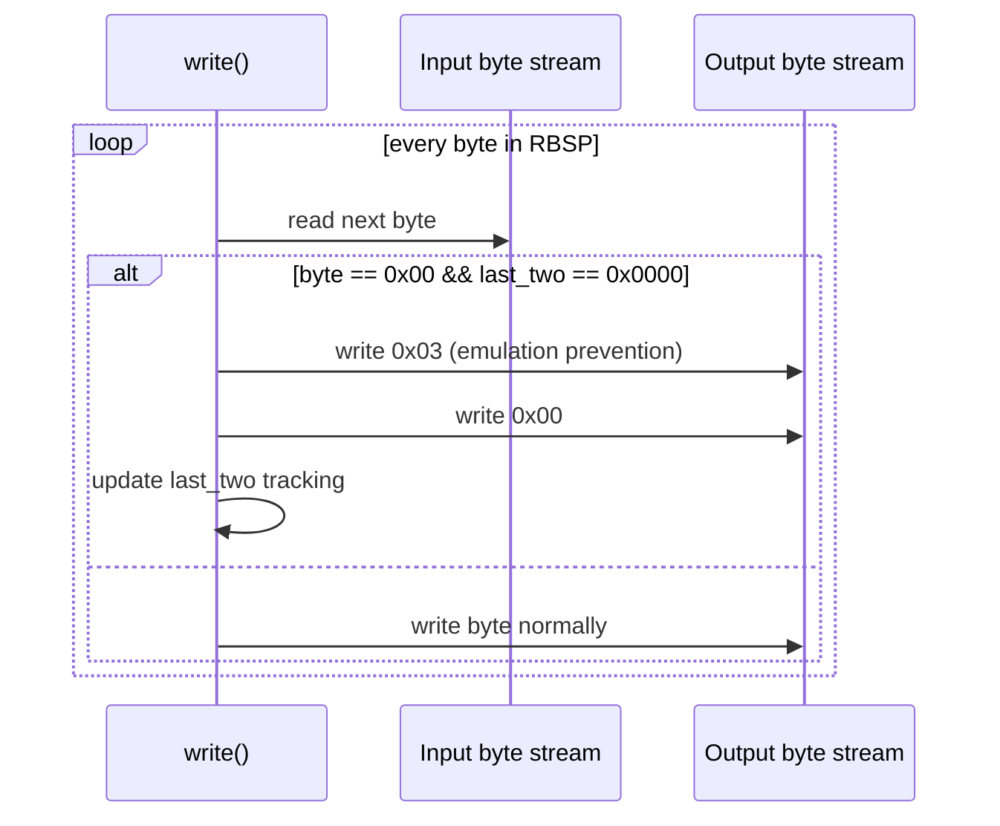

# NALwrite — NAL Unit Output and Start-Code Emulation Prevention

## 1. Overview

The `NALwrite` module handles serialisation of VVC NAL units from the encoder bitstream to the output bytestream. It provides the `OutputNALUnit` convenience wrapper, the free-function `write()` that emits a NAL unit with start-code emulation prevention (RBSP → EBSP conversion), and the `NALUnitEBSP` struct for in-memory EBSP storage.

**Key types:**
- **`OutputNALUnit`** — extends `NALUnit` with an embedded `OutputBitstream`; constructed with NAL header fields
- **`NALUnitEBSP`** — extends `NALUnit`, constructed from an `OutputNALUnit` by calling `write()` and storing the EBSP in `m_nalUnitData`
- **`write(ostream&, OutputNALUnit&)`** — free function that writes the NAL unit with start-code prefix, NAL header, RBSP trailing bits, and emulation prevention

**Dependencies**: `CommonDef.h`, `BitStream.h`, `Nal.h` (NAL unit type definitions), `<ostream>`.

**Lifecycle**: Encoder creates `OutputNALUnit` with NAL type/temporal ID → writes payload via `CABACWriter`/`VLCWriter` → `write(ostream, nalu)` flushes the complete bitstream to output. `NALUnitEBSP` is used by the `MpiWrapper` for in-memory multi-process transport.

## 2. Component Specifications

### 2.1 Struct: `OutputNALUnit`

```cpp
struct OutputNALUnit : public NALUnit
{
  OutputNALUnit(
    vvencNalUnitType nalUnitType,
    uint32_t temporalID = 0,
    uint32_t reserved_zero_6bits = 0)
  : NALUnit(nalUnitType, temporalID, reserved_zero_6bits)
  , m_Bitstream()
  {}

  OutputNALUnit& operator=(const NALUnit& src)
  {
    m_Bitstream.clear();
    static_cast<NALUnit*>(this)->operator=(src);
    return *this;
  }

  OutputBitstream m_Bitstream;
};
```

### 2.2 Free Function: `write`

```cpp
void write(std::ostream& out, OutputNALUnit& nalu);
```

Writes to `out`:
1. Zero-byte start-code prefix
2. Start-code delimiter (0x000001)
3. NAL unit header (2 bytes: forbidden bit, nal_unit_type, temporal_id, etc.)
4. RBSP payload from `nalu.m_Bitstream`
5. RBSP trailing bits (one 1-bit + zero-align)
6. Emulation prevention bytes inserted after each 0x0000{00,01,02,03} sequence

### 2.3 Struct: `NALUnitEBSP`

```cpp
inline NALUnitEBSP::NALUnitEBSP(OutputNALUnit& nalu)
  : NALUnit(nalu)
{
  write(m_nalUnitData, nalu);
}
```

## 3. System Architecture



## 4. Detailed Data Flow

### 4.1 NAL Unit Output Pipeline



### 4.2 Emulation Prevention Byte Insertion



## 5. Visualisation

No D3 animation — NAL unit output is a straightforward byte-stream transformation (start code prefix + emulation prevention). Correctness is verified via bitstream conformance tests and VVC reference decoder decode.

## 6. Testing Requirements

### Unit Tests (new file: `test/vvenc_unit_test/nalwrite_test.cpp`)

| Test ID | Method | What to Verify |
|---|---|---|
| `NAL_OUTPUT_CONSTRUCTOR` | `OutputNALUnit(type, tid)` | header fields match, bitstream empty |
| `NAL_OUTPUT_ASSIGN` | `operator=(NALUnit)` | clears bitstream, copies header |
| `NAL_WRITE_START_CODE` | `write(out, nalu)` | outputs 0x00000001 prefix |
| `NAL_WRITE_HEADER` | `write(out, nalu)` | outputs 2-byte NAL header after start code |
| `NAL_WRITE_RBSP` | `write(out, nalu)` | RBSP payload bytes appear unchanged |
| `NAL_WRITE_EMUL_PREVENT` | `write(out, nalu)` | 0x03 inserted after 0x0000{00,01,02,03} |
| `NAL_WRITE_EMUL_NONE` | `write(out, nalu)` | no false-positive 0x03 insertion |
| `NAL_WRITE_TRAILING` | `write(out, nalu)` | trailing bit completes output |
| `NAL_WRITE_TRAPS_ALL_ZERO` | `write(out, nalu)` | 0x0000000000 → 0x00000300000300... |
| `NAL_EBSP_CONSTRUCTOR` | `NALUnitEBSP(nalu)` | header matches, m_nalUnitData has EBSP |
| `NAL_EBSP_SIZE` | `NALUnitEBSP(nalu)` | size > RBSP size (due to emul prevention) |
| `NAL_WRITE_MULTI_NALUS` | two consecutive writes | each NAL unit starts with 0x00000001 |
| `NAL_HEADER_ENCODE` | `write(out, nalu)` | forbidden=0, type matches, tid matches |
| `NAL_STREAM_EOF` | empty RBSP | trailing bit + start code still valid |

### Calling-Order Validation

- Verify `write()` after `CABACWriter::finish()` produces a complete NAL unit.
- Verify `write()` on a cleared `OutputNALUnit` produces a valid empty NAL unit (header only + trailing bit).

### Parameter Range Tests

- `OutputNALUnit(VVC_NAL_UNIT_CODED_SLICE_IDR_W_RADL, 0)` — IDR slice
- `OutputNALUnit(VVC_NAL_UNIT_VPS, 0)` — VPS parameter set
- `OutputNALUnit(VVC_NAL_UNIT_ACCESS_UNIT_DELIMITER, 0)` — AUD
- Temporal ID at max: `tid = 6` (max sub-layers)
- `reserved_zero_6bits` = 0..63

### Integration Tests

- Full encoder output: verify with `vvdec --check-md5` that the concat of all NAL units decodes correctly.
- Emulation prevention round-trip: manually craft RBSP with 0x000000 sequences, encode → decode, verify original data restored.

## 7. CLI Entry Point

Not directly exposed via CLI. The `write()` function is called from the encoder's output stage in `EncLib.cpp` to write each NAL unit to the output file/socket. `NALUnitEBSP` is used by the MPI distributed encoding path.
