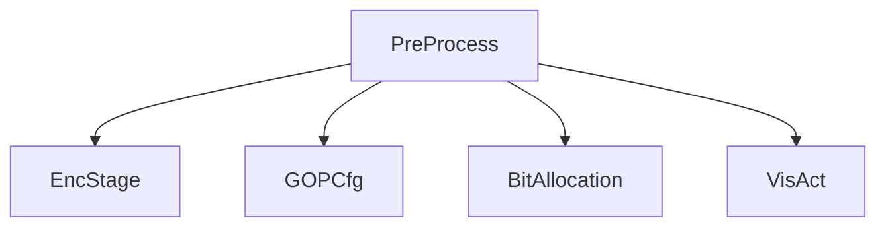
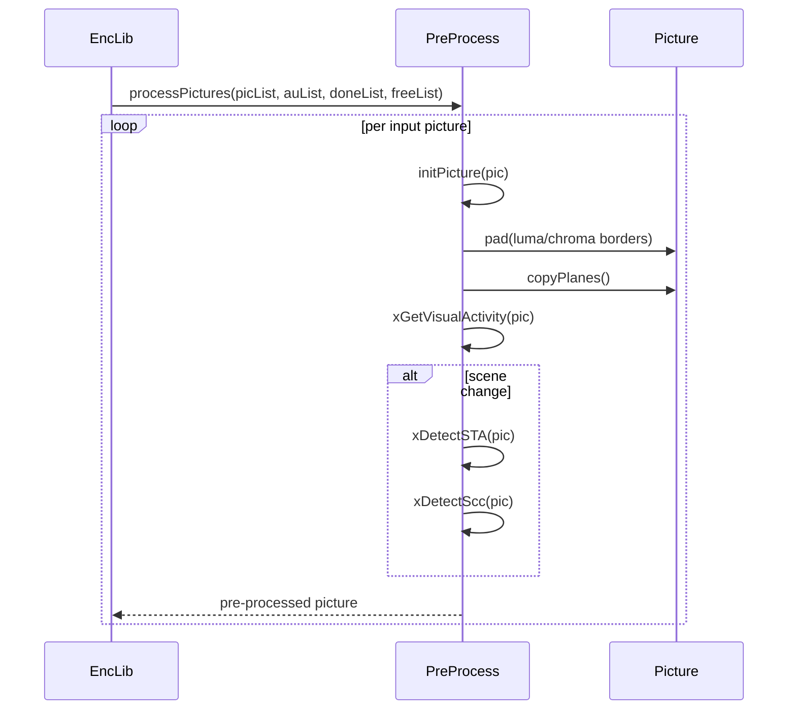

# PreProcess — Input Picture Pre-Processor

## 1) Purpose

`PreProcess` handles input picture preparation: color space conversion, luma padding, chroma plane copy, spatial/temporal activity analysis, scene change detection, and SCC detection.

## 2) Class Diagram



## 3) Key Methods

| Method | Description |
|---|---|
| `init()` | Initialize pre-processor with encoder config and final-pass flag |
| `initPicture()` | Prepare picture for encoding — padding, plane copy, chroma conversion |
| `processPictures()` | Main processing loop: pre-process pictures from input list |
| `xGetVisualActivity()` | Compute visual activity for QPA (Quadtree-based Perceptual Adaptation) |
| `xGetSpatialActivity()` | Compute spatial activity (luma and chroma) |
| `xGetTemporalActivity()` | Compute temporal activity between frames |
| `xDetectSTA()` | Scene change / temporal activity change detection |
| `xDetectScc()` | Screen content classification |
| `xDisableTempDown()` | Disable temporal down-sampling based on content |
| `xFreeUnused()` | Release unreferenced picture buffers |

## 4) Dependencies

- **Inherits**: `EncStage`
- **Owns**: `GOPCfg`, uses `BitAllocation`
- **Uses**: `Picture`, `PicList`, `VisAct`, `VVEncCfg`
- **Called by**: `EncLib` pipeline stage chain

## 5) Data Flow



## 6) Configuration

| Field | Source | Effect |
|---|---|---|
| `VVEncCfg::m_inputBitDepth` | Encoder config | Input bit depth |
| `VVEncCfg::m_internalBitDepth` | Encoder config | Internal processing bit depth |
| `VVEncCfg::m_chromaFormat` | Encoder config | Chroma subsampling format |
| `VVEncCfg::m_qpa` | Encoder config | Enable QPA perceptual adaptation |
| `m_isHighRes` | Internal | High-resolution content flag |
| `m_doSTA` | Internal | Spatial-temporal activity analysis flag |
| `m_doVisAct` | Internal | Visual activity computation flag |

## 7) Lifecycle

```
init(cfg, isFinalPass) per encoder init
  → processPictures() per batch
    → initPicture(pic) per picture
      → padding + plane copy
      → visual activity / STA / SCC detection
    → xFreeUnused() per picture
  → (pictures passed to next pipeline stage: MCTF → EncGOP)
```
