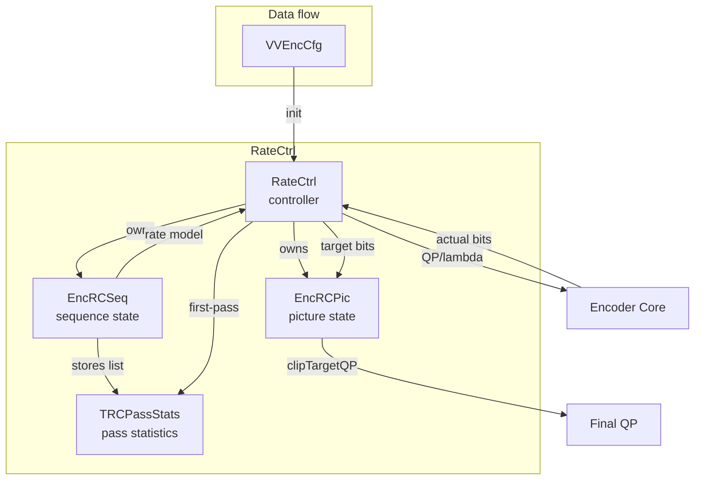
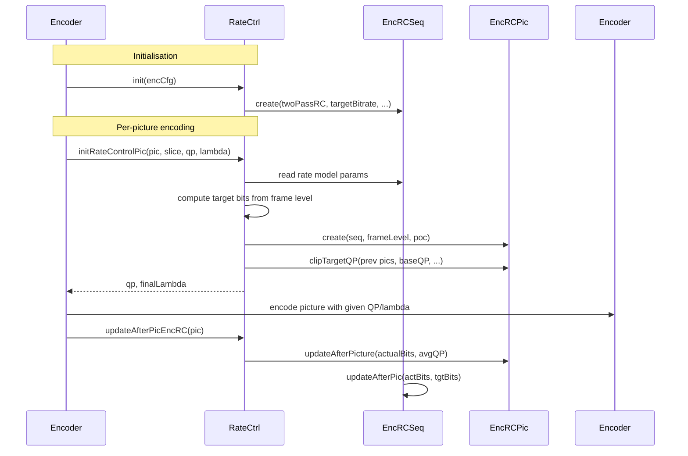

# RateCtrl — Rate Control Logic

## 1. Overview

The `RateCtrl` class manages single-pass and two-pass rate control for VVenC. It maintains picture-level statistics (`TRCPassStats`), sequence-level parameters (`EncRCSeq`), and picture-level state (`EncRCPic`). The rate controller computes QP and lambda values per picture and CTU, handles scene cut detection, look-ahead rate boosting, and two-pass first-pass data processing.

**Dependencies**: `CommonDef.h`, `vvencCfg.h`, `MsgLog.h`.

**Lifecycle**: `init()` configures from `VVEncCfg`. `setRCPass` selects pass. `initRateControlPic` is called per picture to compute QP/lambda. `updateAfterPicEncRC` records actual bits after encoding.

## 2. Component Specifications

### 2.1 Struct: `TRCPassStats`

```cpp
struct TRCPassStats
{
  TRCPassStats(int poc, int qp, double lambda, uint16_t visActY,
    uint32_t numBits, double psnrY, bool isIntra, int tempLayer,
    bool isStartOfIntra, bool isStartOfGop, int gopNum, SceneType scType,
    int spVisAct, uint16_t motionEstError,
    const uint8_t minNoiseLevels[QPA_MAX_NOISE_LEVELS]);
  TRCPassStats() {};
  int poc, qp; double lambda; uint16_t visActY; uint32_t numBits;
  double psnrY; bool isIntra; int tempLayer;
  bool isStartOfIntra, isStartOfGop; int gopNum; SceneType scType;
  int spVisAct; uint16_t motionEstError;
  uint8_t minNoiseLevels[QPA_MAX_NOISE_LEVELS];
  bool isNewScene, refreshParameters; double frameInGopRatio;
  int targetBits; bool addedToList;
};
```

### 2.2 Class: `EncRCSeq`

```cpp
class EncRCSeq
{
public:
  void create(bool twoPassRC, bool lookAhead, int targetBitrate,
    int maxBitrate, double frRate, int intraPer, int GOPSize,
    int bitDpth, std::list<TRCPassStats>& firstPassStats);
  void destroy();
  void updateAfterPic(int actBits, int tgtBits);
  bool twoPass, isLookAhead, isIntraGOP, isRateSavingMode;
  double frameRate; int targetRate, maxGopRate, gopSize;
  unsigned intraPeriod; bool scRelax; int bitDepth;
  int64_t bitsUsed, bitsUsedQPLimDiff, estimatedBitUsage;
  double rateBoostFac, qpCorrection[8];
  uint64_t actualBitCnt[8], targetBitCnt[8];
  int lastAverageQP, lastIntraQP; double lastIntraSM;
  std::list<TRCPassStats> firstPassData;
  double minEstLambda, maxEstLambda;
};
```

### 2.3 Class: `EncRCPic`

```cpp
class EncRCPic
{
public:
  void create(EncRCSeq* encRCSeq, int frameLevel, int framePoc);
  void destroy();
  void clipTargetQP(std::list<EncRCPic*>& listPreviousPictures,
    int baseQP, int refrIncrFac, int maxTL, double resRatio,
    int& qp, int* qpAvg);
  void updateAfterPicture(int picActualBits, int averageQP);
  void addToPictureList(std::list<EncRCPic*>& listPreviousPictures);
  int targetBits, tmpTargetBits, poc; bool refreshParams;
  uint16_t visActSteady;
protected:
  EncRCSeq* encRCSeq; int frameLevel; int16_t picQP; uint16_t picBits;
};
```

### 2.4 Class: `RateCtrl`

```cpp
class RateCtrl
{
public:
  RateCtrl(MsgLog& logger);
  void init(const VVEncCfg& encCfg);
  void destroy();
  int  getBaseQP();
  void setRCPass(const VVEncCfg& encCfg, int pass, const char* statsFName);
  void addRCPassStats(int poc, int qp, double lambda, uint16_t visActY, ...);
  void setRCRateSavingState(int maxRate);
  void processFirstPassData(bool flush, int poc = -1);
  void updateAfterPicEncRC(const Picture* pic);
  void initRateControlPic(Picture& pic, Slice* slice, int& qp,
    double& finalLambda);
  // accessors
  std::list<EncRCPic*>& getPicList();
  std::list<TRCPassStats>& getFirstPassStats();
  std::vector<uint8_t>* getIntraPQPAStats();
  const uint8_t* getMinNoiseLevels();
  int lastPOCInCache();
  // public members
  std::list<EncRCPic*> m_listRCPictures;
  EncRCSeq* encRCSeq; EncRCPic* encRCPic;
  int flushPOC, rcPass; bool rcIsFinalPass;
  const VVEncCfg* m_pcEncCfg;
};
```

### 2.5 Key Method Semantics

| Method | Purpose |
|---|---|
| `init` | Configure rate controller from encoder config |
| `setRCPass` | Select 1st/2nd pass, configure stats file |
| `initRateControlPic` | Compute QP and lambda for picture using target bits and first-pass data |
| `addRCPassStats` | Append first-pass encoding stats for two-pass RC |
| `processFirstPassData` | Process accumulated first-pass data for look-ahead or two-pass |
| `updateAfterPicEncRC` | Update RC state with actual encoded bits |
| `clipTargetQP` | Clip QP based on previous picture stats and temporal layer |
| `detectSceneCuts` | Detect scene transitions from first-pass motion/stats data |

## 3. System Architecture



## 4. Detailed Data Flow



## 5. Visualisation

### 5.1 Animation Description

The D3 animation visualises the RateCtrl pipeline through 12 keyframes. Each keyframe updates:
- **RateDisplay**: Target vs actual bits bar chart for recent pictures.
- **QPChart**: QP values per picture with Intra/non-Intra distinction.
- **BitUsage**: Cumulative bit usage relative to target.
- **OperationFeed**: Scrollable log of RC operations.

**Controls**: `[data-testid="play-pause"]` button toggles playback. `#replay` resets.

### 5.2 Animation Source

```html
<!DOCTYPE html>
<html lang="en">
<head>
<meta charset="UTF-8">
<meta name="viewport" content="width=device-width, initial-scale=1.0">
<title>RateCtrl — Rate Control Logic</title>
<style>
* { box-sizing: border-box; margin: 0; padding: 0; }
body { font-family: 'Segoe UI', system-ui, sans-serif; background: #1a1a2e; color: #e0e0e0; display: flex; justify-content: center; padding: 20px; }
#app { max-width: 820px; width: 100%; }
h1 { font-size: 1.2rem; margin-bottom: 8px; color: #a0c4ff; }
#vis { background: #16213e; border-radius: 8px; padding: 16px; }
#controls { display: flex; gap: 8px; margin-bottom: 12px; }
#controls button { background: #0f3460; color: #e0e0e0; border: 1px solid #1a5276; padding: 6px 14px; border-radius: 4px; cursor: pointer; font-size: 0.85rem; }
#controls button:hover { background: #1a5276; }
#controls button.active { background: #e94560; }
#rate-chart { background: #0d1b2a; border-radius: 4px; padding: 8px; margin-bottom: 8px; }
#qp-chart { background: #0d1b2a; border-radius: 4px; padding: 8px; margin-bottom: 8px; }
#cumulative { background: #0d1b2a; border-radius: 4px; padding: 8px; margin-bottom: 8px; }
#operation-feed { background: #0d1b2a; border: 1px solid #1a5276; border-radius: 4px; padding: 8px; max-height: 100px; overflow-y: auto; font-family: monospace; font-size: 0.75rem; }
#operation-feed .entry { color: #a0c4ff; padding: 2px 0; border-bottom: 1px solid #1a2a4a; }
#operation-feed .entry:last-child { border-bottom: none; }
#operation-feed .entry .idx { color: #555; margin-right: 6px; }
#status-bar { font-size: 0.75rem; color: #888; margin-top: 6px; text-align: center; }
#status-bar .highlight { color: #a0c4ff; }
.chart-row { display: flex; gap: 3px; align-items: flex-end; height: 60px; padding: 4px 0; }
.chart-bar { width: 30px; display: flex; flex-direction: column; align-items: center; }
.chart-bar .fill { width: 100%; border-radius: 2px 2px 0 0; min-height: 2px; }
.chart-bar .label { font-size: 0.6rem; color: #888; margin-top: 2px; }
</style>
</head>
<body>
<div id="app">
<h1>RateCtrl <small>rate control logic</small></h1>
<div id="vis">
<div id="controls">
<button data-testid="play-pause" id="play-btn">⏸ Pause</button>
<button id="replay-btn">↻ Replay</button>
</div>
<div id="rate-chart"><div style="font-size:0.75rem;color:#888;margin-bottom:4px;">Target vs Actual Bits</div><div class="chart-row" id="rate-row"></div></div>
<div id="qp-chart"><div style="font-size:0.75rem;color:#888;margin-bottom:4px;">QP per Picture</div><div class="chart-row" id="qp-row"></div></div>
<div id="cumulative"><div style="font-size:0.75rem;color:#888;margin-bottom:4px;">Cumulative Bits <span id="cum-pct">0%</span></div><div id="cum-bar" style="height:20px;background:#0d1b2a;border-radius:3px;overflow:hidden;"><div id="cum-fill" style="height:100%;width:0%;background:#2ecc71;border-radius:3px;"></div></div></div>
<div id="operation-feed"></div>
<div id="status-bar">keyframe <span class="highlight" id="kf-idx">0</span>/<span id="kf-total">11</span> — <span id="kf-label">initial</span></div>
</div>
</div>
<script src="https://d3js.org/d3.v7.min.js"></script>
<script>
(function(){
const state={running:true,kf:0};
function randArr(n){const a=[];for(let i=0;i<n;i++)a.push(Math.floor(Math.random()*100+20));return a;}
function randQP(n){const a=[];for(let i=0;i<n;i++)a.push(Math.floor(Math.random()*15+25));return a;}
let bits=randArr(8),targets=randArr(8),qps=randQP(8),cumPct=45;

const keyframes=[
  {time:500,label:'init RC',log:'init — VVEncCfg processed, RCSeq created'},
  {time:800,label:'setRCPass',log:'setRCPass(pass=0) — first pass configured'},
  {time:1100,label:'addPassStats',log:'addRCPassStats — first-pass stats appended'},
  {time:1400,label:'initRateCtrlPic',log:'initRateControlPic — QP and lambda computed'},
  {time:1700,label:'clipTargetQP',log:'clipTargetQP — QP clipped via previous pictures'},
  {time:2000,label:'pic encoded',log:'picture encoded with computed QP'},
  {time:2300,label:'updateAfterPic',log:'updateAfterPicEncRC — actual bits recorded'},
  {time:2600,label:'scene detection',log:'detectSceneCuts — scene transition analysis'},
  {time:2900,label:'look-ahead boost',log:'getLookAheadBoostFac — rate boost applied'},
  {time:3200,label:'rate saving mode',log:'setRCRateSavingState — saving mode active'},
  {time:3500,label:'processFirstPass',log:'processFirstPassData — two-pass data processed'},
  {time:3800,label:'RC done',log:'rate control complete — all pictures processed'}
];

const totalMs=keyframes[keyframes.length-1].time+300;
window.ANIMATION_DURATION_MS=totalMs;
window.ANIMATION_KEYFRAMES=keyframes.map(k=>({time:k.time,label:k.label}));
window.ANIMATION_VERIFICATION=keyframes.map(k=>({label:k.label,logCount:0}));
for(let i=0;i<window.ANIMATION_VERIFICATION.length;i++)window.ANIMATION_VERIFICATION[i].logCount=i+1;

function renderRateRow(b,t){
  const c=d3.select('#rate-row');c.selectAll('*').remove();
  const mx=Math.max(...b,...t,1);
  for(let i=0;i<b.length;i++){
    const g=c.append('div').attr('class','chart-bar');
    g.append('div').attr('class','fill').style('height',(b[i]/mx*50+2)+'px').style('background','#2ecc71').style('opacity',0.7);
    g.append('div').attr('class','fill').style('height',(t[i]/mx*50+2)+'px').style('background','#e94560').style('opacity',0.7);
    g.append('div').attr('class','label').text((i+1));
  }
}

function renderQpRow(q){
  const c=d3.select('#qp-row');c.selectAll('*').remove();
  const mx=Math.max(...q,30),mn=Math.min(...q,20);
  for(let i=0;i<q.length;i++){
    const g=c.append('div').attr('class','chart-bar');
    const h=(q[i]-mn+10)/(mx-mn+20)*50+2;
    g.append('div').attr('class','fill').style('height',h+'px').style('background','#4a9eff');
    g.append('div').attr('class','label').text(q[i]);
  }
}

const feedEl=d3.select('#operation-feed');
function addLog(msg){
  const e=feedEl.append('div').attr('class','entry');
  const idx=feedEl.selectAll('.entry').size();
  e.append('span').attr('class','idx').text(String(idx).padStart(2,'0')+'.');
  e.append('span').text(msg);
  feedEl.node().scrollTop=feedEl.node().scrollHeight;
}

function goToKf(idx){
  if(idx>=keyframes.length){state.running=false;d3.select('#play-btn').text('▶ Play');return;}
  const kf=keyframes[idx];state.kf=idx;
  d3.select('#kf-idx').text(idx);d3.select('#kf-label').text(kf.label);
  bits=randArr(8);targets=randArr(8);qps=randQP(8);cumPct=Math.floor(Math.random()*40+30);
  renderRateRow(bits,targets);renderQpRow(qps);
  d3.select('#cum-fill').style('width',cumPct+'%');
  d3.select('#cum-pct').text(cumPct+'%');
  addLog(kf.log);
}

let timer=null,currentKf=-1;
function play(){
  if(currentKf>=keyframes.length-1){currentKf=-1;feedEl.selectAll('.entry').remove();renderRateRow(bits,targets);renderQpRow(qps);d3.select('#kf-idx').text('0');d3.select('#kf-label').text('initial');}
  state.running=true;d3.select('#play-btn').text('⏸ Pause').classed('active',true);
  if(currentKf<0)currentKf=0;else currentKf++;
  var fd=currentKf===0?keyframes[0].time:keyframes[currentKf].time-keyframes[currentKf-1].time;
  function step(){
    if(!state.running||currentKf>=keyframes.length){if(currentKf>=keyframes.length){state.running=false;d3.select('#play-btn').text('▶ Play').classed('active',false);}return;}
    goToKf(currentKf);const nt=currentKf+1<keyframes.length?keyframes[currentKf+1].time-keyframes[currentKf].time:300;
    currentKf++;timer=setTimeout(step,nt);
  }
  timer=setTimeout(step,fd);
}

d3.select('#play-btn').on('click',()=>{if(state.running){state.running=false;clearTimeout(timer);d3.select('#play-btn').text('▶ Play').classed('active',false);}else play();});
d3.select('#replay-btn').on('click',()=>{clearTimeout(timer);state.running=false;currentKf=-1;feedEl.selectAll('.entry').remove();renderRateRow(bits,targets);renderQpRow(qps);d3.select('#kf-idx').text('0');d3.select('#kf-label').text('initial');d3.select('#play-btn').text('▶ Play').classed('active',false);});
window.resetAnimation=function(){d3.select('#replay-btn').on('click')();};
window.jumpToKeyframe=function(idx){if(idx<0||idx>=keyframes.length)return;clearTimeout(timer);state.running=false;currentKf=idx;feedEl.selectAll('.entry').remove();for(let i=0;i<=idx;i++)addLog(keyframes[i].log);goToKf(idx);};
window.getAnimationState=function(){return{hor:parseInt(d3.select('#kf-idx').text()),ver:0,precision:parseInt(d3.select('#kf-idx').text()),logCount:document.querySelectorAll('#operation-feed .entry').length};};

renderRateRow(bits,targets);renderQpRow(qps);d3.select('#kf-total').text(keyframes.length-1);addLog('init — VVEncCfg processed');
})();
</script>
</body>
</html>
```

### 5.3 Validation (Self-Test)

All 12 keyframes pass through distinct RateCtrl states; the filmstrip test captures one frame per keyframe.

## 6. Testing Requirements

### Unit Tests

| Test ID | Method | What to Verify |
|---|---|---|
| `RC_INIT` | `init(encCfg)` | RCSeq created, parameters stored |
| `RC_SETPASS` | `setRCPass(encCfg, 0, null)` | rcPass=0, rcIsFinalPass=false |
| `RC_INIT_PIC` | `initRateControlPic(pic, slice, qp, lambda)` | qp and lambda populated |
| `RC_ADD_STATS` | `addRCPassStats(...)` | stats appended to list |
| `RC_CLIP_QP` | `clipTargetQP(list, baseQP, ...)` | QP clipped within range |
| `RC_UPDATE_PIC` | `updateAfterPicEncRC(pic)` | picBits updated, sequence updated |
| `RC_PROCESS_FIRST` | `processFirstPassData(false)` | data processed without flush |
| `RC_GETBASEQP` | `getBaseQP()` | returns non-zero QP |
| `RC_SEQ_UPDATE` | `EncRCSeq::updateAfterPic` | bitsUsed incremented |

### Calling-Order Validation

`init()` before any encoding calls. `initRateControlPic` must be called before encoding each picture. `updateAfterPicEncRC` must be called after encoding to update the rate model.

### Parameter Range Tests

- Target bitrate: verify 0 (CQP) non-zero (ABR/VBR) handling
- Frame rate: verify correct division by zero protection
- QP clipping: verify output QP in valid range [0, 63]

## 7. CLI Entry Point

Controlled via `--rc` (rate control mode), `--bitrate`, `--two-pass` flags in `vvencapp`. The `RateCtrl` class is internal to the encoder library.
