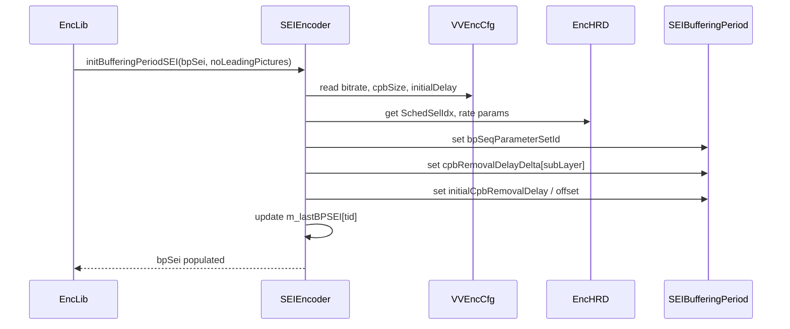
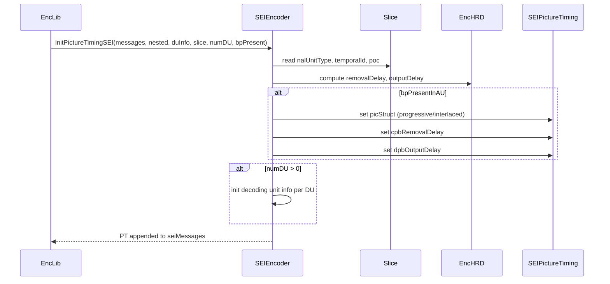
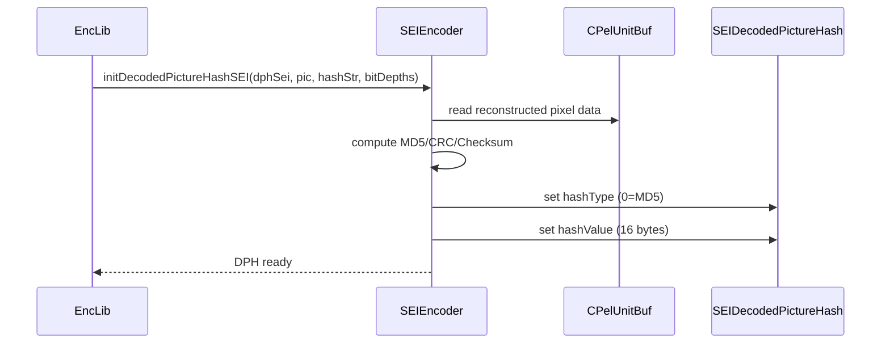

# SEIEncoder — SEI Message Initialisation from Encoder Configuration

## 1. Overview

The `SEIEncoder` class creates and initialises the SEI message payload structures used during encoding. It transforms encoder configuration parameters (`VVEncCfg`, `GOPCfg`, `EncHRD`) into concrete SEI message objects that are later serialised by `SEIWriter`.

**Key class:**
- **`SEIEncoder`** — initialises buffering period, picture timing, decoded picture hash, and other SEI payloads from encoder state

**Supporting type:**
- **`DUData`** — stores accumulated bits and NAL count per decoding unit (`accumBitsDU`, `accumNalsDU`)

**Dependencies**: `SEI.h`, `Unit.h`, `<deque>`.

**Lifecycle**: Created once in `EncLib`. `init(encCfg, gopCfg, encHRD)` sets configuration. For each IDR/GDR picture: `initBufferingPeriodSEI()`. For each slice: `initPictureTimingSEI()`. For each reconstructed frame: `initDecodedPictureHashSEI()`.

## 2. Component Specifications

### 2.1 Struct: `DUData`

```cpp
struct DUData
{
  DUData() : accumBitsDU(0), accumNalsDU(0) {};
  int accumBitsDU;
  int accumNalsDU;
};
```

### 2.2 Class: `SEIEncoder`

```cpp
class SEIEncoder
{
public:
  SEIEncoder();
  virtual ~SEIEncoder();

  void init(const VVEncCfg& encCfg, const GOPCfg* gopCfg, EncHRD& encHRD);

  void initDecodedPictureHashSEI  (SEIDecodedPictureHash& dphSei,
                                   const CPelUnitBuf& pic, std::string &rHashString,
                                   const BitDepths &bitDepths);
  void initBufferingPeriodSEI     (SEIBufferingPeriod& bpSei, bool noLeadingPictures);
  void initPictureTimingSEI       (SEIMessages& seiMessages, SEIMessages& nestedSeiMessages,
                                   SEIMessages& duInfoSeiMessages, const Slice *slice,
                                   const uint32_t numDU, const bool bpPresentInAU);
  void initDrapSEI                (SEIDependentRAPIndication& drapSei) {};
  void initSEIAlternativeTransferCharacteristics(SEIAlternativeTransferCharacteristics *seiAltTransCharacteristics);
  void initSEIMasteringDisplayColourVolume(SEIMasteringDisplayColourVolume *seiMDCV);
  void initSEIContentLightLevel   (SEIContentLightLevelInfo *seiCLL);
  void initSeiFgc                 (SeiFgc* sei);

private:
  const VVEncCfg* m_pcEncCfg;
  const GOPCfg*   m_gopCfg;
  EncHRD*         m_pcEncHRD;
  bool            m_isInitialized;
  bool            m_rapWithLeading;
  uint32_t        m_lastBPSEI[VVENC_MAX_TLAYER];
  uint32_t        m_totalCoded[VVENC_MAX_TLAYER];
};
```

## 3. System Architecture

```mermaid
graph TB
    subgraph SEIEncoder
        SEIEnc[SEIEncoder<br/>payload initialiser]
    end

    subgraph Configuration
        Cfg[VVEncCfg<br/>encoder config]
        GOP[GOPCfg<br/>GOP structure]
        HRD[EncHRD<br/>HRD parameters]
    end

    subgraph SEIPayloads
        BP[SEIBufferingPeriod]
        PT[SEIPictureTiming]
        DPH[SEIDecodedPictureHash]
        DRAP[SEIDependentRAPIndication]
        ATC[SEIAlternativeTransferCharacteristics]
        MDCV[SEIMasteringDisplayColourVolume]
        CLL[SEIContentLightLevelInfo]
        FGC[SeiFgc]
    end

    subgraph Serialisation
        SW[SEIWriter]
    end

    SEIEnc -->|reads| Cfg
    SEIEnc -->|reads| GOP
    SEIEnc -->|reads| HRD
    SEIEnc -->|creates/fills| BP
    SEIEnc -->|creates/fills| PT
    SEIEnc -->|creates/fills| DPH
    SEIEnc -->|creates/fills| DRAP
    SEIEnc -->|creates/fills| ATC
    SEIEnc -->|creates/fills| MDCV
    SEIEnc -->|creates/fills| CLL
    SEIEnc -->|creates/fills| FGC
    SW -->|serialises| BP
    SW -->|serialises| PT
    SW -->|serialises| DPH
    SW -->|serialises| DRAP
    SW -->|serialises| ATC
    SW -->|serialises| MDCV
    SW -->|serialises| CLL
    SW -->|serialises| FGC
```



## 4. Detailed Data Flow

### 4.1 Buffering Period Initialisation



### 4.2 Picture Timing Initialisation



### 4.3 Decoded Picture Hash



## 5. Visualisation

No D3 animation — SEIEncoder populates data structures from config. The logic is parameter-driven (no runtime visualisation).

## 6. Testing Requirements

### Unit Tests (new file: `test/vvenc_unit_test/seiencoder_test.cpp`)

| Test ID | Method | What to Verify |
|---|---|---|
| `SEI_ENC_CONSTRUCTOR` | `SEIEncoder()` | members null/zero, isInitialized=false |
| `SEI_ENC_INIT` | `init(cfg, gop, hrd)` | stores pointers, sets isInitialized=true |
| `SEI_ENC_BP` | `initBufferingPeriodSEI(bp, false)` | bp populated from cfg HRD params |
| `SEI_ENC_BP_NO_LEAD` | `initBufferingPeriodSEI(bp, true)` | no-leading-pictures flag honoured |
| `SEI_ENC_PT` | `initPictureTimingSEI(msgs, nest, du, slc, 0, true)` | PT populated with delays |
| `SEI_ENC_PT_NO_BP` | `initPictureTimingSEI(msgs, nest, du, slc, 0, false)` | no BP present → timing skipped |
| `SEI_ENC_PT_DU` | `initPictureTimingSEI(msgs, nest, du, slc, 3, true)` | DU info for 3 decoding units |
| `SEI_ENC_DPH_MD5` | `initDecodedPictureHashSEI(dph, pic, str, bd)` | MD5 hash computed |
| `SEI_ENC_ATC` | `initSEIAlternativeTransferCharacteristics(sei)` | transfer char set from cfg |
| `SEI_ENC_MDCV` | `initSEIMasteringDisplayColourVolume(sei)` | display primaries from cfg |
| `SEI_ENC_CLL` | `initSEIContentLightLevel(sei)` | content light level from cfg |
| `SEI_ENC_FGC` | `initSeiFgc(sei)` | film grain params from cfg |
| `SEI_ENC_DRAP` | `initDrapSEI(drap)` | no-op (empty) |
| `SEI_ENC_MULTI_TID` | `initBufferingPeriodSEI` + `initPictureTimingSEI` | per-TL buffering tracking |

### Calling-Order Validation

- `initPictureTimingSEI()` before `initBufferingPeriodSEI()`: should still produce a valid PT (BP-independent fields).
- `initBufferingPeriodSEI()` multiple times: tracks via `m_lastBPSEI[]`, second call uses accumulated `m_totalCoded[]`.
- `init()` not called before payload inits: assert/guard in `m_isInitialized`.

### Parameter Range Tests

- `numDU = 0` vs. `numDU = N`: DU info messages created per decoded unit.
- `noLeadingPictures = true` vs. `false`: BP initial removal delay changes.
- `hashType` implicit: always MD5 (type 0) in current implementation.

### Integration Tests

- Full encode with SEI enabled: bitstream contains BP, PT, DPH SEI NAL units.
- Decoder round-trip: verify SEI messages parsed by `vvdec` match encoder configuration.
- Verify decoded picture hash: `vvdec --check-md5` matches `initDecodedPictureHashSEI` computation.

## 7. CLI Entry Point

Not directly exposed via CLI. Controlled indirectly through encoder configuration flags: `--sei-buffering-period`, `--sei-picture-timing`, `--sei-decode-picture-hash`, `--sei-mastering-display`, `--sei-content-light-level`, `--sei-fgc`, etc.
