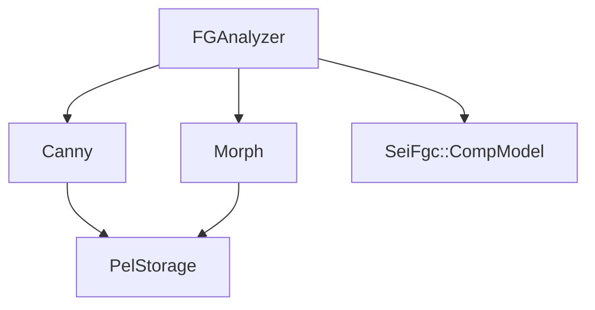
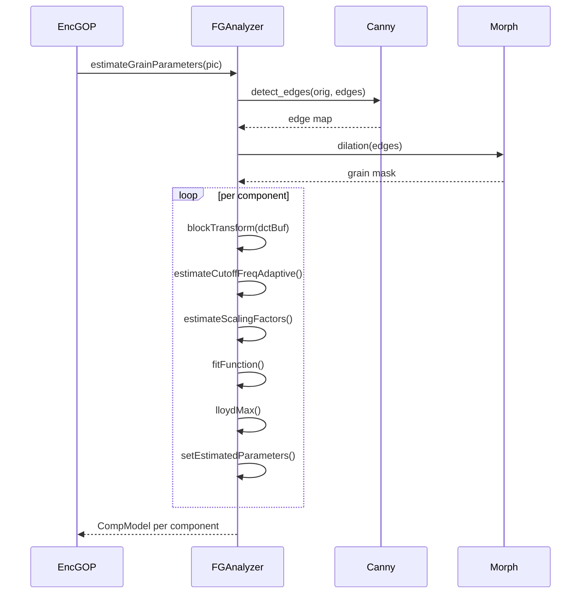

# SEIFilmGrainAnalyzer — Film Grain Analysis for SEI

## 1) Purpose

`SEIFilmGrainAnalyzer` (via `FGAnalyzer`, `Canny`, `Morph`) analyzes input pictures to estimate film grain parameters for the film grain characteristics SEI message. It uses edge detection, morphological operations, DCT-based grain analysis, and Lloyd-Max quantization.

## 2) Class Diagram



## 3) Key Methods

| Method | Description |
|---|---|
| `FGAnalyzer::init()` | Initialize analyzer with picture dimensions, chroma format, bit depths |
| `FGAnalyzer::estimateGrainParameters()` | Main entry — estimate grain params for a picture |
| `FGAnalyzer::findMask()` | Build grain mask using edge detection + morphology |
| `FGAnalyzer::blockTransform()` | DCT transform on grain blocks |
| `FGAnalyzer::estimateCutoffFreqAdaptive()` | Adaptive frequency cutoff estimation |
| `FGAnalyzer::estimateScalingFactors()` | Estimate intensity scaling factors |
| `FGAnalyzer::fitFunction()` | Fit polynomial to grain intensity-variance curve |
| `FGAnalyzer::lloydMax()` | Lloyd-Max quantization of scaling factors |
| `Canny::detect_edges()` | Canny edge detection pipeline |
| `Morph::dilation()` | Morphological dilation operation |

## 4) Dependencies

- **Owns**: `Canny` (edge detector), `Morph` (morphology operator)
- **Uses**: `PelStorage`, `SeiFgc::CompModel`, `CoeffBuf`, `TCoeff`
- **SIMD**: Optional x86 SIMD optimization paths (`ENABLE_SIMD_OPT_FGA`)
- **Called by**: `EncGOP` (via `m_fgAnalyzer`)

## 5) Data Flow



## 6) Configuration

| Field | Source | Effect |
|---|---|---|
| `m_doAnalysis[comp]` | External | Enable/disable analysis per component |
| `m_log2ScaleFactor` | Internal | Log2 of grain scale factor |
| `m_lowIntensityRatio` | Internal | Low-intensity suppression threshold |
| `m_lowThresholdRatio`/`m_highThresholdRatio` | Canny | Canny hysteresis thresholds |
| `DATA_BASE_SIZE` | Constant | DCT block size (64x64) |
| `KERNELSIZE` | Constant | Morphological kernel size (3) |

## 7) Lifecycle

```
init(width, height, chroma, bitDepths, doAnalysis) per encoder init
  → estimateGrainParameters(pic) per picture
    → findMask(comp) per component [Canny edge det + Morph dilation]
    → blockTransform() → DCT analysis
    → estimateCutoffFreqAdaptive()
    → estimateScalingFactors()
    → fitFunction() → lloydMax() quantization
    → setEstimatedParameters()
  → getCompModel(idx) retrieves per-component model
destroy()
```
