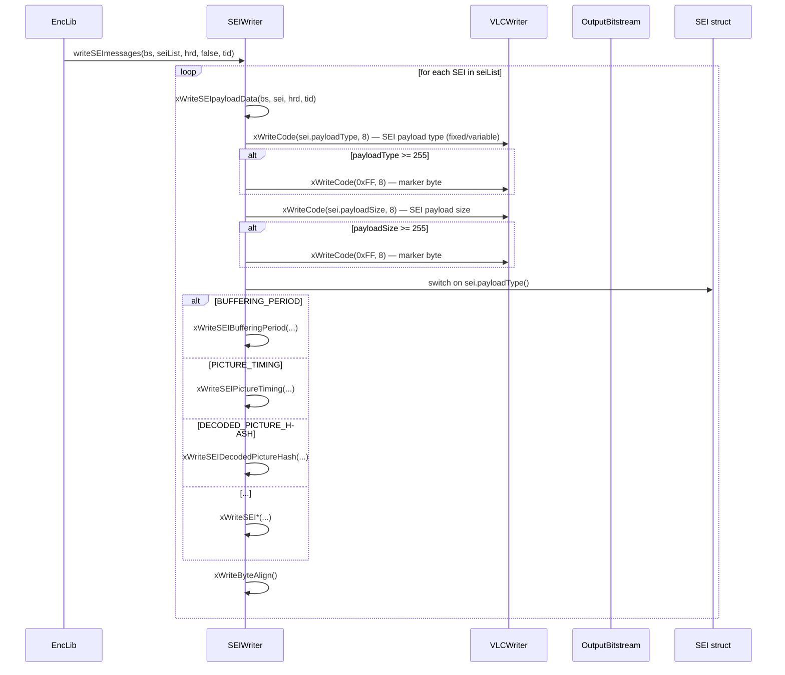
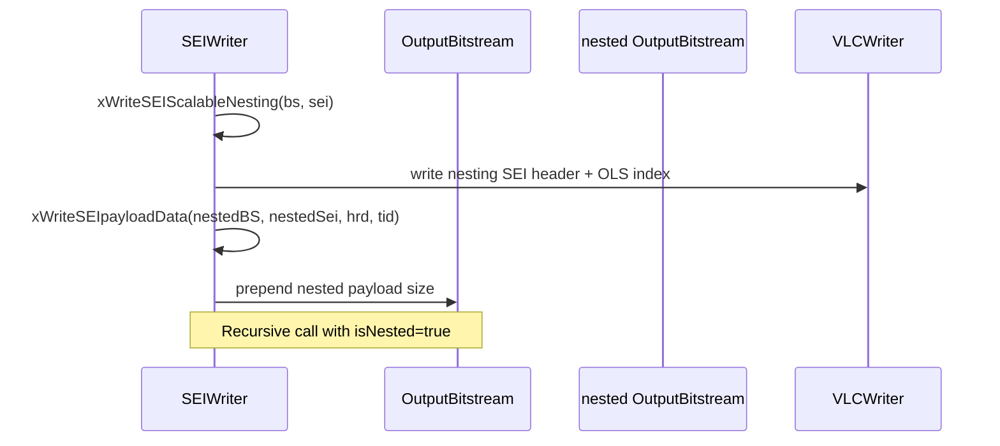

# SEIwrite — Supplemental Enhancement Information Message Serialisation

## 1. Overview

The `SEIwrite` module (class `SEIWriter`) serialises all VVC SEI message types into an `OutputBitstream`. It inherits from `VLCWriter` for bit-level coding and dispatches per-message-type writes from a single `writeSEImessages()` entry point.

**Key class:**
- **`SEIWriter`** — inherits `VLCWriter`, provides `writeSEImessages()` and private `xWriteSEI*()` methods for each SEI type

**Dependencies**: `VLCWriter.h` (base), `SEI.h` (SEI message structs), `HRD.h` (HRD parameters for buffering period + picture timing).

**Lifecycle**: Created per-access-unit in the encoder. For each AU, `writeSEImessages(bs, seiList, hrd, isNested, temporalId)` is called to serialise all SEI messages associated with the AU. Nested SEI (for scalable nesting) calls recursively with `isNested = true`.

## 2. Component Specifications

### 2.1 Class: `SEIWriter`

```cpp
class SEIWriter : public VLCWriter
{
public:
  SEIWriter();
  virtual ~SEIWriter();

  void writeSEImessages(OutputBitstream& bs, const SEIMessages &seiList,
                        HRD &hrd, bool isNested, const uint32_t temporalId);

protected:
  void xWriteSEIuserDataUnregistered          (const SEIuserDataUnregistered &sei);
  void xWriteSEIDecodingUnitInfo              (const SEIDecodingUnitInfo& sei,
                                               const SEIBufferingPeriod& bp,
                                               const uint32_t temporalId);
  void xWriteSEIDecodedPictureHash            (const SEIDecodedPictureHash& sei);
  void xWriteSEIBufferingPeriod               (const SEIBufferingPeriod& sei);
  void xWriteSEIPictureTiming                 (const SEIPictureTiming& sei,
                                               const SEIBufferingPeriod& bp,
                                               const uint32_t temporalId);
  void xWriteSEIFrameFieldInfo                (const SEIFrameFieldInfo& sei);
  void xWriteSEIDependentRAPIndication         (const SEIDependentRAPIndication& sei);
  void xWriteSEIScalableNesting               (OutputBitstream& bs,
                                               const SEIScalableNesting& sei);
  void xWriteSEIFramePacking                  (const SEIFramePacking& sei);
  void xWriteSEIParameterSetsInclusionIndication(const SEIParameterSetsInclusionIndication& sei);
  void xWriteSEIMasteringDisplayColourVolume   (const SEIMasteringDisplayColourVolume& sei);
  void xWriteSEIAlternativeTransferCharacteristics(const SEIAlternativeTransferCharacteristics& sei);
  void xWriteSEIEquirectangularProjection      (const SEIEquirectangularProjection &sei);
  void xWriteSEISphereRotation                 (const SEISphereRotation &sei);
  void xWriteSEIOmniViewport                   (const SEIOmniViewport& sei);
  void xWriteSEIRegionWisePacking              (const SEIRegionWisePacking &sei);
  void xWriteSEIGeneralizedCubemapProjection   (const SEIGeneralizedCubemapProjection &sei);
  void xWriteSEISubpictureLevelInfo            (const SEISubpicureLevelInfo &sei);
  void xWriteSEISampleAspectRatioInfo          (const SEISampleAspectRatioInfo &sei);
  void xWriteSEIUserDataRegistered             (const SEIUserDataRegistered& sei);
  void xWriteSeiFgc                            (const SeiFgc& sei);
  void xWriteSEIContentLightLevelInfo          (const SEIContentLightLevelInfo& sei);
  void xWriteSEIAmbientViewingEnvironment       (const SEIAmbientViewingEnvironment& sei);
  void xWriteSEIContentColourVolume            (const SEIContentColourVolume &sei);
  void xWriteSEIpayloadData                    (OutputBitstream &bs, const SEI& sei,
                                                HRD &hrd, const uint32_t temporalId);
  void xWriteByteAlign();

protected:
  HRD m_nestingHrd;
};
```

## 3. System Architecture

```mermaid
graph TB
    subgraph SEIWriter
        SW[SEIWriter]
        VLC[VLCWriter<br/>inherited base]
    end

    subgraph SEITypes
        BU[BufferingPeriod]
        PT[PictureTiming]
        DPH[DecodedPictureHash]
        DUI[DecodingUnitInfo]
        UD[UserDataUnregistered]
        UR[UserDataRegistered]
        FFI[FrameFieldInfo]
        DRAP[DependentRAPIndication]
        FP[FramePacking]
        PSII[ParameterSetsInclusionIndication]
        MDCV[MasteringDisplayColourVolume]
        ATC[AlternativeTransferCharacteristics]
        ERP[EquirectangularProjection]
        SR[SphereRotation]
        OV[OmniViewport]
        RWP[RegionWisePacking]
        CMP[GeneralizedCubemapProjection]
        SLI[SubpictureLevelInfo]
        SARI[SampleAspectRatioInfo]
        FGC[Fgc]
        CLL[ContentLightLevelInfo]
        AVE[AmbientViewingEnvironment]
        CCV[ContentColourVolume]
        SN[ScalableNesting]
    end

    subgraph Output
        BS[OutputBitstream]
    end

    SW -->|inherits| VLC
    VLC -->|writes bits to| BS
    SW -->|dispatches| BU
    SW -->|dispatches| PT
    SW -->|dispatches| DPH
    SW -->|dispatches| DUI
    SW -->|dispatches| UD
    SW -->|dispatches| UR
    SW -->|dispatches| FFI
    SW -->|dispatches| DRAP
    SW -->|dispatches| FP
    SW -->|dispatches| PSII
    SW -->|dispatches| MDCV
    SW -->|dispatches| ATC
    SW -->|dispatches| ERP
    SW -->|dispatches| SR
    SW -->|dispatches| OV
    SW -->|dispatches| RWP
    SW -->|dispatches| CMP
    SW -->|dispatches| SLI
    SW -->|dispatches| SARI
    SW -->|dispatches| FGC
    SW -->|dispatches| CLL
    SW -->|dispatches| AVE
    SW -->|dispatches| CCV
    SW -->|dispatches| SN
```



## 4. Detailed Data Flow

### 4.1 SEI Message Serialisation



### 4.2 Nested SEI Flow



## 5. Visualisation

No D3 animation — SEI writing is a serialisation layer over VLC primitives. Each SEI message follows a fixed syntax defined in the VVC specification (ITU-T H.266 | ISO/IEC 23090-3, Annex D).

## 6. Testing Requirements

### Unit Tests (new file: `test/vvenc_unit_test/seiwriter_test.cpp`)

| Test ID | Method | What to Verify |
|---|---|---|
| `SEI_WRITE_EMPTY` | `writeSEImessages(bs, {}, hrd, false, 0)` | no bytes written |
| `SEI_WRITE_BP` | `xWriteSEIBufferingPeriod(bp)` | SPS-dependent BP syntax |
| `SEI_WRITE_PT` | `xWriteSEIPictureTiming(pt, bp, tid)` | clock timestamps + DPB output |
| `SEI_WRITE_HASH_MD5` | `xWriteSEIDecodedPictureHash(dph)` | hash type=0, 16-byte MD5 |
| `SEI_WRITE_HASH_CRC` | `xWriteSEIDecodedPictureHash(dph)` | hash type=1, 3-byte CRC |
| `SEI_WRITE_HASH_CHECKSUM` | `xWriteSEIDecodedPictureHash(dph)` | hash type=2, 32-byte checksum |
| `SEI_WRITE_USER_DATA` | `xWriteSEIuserDataUnregistered(sei)` | UUID + data payload |
| `SEI_WRITE_USER_REG` | `xWriteSEIUserDataRegistered(sei)` | itu_t_t35_country + data |
| `SEI_WRITE_FRAME_FIELD` | `xWriteSEIFrameFieldInfo(ffi)` | picture structure flags |
| `SEI_WRITE_DRAP` | `xWriteSEIDependentRAPIndication(drap)` | dependent RAP flag |
| `SEI_WRITE_FRAME_PACK` | `xWriteSEIFramePacking(fp)` | frame packing arrangement |
| `SEI_WRITE_MDCV` | `xWriteSEIMasteringDisplayColourVolume(mdcv)` | primaries + luminance |
| `SEI_WRITE_ATC` | `xWriteSEIAlternativeTransferCharacteristics(atc)` | transfer char ID |
| `SEI_WRITE_CLL` | `xWriteSEIContentLightLevelInfo(cll)` | maxCLL + maxFALL |
| `SEI_WRITE_AVE` | `xWriteSEIAmbientViewingEnvironment(ave)` | ambient light params |
| `SEI_WRITE_CCV` | `xWriteSEIContentColourVolume(ccv)` | colour volume primaries |
| `SEI_WRITE_ERP` | `xWriteSEIEquirectangularProjection(erp)` | ERP sphere params |
| `SEI_WRITE_SPHERE` | `xWriteSEISphereRotation(sr)` | rotation angles |
| `SEI_WRITE_OMNI` | `xWriteSEIOmniViewport(ov)` | omnidirectional viewport |
| `SEI_WRITE_RWP` | `xWriteSEIRegionWisePacking(rwp)` | region packing maps |
| `SEI_WRITE_CMP` | `xWriteSEIGeneralizedCubemapProjection(cmp)` | cubemap faces |
| `SEI_WRITE_SUBPIC_LEVEL` | `xWriteSEISubpictureLevelInfo(sli)` | subpicture level info |
| `SEI_WRITE_SAR` | `xWriteSEISampleAspectRatioInfo(sari)` | SAR width:height |
| `SEI_WRITE_FGC` | `xWriteSeiFgc(fgc)` | film grain characteristics |
| `SEI_WRITE_NESTED` | `xWriteSEIScalableNesting(bs, sn)` | nesting + contained SEI |
| `SEI_WRITE_PAYLOAD_DISPATCH` | `xWriteSEIpayloadData(bs, sei, hrd, tid)` | type dispatch + byte-align |
| `SEI_WRITE_BYTE_ALIGN` | `xWriteByteAlign()` | zero-bits until byte-aligned |

### Calling-Order Validation

- Verify `writeSEImessages()` on an empty list writes nothing (0 bytes).
- Verify SEI payload header (type + size) precedes each payload body.
- Verify nested SEI: `xWriteSEIScalableNesting()` writes nested header + inner payload + nesting trailing bits.

### Parameter Range Tests

- SEI payload type at range boundaries: 0, 254, 255, 256+ (variable-length coding).
- SEI payload size at range boundaries: 0, 254, 255, 256+ (variable-length coding).
- `hashType` in `SEIDecodedPictureHash`: 0 (MD5), 1 (CRC), 2 (Checksum).
- `frame_packing_arrangement_type` in `SEIFramePacking`: 0..6.

### Integration Tests

- Write SEI to bitstream, verify with reference decoder (`vvdec`) that SEI messages are correctly parsed.
- Round-trip: encode SEI messages → decode → compare all fields.
- Multiple SEI messages per AU: BP + PT + DPH + user data in a single NAL unit.

## 7. CLI Entry Point

Not directly exposed via CLI. `SEIWriter` is called from `EncLib.cpp` during the access-unit assembly stage, after all slice NAL units for an AU have been written. SEI selection is controlled by encoder configuration flags (`m_sei*` in `VVEncCfg`).
