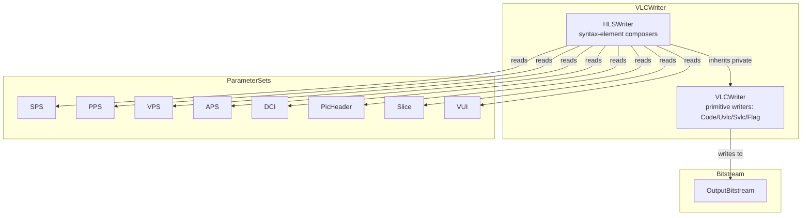
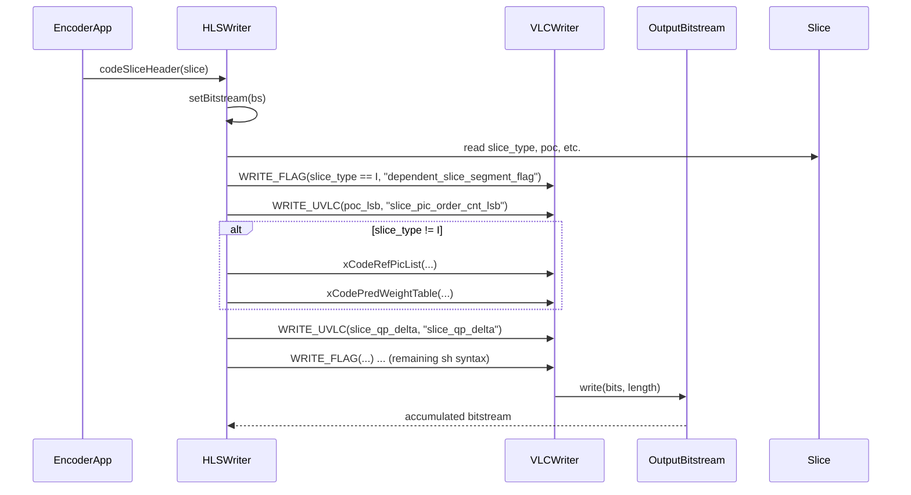
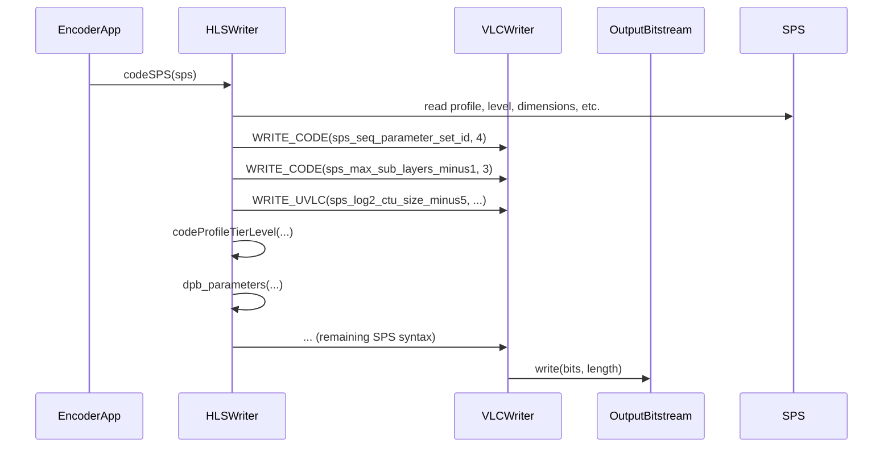

# VLCWriter — Variable-Length Coding Writer for High-Level Syntax

## 1. Overview

The `VLCWriter` module provides the variable-length coding (VLC) primitives used to serialize VVC high-level syntax: slice headers, parameter sets (SPS/PPS/VPS/DCI/APS), picture headers, VUI, HRD parameters, and tile-entry-point byte offsets.

**Key classes:**
- **`VLCWriter`** — base class providing fixed-length code (`xWriteCode`), unsigned/signed exponential-Golomb (`xWriteUvlc`/`xWriteSvlc`), and flag (`xWriteFlag`) emission into an `OutputBitstream`
- **`HLSWriter`** — public subclass that composes the per-syntax-element coding functions (`codeSPS`, `codePPS`, `codeSliceHeader`, etc.)

**Dependencies**: `CABACWriter.h`, `CommonDef.h`, `BitStream.h` (`OutputBitstream`), `Rom.h`, `Slice.h`.

**Lifecycle**: `HLSWriter` is instantiated as `m_HLSWriter` in the encoder. For each slice/picture/sequence, the relevant `code*()` method is called with the parameter set or slice object.

## 2. Component Specifications

### 2.1 Class: `VLCWriter`

```cpp
class VLCWriter
{
protected:
  OutputBitstream* m_pcBitIf;

  VLCWriter() : m_pcBitIf(NULL) {}
  virtual ~VLCWriter() {}

  void  setBitstream          (OutputBitstream* p)     { m_pcBitIf = p; }
  void  xWriteSCode           (int code,  uint32_t length);
  void  xWriteCode            (uint32_t uiCode, uint32_t uiLength);
  void  xWriteUvlc            (uint32_t uiCode);
  void  xWriteSvlc            (int iCode);
  void  xWriteFlag            (bool flag);
  void  xWriteRbspTrailingBits();
  bool  isByteAligned()       { return (m_pcBitIf->getNumBitsUntilByteAligned() == 0); }
};
```

**Tracing macros (when `ENABLE_TRACING`):**

| Macro | Without Tracing | With Tracing |
|---|---|---|
| `WRITE_SCODE(value, length, name)` | `xWriteSCode(value, length)` | `xWriteSCodeTr(value, length, name)` |
| `WRITE_CODE(value, length, name)` | `xWriteCode(value, length)` | `xWriteCodeTr(value, length, name)` |
| `WRITE_UVLC(value, name)` | `xWriteUvlc(value)` | `xWriteUvlcTr(value, name)` |
| `WRITE_SVLC(value, name)` | `xWriteSvlc(value)` | `xWriteSvlcTr(value, name)` |
| `WRITE_FLAG(value, name)` | `xWriteFlag(value)` | `xWriteFlagTr(value, name)` |

### 2.2 Class: `HLSWriter` (extends `VLCWriter` privately)

```cpp
class HLSWriter : private VLCWriter
{
public:
  HLSWriter() {}
  virtual ~HLSWriter() {}

  void  setBitstream            (OutputBitstream* p);
  uint32_t  getNumberOfWrittenBits  ();

  void  codeVUI                 (const VUI *pcVUI, const SPS* pcSPS);
  void  codeSPS                 (const SPS* pcSPS);
  void  codePPS                 (const PPS* pcPPS, const SPS* pcSPS);
  void  codeAPS                 (const APS* pcAPS);
  void  codeAlfAps              (const APS* pcAPS);
  void  codeLmcsAps             (const APS* aps);
  void  codeVPS                 (const VPS* pcVPS);
  void  codeDCI                 (const DCI* dci);
  void  codePictureHeader       (const PicHeader* picHeader, bool writeRbspTrailingBits);
  void  codeSliceHeader         (const Slice* slice);
  void  codeConstraintInfo      (const ConstraintInfo* cinfo);
  void  codeProfileTierLevel    (const ProfileTierLevel* ptl, bool profileTierPresent, int maxNumSubLayersMinus1);
  void  codeOlsHrdParameters    (const GeneralHrdParams *generalHrd, const OlsHrdParams *olsHrd,
                                 const uint32_t firstSubLayer, const uint32_t maxNumSubLayersMinus1);
  void  codeGeneralHrdparameters(const GeneralHrdParams *hrd);
  void  codeAUD                 (const int audIrapOrGdrAuFlag, const int pictureType);
  void  codeTilesWPPEntryPoint  (Slice* pSlice);
  void  alfFilter               (const AlfParam& alfParam, const bool isChroma, const int altIdx);

private:
  void dpb_parameters           (int maxSubLayersMinus1, bool subLayerInfoFlag, const SPS *pcSPS);
  void xCodeRefPicList          (const ReferencePictureList* rpl, bool isLongTermPresent,
                                 uint32_t ltLsbBitsCount, const bool isForbiddenZeroDeltaPoc, int rplIdx);
  void xCodePredWeightTable     (const PicHeader *picHeader, const PPS *pps, const SPS *sps);
  void xCodePredWeightTable     (const Slice* slice);
};
```

## 3. System Architecture



## 4. Detailed Data Flow

### 4.1 Slice Header Coding



### 4.2 SPS Coding



## 5. Visualisation

No D3 animation — VLC/HLS syntax coding follows the VVC specification text tables (7.3.x) and is best verified via bitstream conformance tests rather than visualisation.

## 6. Testing Requirements

### Unit Tests (new file: `test/vvenc_unit_test/vlcwriter_test.cpp`)

| Test ID | Class / Method | What to Verify |
|---|---|---|
| `VLC_WRITE_CODE` | `xWriteCode(val, 8)` | writes 8-bit value |
| `VLC_WRITE_CODE_32` | `xWriteCode(val, 32)` | writes 32-bit value |
| `VLC_WRITE_UVLC_1` | `xWriteUvlc(0)` | writes `1` (exp-Golomb: 1) |
| `VLC_WRITE_UVLC_2` | `xWriteUvlc(3)` | writes `00100` (exp-Golomb: 00100) |
| `VLC_WRITE_SVLC_POS` | `xWriteSvlc(5)` | maps positive to uvlc(5) |
| `VLC_WRITE_SVLC_NEG` | `xWriteSvlc(-5)` | maps negative to uvlc(4) |
| `VLC_WRITE_FLAG` | `xWriteFlag(true)` | writes 1 |
| `VLC_WRITE_SCODE` | `xWriteSCode(-5, 8)` | writes two's complement 8-bit |
| `VLC_RBSP_TRAILING` | `xWriteRbspTrailingBits()` | writes 1 then zero-align |
| `HLS_SPS_ROUNDTRIP` | `codeSPS(sps)` | encode then decode, compare fields |
| `HLS_PPS_ROUNDTRIP` | `codePPS(pps, sps)` | encode then decode, compare fields |
| `HLS_SLICE_HEADER` | `codeSliceHeader(slice)` | encode slice header, verify byte-aligned |
| `HLS_PIC_HEADER` | `codePictureHeader(ph, true)` | encode picture header with trailing |
| `HLS_VPS` | `codeVPS(vps)` | encode VPS, verify length |
| `HLS_APS` | `codeAPS(aps)` | encode APS (ALF/LMCS/SCALING) |
| `HLS_AUD` | `codeAUD(flag, type)` | encode AU delimiter |
| `HLS_ALF_FILTER` | `alfFilter(param, false, 0)` | encode ALF filter coefficients |
| `HLS_DPB_PARAMS` | `dpb_parameters(...)` | encode DPB parameters |
| `HLS_TILES_WPP` | `codeTilesWPPEntryPoint(slice)` | encode entry point offsets |

### Calling-Order Validation

- Verify `setBitstream()` before any `code*()` call does not crash on null.
- Verify `codeSliceHeader()` → `xWriteRbspTrailingBits()` is not called twice for the same slice.
- Verify tracing path (ENABLE_TRACING) produces identical bitstream as non-tracing path.

### Parameter Range Tests

- `xWriteCode(val, 0)`: no-op (undefined for length > 32).
- `xWriteUvlc(0xFFFFFFFF)`: maximum unsigned exp-Golomb.
- `xWriteSvlc(INT_MIN/INT_MAX)`: extreme signed values.
- `codeProfileTierLevel()` with `maxNumSubLayersMinus1 = 0` and `= 6`.

### Integration Tests

- Full encoder run: encode a sequence → dump raw bitstream → verify with `vvdec` or `VTM` reference decoder.
- Parameter set round-trip: encode SPS/PPS/VPS, decode with T-mac decoder, compare all fields.

## 7. CLI Entry Point

Not directly exposed via CLI. `HLSWriter` is instantiated inside `EncoderLib/EncLib.cpp` and called during the encoding loop for each parameter set, picture header, and slice header.
