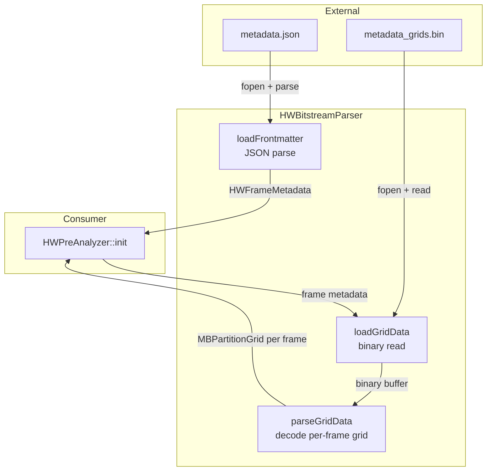

# HWBitstreamParser — Metadata Sidecar Loader

## 1. Overview

`HWBitstreamParser` loads the pre-generated hardware encode metadata from two sidecar files: a JSON frontmatter (`metadata.json`) and a binary grid data file (`metadata_grids.bin`). It is the data ingestion layer for the `HWPreAnalyzer` module.

**Sidecar format**:
- `metadata.json`: JSON array of per-frame entries, each containing POC, frame type, QP, bit count, scene cut flag, MV complexity, and offsets into the binary grid file
- `metadata_grids.bin`: Flat binary file containing all MB partition grids and MV fields concatenated per frame, each prefixed with a 4-byte size header

**Lifecycle**: Created by `HWPreAnalyzer::init()`, used once to populate the internal metadata array, then kept for any on-demand re-parsing of individual frames.

## 2. Component Specifications

```cpp
#pragma once

#include "HWPreAnalyzer.h"
#include <string>
#include <vector>
#include <cstdint>

namespace vvenc {

class HWBitstreamParser
{
public:
  static constexpr int   BIN_HEADER_SIZE = 4;  // bytes per frame grid size prefix
  static constexpr int   MAX_FRAME_COUNT = 65535;
  static constexpr int   MB_TYPE_BYTES   = 64;  // bytes per MB (8x8 sub-MB partition mask)
  static constexpr int   MV_BYTES        = 4;   // bytes per MV entry (int16_t x 2)

  explicit HWBitstreamParser();
  virtual ~HWBitstreamParser();

  /** \brief Load JSON frontmatter from file path.
   *  \param[in]  cPath         path to metadata.json
   *  \param[out] rFrames       output frame metadata array
   *  \param[out] riWidth       video width from metadata
   *  \param[out] riHeight      video height from metadata
   *  \param[out] riAvgBits     average bits per frame
   *  \retval 0  success
   *  \retval -1 file not found
   *  \retval -2 JSON parse error
   *  \retval -3 invalid format
   */
  int loadFrontmatter(const std::string& cPath,
                      std::vector<HWFrameMetadata>& rFrames,
                      int& riWidth,
                      int& riHeight,
                      int& riAvgBits);

  /** \brief Load binary grid data for all frames.
   *  \param[in]  cPath      path to metadata_grids.bin
   *  \param[out] rFrames    frame metadata array (populates m_cMBGrid for each frame)
   *  \param[in]  iWidth     video width in pixels
   *  \param[in]  iHeight    video height in pixels
   *  \retval 0  success
   *  \retval -1 file not found
   *  \retval -2 size mismatch (grid data size != expected)
   */
  int loadGridData(const std::string& cPath,
                   std::vector<HWFrameMetadata>& rFrames,
                   int iWidth,
                   int iHeight);

  /** \brief Parse a single MBPartitionGrid from raw binary buffer.
   *  \param[in]  pBuffer    binary data starting at this frame's grid
   *  \param[in]  iBufferSz  remaining buffer size
   *  \param[in]  iGridW     grid width in MBs
   *  \param[in]  iGridH     grid height in MBs
   *  \param[out] rGrid      parsed grid
   *  \param[out] riConsumed bytes consumed from buffer
   *  \retval 0  success
   *  \retval -1 buffer too small
   */
  int parseGridData(const uint8_t* pBuffer,
                    int iBufferSz,
                    int iGridW,
                    int iGridH,
                    MBPartitionGrid& rGrid,
                    int& riConsumed) const;

  /** \brief Check if a frame index is within bounds.
   *  \param[in]  iIndex
   *  \retval true   valid
   *  \retval false  out of range
   */
  bool isValidFrameIndex(int iIndex) const;

  /** \brief Release all internal buffers.
   *  \retval 0  success
   */
  int release();

private:
  // ── Private helpers ───────────────────────────────────────────
  int xParseJSONArray(const void* pJsonRoot,
                      std::vector<HWFrameMetadata>& rFrames,
                      int& riWidth,
                      int& riHeight,
                      int& riAvgBits);
  int xParseSingleFrame(const void* pJsonEntry,
                        HWFrameMetadata& rMeta) const;
  int xValidateDimensions(int iWidth, int iHeight) const;

  // ── Member variables ─────────────────────────────────────────
  bool  m_bInitialized;
  void* m_pJsonRoot;          ///< root JSON object (opaque, parsed via yyjson or similar)
  int   m_iRawDataBytes;      ///< total bytes in loaded grid data (for validation)
};

}  // namespace vvenc
```

### Sidecar Format Specification

**metadata.json**:
```json
{
  "version": 1,
  "width": 1920,
  "height": 1080,
  "frames": [
    {
      "poc": 0,
      "frameType": "I",
      "qp": 28,
      "bits": 123456,
      "sceneCut": true,
      "mvComplexity": 0.75,
      "gridOffset": 0,
      "gridBytes": 523776
    },
    {
      "poc": 1,
      "frameType": "B",
      "qp": 32,
      "bits": 54321,
      "sceneCut": false,
      "mvComplexity": 0.31,
      "gridOffset": 523776,
      "gridBytes": 523776
    }
  ]
}
```

**metadata_grids.bin** (per-frame binary layout):
```
Offset  Size    Field
──────────────────────────────────────
0       4       gridSizeBytes (u32 little-endian, includes this header)
4       W*H     MB types: uint8_t[W*H], 0..255 per MB
4+W*H   W*H*4   MV data:  int16_t[W*H*2] (mvX, mvY per MB)
──────────────────────────────────────
Total:  4 + W*H*5 bytes per frame
```

For 120x68 MB grid (1080p): 4 + 120*68*5 = 40,804 bytes per frame.

## 3. System Architecture



## 4. Detailed Data Flow

```
HWPreAnalyzer::init("/path/to/metadata.json")
  → HWBitstreamParser::loadFrontmatter("metadata.json")
    → fopen() read entire file
    → JSON parse (root object)
    → xParseJSONArray: iterate "frames" array
      → for each entry:
        → xParseSingleFrame → HWFrameMetadata
        → validate POC monotonically increasing
    → return 0

HWPreAnalyzer::xLoadGridData("metadata_grids.bin")
  → HWBitstreamParser::loadGridData("metadata_grids.bin")
    → fopen() read entire file
    → for each frame (index from offset):
      → compute expected grid size: 4 + gridW * gridH * 5
      → read gridSizeBytes header
      → if gridSizeBytes != expected: return -2
      → parseGridData(buffer + offset, gridW, gridH)
        → read uint8_t[W*H] MB types
        → read int16_t[W*H*2] MV pairs
        → build MBPartitionGrid vector
      → advance offset by gridSizeBytes
    → return 0
```

### JSON Parsing Library

The JSON parser must be lightweight with no external dependencies. Options:
- **yyjson** (single-file C, 0-dependency) — recommended for this module if vendored
- **simdjson** (faster but larger)
- **Manual state machine** (minimal but error-prone for complex schema)

Recommendation: yyjson vendored in `source/Lib/HWPreAnalysis/yyjson/` to keep the module self-contained, with a `HWPreAnalyzer_yyjson.h` wrapper.

## 5. Visualisation

No D3 animation for this leaf-level component.

## 6. Testing Requirements

### Unit Tests (in `test/hw_preanalysis/hw_preanalysis_test.cpp`)

| Test ID | What to Verify |
|---------|---------------|
| `HW_BITSTREAM_LOAD_FRONTMATTER` | `loadFrontmatter()` with valid JSON returns 0 and correct width/height/frame count |
| `HW_BITSTREAM_MISSING_FILE` | `loadFrontmatter()` with nonexistent path returns -1 |
| `HW_BITSTREAM_CORRUPT_JSON` | `loadFrontmatter()` with malformed JSON returns -2 |
| `HW_BITSTREAM_MISSING_FIELDS` | `loadFrontmatter()` with missing "frames" returns -3 |
| `HW_BITSTREAM_LOAD_GRID` | `loadGridData()` with valid bin returns 0 |
| `HW_BITSTREAM_GRID_MISSING` | `loadGridData()` with missing file returns -1 |
| `HW_BITSTREAM_GRID_SIZE_MISMATCH` | `loadGridData()` with wrong-size grid returns -2 |
| `HW_BITSTREAM_PARSE_GRID` | `parseGridData()` with valid buffer returns correct MB types and MVs |
| `HW_BITSTREAM_PARSE_TRUNCATED` | `parseGridData()` with too-small buffer returns -1 |
| `HW_BITSTREAM_PARSE_RTT` | `parseGridData()` output round-trips: serialize → parse → matches original |
| `HW_BITSTREAM_ZERO_FRAMES` | `loadFrontmatter()` with empty "frames" array returns 0 with 0 frames |
| `HW_BITSTREAM_RELEASE` | `release()` clears internal state, subsequent isValidFrameIndex returns false |

### Edge Cases

- JSON with negative POC values (lead frames): accepted if monotonically increasing
- Binary grid with extra trailing bytes: ignored (no error)
- Single-frame video: one entry in arrays, all queries valid
- Extreme dimension mismatch: e.g., width=0 or height=0 rejected by xValidateDimensions

## 7. CLI Entry Point

No direct CLI entry. Instantiated internally by `HWPreAnalyzer::init()`.

### Test Data Generator

A Python script or C++ utility should be provided to generate hand-crafted test sidecar files:

```bash
# Generate test metadata for unit tests
python scripts/gen_hw_metadata.py \
  --width 1920 --height 1080 --num-frames 16 \
  --output /tmp/test_hw_metadata.json
```
