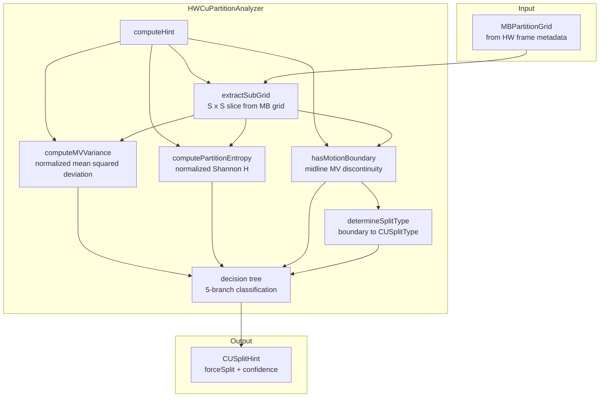

# HWCuPartitionAnalyzer — H.264 MB Grid to H.266 CU Split Hint Heuristic

## 1. Overview

`HWCuPartitionAnalyzer` implements the 2D aggregation heuristic that converts a per-macroblock partition and motion vector grid from a hardware H.264/H.265 encode into CU split hints for the H.266 encoder. The heuristic computes three metrics over an S x S sub-grid of MBs (S in {1,2,4,8} corresponding to 16x16 through 128x128 CU sizes):

1. **Partition entropy** — how varied the sub-MB partition types are within the region
2. **MV variance** — how much the motion vectors diverge within the region
3. **Motion boundary** — whether there is a sharp MV discontinuity across the region center

These metrics are combined via a decision tree to produce a `CUSplitHint` with a confidence score.

**Design principle**: The hint is never a hard decision — always a recommendation with confidence. Downstream (EncCu) applies its own threshold and may override based on RDO results.

**State**: Stateless. All computation is local to the input grid and CU position.

## 2. Component Specifications

```cpp
#pragma once

#include "HWPreAnalyzer.h"
#include <cstdint>

namespace vvenc {

class HWCuPartitionAnalyzer
{
public:
  static constexpr float  MV_BOUNDARY_THRESHOLD_PEL = 4.0f;  // pel diff triggers boundary
  static constexpr float  LOW_MV_VAR_THRESHOLD      = 0.05f; // below this = homogeneous motion
  static constexpr float  LOW_ENTROPY_THRESHOLD      = 0.1f;  // below this = uniform partition
  static constexpr float  MED_MV_VAR_THRESHOLD       = 0.2f;
  static constexpr float  MED_ENTROPY_THRESHOLD      = 0.3f;
  static constexpr float  HIGH_MV_VAR_THRESHOLD      = 0.5f;
  static constexpr float  HIGH_ENTROPY_THRESHOLD      = 0.6f;

  explicit HWCuPartitionAnalyzer();
  virtual ~HWCuPartitionAnalyzer();

  /** \brief Compute a CU split hint for a given sub-grid of the MB partition grid.
   *  \param[in]  rcGrid     full-frame MB partition grid
   *  \param[in]  iCtuX      CTU column in MB units (0-indexed)
   *  \param[in]  iCtuY      CTU row in MB units (0-indexed)
   *  \param[in]  iCUSize    CU side length in MB units (1, 2, 4, or 8)
   *  \param[out] rcHint     computed split hint
   *  \retval 0   hint computed
   *  \retval 1   insufficient MB data (CU exceeds grid bounds)
   */
  int computeHint(const MBPartitionGrid& rcGrid,
                  int iCtuX, int iCtuY, int iCUSize,
                  CUSplitHint& rcHint) const;

  /** \brief Compute MV variance over an array of MVs.
   *         Returns mean squared deviation from the mean MV,
   *         normalized to [0.0, 1.0] by maxMvDist^2.
   *  \param[in]  pcMVs     pointer to MV array
   *  \param[in]  iCount    number of MVs
   *  \retval normalized variance (0.0 = all identical)
   */
  float computeMVVariance(const Mv* pcMVs, int iCount) const;

  /** \brief Compute partition entropy over an array of MB type masks.
   *         Normalized Shannon entropy: H / H_max.
   *  \param[in]  pcTypes   array of uint8_t sub-MB partition masks
   *  \param[in]  iCount    number of entries
   *  \retval normalized entropy (0.0 = uniform, 1.0 = maximally diverse)
   */
  float computePartitionEntropy(const uint8_t* pcTypes, int iCount) const;

  /** \brief Detect if there is a motion boundary across the region.
   *         Checks adjacent MB pairs across the horizontal and vertical
   *         midlines of the region for MV differences > threshold.
   *  \param[in]  pcMVs     pointer to MV array (row-major, regionWidth x regionHeight)
   *  \param[in]  iW        region width in MBs
   *  \param[in]  iH        region height in MBs
   *  \param[out] pbHoriz   true if horizontal boundary detected
   *  \param[out] pbVert    true if vertical boundary detected
   *  \retval true   at least one boundary detected
   */
  bool hasMotionBoundary(const Mv* pcMVs, int iW, int iH,
                         bool& rbHoriz, bool& rbVert) const;

  /** \brief Determine dominant split direction from motion boundary.
   *  \param[in]  bHorizBoundary   horizontal boundary present
   *  \param[in]  bVertBoundary    vertical boundary present
   *  \retval CUSplitType  BT_H, BT_V, or QT if both
   */
  CUSplitType determineSplitType(bool bHorizBoundary, bool bVertBoundary) const;

  /** \brief Extract a sub-grid of MBs covering a CU-sized region.
   *  \param[in]  rcGrid       full MB grid
   *  \param[in]  iOriginX     sub-grid origin X in MB units
   *  \param[in]  iOriginY     sub-grid origin Y in MB units
   *  \param[in]  iSize        sub-grid side length in MB units
   *  \param[out] pcMBTypes    output buffer for MB types (iSize*iSize)
   *  \param[out] pcMVs        output buffer for MVs (iSize*iSize)
   *  \param[out] piActualW    actual width (clamped to grid bounds)
   *  \param[out] piActualH    actual height (clamped to grid bounds)
   *  \retval 0   success
   *  \retval 1   origin outside grid
   */
  int extractSubGrid(const MBPartitionGrid& rcGrid,
                     int iOriginX, int iOriginY, int iSize,
                     uint8_t* pcMBTypes, Mv* pcMVs,
                     int& riActualW, int& riActualH) const;

private:
  // ── Private helpers ───────────────────────────────────────────
  static float xMVDistSq(const Mv& rcA, const Mv& rcB);
  static float xMVNormSq(const Mv& rcMv);
  static float xShannonEntropy(const int* piCounts, int iNumBins, int iTotal);
};

}  // namespace vvenc
```

## 3. System Architecture



## 4. Detailed Data Flow

### 4.1 CU Split Hint Decision Tree

```
computeHint(grid, ctuX, ctuY, cuSize):
  → extractSubGrid(grid, ctuX*cuSize, ctuY*cuSize, cuSize, types, mvs, w, h)
    → if origin outside grid: return 1 (insufficient data)
    → copy MB types and MVs for cuSize x cuSize region
    → clamp to grid bounds if CU extends past frame edge

  → mvVar = computeMVVariance(mvs, w*h)
  → entropy = computePartitionEntropy(types, w*h)
  → hasBoundary, hBound, vBound = hasMotionBoundary(mvs, w, h)

  ┌─ Decision tree ───────────────────────────────────────────────┐
  │                                                                │
  │  if mvVar < LOW_MV_VAR (0.05) AND entropy < LOW_ENTROPY (0.1):│
  │    → hint = noSplit, confidence = 0.9                          │
  │                                                                │
  │  elif hasBoundary:                                             │
  │    → hint = forceSplit                                         │
  │    → splitType = determineSplitType(hBound, vBound)            │
  │    → confidence = 0.8                                          │
  │                                                                │
  │  elif mvVar < MED_MV_VAR (0.2) AND entropy < MED_ENTROPY (0.3):│
  │    → hint = noSplit, confidence = 0.6                          │
  │                                                                │
  │  elif mvVar > HIGH_MV_VAR (0.5) OR entropy > HIGH_ENTROPY (0.6):│
  │    → hint = forceSplit                                         │
  │    → splitType = QT (most general split)                       │
  │    → confidence = 0.7                                          │
  │                                                                │
  │  else:                                                         │
  │    → hint = none (no recommendation)                           │
  │    → confidence = 0.3                                          │
  └────────────────────────────────────────────────────────────────┘

  → return 0
```

### 4.2 Sub-Grid Extraction (for CU at frame boundary)

```
Frame boundary example: 128x128 CTU at right edge, only 3 MB columns remain
  cuSize = 8 (desired 128x128)
  actualW = min(8, remainingMBsRight) = 3
  actualH = min(8, remainingMBsDown) = 8

  → extract 3x8 sub-grid
  → all metrics computed over 3x8 = 24 MBs instead of 64
  → confidence is downscaled by coverage ratio: conf *= (actualW*actualH) / (cuSize^2)
  → prevents overconfident hints from partial data
```

## 5. Visualisation

No D3 animation for this leaf-level component. See `HWPreAnalyzer.spec.md` for module-level animation reference.

## 6. Testing Requirements

### Unit Tests (in `test/hw_preanalysis/hw_preanalysis_test.cpp`)

| Test ID | What to Verify |
|---------|---------------|
| `HW_CU_HINT_HOMOGENEOUS_NO_SPLIT` | 8x8 uniform MB grid with zero MV variance: hint.noSplit=true, conf > 0.8 |
| `HW_CU_HINT_HOMOGENEOUS_4X4` | 4x4 uniform grid (64x64 CU): same result, conf scaled correctly |
| `HW_CU_HINT_HOMOGENEOUS_1X1` | 1x1 grid (16x16 CU): no split, conf=0.9 |
| `HW_CU_HINT_BOUNDARY_HORIZ` | MB grid with MV discontinuity > 4pel across horizontal midline: forceSplit, splitType=BT_H |
| `HW_CU_HINT_BOUNDARY_VERT` | MB grid with MV discontinuity > 4pel across vertical midline: forceSplit, splitType=BT_V |
| `HW_CU_HINT_BOUNDARY_BOTH` | MB grid with discontinuity on both axes: forceSplit, splitType=QT |
| `HW_CU_HINT_MEDIUM_VARIANCE` | Medium MV var (0.1) and entropy (0.2): noSplit, conf=0.6 |
| `HW_CU_HINT_HIGH_VARIANCE` | High MV var (0.6): forceSplit, splitType=QT, conf=0.7 |
| `HW_CU_HINT_HIGH_ENTROPY` | High entropy (0.7): forceSplit, splitType=QT, conf=0.7 |
| `HW_CU_HINT_LOW_CONFIDENCE` | Mixed signals (mvVar=0.3, entropy=0.4, no boundary): hint=none, conf=0.3 |
| `HW_CU_HINT_INSUFFICIENT_DATA` | CU size=8 at grid origin (-1, -1): returns 1 |
| `HW_CU_HINT_FRAME_BOUNDARY` | CU at right edge with 3 remaining MB columns: hint computed over truncated grid, conf downscaled |
| `HW_MV_VARIANCE_ZERO` | All identical MVs: computeMVVariance returns 0.0 |
| `HW_MV_VARIANCE_UNIFORM` | All MVs = (0,0): returns 0.0 |
| `HW_MV_VARIANCE_HIGH` | Random MVs in [-16,16]: returns > 0.5 |
| `HW_MV_VARIANCE_SINGLE` | Single MV: returns 0.0 |
| `HW_PARTITION_ENTROPY_UNIFORM` | All MB type = 0: returns 0.0 |
| `HW_PARTITION_ENTROPY_MIXED` | 8 distinct types evenly distributed: returns ~1.0 |
| `HW_PARTITION_ENTROPY_TWO` | 2 types evenly split: returns 1.0 |
| `HW_MOTION_BOUNDARY_8PEL` | Adjacent MVs differ by 8 pel: returns true |
| `HW_MOTION_BOUNDARY_4PEL_AT` | Adjacent MVs differ by exactly 4 pel: returns true (boundary inclusive) |
| `HW_MOTION_BOUNDARY_1PEL` | Adjacent MVs differ by 1 pel: returns false |
| `HW_MOTION_BOUNDARY_IDENTICAL` | All MVs same: returns false |
| `HW_EXTRACT_SUBGRID_FULL` | extract 8x8 from center of 16x16 grid: returns 0x0 with correct data |
| `HW_EXTRACT_SUBGRID_TRUNCATED` | extract 8x8 from right edge with 3 cols left: actualW=3, actualH=8 |
| `HW_EXTRACT_SUBGRID_OUT_OF_BOUNDS` | extract with origin > grid: returns 1 |
| `HW_DETERMINE_SPLIT_HORIZ` | hBoundary=true, vBoundary=false → BT_H |
| `HW_DETERMINE_SPLIT_VERT` | hBoundary=false, vBoundary=true → BT_V |
| `HW_DETERMINE_SPLIT_BOTH` | hBoundary=true, vBoundary=true → QT |
| `HW_DETERMINE_SPLIT_NEITHER` | both false → CU_SPLIT_NONE |

### Edge Case Tests

| Test | What to Verify |
|------|---------------|
| Single-MB CU (16x16, cuSize=1) | No boundary possible on 1x1 grid; falls through to variance/entropy check |
| All-zero MV grid (static scene) | mvVar=0, entropy low → noSplit, conf=0.9 |
| All-same MB type (e.g., all INTRA_16x16) | entropy=0, mvVar irrelevant → noSplit |
| Frame edge: CU straddles right+bottom edge | Truncated in both dimensions, confidence downscaled twice |
| Frame edge: CU starts at (0,0) with cuSize=8 | Full extraction from top-left, no truncation |

## 7. CLI Entry Point

No direct CLI entry. Instantiated internally by `HWPreAnalyzer::init()` and accessed through `HWPreAnalyzer::getCUSplitHint()`.
