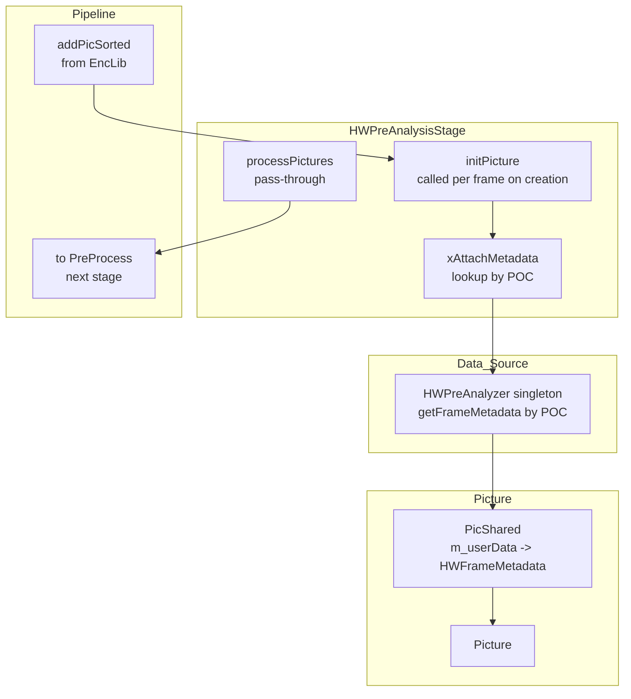

# HWPreAnalysisStage — Encoder Pipeline Stage for Metadata Attachment

## 1. Overview

`HWPreAnalysisStage` is an `EncStage` subclass that sits at the front of the encoder pipeline (before `PreProcess`). Its sole responsibility is to attach pre-loaded `HWFrameMetadata` to each `PicShared` as it enters the pipeline, making the hardware pre-analysis data available to all downstream stages.

**Why a separate stage?** Using an `EncStage` rather than inline attachment in `EncLib::encodePicture()` ensures:
- Consistent ordering with the existing pipeline stage lifecycle
- Proper POC-based sorting and lead/trail frame handling
- Clean separation of concerns — the stage does one thing

**What it does not do**: No encoding, no analysis, no I/O. All data is pre-loaded at init time by `HWPreAnalyzer::init()`. The stage is a metadata attachment pass-through.

## 2. Component Specifications

```cpp
#pragma once

#include "EncoderLib/EncStage.h"

namespace vvenc {

class HWPreAnalyzer;
struct HWFrameMetadata;

class HWPreAnalysisStage : public EncStage
{
public:
  /** \brief Construct stage with reference to loaded HW pre-analysis data.
   *  \param[in]  pcMsg       message handler for logging
   *  \param[in]  pcAnalyzer  initialized HWPreAnalyzer instance
   */
  explicit HWPreAnalysisStage(MsgSet* pcMsg, HWPreAnalyzer* pcAnalyzer);
  virtual ~HWPreAnalysisStage();

  // ── Overrides ─────────────────────────────────────────────────
  /** \brief Attach HW frame metadata to the picture being set up.
   *         Called once per picture when it enters the stage.
   *  \param[in]  pic   Picture being initialised
   */
  void initPicture(Picture* pic) override;

  /** \brief Process pictures through the stage.
   *         Pass-through: simply forwards all pictures to the done list
   *         after metadata attachment (done in initPicture).
   *  \param[in]  picList     incoming picture queue
   *  \param[out] auList      access unit output (unused in this stage)
   *  \param[out] doneList    pictures ready for next stage
   *  \param[out] freeList    pictures to recycle
   */
  void processPictures(const PicList& picList,
                       AccessUnitList& auList,
                       PicList& doneList,
                       PicList& freeList) override;

private:
  // ── Private helpers ───────────────────────────────────────────
  /** \brief Find HWFrameMetadata for the given POC and attach it.
   *  \param[in]  pic   Picture to attach metadata to
   *  \retval 0   metadata found and attached
   *  \retval 1   no metadata for this POC (warning logged)
   */
  int xAttachMetadata(Picture* pic);

  // ── Member variables ─────────────────────────────────────────
  HWPreAnalyzer*  m_pAnalyzer;       ///< pre-loaded metadata, not owned
  MsgSet*         m_pMsg;            ///< message handler for warnings
  int             m_iWarnedMissing;  ///< count of missing-POC warnings
};

}  // namespace vvenc
```

### Stage Lifecycle

```
EncLib::initPass()
  → m_pHWPreAnalyzer->createStage(msg, encCfg) → new HWPreAnalysisStage(msg, analyzer)
  → stage->initStage(encCfg, minQueueSize=1, startPoc=0, processLeadTrail=false, sortByPoc=false, nonBlocking=false)
  → m_encStages.push_back(stage)

For each frame:
  EncStage::addPicSorted(picShared, flush)
    → allocates Picture from free list
    → picShared->shareData(pic)  // copies YUV data, POC, gopEntry
    → initPicture(pic)           // OVERRIDE: attaches HW metadata
    → inserts into m_procList

  EncStage::runStage(flush, auList)
    → processPictures(m_procList, auList, doneList, freeList)
      → OVERRIDE: all pictures in m_procList → doneList immediately
      (no computation, multi-frame buffering handled by next stage)
    → sends doneList pictures to next stage (PreProcess)
```

## 3. System Architecture



## 4. Detailed Data Flow

### 4.1 Frame Metadata Attachment Sequence

```
EncLib::encodePicture()
  → get free PicShared from pool
  → feed input YUV to PicShared
  → m_encStages[0]->addPicSorted(picShared, flush)

addPicSorted(picShared, flush):
  → pop free Picture from m_freeList (or allocate new)
  → picShared->shareData(pic)
    → copies YUV, POC, gopEntry, userData to Picture
  → initPicture(pic)      *** OVERRIDE ***
    → xAttachMetadata(pic)
      → HWPreAnalyzer::getFrameMetadata(pic->poc, &meta)
      → if found:
          → pic->userData = const_cast<HWFrameMetadata*>(meta)
          → log trace: "HW metadata attached for POC %d"
      → if not found:
          → m_iWarnedMissing++
          → if m_iWarnedMissing <= 3:
              → log warning: "No HW metadata for POC %d"
          → pic->userData = nullptr (no metadata)
    → insert pic into m_procList sorted by coding number

runStage(flush, auList):
  → processPictures(m_procList, auList, doneList, freeList)
    → move ALL pictures from m_procList → doneList
    → (freeList is empty — this stage never frees pictures)
  → for each pic in doneList:
    → picShared->releasePrevBuffers(pic)
    → m_nextStage->addPicSorted(picShared, flush)
```

### 4.2 Metadata Access by Downstream Stages

```
Downstream stage (e.g., RateCtrl, EncCu):
  → Picture* pic = current picture
  → HWFrameMetadata* meta = reinterpret_cast<HWFrameMetadata*>(pic->userData)
  → if meta:
      → use meta->m_iQP, meta->m_bSceneCut, meta->m_fMVComplexity, etc.
  → else:
      → fall through to default behavior (no HW guidance)

EncCu (CU-level):
  → HWPreAnalyzer::getInstance()->getCUSplitHint(ctuX_mb, ctuY_mb, cuSize_mb, hint)

InterSearch (motion estimation):
  → HWPreAnalyzer::getInstance()->getMVField(poc, mvGrid, w, h)
```

## 5. Visualisation

No D3 animation for this pipeline-integration component.

## 6. Testing Requirements

### Unit Tests (in `test/hw_preanalysis/hw_preanalysis_test.cpp`)

| Test ID | What to Verify |
|---------|---------------|
| `HW_STAGE_CREATE` | `createStage()` returns non-null `EncStage*` when analyzer is initialized |
| `HW_STAGE_CREATE_NULL` | `createStage()` returns nullptr when analyzer is null |
| `HW_STAGE_ATTACH_FOUND` | `initPicture(pic)` attaches metadata for a POC that exists in the loaded set |
| `HW_STAGE_ATTACH_NOT_FOUND` | `initPicture(pic)` leaves userData=nullptr for missing POC |
| `HW_STAGE_PASSTHROUGH` | `processPictures()` moves all input pictures to doneList |
| `HW_STAGE_PASSTHROUGH_EMPTY` | `processPictures()` with empty input produces empty output |
| `HW_STAGE_MULTIPLE_FRAMES` | Stage handles 16 consecutive POCs without warning threshold overflow |
| `HW_STAGE_LIFECYCLE` | initStage → addPicSorted x3 → runStage → all 3 reach doneList |

### Integration Tests

| Test | What to Verify |
|------|---------------|
| Pipeline insertion | Stage is inserted at correct position (before PreProcess, index 0 in m_encStages) |
| Metadata propagation | HWFrameMetadata on PicShared survives shareData → Picture → downstream stage |
| Graceful degradation | With null analyzer, stage processes all frames without crash, no metadata attached |
| Lead/trail frames | Frames with POC < startPoc are forwarded to next stage without attachment |
| Memory leak | Stage lifecycle produces no leaks (valgrind-checked) |

## 7. CLI Entry Point

No direct CLI entry. Created and managed by `HWPreAnalyzer::createStage()`.

### Integration Code (in EncLib)

```cpp
// EncLib::initPass() — add before PreProcess:
if (m_pHWPreAnalyzer && m_pHWPreAnalyzer->isInitialized())
{
  m_hwStage = m_pHWPreAnalyzer->createStage(msg, m_encCfg);
  if (m_hwStage)
  {
    m_hwStage->initStage(
      m_encCfg,
      /*minQueueSize*/ 1,
      /*startPoc*/      0,
      /*processLeadTrail*/ false,
      /*sortByPoc*/     false,
      /*nonBlocking*/   false
    );
    m_encStages.push_back(m_hwStage);
  }
}

// ... then existing PreProcess, MCTF, etc. stages follow
```
