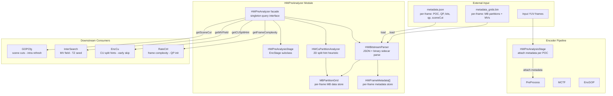
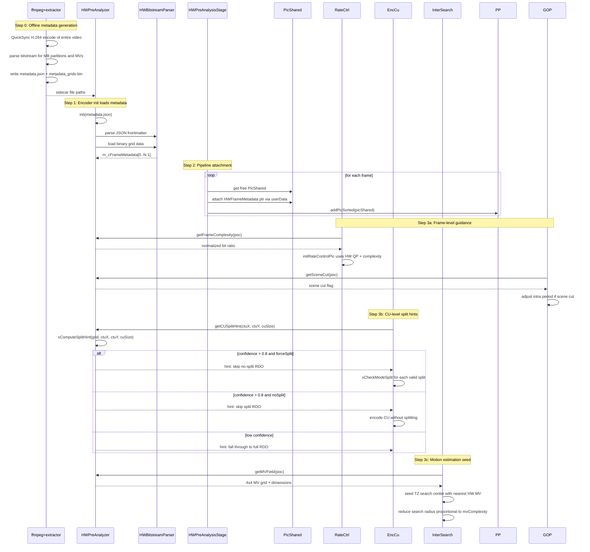

# HWPreAnalyzer — QuickSync Hardware Encode Pre-Analysis Module

## 1. Overview

`HWPreAnalyzer` ingests metadata from a QuickSync (H.264/H.265) hardware encode pass and produces per-frame analysis data that guides downstream H.266 encoding decisions. It operates in file-backed mode: an external tool produces a metadata sidecar, which `HWPreAnalyzer` loads once at encoder init and provides via a query interface.

**Data captured per frame**: frame type (I/P/B), per-frame QP, encoded bit count, scene cut flag, normalized motion vector complexity, and a per-MB partition/MV grid for CU split hint aggregation.

**Consumption points**:
- `RateCtrl` — frame-level complexity metric for initial QP allocation
- `GOPCfg` — scene cut flags for intra refresh placement
- `EncCu` — CU split hints for early skip in `xCompressCU`
- `InterSearch` — MV field to seed TZ search center and reduce search radius

**Dependencies**: `CommonLib` (PicShared, PelStorage, Mv types), `EncoderLib` (EncStage, GOPCfg, RateCtrl, EncCu, InterSearch)

**Lifecycle stages**:
1. **Init** — `HWPreAnalyzer::init(path)` loads `metadata.json` + binary sidecar, populates per-frame metadata array
2. **Attachment** — `HWPreAnalysisStage` attaches `HWFrameMetadata` to each `PicShared` in the encoder pipeline
3. **Consumption** — downstream modules call facade query methods per frame, per CU position
4. **Uninit** — `HWPreAnalyzer::uninit()` releases internal structures

**Module Export Rules**:
- `HWPreAnalyzer` is the only class intended for external consumption (by `EncLib`).
- `HWBitstreamParser`, `HWCuPartitionAnalyzer`, and `HWPreAnalysisStage` are internal to the module, accessed through `HWPreAnalyzer`'s public interface.

**Conditional compilation**: The entire module compiles to empty stubs when `VVENC_ENABLE_HW_PREANALYSIS` is `0` (default), providing zero codegen impact on unmodified builds.

## 2. Component Specifications

### Internal Component Reference

| # | Spec File | Role |
|---|-----------|------|
| 1 | `HWBitstreamParser.spec.md` | Parse metadata.json + binary sidecar into internal per-frame array |
| 2 | `HWCuPartitionAnalyzer.spec.md` | 2D aggregation heuristic: 8x8 MB grid to per-CU split hints |
| 3 | `HWPreAnalysisStage.spec.md` | `EncStage` subclass that attaches metadata to PicShared in the pipeline |

### Facade Class — HWPreAnalyzer

```cpp
#pragma once

#include "CommonLib/PelBuffer.h"
#include <string>
#include <vector>

namespace vvenc {

// ── Forward declarations ──────────────────────────────────────────
class EncStage;
class PicShared;
struct Mv;

// ── Enums ─────────────────────────────────────────────────────────
enum HWFrameType
{
  HW_FRAME_I       = 0,
  HW_FRAME_P       = 1,
  HW_FRAME_B       = 2,
  HW_FRAME_UNKNOWN = 3
};

enum CUSplitType
{
  CU_SPLIT_NONE = 0,
  CU_SPLIT_QT   = 1,
  CU_SPLIT_BT_H = 2,
  CU_SPLIT_BT_V = 3,
  CU_SPLIT_TT_H = 4,
  CU_SPLIT_TT_V = 5
};

// ── Data structures ──────────────────────────────────────────────
struct MBPartitionInfo
{
  int              m_iPosX;       ///< MB column index
  int              m_iPosY;       ///< MB row index
  uint8_t          m_uiMBType;    ///< H.264 MB type or H.265 CU geometry
  uint8_t          m_uiSubMBMask; ///< Sub-MB partition bitmask (4x4 grid per MB)
  Mv               m_cMV;         ///< MV for this MB (best match across sub-partitions)
  int16_t          m_iQP;         ///< Per-MB QP delta
};

struct MBPartitionGrid
{
  int                           m_iWidth;    ///< grid width in MB units
  int                           m_iHeight;   ///< grid height in MB units
  std::vector<MBPartitionInfo>  m_cMBs;      ///< tile in raster order
};

struct HWFrameMetadata
{
  int              m_iPOC;            ///< picture order count
  HWFrameType      m_eFrameType;      ///< I/P/B from HW encode
  int              m_iQP;             ///< per-frame average QP from HW encode
  uint64_t         m_uBits;           ///< encoded frame size in bytes
  bool             m_bSceneCut;       ///< scene change detected at this frame
  float            m_fMVComplexity;   ///< 0.0-1.0 normalized MV magnitude
  MBPartitionGrid  m_cMBGrid;         ///< per-MB partition and MV data
};

struct CUSplitHint
{
  bool            m_bForceSplit;     ///< true: skip no-split mode evaluation
  bool            m_bNoSplit;        ///< true: skip split mode evaluation
  CUSplitType     m_eSplitType;      ///< preferred split type when forceSplit
  float           m_fConfidence;     ///< 0.0-1.0 strength of recommendation
};

// ── Facade class ─────────────────────────────────────────────────
class HWPreAnalyzer
{
public:
  static constexpr int MAX_CTU_SIZE_MB = 8;  // 128 / 16
  static constexpr int MB_SUB_BLOCK     = 4;  // sub-blocks per MB side (4x4 MV grid)

  explicit HWPreAnalyzer();
  virtual ~HWPreAnalyzer();

  // ── Singleton access ─────────────────────────────────────────
  /** \brief Get global HWPreAnalyzer instance.
   *  \retval pointer   active instance
   *  \retval nullptr   not initialised
   */
  static HWPreAnalyzer* getInstance();

  /** \brief Set global HWPreAnalyzer instance.
   *  \param[in]  pInstance   pointer to active instance
   */
  static void setInstance(HWPreAnalyzer* pInstance);

  // ── Lifecycle ────────────────────────────────────────────────
  /** \brief Load pre-generated HW metadata from sidecar files.
   *  \param[in]  cMetadataPath   path to metadata.json
   *  \retval 0  success
   *  \retval -1 file not found
   *  \retval -2 parse error
   *  \retval -3 grid data file not found
   */
  int init(const std::string& cMetadataPath);

  /** \brief Uninitialize and release resources.
   *  \retval 0  success
   */
  int uninit();

  /** \brief Check if analyser is initialised.
   *  \retval true   metadata loaded and ready
   *  \retval false  not initialised
   */
  bool isInitialized() const;

  // ── Metadata queries ─────────────────────────────────────────
  /** \brief Get per-frame metadata for a given POC.
   *  \param[in]  iPOC      picture order count
   *  \param[out] ppcMeta   pointer to internal metadata entry
   *  \retval 0  found
   *  \retval 1  not found
   */
  int getFrameMetadata(int iPOC, const HWFrameMetadata*& ppcMeta) const;

  /** \brief Get normalised frame complexity for rate control.
   *         Complexity = frameBits / averageBitsPerFrame.
   *  \param[in]  iPOC
   *  \param[out] pfComplexity   ratio (1.0 = average, 0.0 = empty frame)
   *  \retval 0  success
   *  \retval 1  POC not found
   */
  int getFrameComplexity(int iPOC, float& rfComplexity) const;

  /** \brief Get scene cut status for a given POC.
   *  \param[in]  iPOC
   *  \param[out] pbSceneCut   true if HW detected a scene change
   *  \retval 0  success
   */
  int getSceneCut(int iPOC, bool& rbSceneCut) const;

  /** \brief Get CU split hint for a region within a CTU.
   *  \param[in]  iCtuX      CTU column index (in MB units)
   *  \param[in]  iCtuY      CTU row index (in MB units)
   *  \param[in]  iCUSize    CU size in MB units (1=16x16, 2=32x32, 4=64x64, 8=128x128)
   *  \param[out] rcHint     split recommendation
   *  \retval 0  hint generated
   *  \retval 1  insufficient MB data for this CU size
   */
  int getCUSplitHint(int iCtuX, int iCtuY, int iCUSize,
                     CUSplitHint& rcHint) const;

  /** \brief Get motion vector field for seeding TZ search.
   *  \param[in]  iPOC
   *  \param[out] ppcMVGrid   pointer to 4x4-pel MV grid (sub-MB resolution)
   *  \param[out] piGridW     grid width in MV entries
   *  \param[out] piGridH     grid height in MV entries
   *  \retval 0  success
   *  \retval 1  POC not found
   */
  int getMVField(int iPOC, const Mv*& ppcMVGrid,
                 int& riGridW, int& riGridH) const;

  /** \brief Create an EncStage that attaches HW metadata to PicShared.
   *  \param[in]  pcMsg       message handler for logging
   *  \param[in]  rcEncCfg    encoder configuration
   *  \retval pointer  new HWPreAnalysisStage instance
   *  \retval nullptr  not initialised
   */
  EncStage* createStage(MsgSet* pcMsg, const VVEncCfg& rcEncCfg);

  /** \brief Get total number of frames in metadata.
   *  \retval frame count
   */
  int getNumFrames() const;

private:
  // ── Private helpers ──────────────────────────────────────────
  int xLoadJSON(const std::string& cPath);
  int xLoadGridData(const std::string& cBinPath);
  int xParseFrameMetadata(const void* pJsonObj, HWFrameMetadata& rcMeta);
  CUSplitHint xComputeSplitHint(const MBPartitionGrid& rcGrid,
                                int iCtuX, int iCtuY, int iCUSize) const;
  float xComputeMVVariance(const Mv* pcMVs, int iCount) const;
  float xComputePartitionEntropy(const uint8_t* pcTypes, int iCount) const;
  bool  xHasMotionBoundary(const Mv* pcMVs, int iW, int iH) const;
  int   xFindFrameIndex(int iPOC) const;

  // ── Member variables ─────────────────────────────────────────
  bool                          m_bInitialized;         ///< true after successful init
  std::vector<HWFrameMetadata>  m_cFrameMetadata;       ///< indexed by POC order
  HWBitstreamParser*            m_pParser;              ///< internal metadata parser
  HWCuPartitionAnalyzer*        m_pCuAnalyzer;          ///< internal split hint engine
  int                           m_iWidth;               ///< video width in pixels
  int                           m_iHeight;              ///< video height in pixels
  int                           m_iNumFrames;           ///< total frame count
  int                           m_iAvgBits;             ///< average bits per frame (for complexity norm)
};

}  // namespace vvenc
```

## 3. System Architecture



## 4. Detailed Data Flow

### 4.1 File-Backed Pre-Analysis Lifecycle



### 4.2 CU Split Hint Heuristic

```
Input: MBPartitionGrid at CTU position (ctuX, ctuY)
       CU size in MB units (S = 1, 2, 4, 8)

Step 1: Extract S x S sub-grid of MBs covering the candidate CU
        gridW = min(S, remainingMBsRight)
        gridH = min(S, remainingMBsDown)

Step 2: Compute partition entropy
        for each MB in sub-grid:
            count[MB.subMBMask] += 1
        entropy = -sum(p_i * log(p_i)) / log(numTypes)

Step 3: Compute MV variance
        mvVar = mean(||MV_i - MV_mean||^2) / (maxMvDist^2)

Step 4: Detect motion boundaries
        hasBoundary = false
        for each adjacent MB pair across CU midlines:
            if ||MV_a - MV_b|| > threshold (4 pel):
                hasBoundary = true

Step 5: Decision
        if mvVar < 0.05 AND entropy < 0.1:
            hint = noSplit, confidence = 0.9
        elif hasBoundary:
            hint = forceSplit, splitType from dominant boundary direction
            confidence = 0.8
        elif mvVar < 0.2 AND entropy < 0.3:
            hint = noSplit, confidence = 0.6
        elif mvVar > 0.5 OR entropy > 0.6:
            hint = forceSplit, splitType = QT
            confidence = 0.7
        else:
            hint = none, confidence = 0.3
```

## 5. Visualisation

Covered by the root `technical-specification.md` D3 animation. If an HW pre-analysis panel is added, it would show: metadata load state, per-frame QP and bit curves, scene cut markers, and CU hint acceptance rate. Not specified here.

## 6. Testing Requirements

### Unit Tests (new file: `test/hw_preanalysis/hw_preanalysis_test.cpp`)

| Test ID | Scope | What to Verify |
|---------|-------|---------------|
| `HW_INIT_LOAD` | HWPreAnalyzer | `init()` with valid sidecar returns 0 |
| `HW_INIT_MISSING_FILE` | HWPreAnalyzer | `init()` with missing JSON returns -1 |
| `HW_INIT_CORRUPT_JSON` | HWPreAnalyzer | `init()` with corrupt JSON returns -2 |
| `HW_INIT_MISSING_BIN` | HWPreAnalyzer | `init()` with valid JSON but missing bin returns -3 |
| `HW_GET_FRAME_META` | HWPreAnalyzer | `getFrameMetadata(0, ptr)` returns valid QP, type, bits |
| `HW_GET_FRAME_META_INVALID` | HWPreAnalyzer | `getFrameMetadata(9999, ptr)` returns 1 |
| `HW_GET_COMPLEXITY` | HWPreAnalyzer | Average-bit frame returns 1.0, high-bit frame > 1.0 |
| `HW_GET_SCENE_CUT` | HWPreAnalyzer | Known cut frame returns true |
| `HW_GET_MV_FIELD` | HWPreAnalyzer | Grid dimensions match resolution / 16 |
| `HW_GET_MV_FIELD_INVALID` | HWPreAnalyzer | Invalid POC returns 1 |
| `HW_GET_CU_HINT_NO_SPLIT` | HWCuPartitionAnalyzer | Uniform MB grid with 0 MV variance: confidence > 0.8, bNoSplit=true |
| `HW_GET_CU_HINT_FORCE_SPLIT` | HWCuPartitionAnalyzer | MB grid with MV discontinuity at midline: bForceSplit=true |
| `HW_GET_CU_HINT_LOW_CONF` | HWCuPartitionAnalyzer | Mixed-variance grid: 0.3 < confidence < 0.7 |
| `HW_GET_CU_HINT_INSUFFICIENT` | HWCuPartitionAnalyzer | CU size larger than available MB grid returns 1 |
| `HW_MV_VARIANCE_ZERO` | HWCuPartitionAnalyzer | Identical MV array returns 0.0 |
| `HW_MV_VARIANCE_HIGH` | HWCuPartitionAnalyzer | Random MV array returns > 0.5 |
| `HW_PARTITION_ENTROPY_UNIFORM` | HWCuPartitionAnalyzer | Single type repeated returns 0.0 |
| `HW_PARTITION_ENTROPY_MIXED` | HWCuPartitionAnalyzer | All different types returns 1.0 |
| `HW_MOTION_BOUNDARY_DETECT` | HWCuPartitionAnalyzer | MV pair with 8 pel distance returns true |
| `HW_MOTION_BOUNDARY_SKIP` | HWCuPartitionAnalyzer | MV pair with 1 pel distance returns false |

### Calling-Order Validation

| Test | What to Verify |
|------|---------------|
| `init()` → `getFrameMetadata(0)` → `uninit()` | Valid lifecycle completes cleanly |
| `getFrameMetadata` before `init()` | Returns error code |
| `uninit()` after `uninit()` | No crash |
| `init()` after `uninit()` | Can re-initialise |
| `getCUSplitHint` with invalid CU size | Graceful fallback (no crash) |

### Metadata Sidecar Format Tests

| Test | What to Verify |
|------|---------------|
| Frontmatter-only JSON (no bin) | Error but message identifies missing grids |
| Binary grid with wrong dimensions | Error, dimension mismatch detected |
| Metadata with discontinuous POC | Missing POC returns not-found gracefully |
| Zero-frame metadata | Init succeeds, queries return not-found |

### Integration Tests

- Full encode with HW mock: 16 frames, `HWPreAnalyzer` loaded from hand-crafted test metadata
- Verify CU split hints are consumed by `EncCu` pattern (via singleton, same as ML module)
- Verify frame complexity feeds into `RateCtrl::initRateControlPic` path
- Verify MV field seed does not crash `InterSearch` when grid is empty

## 7. CLI Entry Point

Configured through `vvenc_config` fields:

| Config Field | Type | Default | Purpose |
|-------------|------|---------|---------|
| `m_hwPreAnalysis` | int | 0 | 0=disabled, 1=file-backed |
| `m_hwMetadataPath` | char[1024] | "" | path to metadata.json |

Set via `vvenc_set_param(cfg, "hw-pre-analysis", "1")` and `vvenc_set_param(cfg, "hw-metadata", "path/to/metadata.json")`.

In `vvencapp` CLI:
```
--hw-pre-analysis 1 --hw-metadata path/to/metadata.json
```

In `VVEncImpl::init()`:
```cpp
if (m_cVVEncCfg.m_hwPreAnalysis == 1) {
  m_pHWPreAnalyzer = new HWPreAnalyzer();
  if (m_pHWPreAnalyzer->init(m_cVVEncCfg.m_hwMetadataPath) != 0) {
    msg.log(WARNING, "HW pre-analysis metadata not found; continuing without\n");
    delete m_pHWPreAnalyzer;
    m_pHWPreAnalyzer = nullptr;
  }
}
```

In `EncLib::initPass()`, inserted before `PreProcess` as the first pipeline stage:
```cpp
if (m_pHWPreAnalyzer && m_pHWPreAnalyzer->isInitialized()) {
  m_hwStage = m_pHWPreAnalyzer->createStage(msg, m_encCfg);
  if (m_hwStage) {
    m_hwStage->initStage(m_encCfg, 1, 0, false, false, false);
    m_encStages.push_back(m_hwStage);
  }
}
```

### Environment Variables

| Variable | Purpose | Set By |
|----------|---------|--------|
| `VVENC_HW_METADATA` | Override metadata path at runtime | deepenc-harness |
