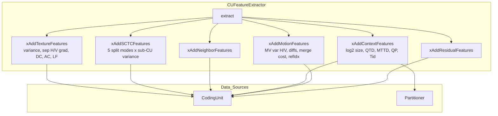

# CUFeatureExtractor — Mansouri 2024 Feature Extraction

## 1. Overview

`CUFeatureExtractor` builds a fixed ~30-element feature vector from the current CU context for inter-picture (P/B slice) split prediction. The feature set follows Taabane et al. (2024, IEEE Access) and covers texture statistics, Sub-CU Texture Complexity (SCTC), neighbouring CU information, current CU context (including QT/MTT depth and temporal layer), motion vector variance, and residual energy.

The class is stateless — it accumulates features into a pre-allocated vector and returns it.

## 2. Component Specifications

```cpp
#pragma once

#include <vector>

namespace vvenc {

class CodingUnit;
class Partitioner;

class CUFeatureExtractor {
public:
    CUFeatureExtractor();
    virtual ~CUFeatureExtractor();

    /** \brief Extract feature vector from CU context (Taabane 2024 feature set)
     *  \param[in]  cu           Current coding unit being evaluated
     *  \param[in]  partitioner  Active partitioner (split context)
     *  \param[out] outFeatures  Feature vector (~30 elements)
     *  \retval 0  Success
     *  \retval -1 Feature extraction failed (invalid CU state)
     */
    int extract(const CodingUnit& cu,
                const Partitioner& partitioner,
                std::vector<double>& outFeatures);

private:
    /** \brief Add texture statistics (variance, sep hor/ver gradient, DC, AC, LF ratio)
     *  \param[in] cu Current coding unit
     */
    int xAddTextureFeatures(const CodingUnit& cu);

    /** \brief Add Sub-CU Texture Complexity for each split mode (Taabane 2024 eq.6)
     *  Computes SCTC for QT (4 sub-CUs), BH/BV (2), TH/TV (3).
     *  Measures variance homogeneity across candidate sub-partitions.
     *  \param[in] cu Current coding unit
     */
    int xAddSCTCFeatures(const CodingUnit& cu);

    /** \brief Add neighbouring CU split depths and modes
     *  \param[in] cu Current coding unit
     */
    int xAddNeighborFeatures(const CodingUnit& cu);

    /** \brief Add current CU context (log2 size, QT depth, MTT depth, QP, temporal layer)
     *  \param[in] cu           Current coding unit
     *  \param[in] partitioner  Active partitioner
     */
    int xAddContextFeatures(const CodingUnit& cu, const Partitioner& partitioner);

    /** \brief Add motion information (MV variance hor/ver, MV diffs, merge cost, refIdx)
     *  \param[in] cu Current coding unit
     */
    int xAddMotionFeatures(const CodingUnit& cu);

    /** \brief Add residual energy (SAD, coefficient count)
     *  \param[in] cu Current coding unit
     */
    int xAddResidualFeatures(const CodingUnit& cu);

    /** \brief Compute variance of a 4x4-block-based quantity across the CU sub-blocks
     *  \param[in] cu     Current coding unit
     *  \param[in] getVal Callback extracting the quantity per 4x4 block
     */
    double xComputeSubBlockVariance(const CodingUnit& cu,
                                    std::function<double(int,int)> getVal);

    /** \brief Reset feature vector for new extraction */
    void xReset();

    std::vector<double> m_vFeatures;  ///< Accumulated feature vector
};

}
```

### Feature Vector Layout (Taabane 2024, IEEE Access)

| Index | Feature | Category | Source |
|-------|---------|----------|--------|
| 0 | Luma variance | Texture | `xGetLumaVariance(cu)` |
| 1 | Vertical gradient (Sobel) | Texture | `xSobelGradientVertical(cu)` |
| 2 | Horizontal gradient (Sobel) | Texture | `xSobelGradientHorizontal(cu)` |
| 3 | Edge strength (hor/ver ratio) | Texture | `xEdgeStrength(cu)` |
| 4 | DC component | Texture | `xGetDCMean(cu)` |
| 5 | AC energy | Texture | `xGetACEnergy(cu)` |
| 6 | Low-frequency energy ratio | Texture | `xLowFreqEnergyRatio(cu)` |
| 7 | SCTC for QT (4 sub-CUs) | SCTC | `xAddSCTCFeatures` (eq.6) |
| 8 | SCTC for BH (2 sub-CUs) | SCTC | `xAddSCTCFeatures` (eq.6) |
| 9 | SCTC for BV (2 sub-CUs) | SCTC | `xAddSCTCFeatures` (eq.6) |
| 10 | SCTC for TH (3 sub-CUs) | SCTC | `xAddSCTCFeatures` (eq.6) |
| 11 | SCTC for TV (3 sub-CUs) | SCTC | `xAddSCTCFeatures` (eq.6) |
| 12 | Left CU split depth | Neighbour | `xGetLeftSplitDepth(cu)` |
| 13 | Top CU split depth | Neighbour | `xGetTopSplitDepth(cu)` |
| 14 | Top-left CU split depth | Neighbour | `xGetTopLeftSplitDepth(cu)` |
| 15 | Left CU prediction mode | Neighbour | `xGetLeftPredMode(cu)` |
| 16 | Top CU prediction mode | Neighbour | `xGetTopPredMode(cu)` |
| 17 | Top-left CU prediction mode | Neighbour | `xGetTopLeftPredMode(cu)` |
| 18 | CU log2 size | Context | `log2(cu.lumaSize().width)` |
| 19 | QT depth (QTD) | Context | `cu.depth` (QT sub-depth) |
| 20 | MTT depth (MTTD) | Context | `cu.btDepth` (BT/TT sub-depth) |
| 21 | Quantization Parameter | Context | `cu.qp` |
| 22 | Temporal Layer (Tid) | Context | `slice->temporalLayer` |
| 23 | MV variance (horizontal) | Motion | `xComputeSubBlockVariance(MVx)` |
| 24 | MV variance (vertical) | Motion | `xComputeSubBlockVariance(MVy)` |
| 25 | MV diff from left CU | Motion | `xGetMvDiff(cu, LEFT)` |
| 26 | MV diff from top CU | Motion | `xGetMvDiff(cu, TOP)` |
| 27 | RD cost of 2Nx2N merge | Motion | `xGetMergeCost(cu)` |
| 28 | Reference index | Motion | `cu.refIdx[0]` |
| 29 | SAD after initial prediction | Residual | `xGetInitialPredSAD(cu)` |
| 30 | Transform coefficient count | Residual | `xGetCoeffCount(cu)` |

Total: 31 features, all normalised to [0,1] using static per-feature max bounds.

**Key changes from 22-feature set**:
1. Gradient magnitude split into separate **vertical** (idx 1) and **horizontal** (idx 2) components
2. **5 SCTC features** (idx 7-11) added for each split mode (Taabane 2024 eq.6)
3. **QT depth** (idx 19), **MTT depth** (idx 20), **Temporal Layer** (idx 22) replace `cu.depth`
4. **MV variance** vectors (idx 23-24) replace single MV magnitude
5. Feature count grows from 22 to **31**

## 3. System Architecture



## 4. Detailed Data Flow

```
EncCu::xCompressCU()
  → CUFeatureExtractor::extract(cu, partitioner)
    → xReset() clear internal vector
    → xAddTextureFeatures(cu): variance, sep H/V gradients, edge strength, DC, AC, LF ratio = 7 feats
    → xAddSCTCFeatures(cu): compute SCTC for each split mode (QT→4, BH/BV→2, TH/TV→3 sub-CUs) = 5 feats
    → xAddNeighborFeatures(cu): left/top/top-left depths + modes = 6 feats
    → xAddContextFeatures(cu, partitioner): log2 size, QTD, MTTD, QP, Tid = 5 feats
    → xAddMotionFeatures(cu): MV var H/V, diffs, merge cost, refIdx = 6 feats
    → xAddResidualFeatures(cu): SAD, coeff count = 2 feats
    → copy m_vFeatures → outFeatures (31 total)
    → return 0
```

## 5. Visualisation

No D3 animation for this leaf-level component.

## 6. Testing Requirements

See `MLTools.spec.md` §6 for `ML_FEATURE_EXTRACT_*` tests.

Key verifications:
- Feature vector has exactly 31 elements for inter CUs
- All values are in [0.0, 1.0] range (post-normalisation)
- SCTC values: flat block → near-zero; high-texture block → higher variance across sub-CUs
- Separate H/V gradients: vertical gradient > horizontal in horizontally-textured blocks, vice versa
- MV variance: zero for static blocks, higher for motion boundaries
- QT depth + MTT depth sum equals `cu.depth`
- Known inputs produce expected outputs (e.g., flat block → low variance)
- Empty CU or invalid CU → returns error code

## 7. CLI Entry Point

No CLI entry. Instantiated inline by `EncCu` during `xCompressCU()`.
