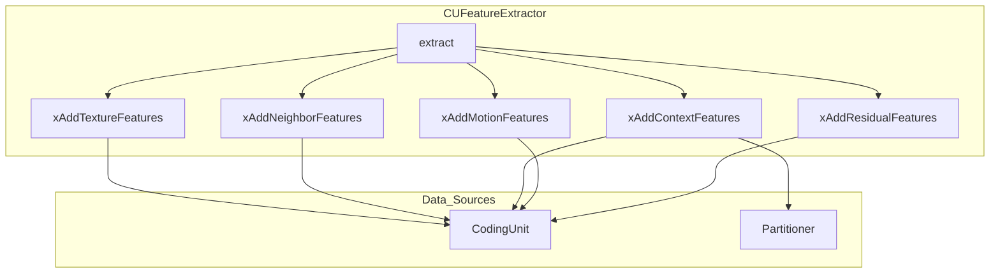

# CUFeatureExtractor — Mansouri 2024 Feature Extraction

## 1. Overview

`CUFeatureExtractor` builds a fixed ~22-element feature vector from the current CU context for inter-picture (P/B slice) split prediction. The feature set follows Mansouri et al. (2024) and covers texture statistics, neighbouring CU information, current CU context, motion information, and residual energy.

The class is stateless — it accumulates features into a pre-allocated vector and returns it.

## 2. Component Specifications

```cpp
#pragma once

#include <vector>

namespace vvenc {

class CodingUnit;
class Partitioner;

class CUFeatureExtractor {
public:
    CUFeatureExtractor();
    virtual ~CUFeatureExtractor();

    /** \brief Extract feature vector from CU context
     *  \param[in]  cu           Current coding unit being evaluated
     *  \param[in]  partitioner  Active partitioner (split context)
     *  \param[out] outFeatures  Feature vector (~22 elements)
     *  \retval 0  Success
     *  \retval -1 Feature extraction failed (invalid CU state)
     */
    int extract(const CodingUnit& cu,
                const Partitioner& partitioner,
                std::vector<double>& outFeatures);

private:
    /** \brief Add texture statistics (variance, gradient, edge strength)
     *  \param[in] cu Current coding unit
     */
    int xAddTextureFeatures(const CodingUnit& cu);

    /** \brief Add neighbouring CU split depths and modes
     *  \param[in] cu Current coding unit
     */
    int xAddNeighborFeatures(const CodingUnit& cu);

    /** \brief Add current CU context (size, depth, QP)
     *  \param[in] cu           Current coding unit
     *  \param[in] partitioner  Active partitioner
     */
    int xAddContextFeatures(const CodingUnit& cu, const Partitioner& partitioner);

    /** \brief Add motion information (MV magnitude, differences, merge cost)
     *  \param[in] cu Current coding unit
     */
    int xAddMotionFeatures(const CodingUnit& cu);

    /** \brief Add residual energy (SAD, coefficient count)
     *  \param[in] cu Current coding unit
     */
    int xAddResidualFeatures(const CodingUnit& cu);

    /** \brief Reset feature vector for new extraction */
    void xReset();

    std::vector<double> m_vFeatures;  ///< Accumulated feature vector
};

}
```

### Feature Vector Layout

| Index | Feature | Category | Source |
|-------|---------|----------|--------|
| 0 | Luma variance | Texture | `xGetLumaVariance(cu)` |
| 1 | Gradient magnitude (Sobel hor + ver) | Texture | `xSobelGradientMagnitude(cu)` |
| 2 | Edge strength (hor/ver ratio) | Texture | `xEdgeStrength(cu)` |
| 3 | DC component | Texture | `xGetDCMean(cu)` |
| 4 | AC energy (variance - DC^2) | Texture | `xGetACEnergy(cu)` |
| 5 | Low-frequency energy ratio | Texture | `xLowFreqEnergyRatio(cu)` |
| 6 | Left CU split depth | Neighbour | `xGetLeftSplitDepth(cu)` |
| 7 | Top CU split depth | Neighbour | `xGetTopSplitDepth(cu)` |
| 8 | Top-left CU split depth | Neighbour | `xGetTopLeftSplitDepth(cu)` |
| 9 | Left CU prediction mode | Neighbour | `xGetLeftPredMode(cu)` |
| 10 | Top CU prediction mode | Neighbour | `xGetTopPredMode(cu)` |
| 11 | Top-left CU prediction mode | Neighbour | `xGetTopLeftPredMode(cu)` |
| 12 | CU log2 size | Context | `log2(cu.lumaSize().width)` |
| 13 | CU depth in QTBT tree | Context | `cu.depth` |
| 14 | Quantization Parameter | Context | `cu.qp` |
| 15 | MV magnitude | Motion | `xGetMvMagnitude(cu)` |
| 16 | MV diff from left CU | Motion | `xGetMvDiff(cu, LEFT)` |
| 17 | MV diff from top CU | Motion | `xGetMvDiff(cu, TOP)` |
| 18 | RD cost of 2Nx2N merge | Motion | `xGetMergeCost(cu)` |
| 19 | Reference index | Motion | `cu.refIdx[0]` |
| 20 | SAD after initial prediction | Residual | `xGetInitialPredSAD(cu)` |
| 21 | Transform coefficient count | Residual | `xGetCoeffCount(cu)` |

Total: 22 features, all normalised to [0,1] using static per-feature max bounds.

## 3. System Architecture



## 4. Detailed Data Flow

```
EncCu::xCompressCU()
  → CUFeatureExtractor::extract(cu, partitioner)
    → xReset() clear internal vector
    → xAddTextureFeatures(cu): luma variance, Sobel gradient, edge strength, DC, AC energy
    → xAddNeighborFeatures(cu): left/top/top-left depths + modes
    → xAddContextFeatures(cu, partitioner): size, depth, QP
    → xAddMotionFeatures(cu): MV magnitude, diffs, merge cost, refIdx
    → xAddResidualFeatures(cu): SAD, coeff count
    → copy m_vFeatures → outFeatures
    → return 0
```

## 5. Visualisation

No D3 animation for this leaf-level component.

## 6. Testing Requirements

See `MLTools.spec.md` §6 for `ML_FEATURE_EXTRACT_*` tests.

Key verifications:
- Feature vector has exactly 22 elements for inter CUs
- All values are in [0.0, 1.0] range (post-normalisation)
- Known inputs produce expected outputs (e.g., flat block → low variance)
- Empty CU or invalid CU → returns error code

## 7. CLI Entry Point

No CLI entry. Instantiated inline by `EncCu` during `xCompressCU()`.
