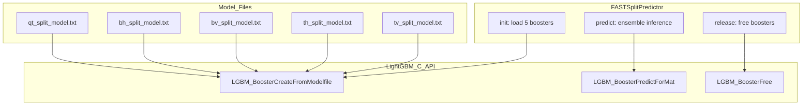

# FASTSplitPredictor — LightGBM Split Decision Inference

## 1. Overview

`FASTSplitPredictor` loads 5 binary LightGBM classifiers (QT, BH, BV, TH, TV) at encoder init and performs inference per-CU to predict the optimal CU split type, bypassing the exhaustive RDO split search when confidence exceeds a threshold.

**All LightGBM C API calls are guarded by `#if VVENC_ENABLE_ML_LIGHTGBM`**.

## 2. Component Specifications

```cpp
#pragma once

#include <string>
#include <vector>

namespace vvenc {

class FASTSplitPredictor {
public:
    enum SplitType {
        NO_SPLIT = 0,
        QT_SPLIT,
        BH_SPLIT,
        BV_SPLIT,
        TH_SPLIT,
        TV_SPLIT
    };

    FASTSplitPredictor();
    virtual ~FASTSplitPredictor();

    /// Singleton access (global instance, used by EncCu)
    static FASTSplitPredictor* getInstance();
    static void setInstance(FASTSplitPredictor* predictor);

    /** \brief Load 5 LightGBM models from model directory
     *  \param[in] modelDir  Path to directory containing model files
     *  \retval 0  Success
     *  \retval -1 Model file not found or load failed
     */
    int init(const std::string& modelDir);

    /** \brief Predict best split for a CU feature vector
     *  \param[in]  features            ~22-element feature vector
     *  \param[in]  confidenceThreshold Minimum confidence to accept ML decision (0.0-1.0)
     *  \param[out] outSplit            Predicted SplitType if confidence >= threshold; NO_SPLIT otherwise
     *  \param[out] outConfidence       Raw max confidence score from model ensemble
     *  \retval 0  Success
     *  \retval -1 Not initialised
     */
    int predict(const std::vector<double>& features,
                double confidenceThreshold,
                SplitType& outSplit,
                double& outConfidence);

    /** \brief Release all model handles
     *  \retval 0  Success
     */
    int release();

    /** \brief Check if predictor is initialised
     *  \retval true  Models loaded and ready
     *  \retval false Not initialised
     */
    bool isInitialized() const;

private:
    /** \brief Load a single booster from file path
     *  \param[in]  path   Full path to .txt model file
     *  \param[out] handle Output LightGBM booster handle (void*)
     *  \retval 0  Success
     *  \retval -1 LGBM_BoosterCreateFromModelfile failed
     */
    int xLoadBooster(const std::string& path, void** handle);

    /** \brief Run inference on a single booster
     *  \param[in]  handle   Loaded LightGBM booster handle (void*)
     *  \param[in]  features Feature vector (1 x nFeatures)
     *  \param[out] result   Predicted score [0.0, 1.0]
     *  \retval 0  Success
     *  \retval -1 LGBM_BoosterPredictForMat failed
     */
    int xPredictOne(void* handle,
                    const std::vector<double>& features,
                    double& result);

    static constexpr int NUM_MODELS = 5;

    void*         m_hBoosters[NUM_MODELS];  ///< Per-split-type booster handles (LightGBM C API, typed void* to avoid header dependency)
    bool          m_bInitialized;           ///< true after successful init()
    std::string   m_cModelDir;              ///< Saved model directory path
};
}
```

## 3. System Architecture



## 4. Detailed Data Flow

```
EncCu → FASTSplitPredictor::predict(features, threshold)
  → for each of 5 boosters:
    → xPredictOne(booster[i], features) → score[i]
  → Find max score and corresponding split type
  → if max_score >= threshold:
      → outSplit = split_type, outConfidence = max_score
      → return 0
    else:
      → outSplit = NO_SPLIT, outConfidence = max_score
      → return 0
```

## 5. Visualisation

No D3 animation for this leaf-level component. See `MLTools.spec.md` for the module-level animation reference.

## 6. Testing Requirements

See `MLTools.spec.md` §6 for the full test matrix (`ML_PREDICTOR_*` tests).

## 7. CLI Entry Point

Not directly exposed. Configured through `vvenc_config` fields:
- `vvenc_config::mlEnable` → `FASTSplitPredictor` is created in `EncLib::initEncoderLib()`
- `vvenc_config::mlConfidenceThreshold` → passed to `predict()` per-CU
- `vvenc_config::mlModelDir` → model directory, passed to `init()`
