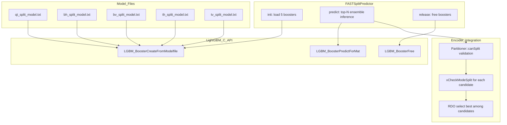

# FASTSplitPredictor — LightGBM Split Decision Inference

## 1. Overview

`FASTSplitPredictor` loads 5 binary LightGBM classifiers (QT, BH, BV, TH, TV) at encoder init and performs inference per-CU to predict the optimal CU split type, bypassing the exhaustive RDO split search when confidence exceeds a threshold.

**All LightGBM C API calls are guarded by `#if VVENC_ENABLE_ML_LIGHTGBM`**.

## 2. Component Specifications

```cpp
#pragma once

#include <string>
#include <vector>

namespace vvenc {

class FASTSplitPredictor {
public:
    enum SplitType {
        NO_SPLIT = 0,
        QT_SPLIT,
        BH_SPLIT,
        BV_SPLIT,
        TH_SPLIT,
        TV_SPLIT
    };

    FASTSplitPredictor();
    virtual ~FASTSplitPredictor();

    /// Singleton access (global instance, used by EncCu)
    static FASTSplitPredictor* getInstance();
    static void setInstance(FASTSplitPredictor* predictor);

    /** \brief Load 5 LightGBM models from model directory
     *  \param[in] modelDir  Path to directory containing model files
     *  \retval 0  Success
     *  \retval -1 Model file not found or load failed
     */
    int init(const std::string& modelDir);

    /** \brief Predict top-N best splits for a CU feature vector (Algorithm 1 from Taabane 2024)
     *  \param[in]  features       ~30-element feature vector
     *  \param[in]  nCandidates    Max candidates to return (top-N, default 3)
     *  \param[in]  thNs           No-split threshold (default 0.25). If max(pred) < thNs,
     *                             bEarlySkip is set true and encoder skips CU entirely.
     *  \param[in]  allowedSplits  Bitmask of canSplit-valid modes for current CU geometry
     *  \param[out] outCandidates  Ranked list of (SplitType, confidence) pairs, size <= nCandidates
     *  \param[out] bEarlySkip    true if max(all scores) < thNs — encoder may encode CU without splitting
     *  \retval 0  Success
     *  \retval -1 Not initialised
     */
    int predict(const std::vector<double>& features,
                int nCandidates,
                double thNs,
                unsigned int allowedSplits,
                std::vector<std::pair<SplitType, double>>& outCandidates,
                bool& bEarlySkip);

    /** \brief Release all model handles
     *  \retval 0  Success
     */
    int release();

    /** \brief Check if predictor is initialised
     *  \retval true  Models loaded and ready
     *  \retval false Not initialised
     */
    bool isInitialized() const;

    /** \brief Map SplitType to PartSplit for encoder mode testing */
    static PartSplit splitTypeToPartSplit(SplitType type);

private:
    /** \brief Load a single booster from file path
     *  \param[in]  path   Full path to .txt model file
     *  \param[out] handle Output LightGBM booster handle (void*)
     *  \retval 0  Success
     *  \retval -1 LGBM_BoosterCreateFromModelfile failed
     */
    int xLoadBooster(const std::string& path, void** handle);

    /** \brief Run inference on a single booster
     *  \param[in]  handle   Loaded LightGBM booster handle (void*)
     *  \param[in]  features Feature vector (1 x nFeatures)
     *  \param[out] result   Predicted score [0.0, 1.0]
     *  \retval 0  Success
     *  \retval -1 LGBM_BoosterPredictForMat failed
     */
    int xPredictOne(void* handle,
                    const std::vector<double>& features,
                    double& result);

    /** \brief Map SplitType enum to model array index */
    static int xSplitToIndex(SplitType type);

    static constexpr int NUM_MODELS = 5;

    void*         m_hBoosters[NUM_MODELS];  ///< Per-split-type booster handles (LightGBM C API, typed void* to avoid header dependency)
    bool          m_bInitialized;           ///< true after successful init()
    std::string   m_cModelDir;              ///< Saved model directory path
};
}
```

## 3. System Architecture



## 4. Detailed Data Flow

### 4.1 Top-N Prediction (Algorithm 1 from Taabane 2024)

```
EncCu → FASTSplitPredictor::predict(features, nCandidates=3, thNs=0.25, allowedSplits)
  → for each booster i where split i is in allowedSplits:
      xPredictOne(booster[i], features) → score[i]
  → Sort (split, score) pairs descending by score
  → if max(score) < thNs:
      bEarlySkip = true   → encoder skips full RDO, encodes CU without splitting
      return 0
  → else:
      outCandidates = top-N entries from sorted list
      bEarlySkip = false
      return 0
```

### 4.2 Encoder Integration (in EncCu)

```
EncCu::xCompressCU():
  → CUFeatureExtractor::extract(cu, partitioner) → features
  → FASTSplitPredictor::predict(features, 3, 0.25, allowedSplitMask)
  → if bEarlySkip:
      → setNoSplit flag, encode CU without split evaluation
      → return
  → for each (splitType, confidence) in outCandidates:
      → partSplit = splitTypeToPartSplit(splitType)
      → if partitioner.canSplit(partSplit, *tempCS):
          → xCheckModeSplit(tempCS, bestCS, partitioner, mlMode)
  → if bestCS->cost < MAX_DOUBLE:
      → return (skip un-tested split modes)
  → else fall through to full RDO search
```

## 5. Visualisation

No D3 animation for this leaf-level component. See `MLTools.spec.md` for the module-level animation reference.

## 6. Testing Requirements

See `MLTools.spec.md` §6 for the full test matrix (`ML_PREDICTOR_*` tests).

Key additions for the top-N algorithm:
- `ML_PREDICTOR_TOP3` — `predict()` returns exactly 3 candidates when all 5 are valid and confident
- `ML_PREDICTOR_EARLY_SKIP` — low-confidence scores (< thNs) trigger `bEarlySkip = true`
- `ML_PREDICTOR_ALLOWED_SPLITS` — only scores for `allowedSplits`-masked models are computed
- `ML_PREDICTOR_CANSPLIT_FILTER` — `canSplit`-invalid mode is never returned even if confident
- `ML_PREDICTOR_SPLITTYPE_MAP` — `splitTypeToPartSplit` round-trip matches expected PartSplit values

## 7. CLI Entry Point

Not directly exposed. Configured through `vvenc_config` fields:
- `vvenc_config::mlEnable` → `FASTSplitPredictor` is created in `EncLib::initEncoderLib()`
- `vvenc_config::mlConfidenceThreshold` → **deprecated**, replaced by `mlThNs` (no-skip threshold)
- `vvenc_config::mlThNs` → no-skip threshold, passed to `predict()` as `thNs` (default 0.25)
- `vvenc_config::mlTopK` → number of candidate splits to evaluate (default 3)
- `vvenc_config::mlModelDir` → model directory, passed to `init()`
