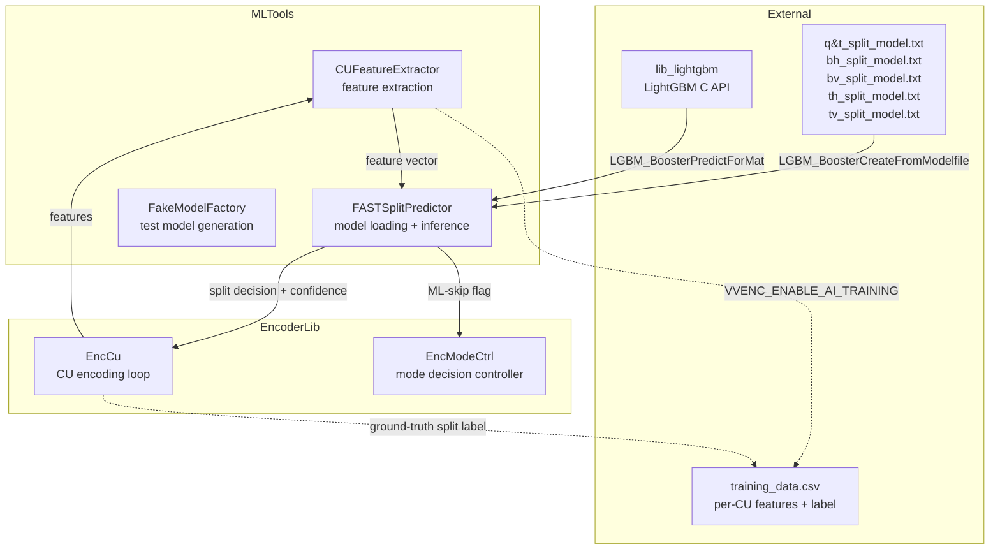
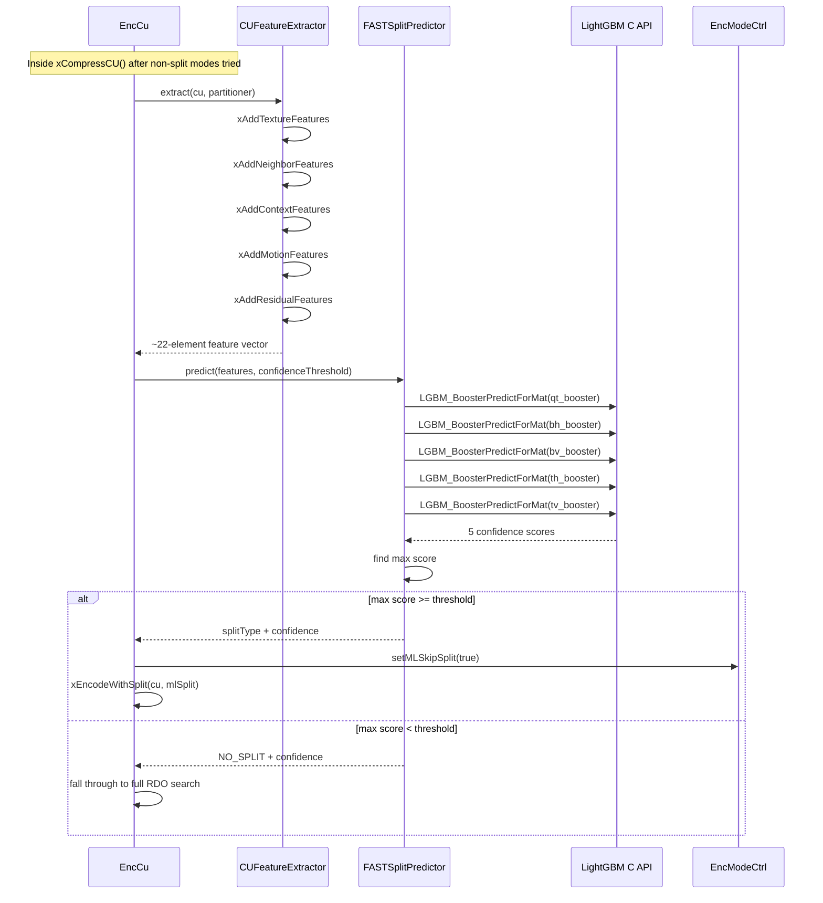
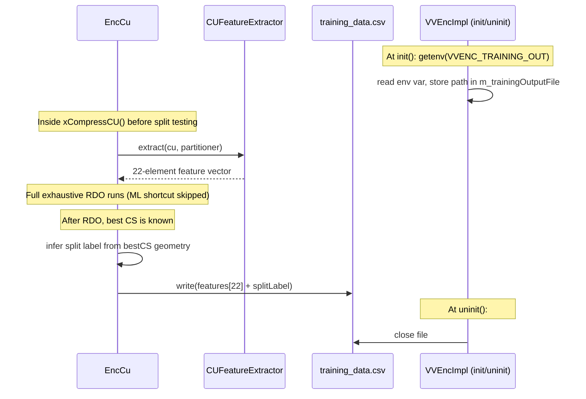

# MLTools — Machine Learning Inference & Training Data Generation Module

## 1. Overview

MLTools provides the LightGBM-based CU split prediction infrastructure for the deepenc AI-accelerated encoder. It implements dual-path CU partitioning: AI inference for fast split decisions with RDO fallback when confidence is low.

**Conditional compilation**: Inference paths are gated by `#if VVENC_ENABLE_ML_LIGHTGBM`. Training data generation paths are gated by `#if VVENC_ENABLE_AI_TRAINING` (requires `VVENC_ENABLE_ML_LIGHTGBM` to share `CUFeatureExtractor`). When both are disabled, the module compiles to empty stubs with zero codegen impact on the encoder.

**Dependencies**: `LightGBM::LightGBM` (C API: `LightGBM/c_api.h`) required for inference only. `CommonLib` (CodingUnit, Partitioner data types) required for both inference and training.

**Lifecycle (inference)**: Models loaded once at encoder init (`FASTSplitPredictor::init()` → modelDir), invoked per-CU during `xCompressCU()` in `EncCu`, released at encoder shutdown.

**Lifecycle (training data)**: Activated by `VVENC_TRAINING_OUT` env var at encoder init. One CSV row is written per CU during `xCompressCU()` after exhaustive RDO, recording 22 features + ground-truth split label. The CSV is flushed per-encode and closed at encoder shutdown.

## 2. Component Specifications

| # | Spec File | Role |
|---|-----------|------|
| 1 | `FASTSplitPredictor.spec.md` | Core inference — loads 5 binary LightGBM models, predicts split type, enforces confidence threshold |
| 2 | `CUFeatureExtractor.spec.md` | Feature extraction — builds ~22-element Mansouri 2024 feature vector from CU context |
| 3 | `FakeModelFactory.spec.md` | Test utility — generates synthetic .txt model files for unit testing without training |

### Module Export Rules

- `FASTSplitPredictor` is the only class intended for external consumption (by `EncLib` → `EncCu`).
- `CUFeatureExtractor` and `FakeModelFactory` are internal to the module, accessed through `FASTSplitPredictor`'s public interface.

## 3. System Architecture



## 4. Detailed Data Flow

### 4.1 Inference Path (VVENC_ENABLE_ML_LIGHTGBM)



### 4.2 Training Data Path (VVENC_ENABLE_AI_TRAINING)



## 5. Visualisation

Covered by the root `technical-specification.md` D3 animation, which includes an MLTools sub-panel showing model load state, confidence threshold, per-CU predictions, and split acceptance rate.

## 6. Testing Requirements

### Unit Tests (new file: `test/vvenc_mltest/vvenc_mltest.cpp`)

| Test ID | Scope | What to Verify |
|---------|-------|---------------|
| `ML_PREDICTOR_LOAD` | FASTSplitPredictor | `init()` with valid model dir returns 0 |
| `ML_PREDICTOR_NO_MODELS` | FASTSplitPredictor | `init()` with missing dir returns non-zero error |
| `ML_PREDICTOR_ABOVE_THRESH` | FASTSplitPredictor | `predict()` with confident features returns split type |
| `ML_PREDICTOR_BELOW_THRESH` | FASTSplitPredictor | `predict()` with low confidence returns NO_SPLIT |
| `ML_PREDICTOR_DOUBLE_INIT` | FASTSplitPredictor | Double `init()` returns error |
| `ML_PREDICTOR_PREDICT_BEFORE_INIT` | FASTSplitPredictor | `predict()` before `init()` returns error |
| `ML_PREDICTOR_RELEASE` | FASTSplitPredictor | `release()` frees all boosters, subsequent predict fails |
| `ML_FEATURE_EXTRACT_SIZE` | CUFeatureExtractor | `extract()` produces vector of expected size (~22) |
| `ML_FEATURE_EXTRACT_VALUES` | CUFeatureExtractor | Feature values within expected ranges given known inputs |
| `ML_DUMMY_MODEL_WRITE` | FakeModelFactory | `writeDummyModel()` produces valid .txt file |
| `ML_DUMMY_MODEL_LOAD` | FASTSplitPredictor | Dummy model loads and predicts constant 0.5 |

### Calling-Order Validation

| Test | What to Verify |
|------|---------------|
| `init()` → `predict()` → `release()` | Valid lifecycle completes cleanly |
| `predict()` before `init()` | Returns error code |
| `release()` after `release()` | No crash, returns error |
| `init()` after `release()` | Can re-initialise |

### AI Training Data Tests (VVENC_ENABLE_AI_TRAINING)

| Test ID | What to Verify |
|---------|---------------|
| `TRAINING_CSV_HEADER` | CSV produced with `VVENC_TRAINING_OUT` has correct header columns |
| `TRAINING_CSV_ROWS` | CSV has expected number of rows (one per CU decision point) |
| `TRAINING_CSV_FEATURE_COUNT` | Each row has 22 feature values + split label |
| `TRAINING_CSV_LABELS` | Split labels are valid: NO_SPLIT, QT, BH, BV, TH, TV |
| `TRAINING_NO_ENV` | Without `VVENC_TRAINING_OUT`, no CSV is produced and no overhead incurred |

### Integration Tests

- Full encode with ML enabled (dummy models): encode 16 frames without crash
- Full encode with ML enabled and `--ml-confidence 1.0`: behaves identically to RDO-only (all predictions rejected)
- Encode with `VVENC_ENABLE_ML_LIGHTGBM=OFF`: binary identical to unmodified VVenC
- Full encode with `VVENC_TRAINING_OUT=/tmp/train.csv`: produces valid CSV, no crash

## 7. CLI Entry Point

No direct CLI. MLTools is loaded by `EncLib` → `EncCu` at encoder initialisation. Configuration is provided through the `vvenc_config` struct:

### Inference Configuration
- `mlEnable` (int): 0=off, 1=on
- `mlConfidenceThreshold` (double): default 0.80
- `mlModelDir` (const char*): path to directory containing split model files

Set via `vvenc_set_param(cfg, "ml-enable", "1")` or `vvencapp --ml-model-dir ./models --ml-confidence 0.80`.

### Training Data Configuration
- `trainingOutputFile` (char[]): path for CSV output, set automatically by the `deepenc-harness` CLI from the `VVENC_TRAINING_OUT` environment variable

Activated by running with:
```bash
VVENC_TRAINING_OUT=training_data.csv ./vvencapp [encode options]
```

The `deepenc-harness ml data-generate` command sets this env var automatically per clip × QP combination.

### Feedback Data Configuration
- `feedbackOutputFile` (char[]): path for misprediction CSV output, set automatically by the `deepenc-harness` CLI from the `VVENC_ML_FEEDBACK` environment variable (gated by `VVENC_ENABLE_ML_LIGHTGBM`)

Activated by running with:
```bash
VVENC_ML_FEEDBACK=ml_feedback.csv ./vvencapp [encode options] --ml-model-dir ./models --ml-confidence 0.80
```

During encoding, for each CU where the ML-predicted split (confidence >= threshold) differs from the RDO-chosen split, one row is written to the feedback CSV. The `deepenc-harness ml feedback` command sets this env var automatically, then appends mispredictions to the training set and retrains.
