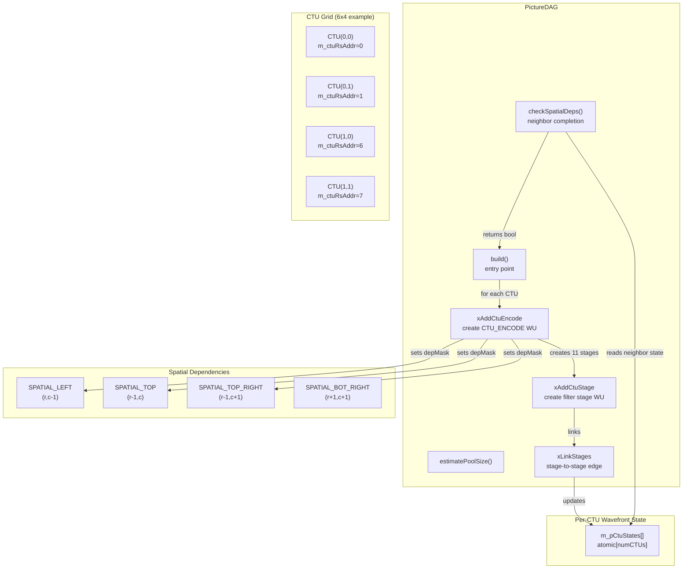
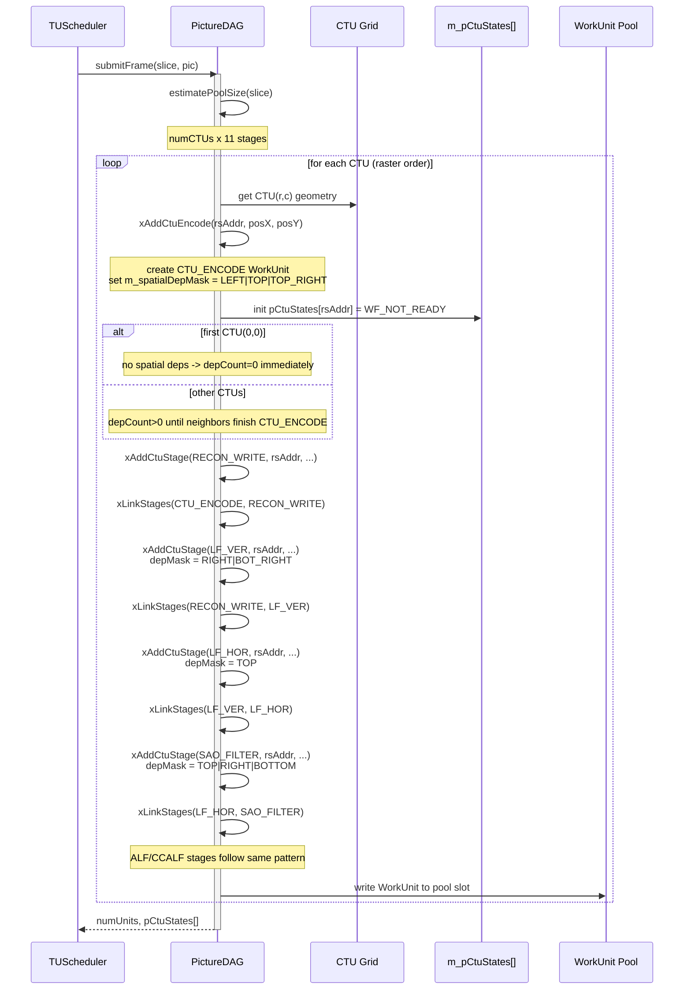

# PictureDAG — Wavefront CTU Dependency Graph Builder

## 1. Overview

`PictureDAG` builds the cross-CTU wavefront DAG for one picture or slice. It creates CTU-level WorkUnits (CTU_ENCODE, RECON_WRITE, LF_VER, LF_HOR, SAO_FILTER, ALF_STATS, ALF_DERIVE, ALF_RECON, CCALF_STATS, CCALF_DERIVE, CCALF_RECON) for every CTU in the slice, then links them with spatial dependency edges matching the existing `EncSlice::xProcessCtuTask` state machine.

The wavefront pattern: CTU(r,c).CTU_ENCODE starts only after CTU(r-1,c).RECON_WRITE and CTU(r,c-1).RECON_WRITE and CTU(r-1,c+1).RECON_WRITE are complete. This matches x265's wavefront and VVenC's current WPP.

**Dependencies**: `WorkUnit.h`, `Slice.h`, `Picture.h`, `Unit.h`. No TU-level headers.

**Lifecycle**: `build()` is called once per frame from `TUScheduler::submitFrame()`. The resulting WorkUnits are consumed by the scheduler's wavefront dispatch loop.

## 2. Component Specifications

### 2.1 Enum: `CtuWavefrontState`

```cpp
#pragma once

#include <cstdint>
#include <atomic>

namespace vvenc {

/// Per-CTU wavefront progress state (one entry per CTU in the picture).
/// Mirrors the existing EncSlice::TaskType enum but re-uses the Stage values.
/// Initialized to STAGE_MINUS_ONE (not yet ready).
enum CtuWfState : int8_t
{
    WF_NOT_READY    = -1,    ///< Not yet ready for CTU_ENCODE (spatial deps unmet)
    WF_CTU_ENCODE   = 12,    ///< == Stage::CTU_ENCODE
    WF_RECON_WRITE  = 13,    ///< == Stage::RECON_WRITE
    WF_LF_VER       = 14,    ///< == Stage::LF_VER
    WF_LF_HOR       = 15,    ///< == Stage::LF_HOR
    WF_SAO_FILTER   = 16,    ///< == Stage::SAO_FILTER
    WF_ALF_STATS    = 17,    ///< == Stage::ALF_STATS
    WF_ALF_DERIVE   = 18,    ///< == Stage::ALF_DERIVE
    WF_ALF_RECON    = 19,    ///< == Stage::ALF_RECON
    WF_CCALF_STATS  = 20,    ///< == Stage::CCALF_STATS
    WF_CCALF_DERIVE = 21,    ///< == Stage::CCALF_DERIVE
    WF_CCALF_RECON  = 22,    ///< == Stage::CCALF_RECON
    WF_DONE         = 23     ///< All stages complete for this CTU
};

}
```

### 2.2 Class: `PictureDAG`

```cpp
namespace vvenc {

class Slice;
class Picture;
struct WorkUnit;

class PictureDAG
{
public:
    /** \brief Build the wavefront CTU DAG for a slice.
     *  \param[in]     slice    the slice to process
     *  \param[in]     pic      the picture buffer
     *  \param[out]    pPool    caller-provided WorkUnit array
     *  \param[in]     poolSize maximum number of units
     *  \param[out]    pNumUnits number of units created
     *  \param[out]    pCtuStates per-CTU wavefront state array
     *  \retval 0 on success
     *  \retval -1 if poolSize insufficient
     *  \retval -2 if slice has no CTUs
     */
    static int build(Slice& slice, Picture* pic,
                     WorkUnit* pPool, int poolSize, int& pNumUnits,
                     std::atomic<int8_t>* pCtuStates);

    /** \brief Estimate the number of CTU-level WorkUnits for a slice.
     *  \param[in] slice the slice to process
     *  \return estimated count (numCTUs * pipelineStages)
     */
    static int estimatePoolSize(const Slice& slice);

    /** \brief Check if a CTU's spatial dependencies are met.
     *  \param[in] ctuRsAddr CTU raster-scan address
     *  \param[in] ctuPosX   CTU grid column
     *  \param[in] ctuPosY   CTU grid row
     *  \param[in] depMask   spatial dependency bitmask
     *  \param[in] requiredStage the stage the neighbor must have reached
     *  \param[in] pCtuStates per-CTU wavefront state array
     *  \param[in] numCtuCols number of CTU columns in the picture
     *  \return true if all spatial deps are satisfied
     */
    static bool checkSpatialDeps(uint32_t ctuRsAddr,
                                  uint16_t ctuPosX, uint16_t ctuPosY,
                                  uint8_t depMask, int8_t requiredStage,
                                  const std::atomic<int8_t>* pCtuStates,
                                  int numCtuCols);

    virtual ~PictureDAG();

private:
    /// Add CTU_ENCODE WorkUnit for one CTU, linking spatial deps
    static int xAddCtuEncode(uint32_t rsAddr, uint16_t posX, uint16_t posY,
                             WorkUnit*& pNext, int& numUnits,
                             std::atomic<int8_t>* pCtuStates,
                             int numCtuCols, int numCtuRows);

    /// Add post-encode stage WorkUnit (LF_VER, SAO, ALF, etc.)
    static int xAddCtuStage(Stage stage, uint32_t rsAddr,
                            uint16_t posX, uint16_t posY,
                            uint8_t depMask, int8_t requiredStage,
                            WorkUnit* pPrev, WorkUnit*& pNext,
                            int& numUnits,
                            std::atomic<int8_t>* pCtuStates,
                            int numCtuCols);

    /// Link two consecutive CTU stages
    static void xLinkStages(WorkUnit* pPrev, WorkUnit* pNext);

    /// Determine the required neighbor stage for a given CTU stage
    static int8_t xRequiredNeighborStage(Stage stage);
};

}
```

## 3. System Architecture



## 4. Detailed Data Flow



## 5. Visualization

### 5.1 Animation Concept

A CTU-grid animation showing the wavefront anti-diagonal sweeping through a 6x4 picture. Each CTU cell transitions gray→yellow→green as its CTU_ENCODE stage progresses. The wavefront arrow shows the anti-diagonal direction. Below the grid, a global progress bar tracks frame completion.

**Controls**: Play/Pause, Replay.

### 5.2 Keyframes

| # | Label | State |
|---|-------|-------|
| 0 | ctu-grid | 24 CTUs visible (6x4 grid), all gray. Per-CTU state labels show WF_NOT_READY. |
| 1 | wavefront-start | CTU(0,0) turns yellow (CTU_ENCODE running). anti-diagonal arrow at top-left. |
| 2 | wavefront-advance | 3 CTUs green (complete), 3 CTUs yellow (running) forming anti-diagonal. Arrow at diagonal index 2. |
| 3 | wavefront-mid | 12 CTUs green, 4 yellow at mid-grid. Arrow at diagonal 5. Progress bar ~50%. |
| 4 | wavefront-near-end | 20 CTUs green, 2 yellow. Arrow approaching bottom-right. |
| 5 | frame-complete | All 24 CTUs green. Frame complete. Progress bar 100%. |

### 5.3 Animation Source

```html
<!DOCTYPE html>
<html>
<head>
<meta charset="utf-8">
<title>PictureDAG — Wavefront CTU Dispatch</title>
<script src="https://d3js.org/d3.v7.min.js"></script>
<style>
body { font-family: 'Segoe UI', sans-serif; background: #1a1a2e; color: #eee; margin: 0; padding: 20px; display: flex; flex-direction: column; align-items: center; }
#container { width: 720px; text-align: center; }
#controls { display: flex; gap: 12px; justify-content: center; margin: 12px 0; align-items: center; }
#controls button { padding: 8px 18px; border: none; border-radius: 6px; cursor: pointer; font-size: 14px; background: #4a90d9; color: white; transition: 0.2s; }
#controls button:hover { background: #357abd; }
#controls button.active { background: #e6a23c; }
#grid-svg { border: 1px solid #2a2a4e; border-radius: 8px; background: #16213e; }
.ctu-cell { stroke: #2a2a4e; stroke-width: 2; rx: 3; ry: 3; transition: fill 0.4s; }
.ctu-label { font-size: 10px; fill: #ccc; text-anchor: middle; pointer-events: none; }
.grid-label { font-size: 11px; fill: #666; text-anchor: middle; }
#progress-bar { width: 100%; height: 16px; background: #16213e; border-radius: 8px; margin: 8px 0; overflow: hidden; }
#progress-fill { height: 100%; width: 0%; background: linear-gradient(90deg, #4a90d9, #67c23a); border-radius: 8px; transition: width 0.4s; }
#stats { display: flex; gap: 16px; justify-content: center; font-size: 13px; margin: 6px 0; }
#stats span { background: #16213e; padding: 4px 12px; border-radius: 4px; }
#wave-arrow { transition: all 0.4s; }
.kf-info { font-size: 12px; color: #aaa; margin-left: 12px; }
#legend { display: flex; gap: 16px; margin: 6px 0; font-size: 12px; justify-content: center; }
.legend-item { display: flex; align-items: center; gap: 4px; }
.legend-swatch { width: 12px; height: 12px; border-radius: 2px; display: inline-block; }
</style>
</head>
<body>
<div id="container">
  <h2 style="margin:0 0 4px 0;">PictureDAG: Wavefront CTU Dispatch</h2>
  <div id="legend">
    <div class="legend-item"><span class="legend-swatch" style="background:#3a3a5e;"></span> Not Ready</div>
    <div class="legend-item"><span class="legend-swatch" style="background:#e6a23c;"></span> Encoding</div>
    <div class="legend-item"><span class="legend-swatch" style="background:#67c23a;"></span> Complete</div>
    <div class="legend-item"><span style="color:#4a90d9;">↘</span> Wavefront</div>
  </div>
  <svg id="grid-svg" width="660" height="440"></svg>
  <div id="progress-bar"><div id="progress-fill"></div></div>
  <div id="stats">
    <span>CTUs Complete: <span id="comp-count">0</span>/24</span>
    <span>Running: <span id="run-count">0</span></span>
    <span>Wavefront Diag: <span id="diag-idx">0</span></span>
  </div>
  <div id="controls">
    <button id="play-btn" data-testid="play-pause">Pause</button>
    <button id="replay-btn">Replay</button>
    <span class="kf-info">Keyframe <span id="kf-counter">0</span>/<span id="kf-total">5</span></span>
  </div>
</div>
<script>
const COLS = 6, ROWS = 4;
const TOTAL_DURATION_MS = 18000;
const keyframes = [
  { time: 0,    label: "ctu-grid" },
  { time: 3000, label: "wavefront-start" },
  { time: 6000, label: "wavefront-advance" },
  { time: 10000,label: "wavefront-mid" },
  { time: 14000,label: "wavefront-near-end" },
  { time: 17000,label: "frame-complete" }
];

window.ANIMATION_DURATION_MS = TOTAL_DURATION_MS;
window.ANIMATION_KEYFRAMES = keyframes.map((k,i) => ({ ...k, idx: i }));
window.ANIMATION_VERIFICATION = [
  { label: "ctu-grid", completed: 0, running: 0, diagIdx: -1, progressPct: 0 },
  { label: "wavefront-start", completed: 0, running: 1, diagIdx: 0, progressPct: 4 },
  { label: "wavefront-advance", completed: 3, running: 3, diagIdx: 2, progressPct: 25 },
  { label: "wavefront-mid", completed: 12, running: 4, diagIdx: 5, progressPct: 50 },
  { label: "wavefront-near-end", completed: 20, running: 2, diagIdx: 7, progressPct: 87 },
  { label: "frame-complete", completed: 24, running: 0, diagIdx: 8, progressPct: 100 }
];

const cellW = 660 / COLS;
const cellH = 440 / ROWS;

// Build CTU grid
let ctuState = [];
for (let r = 0; r < ROWS; r++)
  for (let c = 0; c < COLS; c++)
    ctuState.push({ r, c, state: "pending", idx: r * COLS + c, diag: r + c });

const svg = d3.select("#grid-svg");
const g = svg.append("g");

// Grid cells
ctuState.forEach(ctu => {
  g.append("rect")
    .attr("class", "ctu-cell")
    .attr("x", ctu.c * cellW + 4)
    .attr("y", ctu.r * cellH + 4)
    .attr("width", cellW - 8)
    .attr("height", cellH - 8)
    .attr("fill", "#3a3a5e")
    .attr("data-ctu", ctu.idx)
    .attr("data-row", ctu.r)
    .attr("data-col", ctu.c);

  g.append("text")
    .attr("class", "ctu-label")
    .attr("x", ctu.c * cellW + cellW/2)
    .attr("y", ctu.r * cellH + cellH/2 + 4)
    .text(`(${ctu.c},${ctu.r})`);
});

// Row and col labels
for (let c = 0; c < COLS; c++)
  svg.append("text").attr("class", "grid-label").attr("x", c * cellW + cellW/2).attr("y", 438).text("col " + c);
for (let r = 0; r < ROWS; r++)
  svg.append("text").attr("class", "grid-label").attr("x", 8).attr("y", r * cellH + cellH/2 + 4).text("row " + r);

// Wavefront arrow indicator
const arrow = svg.append("text")
  .attr("id", "wave-arrow")
  .attr("font-size", "28px")
  .attr("fill", "#4a90d9")
  .attr("opacity", 0)
  .text("↘");

// Anti-diagonal line
const diagLine = svg.append("line")
  .attr("stroke", "#4a90d9")
  .attr("stroke-width", 2)
  .attr("stroke-dasharray", "4,4")
  .attr("opacity", 0);

let currentState = { completed: 0, running: 0, diagIdx: -1, currentKf: 0, elapsed: 0, animRunning: true };

function updateGrid() {
  const comp = ctuState.filter(c => c.state === "complete").length;
  const run = ctuState.filter(c => c.state === "running").length;
  currentState.completed = comp;
  currentState.running = run;

  d3.selectAll(".ctu-cell").each(function() {
    const el = d3.select(this);
    const idx = parseInt(el.attr("data-ctu"));
    const c = ctuState.find(c => c.idx === idx);
    if (!c) return;
    el.transition().duration(300).attr("fill",
      c.state === "complete" ? "#67c23a" :
      c.state === "running" ? "#e6a23c" : "#3a3a5e");
  });

  const pct = (comp / 24) * 100;
  d3.select("#progress-fill").style("width", pct + "%");
  d3.select("#comp-count").text(comp);
  d3.select("#run-count").text(run);
  d3.select("#diag-idx").text(currentState.diagIdx);
  d3.select("#kf-counter").text(currentState.currentKf);
  d3.select("#kf-total").text(keyframes.length - 1);
}

function setDiag(diag) {
  currentState.diagIdx = diag;
  // Highlight the anti-diagonal
  const diagCtus = ctuState.filter(c => c.diag === diag && c.state === "running");
  if (diagCtus.length > 0) {
    const avgX = d3.mean(diagCtus, d => d.c * cellW + cellW/2);
    const avgY = d3.mean(diagCtus, d => d.r * cellH + cellH/2);
    arrow.attr("x", avgX + 12).attr("y", avgY - 12).attr("opacity", 1);
  } else {
    arrow.attr("opacity", 0);
  }
}

function setKf(kfIdx) {
  currentState.currentKf = kfIdx;
  ctuState.forEach(c => c.state = "pending");

  switch(kfIdx) {
    case 0: // ctu-grid
      currentState.diagIdx = -1;
      arrow.attr("opacity", 0);
      diagLine.attr("opacity", 0);
      break;
    case 1: // wavefront-start: CTU(0,0) running
      ctuState[0].state = "running";
      setDiag(0);
      diagLine.attr("opacity", 0.4)
        .attr("x1", 0).attr("y1", 10)
        .attr("x2", 120).attr("y2", 0);
      break;
    case 2: // wavefront-advance: 3 complete, 3 running on diag 2
      ctuState.filter(c => c.diag <= 1).forEach(c => c.state = "complete");
      ctuState.filter(c => c.diag === 2).forEach(c => c.state = "running");
      setDiag(2);
      diagLine.attr("opacity", 0.4)
        .attr("x1", 0).attr("y1", 140)
        .attr("x2", 380).attr("y2", 60);
      break;
    case 3: // wavefront-mid: 12 complete, 4 running on diag 5
      ctuState.filter(c => c.diag <= 4).forEach(c => c.state = "complete");
      ctuState.filter(c => c.diag === 5).forEach(c => c.state = "running");
      setDiag(5);
      diagLine.attr("opacity", 0.4)
        .attr("x1", 60).attr("y1", 300)
        .attr("x2", 600).attr("y2", 160);
      break;
    case 4: // wavefront-near-end: 20 complete, 2 running on diag 7
      ctuState.filter(c => c.diag <= 6).forEach(c => c.state = "complete");
      ctuState.filter(c => c.diag === 7).forEach(c => c.state = "running");
      setDiag(7);
      diagLine.attr("opacity", 0.4)
        .attr("x1", 220).attr("y1", 390)
        .attr("x2", 650).attr("y2", 300);
      break;
    case 5: // frame-complete
      ctuState.forEach(c => c.state = "complete");
      currentState.diagIdx = 8;
      arrow.attr("opacity", 0);
      diagLine.attr("opacity", 0);
      break;
  }
  updateGrid();
}

window.resetAnimation = function() {
  currentState.animRunning = false;
  currentState.elapsed = 0;
  setKf(0);
  d3.select("#play-btn").text("Play");
};

window.jumpToKeyframe = function(idx) {
  if (idx < 0 || idx >= keyframes.length) return;
  currentState.animRunning = false;
  currentState.elapsed = keyframes[idx].time;
  setKf(idx);
  d3.select("#play-btn").text("Play");
};

window.getAnimationState = function() {
  return {
    completed: currentState.completed,
    running: currentState.running,
    diagIdx: currentState.diagIdx,
    progressPct: Math.round((currentState.completed / 24) * 100),
    currentKeyframeIdx: currentState.currentKf,
    currentKeyframeLabel: keyframes[currentState.currentKf]?.label || ""
  };
};

function advanceFrame() {
  if (!currentState.animRunning) return;
  currentState.elapsed += 100;
  if (currentState.elapsed > TOTAL_DURATION_MS) {
    currentState.animRunning = false;
    d3.select("#play-btn").text("Play");
    return;
  }
  let kfIdx = 0;
  for (let i = keyframes.length - 1; i >= 0; i--) {
    if (currentState.elapsed >= keyframes[i].time) { kfIdx = i; break; }
  }
  if (kfIdx !== currentState.currentKf) setKf(kfIdx);
}

setInterval(advanceFrame, 100);

d3.select("#play-btn").on("click", function() {
  if (currentState.animRunning) {
    currentState.animRunning = false;
    d3.select(this).text("Play");
  } else {
    if (currentState.elapsed >= TOTAL_DURATION_MS) { currentState.elapsed = 0; setKf(0); }
    currentState.animRunning = true;
    d3.select(this).text("Pause");
  }
});

d3.select("#replay-btn").on("click", function() {
  window.resetAnimation();
  currentState.animRunning = true;
  d3.select("#play-btn").text("Pause");
});

setKf(0);
</script>
</body>
</html>
```

### Self-test

If the wavefront ever skipped a spatial dependency (e.g., CTU(1,1) turned yellow before CTU(0,1) completed), the diagonal would show an isolated cell away from the wavefront line — immediately visible as a disconnected yellow cell surrounded by gray.

## 6. Testing Requirements

### Unit Tests

| Test | What to Verify |
|------|----------------|
| `build empty slice` | Returns -2 |
| `build 1 CTU` | 11 WorkUnits created (one per pipeline stage). CTU(0,0).CTU_ENCODE has depCount=0. |
| `build 2x2 grid` | 44 WorkUnits. CTU(0,0).CTU_ENCODE depCount=0. CTU(1,1).CTU_ENCODE has spatial deps to LEFT, TOP, TOP_RIGHT. |
| `spatial deps 0,0` | checkSpatialDeps for CTU(0,0) returns true regardless of neighbor state |
| `spatial deps 1,1` | Returns false until CTU(0,1), CTU(1,0), CTU(0,2) reach RECON_WRITE |
| `spatial deps tile edge` | CTU at tile boundary: only checks within-tile neighbors |
| `pCtuStates init` | All entries start at -1 (WF_NOT_READY) |
| `stage count` | Each CTU gets exactly 11 WorkUnits (CTU_ENCODE through CCALF_RECON) |
| `estimatePoolSize` | Returns numCTUs * 11 |
