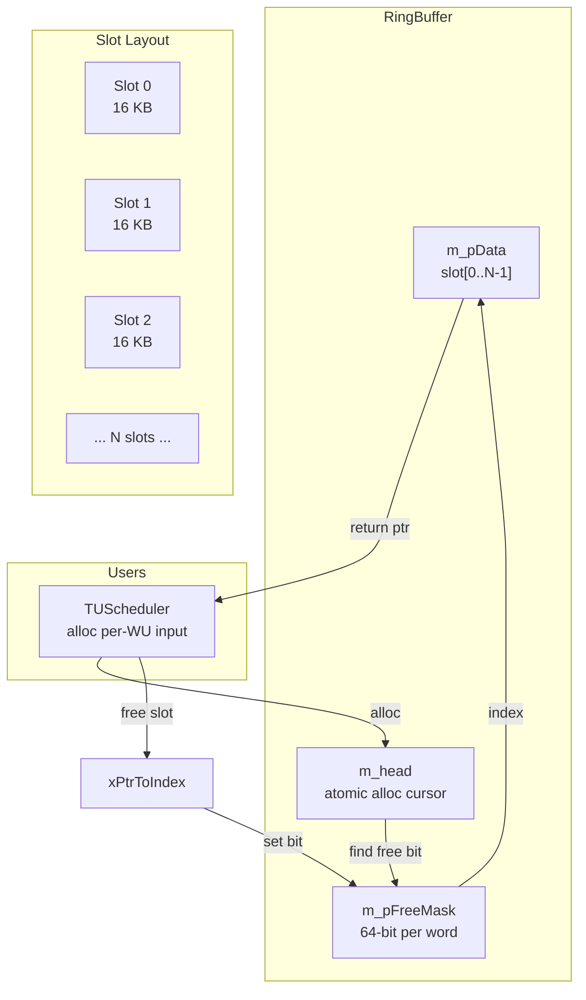
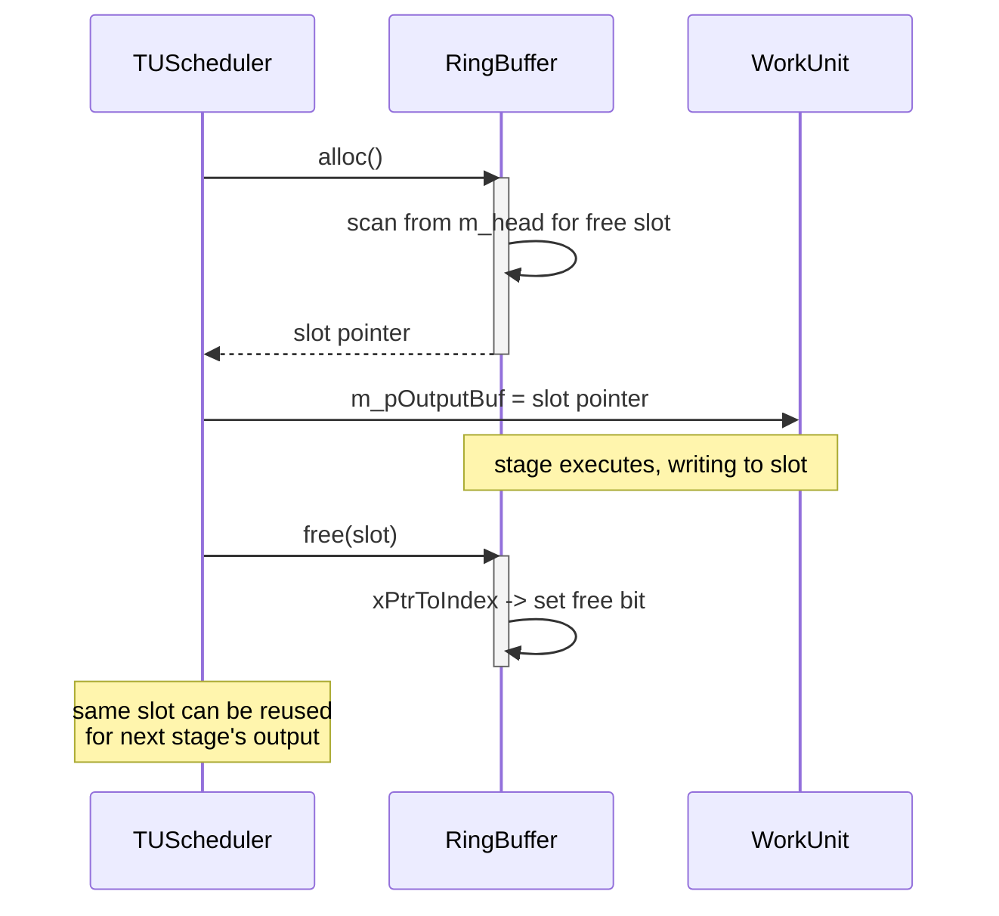

# RingBuffer — Intermediate Buffer Pool

## 1. Overview

`RingBuffer` provides a fixed-size slot-based memory pool for storing intermediate pipeline data between stages. Each slot is sized to the maximum TU buffer size (max TCoeff × 4096 = 16 KB). The buffer is initialized once and recycled across mode trials.

**Dependencies**: `std::atomic`, `<cstdint>`. No encoder-specific headers.

**Lifecycle**: Created in `TUScheduler::init()`. `alloc()` returns a slot pointer or blocks if the pool is exhausted (should not happen with correct window sizing). `free()` returns the slot to the pool. `destroy()` frees the underlying memory.

## 2. Component Specifications

### 2.1 Class: `RingBuffer`

```cpp
#pragma once

#include <atomic>
#include <cstdint>

namespace vvenc {

class RingBuffer
{
public:
    /** \brief Initialize the ring buffer.
     *  \param[in] slotSize  size of each slot in bytes
     *  \param[in] numSlots  number of slots in the pool
     *  \retval 0 on success
     *  \retval -1 if slotSize < 1 or numSlots < 1
     *  \retval -2 if memory allocation fails
     */
    int init(int slotSize, int numSlots);

    /** \brief Destroy the ring buffer and free memory.
     *  \retval 0 on success
     */
    int destroy();

    /** \brief Claim the next available slot.
     *  \return pointer to the slot buffer, or nullptr if pool exhausted
     */
    void* alloc();

    /** \brief Return a slot to the pool.
     *  \param[in] pSlot pointer previously returned by alloc()
     */
    int free(void* pSlot);

    /** \brief Get the number of free slots.
     *  \return current free slot count
     */
    int getFreeCount() const;

    /** \brief Get the total capacity.
     *  \return total number of slots
     */
    int getCapacity() const;

    virtual ~RingBuffer();

private:
    /// Backing memory for all slots
    uint8_t* m_pData   = nullptr;

    /// Size of each slot in bytes
    int m_slotSize     = 0;

    /// Total number of slots
    int m_numSlots     = 0;

    /// Bitmask of free slots (1 = free, 0 = allocated)
    uint64_t* m_pFreeMask = nullptr;

    /// Number of 64-bit words in the free mask
    int m_maskWords    = 0;

    /// Current head index for round-robin allocation
    std::atomic<int> m_head{ 0 };

    /// Compute slot index from pointer
    int xPtrToIndex(void* pSlot) const;

    /// Compute pointer from slot index
    void* xIndexToPtr(int idx) const;
};

}
```

## 3. System Architecture



## 4. Detailed Data Flow



## 5. Visualization

No D3 animation — an alloc/free cycle has insufficient state to justify verification.

## 6. Testing Requirements

### Unit Tests

| Test | What to Verify |
|------|----------------|
| `init zero params` | Returns -1 for slotSize=0 or numSlots=0 |
| `init alloc fail` | Returns -2 when allocation fails (simulate OOM) |
| `alloc single` | Returns non-null, pointer is within data range |
| `alloc all` | N allocs exhaust pool, each unique non-overlapping |
| `alloc after exhaust` | Returns nullptr |
| `free single` | After alloc+free, alloc returns same pointer |
| `free cycle` | alloc+free repeated N times wraps correctly |
| `getFreeCount` | Starts at N, decreases per alloc, increases per free |
| `parallel alloc` | Multiple threads: no double-alloc, no data race |
| `destroy before all freed` | Data freed, no use-after-free |
