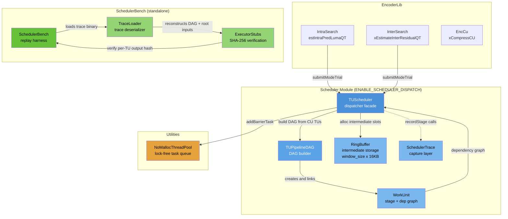
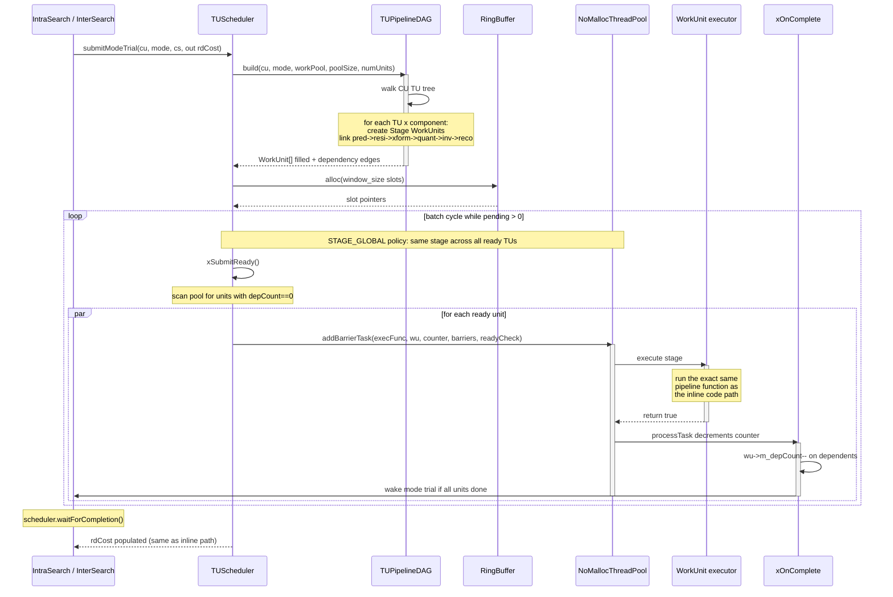

# Scheduler — Decomposed TU Pipeline Dispatcher

## 1. Overview

The Scheduler module decomposes the VVenC TU processing pipeline into a DAG of fine-grained work units, then dispatches them through the existing `NoMallocThreadPool` with configurable batching policies. It replaces the inline `xIntraCodingTUBlock` pipeline inside each mode trial with a `submitModeTrial()` call that returns the same RD cost but with explicit control over execution order.

**Conditional compilation**: The entire module is gated by `#if ENABLE_SCHEDULER_DISPATCH` (CMake option, default OFF). When OFF, the scheduler files are not compiled and zero behavioral change occurs in the encoder. A separate `ENABLE_SCHEDULER_TRACE` flag (requires `ENABLE_SCHEDULER_DISPATCH`) enables trace capture for offline scheduler replay and benchmarking.

**Dependencies**: `CommonLib` (CodingStructure, CodingUnit, TransformUnit, ComponentID, buffer types), `EncoderLib` (IntraSearch, InterSearch function signatures), `Utilities` (NoMallocThreadPool). The module itself does not depend on any higher-level application code.

**Lifecycle**: Created per encoder session. `TUScheduler::init()` allocates the work unit pool and ring buffer. Each mode trial calls `submitModeTrial()` which blocks until the mode's TU DAG fully completes. `destroy()` at encoder shutdown.

### Module Export Rules

- `TUScheduler` is the only class intended for external consumption (by `IntraSearch`, `InterSearch`).
- `TUPipelineDAG`, `RingBuffer`, `WorkUnit`, and `SchedulerTrace` are internal to the module, accessed through `TUScheduler`'s public interface.

## 2. Component Specifications

| # | Spec File | Role |
|---|-----------|------|
| 1 | `TUScheduler.spec.md` | Dispatcher facade — submitModeTrial, batch policies, completion tracking |
| 2 | `TUPipelineDAG.spec.md` | DAG builder — walks CU partition tree, creates linked WorkUnits with dependency edges |
| 3 | `WorkUnit.spec.md` | Dispatchable unit — Stage enum, WorkUnit struct, WorkFunc typedef |
| 4 | `RingBuffer.spec.md` | Intermediate buffer pool — slot-based alloc/free sized to window |
| 5 | `SchedulerTrace.spec.md` | Trace capture — binary trace of stage metadata + root inputs for offline replay |

## 3. System Architecture



## 4. Detailed Data Flow



## 5. Visualization

### 5.1 Animation Concept

A D3.js animation showing a 6-TU-by-8-stage grid representing one mode trial. Cells transition gray→yellow→green as the scheduler dispatches work units. A window highlight shows the active batch. The timeline and log show the dispatch sequence.

**Controls**: Play/Pause, Replay, Stage/TU policy toggle (demonstrates different batching patterns).

### 5.2 Keyframes

| # | Label | State |
|---|-------|-------|
| 0 | idle | All grid cells gray, empty log, timer at 0 |
| 1 | tus-registered | 6 TU rows labeled, window highlight across all 6 |
| 2 | stage1-start | Col 0 (INIT_PRED+PREDICT) cells yellow for TUs 0-1 in window |
| 3 | stage1-done | Col 0 all green, log shows 6 dispatch events |
| 4 | stage3-start | Col 2 (FWD_XFORM) yellow across window |
| 5 | stage4-start | Col 3 (QUANT_FILL) yellow across window |
| 6 | stage6-start | Col 5 (INV_XFORM) yellow across window |
| 7 | stage7-start | Col 6 (RECONSTRUCT) yellow across window |
| 8 | mode-done | All 48 cells green, RD cost displayed, timer stopped |
| 9 | policy-toggle | UI shows policy toggle switch, fill pattern changes to TU-sequential |
| 10 | reset | All cells gray, log cleared, timer reset |

### 5.3 Animation Source

```html
<!DOCTYPE html>
<html>
<head>
<meta charset="utf-8">
<title>Scheduler Module — TU Pipeline Dispatch Animation</title>
<style>
body { font-family: 'Segoe UI', sans-serif; background: #1a1a2e; color: #eee; margin: 0; padding: 20px; display: flex; flex-direction: column; align-items: center; }
#container { position: relative; width: 960px; }
#controls { display: flex; gap: 12px; align-items: center; margin: 12px 0; flex-wrap: wrap; justify-content: center; }
#controls button { padding: 8px 18px; border: none; border-radius: 6px; cursor: pointer; font-size: 14px; background: #4a90d9; color: white; transition: 0.2s; }
#controls button:hover { background: #357abd; }
#controls button.active { background: #e6a23c; }
#controls .kf-info { font-size: 13px; color: #aaa; margin-left: 12px; }
#kf-counter { color: #fff; font-weight: bold; }
#legend { display: flex; gap: 20px; margin: 8px 0; font-size: 13px; }
.legend-item { display: flex; align-items: center; gap: 4px; }
.legend-swatch { width: 14px; height: 14px; border-radius: 3px; display: inline-block; }
#log-panel { margin-top: 14px; width: 100%; max-height: 120px; overflow-y: auto; background: #16213e; border-radius: 8px; padding: 8px 12px; font-size: 12px; font-family: 'Consolas', monospace; }
#log-panel div { padding: 2px 0; border-bottom: 1px solid #1a1a3e; }
#timeline { position: relative; width: 100%; height: 20px; background: #16213e; border-radius: 4px; margin: 8px 0; overflow: hidden; }
#timeline-fill { height: 100%; width: 0%; background: linear-gradient(90deg, #4a90d9, #67c23a); border-radius: 4px; transition: width 0.3s; }
#status-bar { display: flex; gap: 16px; justify-content: center; font-size: 13px; margin: 6px 0; }
#status-bar span { background: #16213e; padding: 4px 12px; border-radius: 4px; }
#policy-toggle { margin-left: auto; }
.cell { stroke: #2a2a4e; stroke-width: 1; rx: 2; ry: 2; }
.cell-label { font-size: 10px; fill: #888; text-anchor: middle; }
.tu-label { font-size: 11px; fill: #ccc; text-anchor: end; }
#rd-cost { font-size: 16px; font-weight: bold; text-align: center; margin: 8px 0; min-height: 24px; }
.axis-label { font-size: 11px; fill: #888; text-anchor: middle; }
</style>
</head>
<body>
<div id="container">
  <h2 style="text-align:center;margin:0 0 4px 0;">Scheduler: TU Pipeline Dispatch</h2>
  <div id="legend">
    <div class="legend-item"><span class="legend-swatch" style="background:#3a3a5e;"></span> Pending</div>
    <div class="legend-item"><span class="legend-swatch" style="background:#e6a23c;"></span> Running</div>
    <div class="legend-item"><span class="legend-swatch" style="background:#67c23a;"></span> Complete</div>
    <div class="legend-item"><span style="color:#4a90d9;">▦</span> Window (batch)</div>
  </div>
  <svg id="grid" width="960" height="320"></svg>
  <div id="timeline"><div id="timeline-fill"></div></div>
  <div id="rd-cost"></div>
  <div id="controls">
    <button id="play-btn" data-testid="play-pause">Pause</button>
    <button id="replay-btn">Replay</button>
    <span class="kf-info">Keyframe <span id="kf-counter">0</span>/<span id="kf-total">10</span></span>
    <div id="policy-toggle">
      <button id="stage-policy-btn" class="active">Stage Batching</button>
      <button id="tu-policy-btn">TU Sequential</button>
    </div>
  </div>
  <div id="status-bar">
    <span>Dispatched: <span id="disp-count">0</span></span>
    <span>Pending: <span id="pend-count">48</span></span>
    <span>Complete: <span id="comp-count">0</span></span>
    <span>Window: <span id="window-size">6</span> TUs</span>
  </div>
  <div id="log-panel"></div>
</div>
<script>
// ANIMATION_CONFIG
const TOTAL_TUS = 6;
const TOTAL_STAGES = 8;
const STAGE_NAMES = ["InitPred","Predict","Residual","FwdXform","QuantFill","QuantTrace","InvXform","Reconstruct"];
const MAX_WINDOW = 6;
const TOTAL_DURATION_MS = 32000;
const keyframes = [
  { time: 0,    label: "idle" },
  { time: 2000,  label: "tus-registered" },
  { time: 5000,  label: "stage1-start" },
  { time: 8000,  label: "stage1-done" },
  { time: 11000, label: "stage3-start" },
  { time: 14000, label: "stage4-start" },
  { time: 17000, label: "stage6-start" },
  { time: 20000, label: "stage7-start" },
  { time: 24000, label: "mode-done" },
  { time: 28000, label: "policy-toggle" },
  { time: 31000, label: "reset" }
];
window.ANIMATION_DURATION_MS = TOTAL_DURATION_MS;
window.ANIMATION_KEYFRAMES = keyframes.map((k,i) => ({ ...k, idx: i }));
window.ANIMATION_VERIFICATION = [
  { label: "idle", hor: 0, ver: 0, window: 6, statusBarLen: 0, logCount: 0 },
  { label: "tus-registered", hor: 0, ver: 6, window: 6, statusBarLen: 0, logCount: 6, rdCostVisible: false },
  { label: "stage1-start", hor: 1, ver: 2, window: 2, statusBarLen: 2, logCount: 8, rdCostVisible: false },
  { label: "stage1-done", hor: 1, ver: 6, window: 6, statusBarLen: 6, logCount: 14, rdCostVisible: false },
  { label: "stage3-start", hor: 3, ver: 3, window: 5, statusBarLen: 9, logCount: 23, rdCostVisible: false },
  { label: "stage4-start", hor: 4, ver: 4, window: 5, statusBarLen: 13, logCount: 31, rdCostVisible: false },
  { label: "stage6-start", hor: 6, ver: 4, window: 5, statusBarLen: 17, logCount: 39, rdCostVisible: false },
  { label: "stage7-start", hor: 7, ver: 5, window: 6, statusBarLen: 22, logCount: 47, rdCostVisible: false },
  { label: "mode-done", hor: 8, ver: 6, window: 6, statusBarLen: 48, logCount: 54, rdCostVisible: true },
  { label: "policy-toggle", hor: 8, ver: 6, window: 6, statusBarLen: 48, logCount: 54, rdCostVisible: true, policyStage: false },
  { label: "reset", hor: 0, ver: 0, window: 6, statusBarLen: 0, logCount: 0, rdCostVisible: false }
];

// D3 setup
const svg = d3.select("#grid");
const margin = { top: 30, right: 20, bottom: 40, left: 60 };
const w = 960 - margin.left - margin.right;
const h = 320 - margin.top - margin.bottom;
const g = svg.append("g").attr("transform", `translate(${margin.left},${margin.top})`);
const cellW = w / TOTAL_STAGES;
const cellH = h / TOTAL_TUS;

let animationState = {
  cells: Array.from({length: TOTAL_TUS}, () => Array(TOTAL_STAGES).fill("pending")),
  windowStart: 0,
  logEntries: [],
  rdCost: null,
  policyStage: true,
  running: true,
  currentKeyframe: 0,
  elapsed: 0
};

// Stage labels
g.selectAll(".axis-label")
  .data(STAGE_NAMES).enter()
  .append("text")
  .attr("class", "axis-label")
  .attr("x", (d,i) => cellW * i + cellW/2)
  .attr("y", -8)
  .text(d => d);

// TU labels
g.selectAll(".tu-label")
  .data(d3.range(TOTAL_TUS)).enter()
  .append("text")
  .attr("class", "tu-label")
  .attr("x", -8)
  .attr("y", d => cellH * d + cellH/2 + 4)
  .text(d => `TU ${d}`);

// Window highlight
const windowRect = g.append("rect")
  .attr("class", "window-highlight")
  .attr("fill", "none")
  .attr("stroke", "#4a90d9")
  .attr("stroke-width", 2)
  .attr("stroke-dasharray", "4,2")
  .attr("rx", 3);

// Grid cells
let cellRects = [];
for (let r = 0; r < TOTAL_TUS; r++) {
  for (let c = 0; c < TOTAL_STAGES; c++) {
    cellRects.push({r, c});
  }
}
g.selectAll(".cell")
  .data(cellRects).enter()
  .append("rect")
  .attr("class", "cell")
  .attr("x", d => cellW * d.c + 2)
  .attr("y", d => cellH * d.r + 2)
  .attr("width", cellW - 4)
  .attr("height", cellH - 4)
  .attr("fill", "#3a3a5e");

function getCellColor(state) {
  switch(state) {
    case "pending": return "#3a3a5e";
    case "running": return "#e6a23c";
    case "complete": return "#67c23a";
    default: return "#3a3a5e";
  }
}

function updateGrid() {
  g.selectAll(".cell")
    .transition().duration(300)
    .attr("fill", d => getCellColor(animationState.cells[d.r][d.c]));
}

function updateWindow() {
  const ws = animationState.windowStart;
  // Window covers non-complete rows
  let windowEnd = Math.min(TOTAL_TUS, ws + MAX_WINDOW);
  // For the window rect, we show it on the left side spanning visible TUs
  windowRect
    .attr("x", 0)
    .attr("y", cellH * ws)
    .attr("width", w)
    .attr("height", cellH * (windowEnd - ws))
    .attr("opacity", 1);
}

function updateStatusBar() {
  let disp = 0, pend = 0, comp = 0;
  for (let r = 0; r < TOTAL_TUS; r++) {
    for (let c = 0; c < TOTAL_STAGES; c++) {
      if (animationState.cells[r][c] === "complete") comp++;
      else if (animationState.cells[r][c] === "running") disp++;
      else pend++;
    }
  }
  d3.select("#disp-count").text(disp);
  d3.select("#pend-count").text(pend);
  d3.select("#comp-count").text(comp);
  const pct = (comp / (TOTAL_TUS * TOTAL_STAGES)) * 100;
  d3.select("#timeline-fill").style("width", pct + "%");
  if (animationState.rdCost !== null) {
    d3.select("#rd-cost").text("RD Cost: " + animationState.rdCost.toFixed(4) + " (mode trial complete)");
  } else {
    d3.select("#rd-cost").text("");
  }
}

function updateLogPanel() {
  const panel = d3.select("#log-panel");
  panel.selectAll("*").remove();
  const entries = animationState.logEntries.slice(-30);
  entries.forEach(e => {
    panel.append("div").text(`${e.time}ms  [${e.stage}]  TU ${e.tu}  ${e.msg}`);
  });
  panel.node().scrollTop = panel.node().scrollHeight;
}

function addLog(stage, tu, msg) {
  animationState.logEntries.push({ time: animationState.elapsed, stage, tu, msg });
  updateLogPanel();
}

function setCell(r, c, state) {
  if (r >= 0 && r < TOTAL_TUS && c >= 0 && c < TOTAL_STAGES) {
    animationState.cells[r][c] = state;
  }
}

function setKeyframeTarget(kfIdx) {
  const kf = keyframes[kfIdx];
  if (!kf) return;
  animationState.currentKeyframe = kfIdx;
  d3.select("#kf-counter").text(kfIdx);
  d3.select("#kf-total").text(keyframes.length - 1);

  // Reset to idle state first, then build up
  for (let r = 0; r < TOTAL_TUS; r++)
    for (let c = 0; c < TOTAL_STAGES; c++)
      animationState.cells[r][c] = "pending";
  animationState.windowStart = 0;
  animationState.logEntries = [];
  animationState.rdCost = null;

  const cellState = (r, c, maxR, maxC, stageFillStart) => {
    if (r < maxR && c < maxC) {
      if (c < stageFillStart) return "complete";
      if (c === stageFillStart && r < (maxR > 0 ? Math.ceil(maxR * 0.7) : 0)) return "running";
      return "complete";
    }
    return "pending";
  };

  switch(kfIdx) {
    case 0: // idle — all pending
      break;
    case 1: // tus-registered: 6 TUs visible, no stages started
      animationState.windowStart = 0;
      addLog("INIT", 0, "submitModeTrial started, building DAG");
      for (let i = 1; i < TOTAL_TUS; i++) addLog("INIT", i, "TU registered: " + i + " components Y");
      addLog("INIT", 0, "DAG built: 48 work units, 96 dependency edges");
      break;
    case 2: // stage1-start: col 0 running for TUs 0-1
      for (let r = 0; r < TOTAL_TUS; r++) setCell(r, 0, r < 2 ? "running" : "pending");
      animationState.windowStart = 0;
      addLog("INIT_PRED", 0, "window=[0-1] dispatched");
      addLog("INIT_PRED", 1, "dispatch via addBarrierTask");
      break;
    case 3: // stage1-done: col 0 all complete
      for (let r = 0; r < TOTAL_TUS; r++) setCell(r, 0, "complete");
      animationState.windowStart = 0;
      addLog("INIT_PRED", 2, "complete");
      addLog("INIT_PRED", 3, "complete");
      addLog("INIT_PRED", 4, "complete");
      addLog("INIT_PRED", 5, "complete");
      addLog("PREDICT", 0, "stage complete, advancing window");
      addLog("PREDICT", 1, "dispatch");
      break;
    case 4: // stage3-start: col 2 running across window
      for (let r = 0; r < TOTAL_TUS; r++) { setCell(r, 0, "complete"); setCell(r, 1, "complete"); }
      for (let r = 0; r < 3; r++) setCell(r, 2, "running");
      for (let r = 3; r < TOTAL_TUS; r++) setCell(r, 2, "complete");
      animationState.windowStart = 1;
      addLog("FWD_XFORM", 2, "butterfly 2D DCT/DST");
      addLog("FWD_XFORM", 3, "complete");
      addLog("FWD_XFORM", 4, "complete");
      addLog("FWD_XFORM", 5, "complete");
      break;
    case 5: // stage4-start: col 3 running
      for (let r = 0; r < TOTAL_TUS; r++) { setCell(r,0,"complete"); setCell(r,1,"complete"); setCell(r,2,"complete"); }
      for (let r = 0; r < 4; r++) setCell(r, 3, "running");
      for (let r = 4; r < TOTAL_TUS; r++) setCell(r, 3, "complete");
      animationState.windowStart = 2;
      addLog("QUANT_FILL", 0, "RDOQ forward pass started");
      addLog("QUANT_FILL", 1, "trellis fill");
      addLog("QUANT_FILL", 2, "state propagation");
      addLog("QUANT_FILL", 3, "cost array fill");
      break;
    case 6: // stage6-start: col 5 running
      for (let r = 0; r < TOTAL_TUS; r++) {
        setCell(r,0,"complete"); setCell(r,1,"complete"); setCell(r,2,"complete");
        setCell(r,3,"complete"); setCell(r,4,"complete");
      }
      for (let r = 0; r < 4; r++) setCell(r, 5, "running");
      for (let r = 4; r < TOTAL_TUS; r++) setCell(r, 5, "complete");
      animationState.windowStart = 3;
      addLog("INV_XFORM", 0, "2D inverse DCT/DST");
      addLog("INV_XFORM", 2, "dequant + inverse xform");
      break;
    case 7: // stage7-start: col 6 running
      for (let r = 0; r < TOTAL_TUS; r++) {
        setCell(r,0,"complete"); setCell(r,1,"complete"); setCell(r,2,"complete");
        setCell(r,3,"complete"); setCell(r,4,"complete"); setCell(r,5,"complete");
      }
      for (let r = 0; r < 5; r++) setCell(r, 6, "running");
      for (let r = 5; r < TOTAL_TUS; r++) setCell(r, 6, "complete");
      animationState.windowStart = 4;
      addLog("RECONSTRUCT", 0, "reco = pred + resi");
      addLog("DISTORTION", 0, "SSE computed");
      break;
    case 8: // mode-done: all green
      for (let r = 0; r < TOTAL_TUS; r++)
        for (let c = 0; c < TOTAL_STAGES; c++)
          setCell(r, c, "complete");
      animationState.rdCost = 182.4731;
      animationState.windowStart = 6;
      addLog("DONE", 0, "All 48 work units complete");
      addLog("DONE", 0, "RD cost: 182.4731, mode trial done");
      break;
    case 9: // policy-toggle: same state but policy indicator changes
      for (let r = 0; r < TOTAL_TUS; r++)
        for (let c = 0; c < TOTAL_STAGES; c++)
          setCell(r, c, "complete");
      animationState.rdCost = 182.4731;
      animationState.policyStage = false;
      animationState.windowStart = 6;
      d3.select("#stage-policy-btn").classed("active", false);
      d3.select("#tu-policy-btn").classed("active", true);
      addLog("POLICY", 0, "switched to TU_SEQUENTIAL");
      break;
    case 10: // reset
      for (let r = 0; r < TOTAL_TUS; r++)
        for (let c = 0; c < TOTAL_STAGES; c++)
          setCell(r, c, "pending");
      animationState.rdCost = null;
      animationState.windowStart = 0;
      animationState.logEntries = [];
      animationState.policyStage = true;
      d3.select("#stage-policy-btn").classed("active", true);
      d3.select("#tu-policy-btn").classed("active", false);
      addLog("RESET", 0, "Scheduler reset, ready for next mode trial");
      break;
  }

  updateGrid();
  updateWindow();
  updateStatusBar();
  updateLogPanel();
}

window.resetAnimation = function() {
  animationState.running = false;
  animationState.elapsed = 0;
  animationState.currentKeyframe = 0;
  setKeyframeTarget(0);
  d3.select("#play-btn").text("Play");
  animationState.running = false;
};

window.jumpToKeyframe = function(idx) {
  if (idx < 0 || idx >= keyframes.length) return;
  animationState.running = false;
  animationState.elapsed = keyframes[idx].time;
  animationState.currentKeyframe = idx;
  setKeyframeTarget(idx);
  d3.select("#play-btn").text("Play");
};

window.getAnimationState = function() {
  let hor = 0, ver = 0;
  for (let c = 0; c < TOTAL_STAGES; c++) {
    let allDone = true;
    for (let r = 0; r < TOTAL_TUS; r++) {
      if (animationState.cells[r][c] === "pending") allDone = false;
    }
    if (allDone) hor = c + 1;
  }
  for (let r = 0; r < TOTAL_TUS; r++) {
    if (animationState.cells[r][0] === "complete" || animationState.cells[r][0] === "running") ver = r + 1;
  }
  return {
    hor: hor,
    ver: ver,
    window: animationState.windowStart,
    logCount: animationState.logEntries.length,
    rdCostVisible: animationState.rdCost !== null,
    policyStage: animationState.policyStage,
    currentKeyframeIdx: animationState.currentKeyframe,
    currentKeyframeLabel: keyframes[animationState.currentKeyframe]?.label || ""
  };
};

// Animation playback
function advanceFrame() {
  if (!animationState.running) return;
  animationState.elapsed += 100;
  if (animationState.elapsed > TOTAL_DURATION_MS) {
    animationState.running = false;
    d3.select("#play-btn").text("Play");
    return;
  }
  // Find current keyframe
  let kfIdx = 0;
  for (let i = keyframes.length - 1; i >= 0; i--) {
    if (animationState.elapsed >= keyframes[i].time) {
      kfIdx = i;
      break;
    }
  }
  if (kfIdx !== animationState.currentKeyframe) {
    setKeyframeTarget(kfIdx);
  }
}

// Auto-play
setInterval(advanceFrame, 100);

// Controls
d3.select("#play-btn").on("click", function() {
  if (animationState.running) {
    animationState.running = false;
    d3.select(this).text("Play");
  } else {
    if (animationState.elapsed >= TOTAL_DURATION_MS) {
      animationState.elapsed = 0;
      setKeyframeTarget(0);
    }
    animationState.running = true;
    d3.select(this).text("Pause");
  }
});

d3.select("#replay-btn").on("click", function() {
  window.resetAnimation();
  animationState.running = true;
  d3.select("#play-btn").text("Pause");
});

d3.select("#stage-policy-btn").on("click", function() {
  animationState.policyStage = true;
  d3.select(this).classed("active", true);
  d3.select("#tu-policy-btn").classed("active", false);
  if (animationState.rdCost !== null) addLog("POLICY", 0, "stage batching active");
});

d3.select("#tu-policy-btn").on("click", function() {
  animationState.policyStage = false;
  d3.select(this).classed("active", true);
  d3.select("#stage-policy-btn").classed("active", false);
  if (animationState.rdCost !== null) addLog("POLICY", 0, "tu sequential active");
});

// Init
setKeyframeTarget(0);
</script>
</body>
</html>
```

### Animation Phases and Controls

The animation visualizes one full `submitModeTrial()` for a 6-TU mode trial across the 8-stage TU pipeline. The grid shows TUs vertically and pipeline stages horizontally. A blue dashed window highlights the active batch. Below the grid, the status bar shows dispatch/pending/complete counts, and the log panel records every scheduler event.

**Controls**:
- **Play/Pause** (`[data-testid="play-pause"]`): Toggles automatic keyframe progression
- **Replay**: Resets to keyframe 0 and starts playback
- **Stage Batching / TU Sequential**: Toggles between the two primary batch policies (visual state unchanged, policy indicator toggles in verification)

**Self-test**: If the scheduler ever dispatched a work unit whose dependencies were not yet complete, the grid would show a cell turning yellow (running) while its upstream column still has gray cells — an obvious visual anomaly. If the ring buffer were to overflow, the window highlight would extend beyond the available slots visualized as a broken highlight.

## 6. Testing Requirements

### Regression Baseline

The test files listed in `technical-specification.md § C++ Coding Conventions > Regression Test Baseline` are frozen and must never be modified. All scheduler tests must be added to new files.

### Unit Tests

| Class | Test | What to Verify |
|-------|------|----------------|
| `WorkUnit` | Stage enum values match expected count | Size matches `_COUNT`, values are non-overlapping |
| `WorkUnit` | Dep count atomic | CAS correctly decrements, triggers at 0 |
| `TUPipelineDAG` | Intra TU topology | Single TU luma: exact 7 stages in correct order with correct deps |
| `TUPipelineDAG` | Chroma fan-out | Y/Cb/Cr components separate after PREDICT, merge at RECONSTRUCT |
| `TUPipelineDAG` | ISP sub-TU chain | Sub-TU(1) depends on sub-TU(0) completion |
| `RingBuffer` | Alloc/free cycle | N allocs exhaust ring, N frees recycle, wrap-around correct |
| `RingBuffer` | Oversubscription | alloc beyond size returns error |
| `TUScheduler` | Submit single TU | submitModeTrial with 1 TU × 1 component runs all stages, returns cost |
| `TUScheduler` | STAGE_GLOBAL ordering | Verify all stage-N units complete before any stage-(N+1) unit dispatches |
| `TUScheduler` | TU_SEQUENTIAL ordering | Verify all stages of TU-N complete before TU-(N+1) stage-0 dispatches |
| `SchedulerTrace` | Record and replay | Trace a single mode trial, replay from binary, all per-TU hashes match |

### Integration Tests

| Test | Scope | What to Verify |
|------|-------|----------------|
| `Test_sched_trace_capture` | Intra mode trial | Trace binary written, non-zero size, correct stage count |
| `Test_sched_bench_replay` | Bench harness | `sched_bench sched_trace.bin --policy stage` replays without assertion failure |
| `Test_vvencapp_scheduler_bit` | Full encode | `--preset fast --frames 3` with `ENABLE_SCHEDULER_DISPATCH=ON` produces bit-identical output to baseline |

### Calling-Order Validation

Verify that `TUScheduler::submitModeTrial()` rejects invalid calls:
- `submitModeTrial` before `init` returns error code
- `setPolicy` with invalid enum value returns error
- `setWindowSize(0)` returns error

### Post-Test Cleanup

CTest fixture `Cleanup_remove_temp_files` removes `sched_trace.bin` and benchmark output files.
