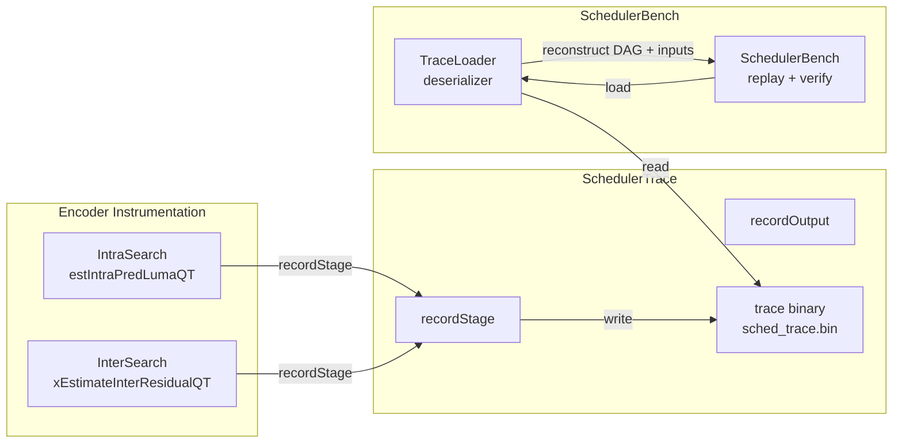

# SchedulerTrace — Trace Capture for Offline Replay

## 1. Overview

`SchedulerTrace` captures per-stage metadata and root-stage input data during a live encode session. The trace is written to a binary file for offline replay by `SchedulerBench`. Root stages (INIT_PRED, PREDICT, RESIDUAL) include full input data; all other stages record only output hashes.

**Conditional compilation**: Only compiled when `ENABLE_SCHEDULER_TRACE=1` (implies `ENABLE_SCHEDULER_DISPATCH=1`). When disabled, all calls expand to nothing.

**Dependencies**: `WorkUnit.h`, `<cstdint>`, `<cstdio>`, `CommonDef.h`. No heavy dependencies.

**Lifecycle**: Created at encoder init, opened at first trace write, closed at encoder shutdown. Each mode trial appends records.

## 2. Component Specifications

### 2.1 Class: `SchedulerTrace`

```cpp
#pragma once

#if ENABLE_SCHEDULER_TRACE

#include <cstdint>
#include <cstdio>
#include <cstddef>

namespace vvenc {

struct WorkUnit;

class SchedulerTrace
{
public:
    /** \brief Initialize the trace system.
     *  \param[in] pFilename output binary file path
     *  \retval 0 on success
     *  \retval -1 if pFilename is null
     *  \retval -2 if file open fails
     */
    int init(const char* pFilename);

    /** \brief Close the trace file and finalize.
     *  \retval 0 on success
     */
    int destroy();

    /** \brief Record a stage execution.
     *  \param[in] pWu       the work unit that executed
     *  \param[in] pInputBuf root input data (null for non-root stages)
     *  \param[in] inputSize size of input data in bytes
     *  \retval 0 on success
     *  \retval -1 if not initialized
     *  \retval -2 if file write fails
     */
    int recordStage(WorkUnit* pWu, const void* pInputBuf, int inputSize);

    /** \brief Record final per-TU output for verification.
     *  \param[in] pWu     the completed work unit
     *  \param[in] pOutput output data buffer
     *  \param[in] outSize size of output in bytes
     *  \retval 0 on success
     */
    int recordOutput(WorkUnit* pWu, const void* pOutput, int outSize);

    /** \brief Get the number of stages recorded so far.
     *  \return stage count
     */
    int getStageCount() const;

    virtual ~SchedulerTrace();

private:
    /// Output file handle
    FILE* m_pFile = nullptr;

    /// Stage counter for validating replay
    int m_stageCount = 0;

    /// Frame index currently being traced
    uint16_t m_frameIdx = 0;

    /// Write a binary record header
    int xWriteHeader(uint8_t recordType, uint32_t size);
};

}

#endif // ENABLE_SCHEDULER_TRACE
```

### 2.2 Trace Binary Format

```
File header:
  uint32_t magic       = 0x53434854   // "SCHT"
  uint32_t version     = 1

Record header (8 bytes):
  uint8_t  recordType  // 0=stage, 1=output, 2=frame_marker, 3=end
  uint8_t  reserved
  uint16_t stageCount
  uint32_t payloadSize

Stage record (payload):
  uint32_t tuId
  uint8_t  stage
  uint8_t  compId
  int8_t   qp
  uint8_t  width, height
  uint8_t  mtsIdx
  uint16_t inputSize     // 0 for non-root
  uint8_t  inputData[inputSize]  // only for root stages
  uint8_t  outputHash[32]        // SHA-256 of stage output

Output record (payload):
  uint32_t tuId
  uint8_t  compId
  uint8_t  finalHash[32]  // SHA-256 of final reconstructed buffer

Frame marker (payload):
  uint16_t frameIdx
  uint32_t numCtu
```

Root stages (always capture full input):
- `INIT_PRED`: reference samples (4 * (2*width + 1) bytes per side)
- `PREDICT` (inter): merge candidates + MV data
- `RESIDUAL`: first `org - pred` result
- `DISTORTION`: original pixel data

All other stages: inputSize=0, only outputHash recorded.

## 3. System Architecture



## 4. Detailed Data Flow

No sequence diagram — the trace is a linear recording of stage events, not a multi-component orchestration.

## 5. Visualization

No D3 animation — the trace capture is a simple write-ahead log.

## 6. Testing Requirements

### Unit Tests

| Test | What to Verify |
|------|----------------|
| init open fails | Returns -2 when file cannot be created |
| record before init | Returns -1 |
| single stage record | File written with correct header + 1 record |
| multiple stages | File contains all records in order, restartable |
| root stage input | Input data preserved exactly in file |
| recordOutput | Final output hash stored and retrievable |
| frame marker | Frame boundary correctly serialized |
| read-back round-trip | File can be read by TraceLoader with identical data |
| file close | All data flushed, file size matches expected |
| large trace | 10000+ records without data corruption |
