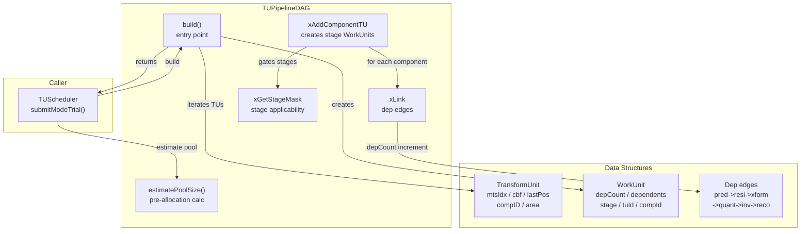
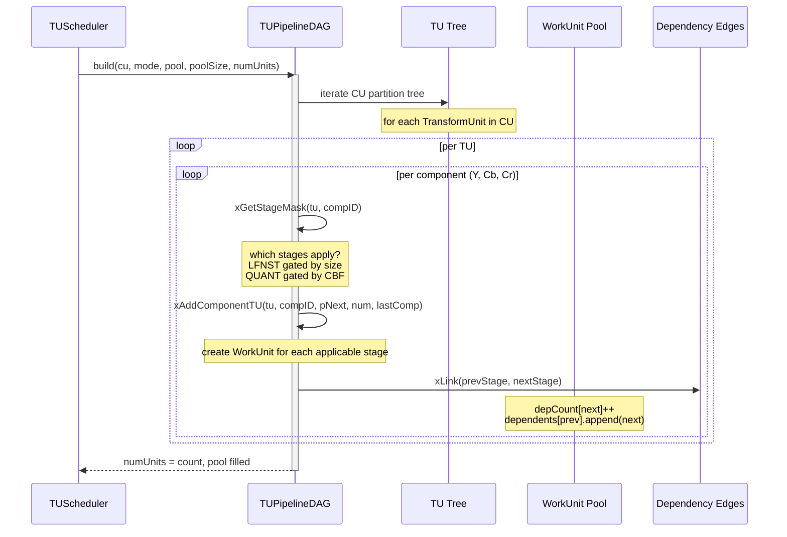

# TUPipelineDAG — TU Pipeline Dependency Graph Builder

## 1. Overview

`TUPipelineDAG` walks the TU tree of a single CU+mode trial and produces a flat array of `WorkUnit` instances linked by dependency edges. Each WorkUnit represents one pipeline stage for one component of one TU. The DAG encodes the exact ordering constraints of the sequential pipeline: PREDICT must complete before RESIDUAL, RESIDUAL before FWD_XFORM, etc.

**Dependencies**: `WorkUnit.h`, `CodingStructure.h`, `Unit.h` (CodingUnit, TransformUnit structs).

**Lifecycle**: `build()` is called once per `submitModeTrial()`. No persistent state between calls — the DAG is constructed in a caller-provided pool.

## 2. Component Specifications

### 2.1 Enum: `Stage`

Defined in WorkUnit.h. See `WorkUnit.spec.md`.

### 2.2 Class: `TUPipelineDAG`

```cpp
#pragma once

#include <cstdint>

namespace vvenc {

class CodingUnit;
class TransformUnit;
struct WorkUnit;

class TUPipelineDAG
{
public:
    /** \brief Build a work-unit DAG for one CU mode trial.
     *  \param[in]     cu       the coding unit to process
     *  \param[in]     mode     intra or inter mode
     *  \param[out]    pPool    caller-provided WorkUnit array to populate
     *  \param[in]     poolSize maximum number of units available
     *  \param[out]    pNumUnits number of work units created
     *  \retval 0 on success
     *  \retval -1 if poolSize is insufficient
     *  \retval -2 if cu has no TUs
     */
    static int build(CodingUnit* cu, ModeType mode,
                     WorkUnit* pPool, int poolSize, int& pNumUnits);

    /** \brief Estimate the number of work units required for a CU + mode.
     *  \param[in] cu   the coding unit
     *  \param[in] mode intra or inter mode
     *  \return estimated work unit count
     */
    static int estimatePoolSize(CodingUnit* cu, ModeType mode);

    virtual ~TUPipelineDAG();

private:
    /// Add stages for one TU component and link dependencies
    static int xAddComponentTU(TransformUnit& tu, ComponentID compID,
                               WorkUnit*& pNext, int& numUnits,
                               WorkUnit* pLastComponent);

    /// Link dependency edges between consecutive stages
    static int xLink(WorkUnit* pPrev, WorkUnit* pNext);

    /// Determine which stages apply for a given TU component
    static int xGetStageMask(const TransformUnit& tu, ComponentID compID,
                             uint16_t& stageMask);
};

}
```

## 3. System Architecture



## 4. Detailed Data Flow



## 5. Visualization

### 5.1 Animation Concept

An animated DAG visualization. Nodes are WorkUnits labeled by stage+TU. Directed edges show dependencies. A topological-sort animation highlights nodes as they become ready (all incoming edges green) and then executed (node turns green).

**Controls**: Play/Pause, Replay. Hover over any node to see its dependency count.

### 5.2 Keyframes

| # | Label | State |
|---|-------|-------|
| 0 | initial | 12 DAG nodes visible (3 TUs x 4 stages each). All gray. |
| 1 | building | Nodes appear one-by-one with connecting edges. |
| 2 | ready-nodes | Root nodes (INIT_PRED) highlighted green: depCount=0. |
| 3 | stage-1-exec | First 3 nodes turn green (executed). Their dependents depCount decremented. |
| 4 | cascade | Wave of green propagation through the DAG. |
| 5 | complete | All 12 nodes green. Total execution count shown. |

### 5.3 Animation Source

```html
<!DOCTYPE html>
<html>
<head>
<meta charset="utf-8">
<title>TUPipelineDAG — Dependency Graph Builder</title>
<style>
body { font-family: 'Segoe UI', sans-serif; background: #1a1a2e; color: #eee; margin: 0; padding: 20px; display: flex; flex-direction: column; align-items: center; }
#container { width: 800px; text-align: center; }
#controls { display: flex; gap: 12px; justify-content: center; margin: 12px 0; align-items: center; flex-wrap: wrap; }
#controls button { padding: 8px 18px; border: none; border-radius: 6px; cursor: pointer; font-size: 14px; background: #4a90d9; color: white; transition: 0.2s; }
#controls button:hover { background: #357abd; }
#dag-svg { border: 1px solid #2a2a4e; border-radius: 8px; background: #16213e; }
.node { cursor: pointer; transition: fill 0.4s; }
.node-label { font-size: 11px; fill: #ccc; text-anchor: middle; pointer-events: none; }
.edge { stroke: #3a3a5e; stroke-width: 2; marker-end: url(#arrow); opacity: 0.6; }
.edge.triggered { stroke: #67c23a; opacity: 1; }
#stats { display: flex; gap: 20px; justify-content: center; margin: 8px 0; font-size: 13px; }
#stats span { background: #16213e; padding: 4px 12px; border-radius: 4px; }
#node-info { min-height: 24px; font-size: 13px; color: #aaa; margin: 6px 0; }
.kf-info { font-size: 12px; color: #aaa; margin-left: 12px; }
</style>
</head>
<body>
<div id="container">
  <h2 style="margin:0 0 4px 0;">TUPipelineDAG: Work-Unit Dependency Graph</h2>
  <svg id="dag-svg" width="760" height="360"></svg>
  <div id="stats">
    <span>Total Nodes: <span id="node-count">12</span></span>
    <span>Complete: <span id="complete-count">0</span></span>
    <span>Ready: <span id="ready-count">0</span></span>
  </div>
  <div id="node-info">Click or hover a node for details</div>
  <div id="controls">
    <button id="play-btn" data-testid="play-pause">Pause</button>
    <button id="replay-btn">Replay</button>
    <span class="kf-info">Keyframe <span id="kf-counter">0</span>/<span id="kf-total">5</span></span>
  </div>
</div>
<script>
const TOTAL_DURATION_MS = 15000;
const keyframes = [
  { time: 0,    label: "initial" },
  { time: 2500, label: "building" },
  { time: 5500, label: "ready-nodes" },
  { time: 9000, label: "stage-1-exec" },
  { time: 12000,label: "cascade" },
  { time: 14500,label: "complete" }
];

window.ANIMATION_DURATION_MS = TOTAL_DURATION_MS;
window.ANIMATION_KEYFRAMES = keyframes.map((k,i) => ({ ...k, idx: i }));

// DAG node data: 12 nodes for 3 TUs x 4 stages (simplified)
const nodes = [
  { id: 0, label: "TU0-INIT", stage: 0, tu: 0, x: 100, y: 60 },
  { id: 1, label: "TU0-FWDX", stage: 1, tu: 0, x: 300, y: 60 },
  { id: 2, label: "TU0-QUANT", stage: 2, tu: 0, x: 500, y: 60 },
  { id: 3, label: "TU0-RECON", stage: 3, tu: 0, x: 680, y: 60 },
  { id: 4, label: "TU1-INIT", stage: 0, tu: 1, x: 100, y: 160 },
  { id: 5, label: "TU1-FWDX", stage: 1, tu: 1, x: 300, y: 160 },
  { id: 6, label: "TU1-QUANT", stage: 2, tu: 1, x: 500, y: 160 },
  { id: 7, label: "TU1-RECON", stage: 3, tu: 1, x: 680, y: 160 },
  { id: 8, label: "TU2-INIT", stage: 0, tu: 2, x: 100, y: 260 },
  { id: 9, label: "TU2-FWDX", stage: 1, tu: 2, x: 300, y: 260 },
  { id: 10, label: "TU2-QUANT", stage: 2, tu: 2, x: 500, y: 260 },
  { id: 11, label: "TU2-RECON", stage: 3, tu: 2, x: 680, y: 260 }
];

// Edges: stage N -> stage N+1 within each TU, plus some cross-TU deps
const edges = [
  { from: 0, to: 1 }, { from: 1, to: 2 }, { from: 2, to: 3 },
  { from: 4, to: 5 }, { from: 5, to: 6 }, { from: 6, to: 7 },
  { from: 8, to: 9 }, { from: 9, to: 10 }, { from: 10, to: 11 },
  { from: 0, to: 4 },  // TU cross-dep: TU1-INIT depends on TU0-INIT
  { from: 4, to: 8 },  // TU2-INIT depends on TU1-INIT
  { from: 3, to: 7 },  // TU1-RECON depends on TU0-RECON
];

const svg = d3.select("#dag-svg");
const defs = svg.append("defs");
defs.append("marker")
  .attr("id", "arrow")
  .attr("viewBox", "0 0 10 10")
  .attr("refX", 20)
  .attr("refY", 5)
  .attr("markerWidth", 8)
  .attr("markerHeight", 8)
  .attr("orient", "auto")
  .append("path")
  .attr("d", "M0,0 L10,5 L0,10 Z")
  .attr("fill", "#3a3a5e");

let graphState = {
  completed: new Set(),
  running: new Set(),
  currentKf: 0,
  elapsed: 0,
  runningAnim: true,
  depCounts: nodes.reduce((acc, n) => ({ ...acc, [n.id]: edges.filter(e => e.to === n.id).length }), {})
};

// Render edges
svg.selectAll(".edge")
  .data(edges).enter()
  .append("line")
  .attr("class", "edge")
  .attr("x1", d => nodes[d.from].x + 20)
  .attr("y1", d => nodes[d.from].y + 20)
  .attr("x2", d => nodes[d.to].x - 20)
  .attr("y2", d => nodes[d.to].y + 20);

// Render nodes
const nodeGroup = svg.selectAll(".node-group")
  .data(nodes).enter()
  .append("g")
  .attr("class", "node-group")
  .attr("transform", d => `translate(${d.x - 20},${d.y})`);

nodeGroup.append("rect")
  .attr("class", "node")
  .attr("width", 40)
  .attr("height", 40)
  .attr("rx", 6)
  .attr("ry", 6)
  .attr("fill", "#3a3a5e")
  .attr("stroke", "#2a2a4e")
  .attr("stroke-width", 2);

nodeGroup.append("text")
  .attr("class", "node-label")
  .attr("x", 20)
  .attr("y", 24)
  .text(d => d.label);

// Hover interaction
svg.selectAll(".node-group")
  .on("mouseenter", function(ev, d) {
    const deps = graphState.depCounts[d.id] || 0;
    const status = graphState.completed.has(d.id) ? "complete" :
                   graphState.running.has(d.id) ? "running" : "pending";
    d3.select("#node-info").text(`Node ${d.id}: ${d.label} | deps: ${deps} | status: ${status}`);
  })
  .on("mouseleave", () => d3.select("#node-info").text("Hover a node for details"));

function updateGraph() {
  graphState.completed.forEach(id => {
    const rect = svg.selectAll(".node-group").filter(d => d.id === id).select("rect");
    rect.transition().duration(300).attr("fill", "#67c23a").attr("stroke", "#4a9e4a");
  });
  graphState.running.forEach(id => {
    const rect = svg.selectAll(".node-group").filter(d => d.id === id).select("rect");
    rect.transition().duration(300).attr("fill", "#e6a23c").attr("stroke", "#d69e2e");
  });

  // Update triggered edges
  svg.selectAll(".edge")
    .classed("triggered", d => graphState.completed.has(d.from));

  d3.select("#complete-count").text(graphState.completed.size);
  d3.select("#ready-count").text(
    nodes.filter(n => !graphState.completed.has(n.id) &&
      edges.filter(e => e.to === n.id).every(e => graphState.completed.has(e.from))).length
  );
}

function applyKf(kfIdx) {
  graphState.currentKf = kfIdx;
  d3.select("#kf-counter").text(kfIdx);
  d3.select("#kf-total").text(keyframes.length - 1);

  graphState.completed.clear();
  graphState.running.clear();

  switch(kfIdx) {
    case 0: // initial
      break;
    case 1: // building
      // All nodes visible, no execution
      break;
    case 2: // ready-nodes: root nodes highlighted
      graphState.running.add(0).add(4).add(8);
      break;
    case 3: // stage-1-exec: first 3 complete
      [0, 4, 8].forEach(id => graphState.completed.add(id));
      graphState.running.add(1).add(5).add(9);
      break;
    case 4: // cascade: middle nodes
      [0, 4, 8, 1, 5, 9].forEach(id => graphState.completed.add(id));
      graphState.running.add(2).add(6).add(10);
      break;
    case 5: // complete
      nodes.forEach(n => graphState.completed.add(n.id));
      break;
  }
  updateGraph();
}

window.resetAnimation = function() {
  graphState.runningAnim = false;
  graphState.elapsed = 0;
  graphState.currentKf = 0;
  applyKf(0);
  d3.select("#play-btn").text("Play");
};

window.jumpToKeyframe = function(idx) {
  if (idx < 0 || idx >= keyframes.length) return;
  graphState.runningAnim = false;
  graphState.elapsed = keyframes[idx].time;
  applyKf(idx);
  d3.select("#play-btn").text("Play");
};

window.getAnimationState = function() {
  const ready = nodes.filter(n => !graphState.completed.has(n.id) &&
    edges.filter(e => e.to === n.id).every(e => graphState.completed.has(e.from))).length;
  return {
    totalNodes: nodes.length,
    completedCount: graphState.completed.size,
    readyCount: ready,
    currentKeyframeIdx: graphState.currentKf,
    currentKeyframeLabel: keyframes[graphState.currentKf]?.label || ""
  };
};

function advanceFrame() {
  if (!graphState.runningAnim) return;
  graphState.elapsed += 100;
  if (graphState.elapsed > TOTAL_DURATION_MS) {
    graphState.runningAnim = false;
    d3.select("#play-btn").text("Play");
    return;
  }
  let kfIdx = 0;
  for (let i = keyframes.length - 1; i >= 0; i--) {
    if (graphState.elapsed >= keyframes[i].time) { kfIdx = i; break; }
  }
  if (kfIdx !== graphState.currentKf) applyKf(kfIdx);
}

setInterval(advanceFrame, 100);

d3.select("#play-btn").on("click", function() {
  if (graphState.runningAnim) {
    graphState.runningAnim = false;
    d3.select(this).text("Play");
  } else {
    if (graphState.elapsed >= TOTAL_DURATION_MS) { graphState.elapsed = 0; applyKf(0); }
    graphState.runningAnim = true;
    d3.select(this).text("Pause");
  }
});

d3.select("#replay-btn").on("click", function() {
  window.resetAnimation();
  graphState.runningAnim = true;
  d3.select("#play-btn").text("Pause");
});

applyKf(0);
</script>
</body>
</html>
```

### Self-test

If the DAG builder ever created a cycle (e.g., QUANT depends on RECONSTRUCT), the ready-count would never reach 12, leaving nodes permanently gray. If a dependency edge was missing, the cascade would skip nodes, leaving some green and some gray — immediately visible.

## 6. Testing Requirements

### Unit Tests

| Test | What to Verify |
|------|----------------|
| `build single TU luma` | 7 work units created (stages: INIT_PRED, PREDICT, RESIDUAL, FWD_XFORM, QUANT, INV_XFORM, RECONSTRUCT). Correct ordering. |
| `build single TU chroma` | 14 work units (7 luma + 7 chroma split). Chroma depends on luma PREDICT. |
| `build ISP sub-TUs` | 2 sub-TUs: sub-TU(1) dependent on sub-TU(0) completion. |
| `build cycle detection` | No cycle in any valid TU configuration. Verify via topological sort. |
| `estimatePoolSize` | Returns >= actual count for known CU geometries. |
| `pool overflow` | build() returns -1 when pool too small. Returns pNumUnits with positive count anyway. |
