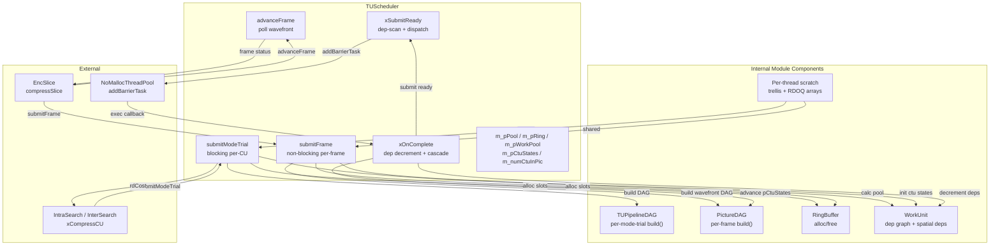
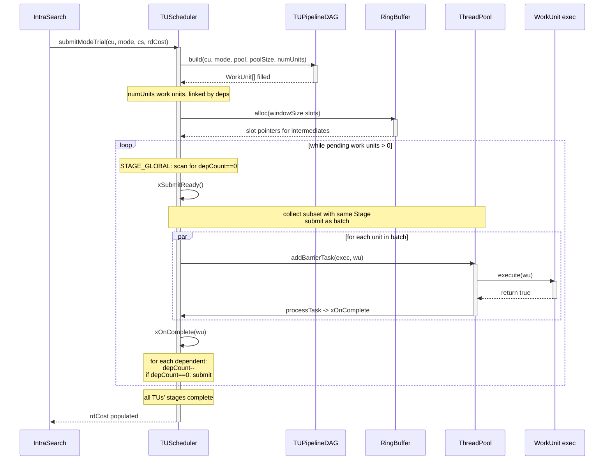

# TUScheduler — TU Pipeline Dispatcher Facade

## 1. Overview

`TUScheduler` is the public facade of the Scheduler module. It receives `submitModeTrial()` calls from `IntraSearch` and `InterSearch` for per-CU mode decision, and `submitFrame()` calls from `EncSlice` for wavefront CTU dispatch. It builds the work-unit DAG via `TUPipelineDAG` or `PictureDAG`, allocates intermediate storage via `RingBuffer`, and dispatches ready work units to `NoMallocThreadPool`.

**Dependencies**: `NoMallocThreadPool.h` (Utilities), `TUPipelineDAG.h`, `PictureDAG.h`, `RingBuffer.h`, `WorkUnit.h`, `CodingStructure.h`, `Slice.h`, `Unit.h`.

**Lifecycle**: `init()` allocates the work unit pool and ring buffer. `submitFrame()` returns immediately — the wavefront advances asynchronously; `advanceFrame()` polls for dispatch. `submitModeTrial()` blocks — it's used for in-CU mode decision and returns only when the CU's TU DAG is complete. `destroy()` frees all resources.

## 2. Component Specifications

### 2.1 Enum: `BatchPolicy`

```cpp
namespace vvenc {

enum class BatchPolicy : uint8_t
{
    TU_SEQUENTIAL,     // dispatch one TU's full pipeline at a time
    STAGE_GLOBAL,      // dispatch same stage across all ready TUs
    HYBRID,            // auto-select per TU size class
    WAVEFRONT          // picture-level wavefront anti-diagonal dispatch
};

}
```

### 2.2 Class: `TUScheduler`

```cpp
#pragma once

#include <atomic>
#include <cstdint>

namespace vvenc {

class NoMallocThreadPool;
class CodingUnit;
class CodingStructure;
class Slice;
class Picture;
class RingBuffer;
struct WorkUnit;

class TUScheduler
{
public:
    /** \brief Initialize the scheduler with a thread pool and window size.
     *  \param[in] pPool      pointer to NoMallocThreadPool instance
     *  \param[in] windowSize number of TUs per batch window (default 8)
     *  \retval 0 on success
     *  \retval -1 if pPool is null
     *  \retval -2 if windowSize < 1
     */
    int init(NoMallocThreadPool* pPool, int windowSize = 8);

    /** \brief Destroy the scheduler and free all resources.
     *  \retval 0 on success
     */
    int destroy();

    /** \brief Submit one mode trial for a CU. Blocks until all TU work units complete.
     *  \param[in]     cu     the coding unit being evaluated
     *  \param[in]     mode   intra or inter mode
     *  \param[in,out] pTempCS temporary coding structure for RD cost accumulation
     *  \param[out]    rdCost accumulated rate-distortion cost for this mode
     *  \retval 0 on success
     *  \retval -1 if not initialized
     *  \retval -2 if DAG construction fails
     */
    int submitModeTrial(CodingUnit* cu, ModeType mode,
                        CodingStructure* pTempCS, double& rdCost);

    /** \brief Submit a frame's CTU wavefront for processing. Non-blocking.
     *  Builds the PictureDAG and begins dispatching CTU_ENCODE stages.
     *  \param[in] slice the slice to encode
     *  \param[in] pic   the picture buffer
     *  \retval 0 on success
     *  \retval -1 if not initialized
     *  \retval -2 if PictureDAG build fails
     */
    int submitFrame(Slice& slice, Picture* pic);

    /** \brief Advance the wavefront dispatch loop.
     *  Called from the encoder main loop. Dispatches newly-ready CTU stages.
     *  \retval 0 if frame still in progress
     *  \retval 1 if frame is complete
     *  \retval -1 if no active frame
     */
    int advanceFrame();

    /** \brief Set the batching policy.
     *  \param[in] ePolicy the batching policy to use
     *  \retval 0 on success
     *  \retval -1 if ePolicy is invalid
     */
    int setPolicy(BatchPolicy ePolicy);

    /** \brief Set the batch window size (TUs per window).
     *  \param[in] nTUs number of TUs per window
     *  \retval 0 on success
     *  \retval -1 if nTUs < 1
     */
    int setWindowSize(int nTUs);

    /** \brief Get the current batch policy.
     *  \return current BatchPolicy
     */
    BatchPolicy getPolicy() const;

    /** \brief Get the current window size.
     *  \return current window size in TUs
     */
    int getWindowSize() const;

    virtual ~TUScheduler();

private:
    /// Thread pool for dispatching work units
    NoMallocThreadPool* m_pPool           = nullptr;

    /// Ring buffer for intermediate storage between stages
    RingBuffer*         m_pRing           = nullptr;

    /// Per-thread scratch memory pool (trellis, cost arrays)
    void*               m_pScratch        = nullptr;

    /// Pre-allocated work unit pool
    WorkUnit*           m_pWorkPool       = nullptr;

    /// Size of the work unit pool
    int                 m_poolSize        = 0;

    /// Per-CTU wavefront state array (size = numCtuInPic)
    std::atomic<int8_t>* m_pCtuStates     = nullptr;

    /// Number of CTUs in the active frame
    int                 m_numCtuInPic     = 0;

    /// Number of CTU columns in the picture
    int                 m_numCtuCols      = 0;

    /// Whether a frame is currently being processed
    bool                m_bFrameActive    = false;

    /// Batch window size in TUs
    int                 m_windowSize      = 8;

    /// Current batching policy
    BatchPolicy         m_ePolicy         = BatchPolicy::WAVEFRONT;

    /// Whether init() has been called
    bool                m_bInitialized    = false;

    /// Submit ready work units (depCount == 0) to the thread pool
    int xSubmitReady();

    /// Completion callback: decrement dependents, submit newly ready units
    static void xOnComplete(WorkUnit* pWu);

    /// Calculate required pool size for a given CU and mode
    int xCalcPoolSize(CodingUnit* cu, ModeType mode);

    /// Calculate required pool size for a frame
    int xCalcFramePoolSize(const Slice& slice);

    /// Reset per-CTU wavefront state for a new frame
    int xInitCtuStates(const Slice& slice);
};

}
```

## 3. System Architecture



## 4. Detailed Data Flow

### 4.1 Frame-level flow (submitFrame)

```mermaid
sequenceDiagram
    participant EncSlice as EncSlice
    participant Sched as TUScheduler
    participant PDAG as PictureDAG
    participant TP as ThreadPool
    participant WUex as CTU WorkUnit exec
    participant TUSched_inner as TUScheduler (internal)

    EncSlice->>Sched: submitFrame(slice, pic)
    activate Sched
    Sched->>PDAG: build(slice, pic, pool, poolSize, numUnits, ctuStates)
    activate PDAG
    Note over PDAG: creates 11 WorkUnits per CTU<br/>with spatial dep edges
    PDAG-->>Sched: WorkUnit[] + ctuStates[]
    deactivate PDAG
    Sched->>Sched: xInitCtuStates() -> all WF_NOT_READY

    rect rgb(30, 40, 60)
        Note over EncSlice,Sched: Wavefront dispatch loop
        loop call each frame cycle
            EncSlice->>Sched: advanceFrame()
            activate Sched
            Sched->>Sched: xSubmitReady()
            Note over Sched: scan for CTU_ENCODE with<br/>depCount==0 AND spatial deps met

            par for each ready CTU
                Sched->>TP: addBarrierTask(execCtuEncode, wu)
                TP->>WUex: execute CTU_ENCODE
                activate WUex
                Note over WUex: internally calls:<br/>xCompressCU(single CU)<br/>which calls submitModeTrial
                WUex->>TUSched_inner: submitModeTrial(cu, mode, tempCS, cost)
                TUSched_inner-->>WUex: cost, mode decision
                Note over WUex: check best mode, recurse or select
                WUex-->>TP: CTU complete
                deactivate WUex
                TP->>Sched: xOnComplete(wu)
                Sched->>Sched: advance pCtuStates[rsAddr]
                Note over Sched: neighbor CTUs' spatial deps<br/>may now be satisfied
            end
            Sched-->>EncSlice: return 0 (in progress) or 1 (done)
            deactivate Sched
        end
    end
    deactivate Sched
```



### 4.2 Mode-trial flow (submitModeTrial)



## 5. Visualization

### 5.1 Animation Concept

A state-machine visualization of the TUScheduler dispatch cycle. Shows a pool of 5 work units cycling through states: `FREE → PREPARING → WAITING → RUNNING → FREE`. A timeline shows which stage and TU each RUNNING burst corresponds to.

**Controls**: Play/Pause, Replay. Speed slider.

### 5.2 Keyframes

| # | Label | State |
|---|-------|-------|
| 0 | idle | Pool: 5 slots all FREE. Scheduler idle. |
| 1 | pool-filled | 5 work units allocated, states shown. |
| 2 | stage-batch-1 | 3 units dispatched RUNNING (PREDICT stage). 2 WAITING. |
| 3 | stage-complete-1 | 3 units→FREE. 2 units promoted to RUNNING. |
| 4 | stage-batch-2 | 2 units RUNNING (FWD_XFORM). 1 WAITING. |
| 5 | drain | All units complete, all FREE. Scheduler reports done. |

### 5.3 Animation Source

```html
<!DOCTYPE html>
<html>
<head>
<meta charset="utf-8">
<title>TUScheduler — Dispatch State Machine</title>
<script src="https://d3js.org/d3.v7.min.js"></script>
<style>
body { font-family: 'Segoe UI', sans-serif; background: #1a1a2e; color: #eee; margin: 0; padding: 20px; display: flex; flex-direction: column; align-items: center; }
#container { width: 800px; text-align: center; }
#controls { display: flex; gap: 12px; justify-content: center; margin: 12px 0; align-items: center; flex-wrap: wrap; }
#controls button { padding: 8px 18px; border: none; border-radius: 6px; cursor: pointer; font-size: 14px; background: #4a90d9; color: white; transition: 0.2s; }
#controls button:hover { background: #357abd; }
#controls button.active { background: #e6a23c; }
#pool-grid { display: flex; gap: 16px; justify-content: center; margin: 16px 0; flex-wrap: wrap; }
.slot { width: 120px; height: 160px; border-radius: 10px; display: flex; flex-direction: column; align-items: center; justify-content: center; border: 2px solid #3a3a5e; transition: all 0.4s; position: relative; }
.slot .state-label { font-size: 13px; font-weight: bold; margin-top: 6px; }
.slot .wu-info { font-size: 11px; color: #aaa; margin-top: 4px; }
.slot.free { background: #2a2a4e; border-color: #3a3a5e; }
.slot.preparing { background: #4a5568; border-color: #e6a23c; }
.slot.waiting { background: #553c1a; border-color: #d69e2e; }
.slot.running { background: #1a3d1a; border-color: #67c23a; box-shadow: 0 0 12px rgba(103,194,58,0.4); }
.slot.running .state-label { color: #67c23a; }
.slot.waiting .state-label { color: #d69e2e; }
.slot.preparing .state-label { color: #e6a23c; }
.slot.free .state-label { color: #666; }
#timeline { margin-top: 20px; width: 100%; height: 60px; background: #16213e; border-radius: 8px; position: relative; overflow: hidden; }
#timeline-bar { height: 100%; background: linear-gradient(90deg, #4a90d9, #67c23a); border-radius: 8px; width: 0%; transition: width 0.3s; }
#event-log { margin-top: 12px; width: 100%; height: 80px; background: #16213e; border-radius: 8px; padding: 8px 12px; font-size: 12px; font-family: 'Consolas', monospace; text-align: left; overflow-y: auto; }
#event-log div { padding: 2px 0; border-bottom: 1px solid #1a1a3e; }
#status { margin: 8px 0; font-size: 13px; }
.kf-info { font-size: 12px; color: #aaa; margin-left: 12px; }
</style>
</head>
<body>
<div id="container">
  <h2 style="margin:0 0 4px 0;">TUScheduler: Work Unit Dispatch State Machine</h2>
  <div id="pool-grid"></div>
  <div id="timeline"><div id="timeline-bar"></div></div>
  <div id="status"></div>
  <div id="controls">
    <button id="play-btn" data-testid="play-pause">Pause</button>
    <button id="replay-btn">Replay</button>
    <span class="kf-info">Keyframe <span id="kf-counter">0</span>/<span id="kf-total">5</span></span>
  </div>
  <div id="event-log"></div>
</div>
<script>
const POOL_SIZE = 5;
const TOTAL_DURATION_MS = 15000;
const keyframes = [
  { time: 0,    label: "idle" },
  { time: 2500, label: "pool-filled" },
  { time: 5500, label: "stage-batch-1" },
  { time: 9500, label: "stage-complete-1" },
  { time: 12500,label: "stage-batch-2" },
  { time: 14500,label: "drain" }
];

window.ANIMATION_DURATION_MS = TOTAL_DURATION_MS;
window.ANIMATION_KEYFRAMES = keyframes.map((k,i) => ({ ...k, idx: i }));
window.ANIMATION_VERIFICATION = [
  { label: "idle", poolFree: 5, poolRunning: 0, poolWaiting: 0, logCount: 0, statusText: "idle" },
  { label: "pool-filled", poolFree: 0, poolRunning: 0, poolWaiting: 0, logCount: 5, statusText: "dag-built" },
  { label: "stage-batch-1", poolFree: 0, poolRunning: 3, poolWaiting: 2, logCount: 8, statusText: "dispatched-stage1" },
  { label: "stage-complete-1", poolFree: 3, poolRunning: 2, poolWaiting: 0, logCount: 11, statusText: "stage1-done" },
  { label: "stage-batch-2", poolFree: 2, poolRunning: 2, poolWaiting: 1, logCount: 14, statusText: "dispatched-stage2" },
  { label: "drain", poolFree: 5, poolRunning: 0, poolWaiting: 0, logCount: 16, statusText: "mode-complete" }
];

let state = {
  slots: Array(POOL_SIZE).fill().map((_,i) => ({
    id: i,
    state: "free",
    stage: "",
    tu: -1
  })),
  running: true,
  currentKf: 0,
  elapsed: 0,
  log: []
};

function renderPool() {
  const grid = d3.select("#pool-grid");
  grid.selectAll("*").remove();

  state.slots.forEach((s, i) => {
    const div = grid.append("div").attr("class", "slot " + s.state);
    div.append("div").attr("class", "wu-info").text("WU " + i);
    div.append("div").attr("class", "state-label").text(s.state.toUpperCase());
    if (s.stage) div.append("div").attr("class", "wu-info").text(s.stage);
    if (s.tu >= 0) div.append("div").attr("class", "wu-info").text("TU " + s.tu);
  });
}

function addLog(text) {
  state.log.push({ time: state.elapsed, text });
  const log = d3.select("#event-log");
  log.selectAll("*").remove();
  state.log.slice(-15).forEach(e => {
    log.append("div").text(`${e.time}ms  ${e.text}`);
  });
  log.node().scrollTop = log.node().scrollHeight;
}

function setAllStates(newStates) {
  newStates.forEach((ns, i) => {
    if (i < state.slots.length) {
      state.slots[i].state = ns.state || "free";
      state.slots[i].stage = ns.stage || "";
      state.slots[i].tu = ns.tu !== undefined ? ns.tu : -1;
    }
  });
  renderPool();
}

function updateStats() {
  const free = state.slots.filter(s => s.state === "free").length;
  const running = state.slots.filter(s => s.state === "running").length;
  const waiting = state.slots.filter(s => s.state === "waiting").length;
  const preparing = state.slots.filter(s => s.state === "preparing").length;
  d3.select("#status").text(`FREE:${free}  PREPARING:${preparing}  WAITING:${waiting}  RUNNING:${running}`);
  d3.select("#kf-counter").text(state.currentKf);
  d3.select("#kf-total").text(keyframes.length - 1);
  const pct = Math.min(100, ((state.currentKf) / (keyframes.length - 1)) * 100);
  d3.select("#timeline-bar").style("width", pct + "%");
}

function applyKeyframe(kfIdx) {
  state.currentKf = kfIdx;
  d3.select("#kf-counter").text(kfIdx);

  switch(kfIdx) {
    case 0: // idle
      setAllStates([
        { state: "free" }, { state: "free" }, { state: "free" }, { state: "free" }, { state: "free" }
      ]);
      state.log = [];
      d3.select("#event-log").selectAll("*").remove();
      break;
    case 1: // pool-filled
      setAllStates([
        { state: "waiting", stage: "INIT_PRED", tu: 0 },
        { state: "waiting", stage: "INIT_PRED", tu: 1 },
        { state: "waiting", stage: "PREDICT", tu: 2 },
        { state: "waiting", stage: "RESIDUAL", tu: 0 },
        { state: "waiting", stage: "RESIDUAL", tu: 1 }
      ]);
      addLog("submitModeTrial: DAG built, 5 work units");
      addLog("WU-0 waiting: stage=INIT_PRED, tu=0");
      addLog("WU-1 waiting: stage=INIT_PRED, tu=1");
      addLog("WU-2 waiting: stage=PREDICT, tu=2");
      addLog("WU-3 waiting: stage=RESIDUAL, tu=0");
      addLog("WU-4 waiting: stage=RESIDUAL, tu=1");
      break;
    case 2: // stage-batch-1: 3 running, 2 waiting
      setAllStates([
        { state: "running", stage: "INIT_PRED", tu: 0 },
        { state: "running", stage: "INIT_PRED", tu: 1 },
        { state: "running", stage: "PREDICT", tu: 2 },
        { state: "waiting", stage: "RESIDUAL", tu: 0 },
        { state: "waiting", stage: "RESIDUAL", tu: 1 }
      ]);
      addLog("xSubmitReady: 3 units READY (depCount=0)");
      addLog("WU-0 RUNNING: INIT_PRED");
      addLog("WU-1 RUNNING: INIT_PRED");
      addLog("WU-2 RUNNING: PREDICT");
      break;
    case 3: // stage-complete-1: 3 freed, 2 running
      setAllStates([
        { state: "free" },
        { state: "free" },
        { state: "free" },
        { state: "running", stage: "RESIDUAL", tu: 0 },
        { state: "running", stage: "RESIDUAL", tu: 1 }
      ]);
      addLog("xOnComplete: WU-0 done, freeing slot");
      addLog("xOnComplete: WU-1 done, freeing slot");
      addLog("xOnComplete: WU-2 done, 2 deps released");
      addLog("xSubmitReady: WU-3 READY, WU-4 READY");
      break;
    case 4: // stage-batch-2: 2 running, 1 waiting
      setAllStates([
        { state: "free" },
        { state: "free" },
        { state: "waiting", stage: "FWD_XFORM", tu: 0 },
        { state: "running", stage: "FWD_XFORM", tu: 0 },
        { state: "running", stage: "FWD_XFORM", tu: 1 }
      ]);
      addLog("stage 2 batch: 2 dispatched, 1 waiting");
      addLog("WU-3 RUNNING: FWD_XFORM 2D DCT");
      addLog("WU-4 RUNNING: FWD_XFORM 2D DCT");
      break;
    case 5: // drain: all free
      setAllStates([
        { state: "free" },
        { state: "free" },
        { state: "free" },
        { state: "free" },
        { state: "free" }
      ]);
      addLog("xOnComplete: last 3 units done");
      addLog("submitModeTrial: mode complete, RD cost returned");
      break;
  }
  updateStats();
}

window.resetAnimation = function() {
  state.running = false;
  state.elapsed = 0;
  state.currentKf = 0;
  applyKeyframe(0);
  d3.select("#play-btn").text("Play");
};

window.jumpToKeyframe = function(idx) {
  if (idx < 0 || idx >= keyframes.length) return;
  state.running = false;
  state.elapsed = keyframes[idx].time;
  state.currentKf = idx;
  applyKeyframe(idx);
  d3.select("#play-btn").text("Play");
};

window.getAnimationState = function() {
  const free = state.slots.filter(s => s.state === "free").length;
  const running = state.slots.filter(s => s.state === "running").length;
  const waiting = state.slots.filter(s => s.state === "waiting").length;
  return {
    poolFree: free,
    poolRunning: running,
    poolWaiting: waiting,
    logCount: state.log.length,
    statusText: keyframes[state.currentKf]?.label || "unknown",
    currentKeyframeIdx: state.currentKf,
    currentKeyframeLabel: keyframes[state.currentKf]?.label || ""
  };
};

// Auto-play
function advanceFrame() {
  if (!state.running) return;
  state.elapsed += 100;
  if (state.elapsed > TOTAL_DURATION_MS) {
    state.running = false;
    d3.select("#play-btn").text("Play");
    return;
  }
  let kfIdx = 0;
  for (let i = keyframes.length - 1; i >= 0; i--) {
    if (state.elapsed >= keyframes[i].time) {
      kfIdx = i;
      break;
    }
  }
  if (kfIdx !== state.currentKf) {
    applyKeyframe(kfIdx);
  }
}

setInterval(advanceFrame, 100);

d3.select("#play-btn").on("click", function() {
  if (state.running) {
    state.running = false;
    d3.select(this).text("Play");
  } else {
    if (state.elapsed >= TOTAL_DURATION_MS) {
      state.elapsed = 0;
      applyKeyframe(0);
    }
    state.running = true;
    d3.select(this).text("Pause");
  }
});

d3.select("#replay-btn").on("click", function() {
  window.resetAnimation();
  state.running = true;
  d3.select("#play-btn").text("Pause");
});

applyKeyframe(0);
</script>
</body>
</html>
```

## 6. Testing Requirements

### Unit Tests

| Test | What to Verify |
|------|----------------|
| `init null pool` | Returns -1 when pPool is null |
| `init invalid window` | Returns -2 when windowSize < 1 |
| `submit before init` | Returns -1 |
| `submit single TU` | Single TU x single component: 7 work units dispatched, correct stages, returns 0 |
| `submit multi TU` | 4 TUs: STAGE_GLOBAL dispatches all stage-0 before any stage-1 |
| `TU_SEQUENTIAL ordering` | With 3 TUs: all 7 stages of TU-0 complete before TU-1 stage 0 |
| `submitFrame single CTU` | 11 CTU-level work units created, CTU(0,0).CTU_ENCODE has depCount=0 |
| `submitFrame 4x4 grid` | 176 WorkUnits, wavefront begins at (0,0) |
| `advanceFrame before submitFrame` | Returns -1 |
| `advanceFrame empty wavefront` | Returns 1 (frame complete) when all CTUs done |
| `setPolicy invalid` | Returns -1 for out-of-range enum value |
| `setWindowSize zero` | Returns -1 |
| `getPolicy after set` | Returns the policy set |
| `destroy without init` | Returns -1 |
| `double init` | Second init returns -1 or succeeds gracefully |

### Integration

- Bit-exactness: `Test_vvencapp_scheduler_bit` verifies byte-identical output vs baseline (mode-level path; frame-level wavefront is a behavioral change and not bit-exact)
- For each batching policy: verify dispatch count equals expected total (numTU x numComponents x stagesPerComponent)
- Frame-level: verify that each CTU's 11 stages dispatch in the correct order across the wavefront
