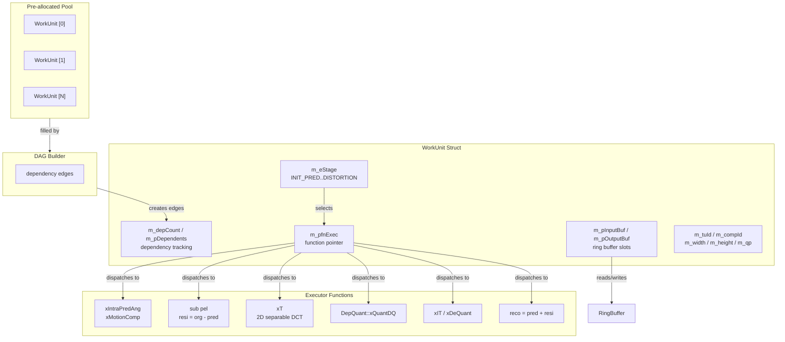

# WorkUnit — Dispatchable Pipeline Stage Unit

## 1. Overview

`WorkUnit` is the fundamental dispatchable unit in the scheduler. It represents one pipeline stage for one component of one TU. The `Stage` enum defines every possible operation in the TU pipeline. The `WorkFunc` typedef is the function pointer signature for executing a stage.

**Dependencies**: `std::atomic`, `<cstdint>`, `CommonDef.h` (for `ComponentID`). No encoder-specific headers.

**Lifecycle**: WorkUnits are created by `TUPipelineDAG::build()` in a pre-allocated pool. They are not individually allocated or freed — the pool is reused across mode trials.

## 2. Component Specifications

### 2.1 Enum: `Stage`

```cpp
#pragma once

#include <cstdint>
#include <atomic>

namespace vvenc {

enum class Stage : uint8_t
{
    INIT_PRED    = 0,   ///< Prepare intra reference samples
    PREDICT      = 1,   ///< Generate prediction signal (intra or inter)
    RESIDUAL     = 2,   ///< resi = org - pred
    FWD_XFORM    = 3,   ///< 2D separable DCT/DST forward transform
    LFNST_FWD    = 4,   ///< LFNST reduction (optional, gated by TU size)
    QUANT_FILL   = 5,   ///< RDOQ cost array fill + DepQuant trellis forward pass
    QUANT_TRACE  = 6,   ///< DepQuant backward trace + level extraction
    DEQUANT      = 7,   ///< Inverse quantization
    LFNST_INV    = 8,   ///< LFNST inverse (optional)
    INV_XFORM    = 9,   ///< 2D inverse DCT/DST
    RECONSTRUCT  = 10,  ///< reco = pred + resi
    DISTORTION   = 11,  ///< SSE computation
    _COUNT       = 12
};

}
```

### 2.2 Typedef: `WorkFunc`

```cpp
namespace vvenc {

/** \brief Work unit executor function pointer.
 *  \param[in,out] pWu      the work unit to execute
 *  \param[in,out] pScratch per-thread scratch buffer pointer
 *  \return true if execution succeeded (unit completes), false to reschedule
 */
using WorkFunc = bool (*)(WorkUnit* pWu, void* pScratch);

}
```

### 2.3 Struct: `WorkUnit`

```cpp
namespace vvenc {

struct WorkUnit
{
    /// Pipeline stage this unit represents
    Stage           m_eStage;

    /// Flat TU index within the mode trial's TU list
    uint32_t        m_tuId;

    /// Colour component index (COMP_Y, COMP_Cb, COMP_Cr)
    ComponentID     m_compId;

    /// Transform block dimensions
    int             m_width     = 0;
    int             m_height    = 0;

    /// Quantization parameter
    int8_t          m_qp        = 0;

    /// MTS index for transform selection
    uint8_t         m_mtsIdx    = 0;

    /// Coded block flag (pre-computed by earlier stage)
    bool            m_bCbf      = false;

    /// Number of remaining dependencies. When 0, the unit is ready to dispatch.
    std::atomic<int> m_depCount{ 0 };

    /// List of dependent work units; each gets depCount-- on completion.
    WorkUnit**      m_pDependents    = nullptr;

    /// Number of entries in m_pDependents
    int             m_numDependents  = 0;

    /// Input buffer pointer (from previous stage's output or ring buffer)
    void*           m_pInputBuf      = nullptr;

    /// Output buffer pointer (to next stage's input)
    void*           m_pOutputBuf     = nullptr;

    /// Scratch buffer for this unit's execution (trellis, cost arrays)
    void*           m_pScratch       = nullptr;

    /// Executor function for this stage
    WorkFunc        m_pfnExec        = nullptr;
};

}
```

## 3. System Architecture



## 4. Detailed Data Flow

No sequence diagram — the WorkUnit is a passive data structure, not an active participant. Its flow is described by the `TUPipelineDAG` sequence diagram, which creates and links WorkUnits, and the `TUScheduler` sequence diagram, which dispatches them.

## 5. Visualization

No D3 animation — a struct definition has no temporal state machine to verify.

## 6. Testing Requirements

### Unit Tests

| Test | What to Verify |
|------|----------------|
| Stage enum uniqueness | All values 0..11, no duplicates, _COUNT = 12 |
| WorkUnit default state | depCount=0, all pointers null |
| depCount decrement | CAS correctly produces 0 after N decrements |
| depCount negative guard | Cannot decrement below 0 (unsigned/saturating) |
| WorkFunc signature | Can be constructed from `bool (*)(WorkUnit*, void*)` |
