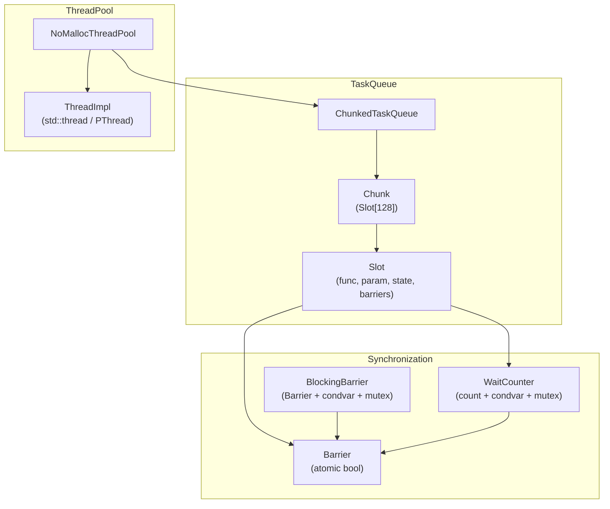
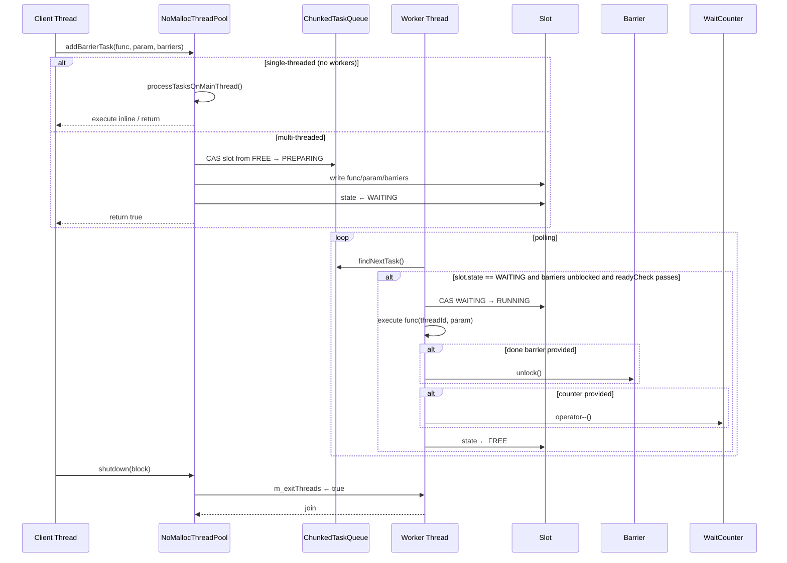

# NoMallocThreadPool — Lock-Free Thread Pool for Wavefront Parallelism

## Overview

`NoMallocThreadPool` provides a lock-free, pre-allocated thread pool for wavefront-style parallelism in VVenC encoding. It avoids dynamic memory allocation during task execution by using a `ChunkedTaskQueue` of fixed-size `Slot` entries. Tasks are submitted via `addBarrierTask`, which supports optional barriers, wait-counters, and ready-check callbacks.

## Class Diagram

## Task Execution Sequence

## Key Design Decisions

| Decision | Rationale |
|---|---|
| **Lock-freedom via CAS** | No `malloc` during encode loop; avoids priority inversion and jitter |
| **ChunkedTaskQueue** | Grows by appending 128-slot chunks; iterator wraps around for fair scheduling |
| **Barrier / BlockingBarrier** | Lightweight spin barrier for short waits; blocking fallback with `condition_variable` after `BUSY_WAIT_TIME` |
| **`ADD_TASK_THREAD_SAFE`** | Optional mutex around `m_nextFillSlot` for multi-producer scenarios |
| **`readyCheck` callback** | Enables conditional execution (e.g. only run when data dependency is resolved) |
