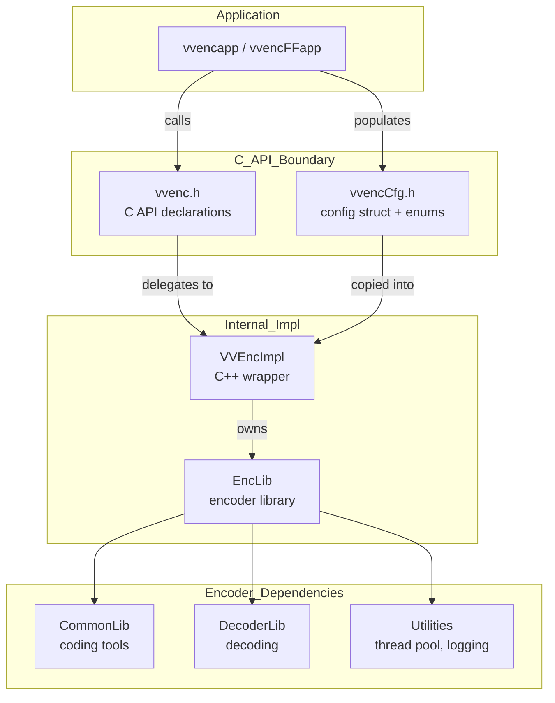
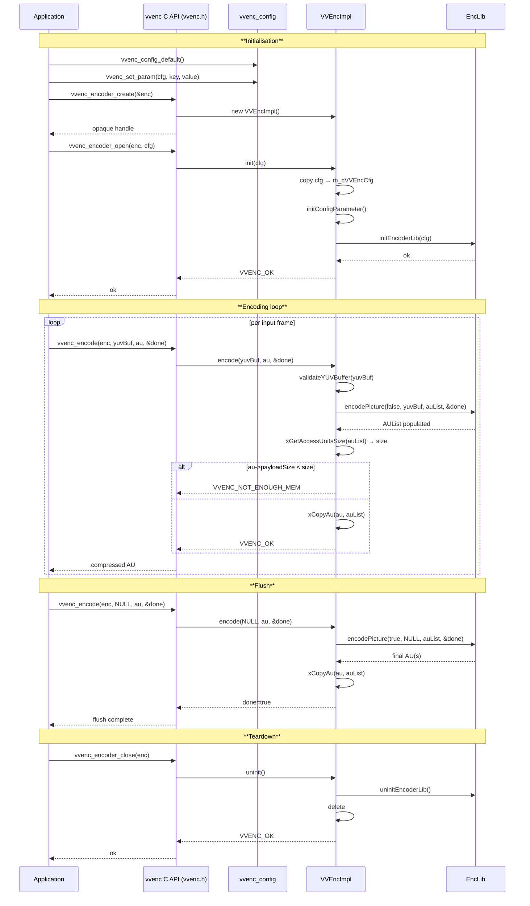

# VVenC — VVenC Module (C API Facade, Config, Implementation)

## 1. Overview

The `vvenc` module is the public-facing facade of the VVenC encoder. It consists of three components: the public C API header (`vvenc.h`), the public configuration struct (`vvencCfg.h`), and the internal C++ implementation (`VVEncImpl`). Together they form the single entry point through which all external applications interact with the encoder.

**Dependencies**: `CommonLib`, `EncoderLib`, `Utilities` (MsgLog).

**Lifecycle**: `vvenc_encoder_create()` → `vvenc_encoder_open()` → `vvenc_encode()` loop → `vvenc_encoder_close()`.

## 2. Component Specifications

| # | Spec File | Role |
|---|-----------|------|
| 1 | `vvenc.spec.md` | Public C API — opaque handle, YUV input, AU output, encode lifecycle |
| 2 | `vvencCfg.spec.md` | Public configuration struct ~200 fields, enums, preset/param helpers |
| 3 | `vvencimpl.spec.md` | Internal `VVEncImpl` C++ class — 5-state machine, EncLib wrapper |

## 3. System Architecture

### 3.1 Module Boundary Summary

| Boundary | Type | Details |
|----------|------|---------|
| Public API | C functions | `vvenc_encoder_create/open/close`, `vvenc_encode`, `vvenc_get_config`, `vvenc_get_headers` |
| Public types | C structs | `vvencEncoder` (opaque), `vvencYUVBuffer`, `vvencAccessUnit`, `vvenc_config` |
| Internal bridge | C++ class | `VVEncImpl` — wraps EncLib, manages state machine |
| Library boundary | Shared/static | `libvvenc` exports C API via `VVENC_EXPORT` macros |

## 4. Detailed Data Flow

## 5. Visualisation

No D3 animation — the module is a C API facade with no visualisation. Internal encoder pipeline animation is covered in `EncLib.spec.md`.

## 6. Testing Requirements

### Unit Tests (new file: `test/vvenc_unit_test/vvenc_module_test.cpp`)

| Test ID | Function | What to Verify |
|---------|----------|---------------|
| `VVC_CREATE_CLOSE` | `vvenc_encoder_create` + close | Handle non-NULL, close returns VVENC_OK |
| `VVC_OPEN_CLOSE` | `vvenc_encoder_open` + close | Full lifecycle with valid config |
| `VVC_ENCODE_IFRAME` | `vvenc_encode` | Single I-frame produces non-zero AU with RAP flag |
| `VVC_ENCODE_FLUSH` | `vvenc_encode(NULL, ...)` | Flush completes with encodeDone=true |
| `VVC_DOUBLE_OPEN` | `vvenc_encoder_open` × 2 | Second open returns VVENC_ERR_INITIALIZE |
| `VVC_GET_CONFIG` | `vvenc_get_config` | Retrieved config matches set config |
| `VVC_GET_HEADERS` | `vvenc_get_headers` | Non-empty SPS/PPS/VPS returned |
| `VVC_RECONFIG` | `vvenc_reconfig` | Returns VVENC_ERR_NOT_SUPPORTED |
| `VVC_CONFIG_DEFAULT` | `vvenc_config_default` | All fields set to valid defaults |
| `VVC_CONFIG_PRESET` | `vvenc_init_default` | Preset correctly populates related fields |
| `VVC_CONFIG_PARAM` | `vvenc_set_param` | Key-value pairs parsed correctly |
| `VVC_IMPL_STATE_MACHINE` | VVEncImpl states | State transitions: UNINIT → INIT → ENCODING → FLUSHING → FINALIZED |
| `VVC_IMPL_INVALID_STATE` | VVEncImpl encode before init | Returns VVENC_ERR_INITIALIZE |
| `VVC_IMPL_YUV_VALIDATION` | VVEncImpl validateYUVBuffer | Invalid planes/chroma rejected |

### Integration Tests

- Encode 16-frame sequence using C API, verify AU list integrity and PSNR
- Encode at all presets via `vvenc_init_default`, verify configuration consistency
- Two-pass encode: `vvenc_init_pass(0)` → first pass → `vvenc_init_pass(1)` → second pass

## 7. CLI Entry Point

The C API is consumed by two CLI applications:
- **`vvencapp`** — primary encoder application, links against libvvenc
- **`vvencFFapp`** — feature-rich reference encoder application

Both use `vvenc_encoder_create/open/encode/close` and `vvenc_config_default/set_param`.
