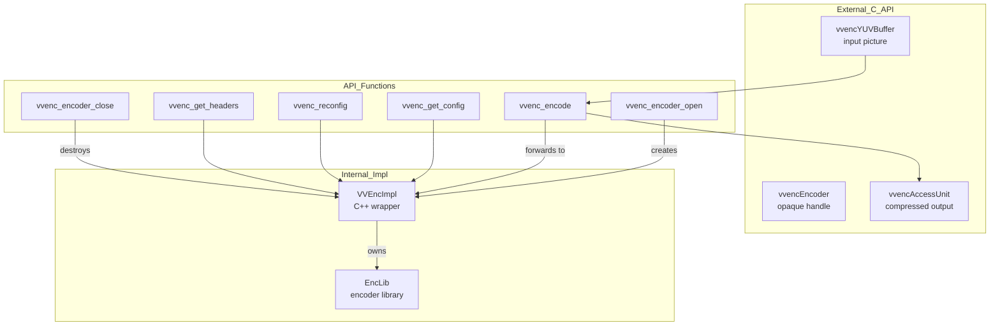
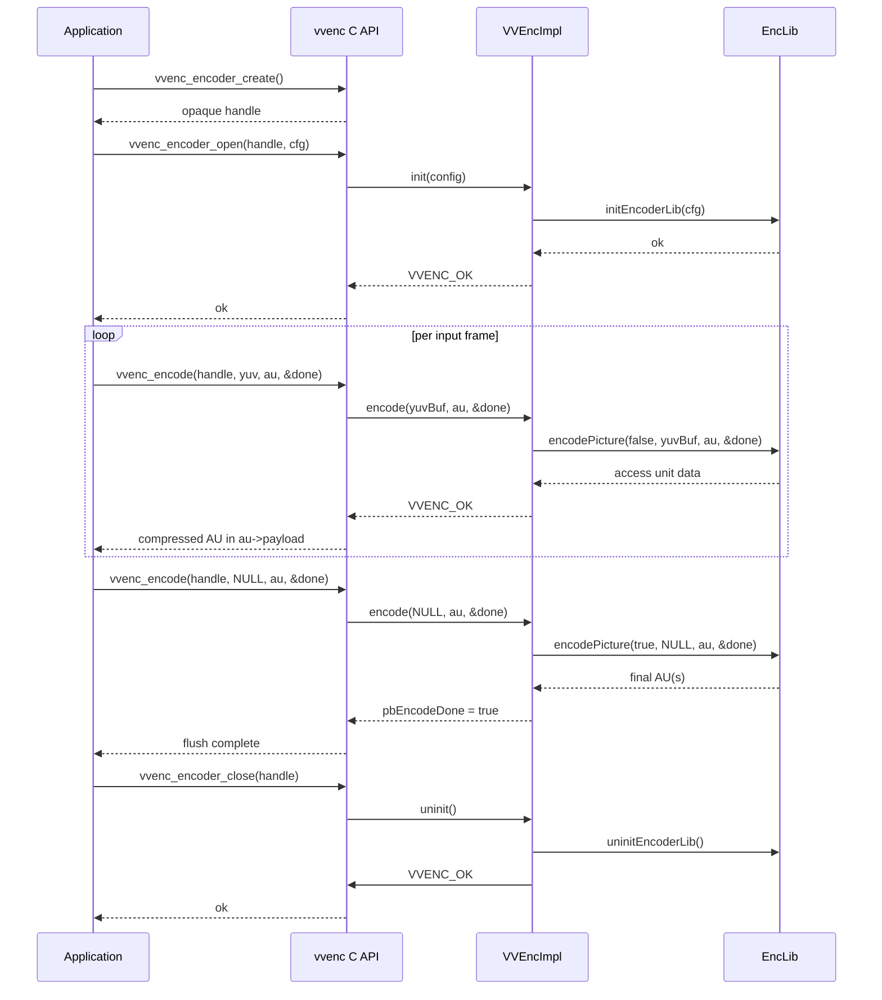
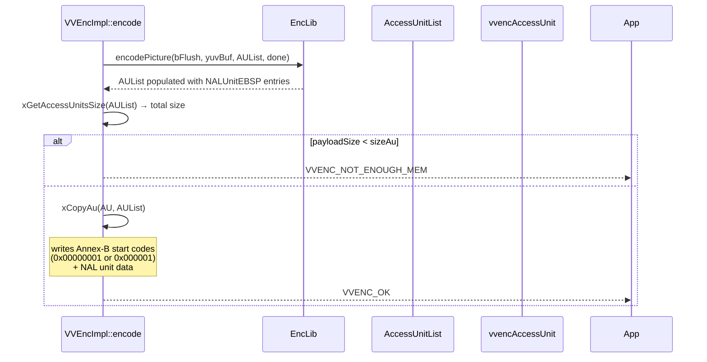

# vvenc — VVenC External C API

## 1. Overview

The `vvenc` module defines the complete external C API of the VVenC H.266/VVC encoder. It is declared in `include/vvenc/vvenc.h` (generated from `vvenc.h.in`). This API provides opaque encoder handle creation/destruction, frame-by-frame YUV input and compressed bitstream output, parameter set retrieval, reconfiguration, logging, SIMD control, and utility functions.

**Key types:**
- `vvencEncoder` — opaque encoder instance handle
- `vvencYUVPlane` / `vvencYUVBuffer` — uncompressed input picture descriptors
- `vvencAccessUnit` — compressed bitstream output descriptor with timing and metadata
- `vvencRecYUVBufferCallback` — callback for reconstructed YUV output
- `vvencLoggingCallback` — callback for encoder log messages

**Dependencies**: `vvenc/vvencDecl.h` (visibility/DLL macros), `vvenc/vvencCfg.h` (config struct).

**Lifecycle**: `vvenc_encoder_create()` → `vvenc_encoder_open()` → `vvenc_encode()` loop → flush (encode with NULL input) → `vvenc_encoder_close()`.

## 2. Component Specifications

### 2.1 Opaque Handle: `vvencEncoder`

```cpp
typedef struct vvencEncoder vvencEncoder;
```

Fully opaque — no fields are exposed. Internal implementation is in `VVEncImpl` (C++ class in `vvencimpl.h`).

### 2.2 Struct: `vvencYUVPlane`

```cpp
typedef struct vvencYUVPlane {
  int16_t*  ptr;     // pointer to plane buffer
  int       width;   // width of the plane
  int       height;  // height of the plane
  int       stride;  // stride (width + left margin + right margin) in samples
} vvencYUVPlane;
```

### 2.3 Struct: `vvencYUVBuffer`

```cpp
typedef struct vvencYUVBuffer {
  vvencYUVPlane planes[3];  // plane buffers for 3 components (Y, Cb, Cr)
  uint64_t      sequenceNumber;  // picture sequence number
  int64_t       cts;             // composition time stamp in TicksPerSecond
  bool          ctsValid;        // CTS valid flag
  void*         userData;        // user data (if VVENC_USE_UNSTABLE_API)
} vvencYUVBuffer;
```

### 2.4 Struct: `vvencAccessUnit`

```cpp
typedef struct vvencAccessUnit {
  unsigned char*  payload;         // coded data buffer
  int             payloadSize;     // allocated size (caller sets)
  int             payloadUsedSize; // filled size (encoder sets)
  int64_t         cts;             // composition time stamp
  int64_t         dts;             // decoding time stamp
  bool            ctsValid, dtsValid;
  bool            rap;             // random access point flag
  vvencSliceType  sliceType;       // I/P/B
  bool            refPic;          // reference picture
  int             temporalLayer;
  uint64_t        poc;             // picture order count
  int             status;
  int             essentialBytes;  // bytes in essential NAL units
  char            infoString[VVENC_MAX_STRING_LEN];
  void*           userData;        // (if VVENC_USE_UNSTABLE_API)
} vvencAccessUnit;
```

### 2.5 Error Codes

```cpp
enum ErrorCodes {
  VVENC_OK                   = 0,
  VVENC_ERR_UNSPECIFIED      = -1,
  VVENC_ERR_INITIALIZE       = -2,
  VVENC_ERR_ALLOCATE         = -3,
  VVENC_NOT_ENOUGH_MEM       = -5,
  VVENC_ERR_PARAMETER        = -7,
  VVENC_ERR_NOT_SUPPORTED    = -10,
  VVENC_ERR_RESTART_REQUIRED = -11,
  VVENC_ERR_CPU              = -30,
};
```

### 2.6 API Functions

| Function | Purpose |
|---|---|
| `vvenc_get_version()` | Return encoder version string |
| `vvenc_encoder_create()` | Allocate opaque encoder handle |
| `vvenc_encoder_open(enc, cfg)` | Initialise encoder with config |
| `vvenc_encoder_close(enc)` | Destroy encoder, free resources |
| `vvenc_encoder_set_RecYUVBufferCallback(enc, ctx, cb)` | Register reconstructed YUV callback |
| `vvenc_init_pass(enc, pass, statsFName)` | Initialise specific RC pass |
| `vvenc_encode(enc, yuv, au, done)` | Encode one frame or flush |
| `vvenc_get_config(enc, cfg)` | Retrieve current internal config |
| `vvenc_reconfig(enc, cfg)` | Change parameters mid-stream |
| `vvenc_check_config(enc, cfg)` | Validate config without applying |
| `vvenc_get_headers(enc, au)` | Get SPS/PPS/VPS parameter sets |
| `vvenc_get_last_error(enc)` | Return last error string |
| `vvenc_get_enc_information(enc)` | Return encoder info string |
| `vvenc_get_num_lead_frames(enc)` | Lead frames needed by MCTF |
| `vvenc_get_num_trail_frames(enc)` | Trail frames needed by MCTF |
| `vvenc_print_summary(enc)` | Print encoding summary |
| `vvenc_get_error_msg(nRet)` | Translate error code to string |
| `vvenc_set_logging_callback(ctx, cb)` | Global logger (deprecated) |
| `vvenc_get_compile_info_string()` | OS/compiler/bits info |
| `vvenc_set_SIMD_extension(simdId)` | Set/query SIMD level |
| `vvenc_get_width_of_component(...)` | Width helper for chroma formats |
| `vvenc_get_height_of_component(...)` | Height helper for chroma formats |

### 2.7 Memory Functions

```cpp
vvencYUVBuffer*  vvenc_YUVBuffer_alloc();
void             vvenc_YUVBuffer_free(vvencYUVBuffer*, bool freePicBuffer);
void             vvenc_YUVBuffer_default(vvencYUVBuffer*);
void             vvenc_YUVBuffer_alloc_buffer(vvencYUVBuffer*, vvencChromaFormat, int w, int h);
void             vvenc_YUVBuffer_free_buffer(vvencYUVBuffer*);

vvencAccessUnit* vvenc_accessUnit_alloc();
void             vvenc_accessUnit_free(vvencAccessUnit*, bool freePayload);
void             vvenc_accessUnit_alloc_payload(vvencAccessUnit*, int size);
void             vvenc_accessUnit_free_payload(vvencAccessUnit*);
void             vvenc_accessUnit_reset(vvencAccessUnit*);
void             vvenc_accessUnit_default(vvencAccessUnit*);
```

## 3. System Architecture



## 4. Detailed Data Flow

### 4.1 Encoder Lifecycle



### 4.2 Access Unit Output Format



## 5. Visualisation

No D3 animation — the C API is a procedural interface. The internal encode lifecycle animation is covered in `vvencimpl.spec.md`.

## 6. Testing Requirements

### Unit Tests (new file: `test/vvenc_api_test.cpp`)

| Test ID | Function | What to Verify |
|---|---|---|
| `API_CREATE_CLOSE` | `vvenc_encoder_create` / close | Handle non-NULL, close returns VVENC_OK |
| `API_OPEN_CLOSE` | `vvenc_encoder_open` + close | Full open/close cycle succeeds |
| `API_ENCODE_FRAME` | `vvenc_encode` | Single I-frame encode produces non-zero AU |
| `API_ENCODE_FLUSH` | `vvenc_encode(NULL, ...)` | Flush completes with encodeDone=true |
| `API_DOUBLE_OPEN` | `vvenc_encoder_open` × 2 | Second open returns VVENC_ERR_INITIALIZE |
| `API_GET_CONFIG` | `vvenc_get_config` | Retrieved config matches set config |
| `API_GET_HEADERS` | `vvenc_get_headers` | Non-empty SPS/PPS/VPS returned |
| `API_GET_LEAD_TRAIL` | `vvenc_get_num_lead/trail_frames` | Lead >= 0, trail >= 0 |
| `API_GET_ERROR_MSG` | `vvenc_get_error_msg` | All error codes map to non-empty strings |
| `API_GET_VERSION` | `vvenc_get_version` | Non-empty version string |
| `API_GET_ENC_INFO` | `vvenc_get_enc_information` | Non-empty info string |
| `API_YUV_ALLOC` | `vvenc_YUVBuffer_alloc/free` | Allocation succeeds, buffer fields default |
| `API_YUV_ALLOC_BUF` | `vvenc_YUVBuffer_alloc_buffer` | Planes allocated with correct stride |
| `API_AU_ALLOC` | `vvenc_accessUnit_alloc/free` | Allocation succeeds, payload null |
| `API_AU_ALLOC_PAYLOAD` | `vvenc_accessUnit_alloc_payload` | Payload allocated with correct size |
| `API_AU_RESET` | `vvenc_accessUnit_reset` | Fields reset without freeing payload |

### Error Handling

- NULL handle returns appropriate error codes for all functions
- `vvenc_encode` with NULL YUV buffer initiates flush sequence
- `vvenc_encoder_open` with invalid config returns VVENC_ERR_PARAMETER
- `vvenc_get_headers` before open returns VVENC_ERR_INITIALIZE

### Integration Tests

- Encode 1+ GOP with known config, verify AU output has correct NAL unit types
- Verify `rap` flag is set on IDR/CRA AUs and false otherwise
- Verify `essentialBytes` count matches SPS+PPS+VPS+slice total
- Two-pass encode: vvenc_init_pass(0) → encode pass1 → vvenc_init_pass(1) → encode pass2 → verify output bitrates

## 7. CLI Entry Point

The C API is consumed by two CLI applications:

- **`vvencapp`** — primary encoder application, links against libvvenc and calls the C API directly
- **`vvencFFapp`** — feature-rich reference encoder application, also uses the C API

Both applications:
1. Parse CLI args → populate `vvenc_config` via `vvenc_config_default()` + `vvenc_set_param()`
2. Call `vvenc_encoder_create()` → `vvenc_encoder_open()`
3. Loop: read raw YUV → `vvenc_encode()` → write compressed AU
4. Flush with NULL input
5. Call `vvenc_encoder_close()`
