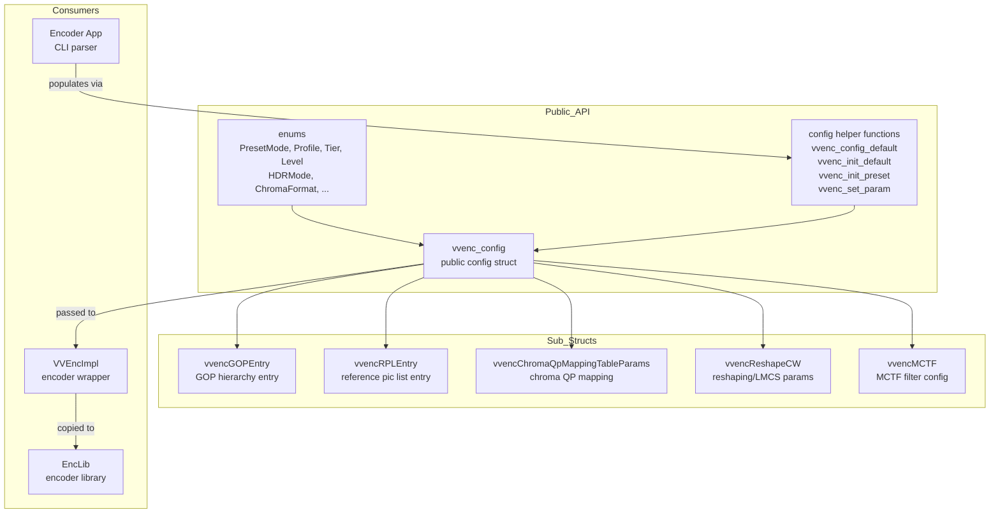
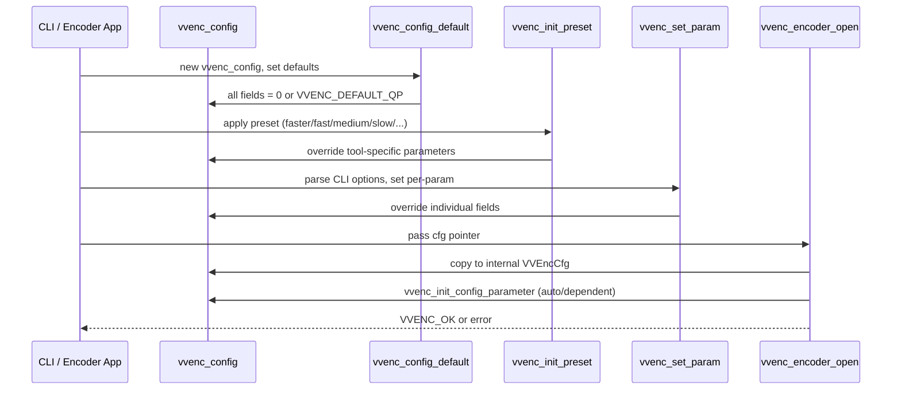
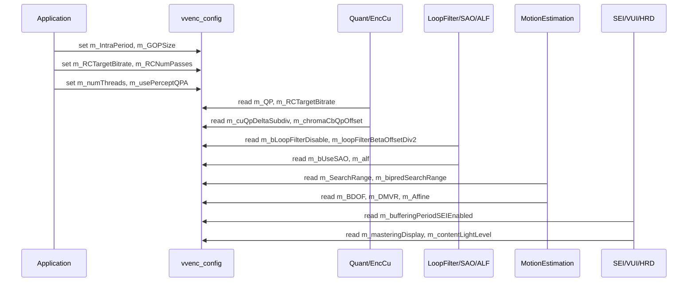

# vvencCfg — VVenC Public Configuration Struct

## 1. Overview

`vvencCfg` defines the public C API configuration struct `vvenc_config` — the single struct through which all encoder parameters are communicated. It is declared in `include/vvenc/vvencCfg.h` alongside all configuration enums (preset, profile, tier, level, HDR mode, etc.) and helper functions for default initialisation, preset application, and string-parameter parsing.

**Key types:**
- `vvencPresetMode`, `vvencProfile`, `vvencTier`, `vvencLevel`, `vvencHDRMode`, `vvencDecodingRefreshType`, `vvencChromaFormat`, `vvencCostMode`, `vvencHashType`, `vvencMESearchMethod`, `vvencFastInterSearchMode`, `vvencNalUnitType`, `vvencMsgLevel`, `vvencSegmentMode`, `vvencSliceType` — enum types
- `vvencGOPEntry`, `vvencRPLEntry`, `vvencChromaQpMappingTableParams`, `vvencReshapeCW`, `vvencMCTF`, `vvencUnusedStruct0` — sub-structs
- `vvenc_config` — the main configuration struct (~200 fields)

**Dependencies**: `vvenc/vvencDecl.h` (DLL export macros), `<stdint.h>`, `<stdbool.h>`, `<stdarg.h>`.

**Lifecycle**: Created and populated by the application, passed to `vvenc_encoder_open()` which copies it internally. Must be initialised via `vvenc_config_default()` or `vvenc_init_default()` before use.

## 2. Component Specifications

### 2.1 Enum: `vvencPresetMode`

```cpp
typedef enum {
  VVENC_NONE         = -1,
  VVENC_FASTER       = 0,
  VVENC_FAST         = 1,
  VVENC_MEDIUM       = 2,
  VVENC_SLOW         = 3,
  VVENC_SLOWER       = 4,
  VVENC_MEDIUM_LOWDECNRG = 130,
  VVENC_FIRSTPASS    = 254,
  VVENC_TOOLTEST     = 255,
} vvencPresetMode;
```

### 2.2 Enum: `vvencProfile / vvencTier / vvencLevel`

```cpp
typedef enum {
  VVENC_PROFILE_AUTO                   = 0,
  VVENC_MAIN_10                        = 1,
  VVENC_MAIN_10_STILL_PICTURE          = 1 + 64,
  VVENC_MAIN_10_444                    = 33,
  VVENC_MAIN_10_444_STILL_PICTURE      = 33 + 64,
  VVENC_MULTILAYER_MAIN_10             = 17,
  VVENC_MULTILAYER_MAIN_10_STILL_PICTURE = 17 + 64,
  VVENC_MULTILAYER_MAIN_10_444         = 49,
  VVENC_MULTILAYER_MAIN_10_444_STILL_PICTURE = 49 + 64,
} vvencProfile;

typedef enum { VVENC_TIER_MAIN = 0, VVENC_TIER_HIGH = 1 } vvencTier;

typedef enum {
  VVENC_LEVEL_AUTO = 0,  VVENC_LEVEL1 = 16,  VVENC_LEVEL2 = 32,
  VVENC_LEVEL2_1 = 35,   VVENC_LEVEL3 = 48,  VVENC_LEVEL3_1 = 51,
  VVENC_LEVEL4 = 64,     VVENC_LEVEL4_1 = 67, VVENC_LEVEL5 = 80,
  VVENC_LEVEL5_1 = 83,   VVENC_LEVEL5_2 = 86, VVENC_LEVEL6 = 96,
  VVENC_LEVEL6_1 = 99,   VVENC_LEVEL6_2 = 102, VVENC_LEVEL6_3 = 105,
  VVENC_LEVEL15_5 = 255,
} vvencLevel;
```

### 2.3 Sub-struct: `vvencGOPEntry`

```cpp
typedef struct vvencGOPEntry {
  int    m_POC;
  int    m_QPOffset;
  double m_QPOffsetModelOffset;
  double m_QPOffsetModelScale;
  int    m_CbQPoffset;
  int    m_CrQPoffset;
  double m_QPFactor;
  int    m_tcOffsetDiv2;
  int    m_betaOffsetDiv2;
  int    m_temporalId;
  char   m_sliceType;
  int    m_numRefPicsActive[2];
  int    m_numRefPics[2];
  int    m_deltaRefPics[2][VVENC_MAX_NUM_REF_PICS];
} vvencGOPEntry;
```

### 2.4 Main Struct: `vvenc_config`

```cpp
typedef struct vvenc_config {
  // Core parameters
  int    m_SourceWidth, m_SourceHeight;
  int    m_FrameRate, m_FrameScale, m_TicksPerSecond;
  int    m_framesToBeEncoded;
  int    m_inputBitDepth[2];
  int    m_numThreads;
  int    m_QP;
  int    m_RCTargetBitrate;
  vvencMsgLevel m_verbosity;

  // Basic configuration
  vvencProfile  m_profile;
  vvencTier     m_levelTier;
  vvencLevel    m_level;
  int           m_IntraPeriod, m_IntraPeriodSec;
  vvencDecodingRefreshType m_DecodingRefreshType;
  int           m_GOPSize;
  int           m_RCNumPasses, m_RCPass;
  int           m_internalBitDepth[2];
  vvencHDRMode  m_HdrMode;
  vvencSegmentMode m_SegmentMode;
  bool          m_usePerceptQPA;
  int32_t       m_numTileCols, m_numTileRows;

  // Expert parameters (~100 additional fields for rate control, 
  // loop filter, SAO, ALF, MCTF, SIMD, tiles, slices, SEIs, 
  // chroma QP mapping, reshaping, merge candidates, IBC, etc.)

  // ML-guided encoding (LightGBM)
  int                   m_mlEnable;                  // 0=off, 1=on (default: 0)
  double                m_mlConfidenceThreshold;     // minimum confidence 0.0-1.0 (default: 0.80)
  char                  m_mlModelDir[VVENC_MAX_STRING_LEN]; // path to model directory

  // AI training data generation (VVENC_ENABLE_AI_TRAINING)
  char                  m_trainingOutputFile[VVENC_MAX_STRING_LEN]; // VVENC_TRAINING_OUT CSV path

  // ML feedback (VVENC_ENABLE_ML_LIGHTGBM)
  char                  m_feedbackOutputFile[VVENC_MAX_STRING_LEN]; // VVENC_ML_FEEDBACK CSV path

  // State variables
  bool                  m_configDone;
  bool                  m_confirmFailed;
  vvencLoggingCallback  m_msgFnc;
  void*                 m_msgCtx;
} vvenc_config;
```

### 2.5 Helper Functions

```cpp
void  vvenc_config_default(vvenc_config* cfg);
int   vvenc_init_default(vvenc_config* cfg, int w, int h, int fps, int bitrate, int qp, vvencPresetMode preset);
int   vvenc_init_preset(vvenc_config* cfg, vvencPresetMode preset);
void  vvenc_set_msg_callback(vvenc_config* cfg, void* ctx, vvencLoggingCallback cb);
bool  vvenc_init_config_parameter(vvenc_config* cfg);
int   vvenc_set_param(vvenc_config* cfg, const char* name, const char* value);
int   vvenc_set_param_list(vvenc_config* c, int argc, char* argv[]);
const char* vvenc_get_config_as_string(vvenc_config* cfg, vvencMsgLevel level);
```

## 3. System Architecture



## 4. Detailed Data Flow

### 4.1 Config Initialisation Flow



### 4.2 Preset Configuration Hierarchy



## 5. Visualisation

No D3 animation — `vvenc_config` is a static data struct populated at startup and read at init time. Runtime parameter changes are handled through `vvenc_reconfig()`.

## 6. Testing Requirements

### Unit Tests (new file: `test/vvenc_config_test.cpp`)

| Test ID | Method | What to Verify |
|---|---|---|
| `CFG_DEFAULTS` | `vvenc_config_default()` | All fields set to expected defaults (QP=32, verbosity=SILENT, etc.) |
| `CFG_INIT_DEFAULT` | `vvenc_init_default()` | Core params applied: width, height, framerate, bitrate, QP, preset |
| `CFG_INIT_PRESET` | `vvenc_init_preset()` | Preset overrides tool flags correctly (FASTER vs SLOWER) |
| `CFG_SET_PARAM` | `vvenc_set_param()` | String-based parameter set for all VVENC_OPT_* macros |
| `CFG_SET_PARAM_LIST` | `vvenc_set_param_list()` | Argv-style parameter parsing |
| `CFG_INIT_CONFIG_PARAM` | `vvenc_init_config_parameter()` | Auto-init of dependent parameters (GOP, internal bit depth, etc.) |
| `CFG_ML_DEFAULTS` | `vvenc_config_default()` | `m_mlEnable=0`, `m_mlConfidenceThreshold=0.80`, `m_mlModelDir=""`, `m_trainingOutputFile=""`, `m_feedbackOutputFile=""` |
| `CFG_LOGGING_CB` | `vvenc_set_msg_callback()` | Callback registered and fired on log |
| `CFG_CONFIG_STRING` | `vvenc_get_config_as_string()` | Non-empty config string returned |
| `CFG_GOP_ENTRY` | `vvenc_GOPEntry_default()` | GOPEntry defaults valid |
| `CFG_RPL_ENTRY` | `vvenc_RPLEntry_default()` | RPLEntry defaults valid |
| `CFG_CHROMA_QP_MAP` | `vvenc_ChromaQpMappingTableParams_default()` | Chroma QP table defaults |
| `CFG_MCTF_DEFAULTS` | `vvenc_vvencMCTF_default()` | MCTF config defaults |
| `CFG_VIDEO_USABILITY_INFO` | VUI fields | VUI, HRD, colour primaries, mastering display set correctly |

### Configuration Consistency Checks

- `m_RCTargetBitrate > 0` requires `m_RCNumPasses` to be set
- `m_IntraPeriod` and `m_GOPSize` must be compatible
- `m_SourceWidth`/`m_SourceHeight` must be multiples of min CU size
- Profile/Level/Tier combination must be valid per VVC spec
- `m_numThreads` must not exceed available cores (clamped internally)

### Error Handling

- `vvenc_set_param()` returns `VVENC_PARAM_BAD_NAME` for unknown option name
- `vvenc_set_param()` returns `VVENC_PARAM_BAD_VALUE` for unparsable value
- `vvenc_init_default()` returns error for invalid width/height < 64
- `vvenc_init_preset()` fails if no default config was initialised first

## 7. CLI Entry Point

The `vvenc_config` struct is exposed through the VVenC encoder CLI (`vvencapp`) via command-line options. The `vvenc_set_param()` function enables string-based parameter configuration at runtime:

- Single params: `vvenc_set_param(cfg, "bitrate", "500000")`
- Param lists: `vvenc_set_param_list(cfg, argc, argv)`
- Preset selection: `vvenc_init_preset(cfg, VVENC_MEDIUM)`

The `vvenc_config_default()` function must be called before any individual parameter is set, ensuring all fields have well-defined starting values.
