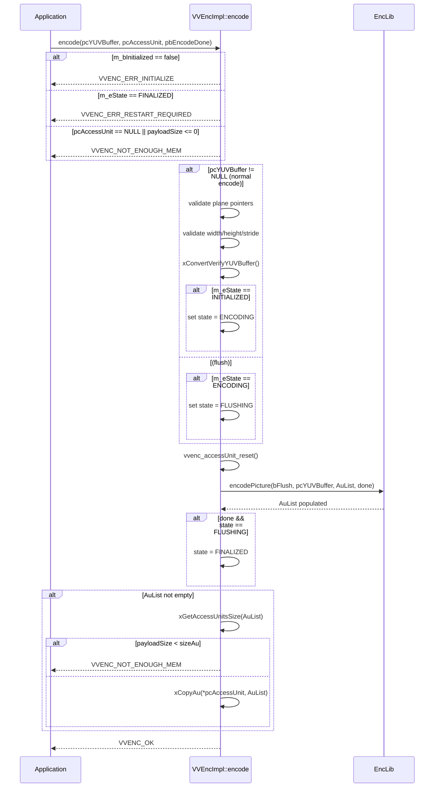
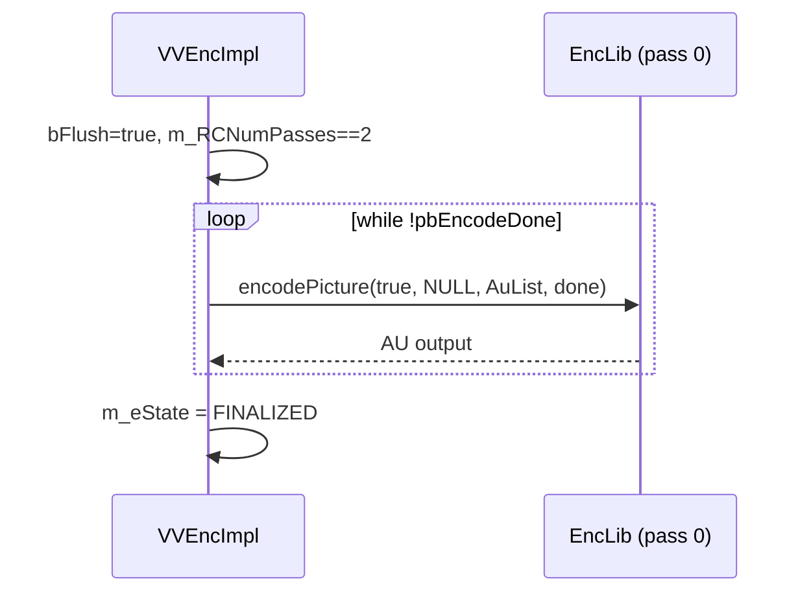

# vvencimpl — VVEncImpl Internal Encoder Wrapper

## 1. Overview

`VVEncImpl` is the internal C++ class that wraps the encoder library (`EncLib`) and implements the public C API (`vvenc_encoder_create`, `vvenc_encode`, `vvenc_encoder_close`, etc.). It manages the entire encode lifecycle via a 5-state internal state machine, owns all encoder resources, handles YUV buffer conversion/verification, and copies compressed access units from the internal `AccessUnitList` to the externally-provided `vvencAccessUnit` buffer.

**Key types:**
- `VVEncImpl` — main encoder wrapper class
- `VVEncInternalState` — 5-state machine: UNINITIALIZED → INITIALIZED → ENCODING → FLUSHING → FINALIZED

**Dependencies**: `vvenc/vvencCfg.h`, `vvenc/vvenc.h` (public API types), `EncoderLib/EncLib.h` (encoder library), `Utilities/MsgLog.h` (logging).

**Lifecycle**: Constructed by `vvenc_encoder_create()`, initialised by `init()`, driven by `encode()` calls, terminated by `uninit()`.

## 2. Component Specifications

### 2.1 State Machine

```cpp
enum VVEncInternalState {
  INTERNAL_STATE_UNINITIALIZED = 0,  // after construction / after uninit
  INTERNAL_STATE_INITIALIZED   = 1,  // after init() succeeds
  INTERNAL_STATE_ENCODING      = 2,  // after first non-flush encode()
  INTERNAL_STATE_FLUSHING      = 3,  // after NULL-input encode()
  INTERNAL_STATE_FINALIZED     = 4,  // after flush completes
};
```

### 2.2 Public Methods

| Method | Description |
|---|---|
| `VVEncImpl()` | Constructor — ensures SIMD detection, builds encoder info string |
| `~VVEncImpl()` | Destructor |
| `init(vvenc_config*)` | Copy config, init config parameters, create EncLib, init encoder |
| `initPass(int pass, const char* statsFName)` | Init multi-pass RC pass |
| `uninit()` | Uninit EncLib, delete, free heap memory, reset state |
| `isInitialized()` | Returns `m_bInitialized` |
| `setRecYUVBufferCallback(void*, vvencRecYUVBufferCallback)` | Forward to EncLib |
| `encode(vvencYUVBuffer*, vvencAccessUnit*, bool* pbEncodeDone)` | Core encode — validate input, delegate to EncLib, copy AU |
| `getParameterSets(vvencAccessUnit*)` | Retrieve SPS/PPS/VPS NAL units |
| `getConfig(vvenc_config&)` | Copy internal config to caller |
| `reconfig(const vvenc_config&)` | Return VVENC_ERR_NOT_SUPPORTED |
| `checkConfig(const vvenc_config&)` | Run `vvenc_init_config_parameter()` on copy |
| `setAndRetErrorMsg(int)` | Set error string and return code |
| `getNumLeadFrames()` | Return `m_cVVEncCfg.m_leadFrames` |
| `getNumTrailFrames()` | Return `m_cVVEncCfg.m_trailFrames` |
| `printSummary()` | Delegate to EncLib::printSummary() |
| `getEncoderInfo()` | Return `m_cEncoderInfo` |

### 2.3 Static Methods

| Method | Description |
|---|---|
| `getErrorMsg(int)` | Translate error code → string via `vvencErrorMsg[]` |
| `getVersionNumber()` | Return `VVENC_VERSION` |
| `registerMsgCbf(void*, vvencLoggingCallback)` | Global logger (deprecated) |
| `setSIMDExtension(const char*)` | Detect/request SIMD level |
| `getCompileInfoString()` | Build OS + compiler + bits string |
| `createEncoderInfoStr()` | Build full encoder info: "VVenC, ... version X [SIMD=...]" |
| `decodeBitstream(...)` | Deprecated, returns VVENC_ERR_NOT_SUPPORTED |

### 2.4 Private Methods

| Method | Description |
|---|---|
| `xGetAccessUnitsSize(const AccessUnitList&)` | Sum NAL unit sizes with Annex-B overhead |
| `xCopyAu(vvencAccessUnit&, const AccessUnitList&)` | Serialise NAL units with Annex-B start codes |
| `xConvertVerifyYUVBuffer(vvencYUVBuffer*)` | Bit-depth conversion + overflow check |

### 2.5 Internal State

```cpp
class VVEncImpl {
  VVEncInternalState  m_eState          = INTERNAL_STATE_UNINITIALIZED;
  bool                m_bInitialized    = false;
  vvenc_config        m_cVVEncCfgExt;   // external (user) config
  vvenc_config        m_cVVEncCfg;      // internal (adapted) config
  std::string         m_cErrorString;
  std::string         m_cEncoderInfo;
  EncLib*             m_pEncLib         = nullptr;
#if VVENC_ENABLE_ML_LIGHTGBM
  FASTSplitPredictor* m_pMLPredictor    = nullptr;
#endif
  MsgLog              msg;
};
```

## 3. System Architecture

```mermaid
graph TB
    subgraph External
        C_API[vvenc C API<br/>vvenc_encoder_create<br/>vvenc_encode<br/>vvenc_encoder_close]
    end

    subgraph VVEncImpl
        State[State Machine<br/>UNINIT → INIT →<br/>ENCODING → FLUSH → FINAL]
        Config[m_cVVEncCfg<br/>internal config]
        Error[m_cErrorString<br/>error reporting]
        Info[m_cEncoderInfo<br/>version + SIMD info]
    end

    subgraph Encoder Library
        EncLib[EncLib]
        MsgLog[MsgLog<br/>logging]
    end

    C_API -->|creates/owns| VVEncImpl
    VVEncImpl -->|owns| EncLib
    VVEncImpl -->|uses| MsgLog
    Config -->|read by| EncLib
    EncLib -->|results| State
    VVEncImpl -->|static helpers| SIMD[setSIMDExtension]
    VVEncImpl -->|static helpers| Version[getVersionNumber]
```



## 4. Detailed Data Flow

### 4.1 Input Validation in `encode()`



### 4.2 2-Pass RC Flush (special case)



## 5. Visualisation

```html
<!DOCTYPE html>
<html lang="en">
<head>
<meta charset="UTF-8">
<meta name="viewport" content="width=device-width, initial-scale=1.0">
<title>VVEncImpl State Machine</title>
<script src="https://d3js.org/d3.v7.min.js"></script>
<style>
  body { margin: 0; overflow: hidden; background: #1a1a2e; font-family: 'Courier New', monospace; }
  #container { width: 900px; height: 600px; position: relative; }
  .state-box { stroke: #e94560; stroke-width: 2; fill: #16213e; rx: 8; ry: 8; cursor: pointer; }
  .state-box-active { stroke: #00ff88; stroke-width: 3; fill: #1a3a2e; }
  .state-label { fill: #e94560; font-size: 11px; text-anchor: middle; dominant-baseline: middle; }
  .state-label-active { fill: #00ff88; }
  .arrow { stroke: #0f3460; stroke-width: 2; fill: none; marker-end: url(#arrowhead); }
  .arrow-active { stroke: #00ff88; stroke-width: 3; }
  .transition-label { fill: #aaa; font-size: 9px; text-anchor: middle; }
  .error-text { fill: #ff4444; font-size: 10px; text-anchor: middle; }
  .counter-label { fill: #aaa; font-size: 12px; text-anchor: start; }
</style>
</head>
<body>
<div id="container">
  <svg width="900" height="600">
    <defs>
      <marker id="arrowhead" viewBox="0 0 10 10" refX="9" refY="5" markerWidth="6" markerHeight="6" orient="auto">
        <path d="M 0 0 L 10 5 L 0 10 z" fill="#0f3460"/>
      </marker>
      <marker id="arrowhead-active" viewBox="0 0 10 10" refX="9" refY="5" markerWidth="6" markerHeight="6" orient="auto">
        <path d="M 0 0 L 10 5 L 0 10 z" fill="#00ff88"/>
      </marker>
    </defs>
  </svg>
</div>
<script>
(function() {
  const width = 900, height = 600;
  const svg = d3.select("#container svg");

  const states = [
    { id: "uninit",  x: 40,  y: 100, w: 140, h: 60, label: "UNINITIALIZED" },
    { id: "init",    x: 250, y: 100, w: 140, h: 60, label: "INITIALIZED" },
    { id: "encode",  x: 460, y: 100, w: 140, h: 60, label: "ENCODING" },
    { id: "flush",   x: 460, y: 270, w: 140, h: 60, label: "FLUSHING" },
    { id: "final",   x: 250, y: 270, w: 140, h: 60, label: "FINALIZED" },
  ];

  const transitions = [
    { from: "uninit", to: "init",    label: "init(cfg)" },
    { from: "init",   to: "encode",  label: "encode(frame)" },
    { from: "encode", to: "flush",   label: "encode(NULL)" },
    { from: "flush",  to: "final",   label: "done=true" },
    { from: "init",   to: "final",   label: "encode(NULL)\n(no frames)" },
    { from: "final",  to: "uninit",  label: "uninit()" },
    { from: "encode", to: "encode",  label: "encode(frame)" },
    { from: "init",   to: "init",    label: "initPass()" },
  ];

  const errorTransitions = [
    { from: "init",   to: "uninit",  label: "init fails" },
    { from: "encode", to: "uninit",  label: "fatal error" },
  ];

  let currentState = "uninit";
  let cycleCount = 0;
  let frameCount = 0;

  // Draw states
  states.forEach(s => {
    const g = svg.append("g").attr("class", "state-group");
    g.append("rect")
      .attr("class", "state-box")
      .attr("id", "box-" + s.id)
      .attr("x", s.x).attr("y", s.y)
      .attr("width", s.w).attr("height", s.h);
    g.append("text")
      .attr("class", "state-label")
      .attr("id", "label-" + s.id)
      .attr("x", s.x + s.w/2)
      .attr("y", s.y + s.h/2)
      .text(s.label);
  });

  // Draw transitions
  transitions.forEach(t => {
    const src = states.find(s => s.id === t.from);
    const dst = states.find(s => s.id === t.to);
    if (t.from === t.to) {
      // self-loop
      svg.append("path")
        .attr("class", "arrow")
        .attr("id", "arrow-" + t.from + "-" + t.to)
        .attr("d", `M ${src.x + src.w} ${src.y + 10} C ${src.x + src.w + 40} ${src.y - 20}, ${src.x + src.w + 40} ${src.y - 20}, ${src.x + src.w} ${src.y + src.h - 10}`);
      svg.append("text")
        .attr("class", "transition-label")
        .attr("x", src.x + src.w + 25)
        .attr("y", src.y + src.h/2)
        .text(t.label);
    } else {
      svg.append("line")
        .attr("class", "arrow")
        .attr("id", "arrow-" + t.from + "-" + t.to)
        .attr("x1", src.x + src.w)
        .attr("y1", src.y + src.h/2)
        .attr("x2", dst.x)
        .attr("y2", dst.y + dst.h/2);
      const midX = (src.x + src.w + dst.x) / 2;
      const midY = (src.y + src.h/2 + dst.y + dst.h/2) / 2;
      svg.append("text")
        .attr("class", "transition-label")
        .attr("x", midX)
        .attr("y", midY - 8)
        .text(t.label);
    }
  });

  // Draw error transitions
  errorTransitions.forEach(t => {
    const src = states.find(s => s.id === t.from);
    const dst = states.find(s => s.id === t.to);
    const srcX2 = src.x, dstX2 = dst.x + dst.w;
    svg.append("path")
      .attr("class", "arrow")
      .attr("stroke", "#ff4444")
      .attr("marker-end", "none")
      .attr("d", `M ${src.x} ${src.y + src.h + 10} C ${src.x - 40} ${src.y + src.h + 30}, ${dst.x + dst.w + 40} ${dst.y + dst.h + 30}, ${dst.x + dst.w} ${dst.y + dst.h/2}`);
    const midXerr = (src.x + dst.x + dst.w) / 2;
    const midYerr = Math.max(src.y, dst.y) + src.h + 25;
    svg.append("text")
      .attr("class", "error-text")
      .attr("x", midXerr)
      .attr("y", midYerr)
      .text(t.label);
  });

  // Status
  const statusLabel = svg.append("text")
    .attr("class", "counter-label")
    .attr("x", 650).attr("y", 30)
    .text("State: UNINITIALIZED");

  const frameLabel = svg.append("text")
    .attr("class", "counter-label")
    .attr("x", 650).attr("y", 50)
    .text("Frames: 0");

  // Animation: walk through states
  function highlightState(stateId) {
    svg.selectAll(".state-box")
      .attr("class", "state-box");
    svg.selectAll(".state-label")
      .attr("class", "state-label");
    svg.selectAll(".arrow")
      .attr("class", "arrow");

    d3.select("#box-" + stateId).attr("class", "state-box state-box-active");
    d3.select("#label-" + stateId).attr("class", "state-label state-label-active");
    currentState = stateId;
    statusLabel.text("State: " + states.find(s => s.id === stateId).label);
  }

  const stateSequence = [
    { state: "uninit", delay: 1000 },
    { state: "init",   delay: 2000 },
    { state: "encode", delay: 3500 },
    { state: "encode", delay: 4500 },
    { state: "encode", delay: 5500 },
    { state: "flush",  delay: 7000 },
    { state: "final",  delay: 8500 },
    { state: "uninit", delay: 9500 },
  ];

  stateSequence.forEach((step, i) => {
    setTimeout(() => {
      highlightState(step.state);
      if (step.state === "encode") frameCount++;
      frameLabel.text("Frames: " + frameCount);
    }, step.delay);
  });

  window.ANIMATION_KEYFRAMES = [
    { time: 0,     label: "uninit" },
    { time: 1000,  label: "init" },
    { time: 2000,  label: "encode-frame-1" },
    { time: 3500,  label: "encode-frame-2" },
    { time: 4500,  label: "encode-frame-3" },
    { time: 5500,  label: "flush" },
    { time: 7000,  label: "finalized" },
    { time: 8500,  label: "uninit" },
  ];

  window.ANIMATION_DURATION_MS = 10000;
})();
</script>
</body>
</html>
```

## 6. Testing Requirements

### Unit Tests (new file: `test/vvenc_impl_test.cpp`)

| Test ID | Method | What to Verify |
|---|---|---|
| `IMPL_CONSTRUCTOR` | `VVEncImpl()` | State = UNINITIALIZED, m_bInitialized = false |
| `IMPL_INIT_OK` | `init(cfg)` | State → INITIALIZED, m_pEncLib != nullptr |
| `IMPL_INIT_NULL_CFG` | `init(NULL)` | Returns VVENC_ERR_PARAMETER |
| `IMPL_INIT_DOUBLE` | `init()` × 2 | Second returns VVENC_ERR_INITIALIZE |
| `IMPL_UNINIT` | `uninit()` | State → UNINITIALIZED, m_pEncLib = nullptr |
| `IMPL_UNINIT_NOT_INIT` | `uninit()` before init | Returns VVENC_ERR_INITIALIZE |
| `IMPL_ENCODE_VALID` | `encode(yuv, au, &done)` | au populated, state → ENCODING |
| `IMPL_ENCODE_NULL_YUV` | `encode(NULL, au, &done)` | State → FLUSHING |
| `IMPL_ENCODE_FLUSH_FINAL` | `encode(NULL)` after state=FLUSHING | State → FINALIZED, done=true |
| `IMPL_ENCODE_AFTER_FINAL` | `encode(yuv)` after FINALIZED | Returns VVENC_ERR_RESTART_REQUIRED |
| `IMPL_GET_CONFIG` | `getConfig(cfg)` | Returns internal m_cVVEncCfg |
| `IMPL_CHECK_CONFIG` | `checkConfig(cfg)` | Returns VVENC_OK for valid cfg |
| `IMPL_RECONFIG` | `reconfig(cfg)` | Returns VVENC_ERR_NOT_SUPPORTED |
| `IMPL_GET_HEADERS` | `getParameterSets(au)` | Non-empty SPS/PPS/VPS AUs |
| `IMPL_GET_LEAD_TRAIL` | `getNumLeadFrames/TrailFrames()` | Match config values |
| `IMPL_GET_ERROR` | `getLastError()` | Non-empty after error |
| `IMPL_GET_VERSION` | `getVersionNumber()` | Equals VVENC_VERSION |
| `IMPL_GET_ENCODER_INFO` | `getEncoderInfo()` | Contains "VVenC" string |
| `IMPL_GET_ERROR_MSG` | `getErrorMsg(code)` | Maps all error codes |

### Input Validation

| Test | What to Verify |
|---|---|
| NULL plane[0] ptr | Returns VVENC_ERR_UNSPECIFIED |
| Wrong width | Returns VVENC_ERR_UNSPECIFIED |
| Wrong stride < width | Returns VVENC_ERR_UNSPECIFIED |
| Chroma 420 but missing Cb/Cr | Returns VVENC_ERR_UNSPECIFIED |
| Values outside bit range | xConvertVerifyYUVBuffer returns false |
| AU payload too small | Returns VVENC_NOT_ENOUGH_MEM |

### Integration Tests

- Full encode sequence: init → N × encode (YUV frames) → flush → uninit, verify all states
- Multi-pass RC: initPass(0) → encode pass1 → initPass(1) → encode pass2
- SIMD detection: `setSIMDExtension("")` returns highest available
- Simulation of encode with 2-pass RC flush loop draining all pending pictures

## 7. CLI Entry Point

Not directly exposed via CLI. `VVEncImpl` is the internal implementation behind the C API used by both `vvencapp` and `vvencFFapp`. The application creates the encoder via `vvenc_encoder_create()` which internally allocates a `VVEncImpl` instance, then interacts with it through the procedural C API (which maps 1:1 to `VVEncImpl` methods — see `vvenc.spec.md` for the C API layer).
