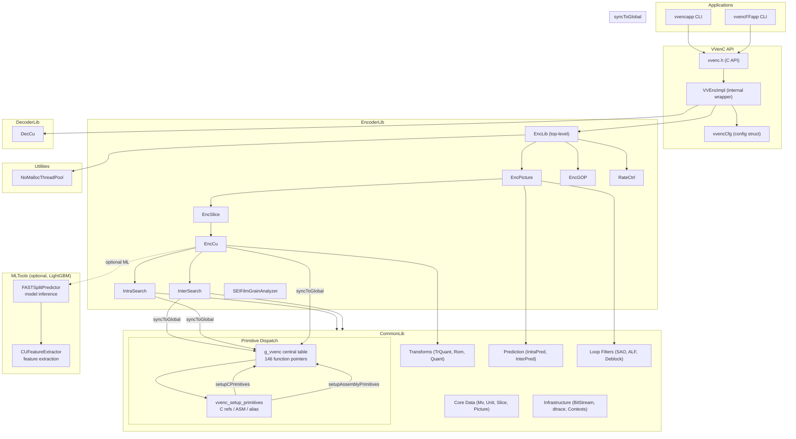
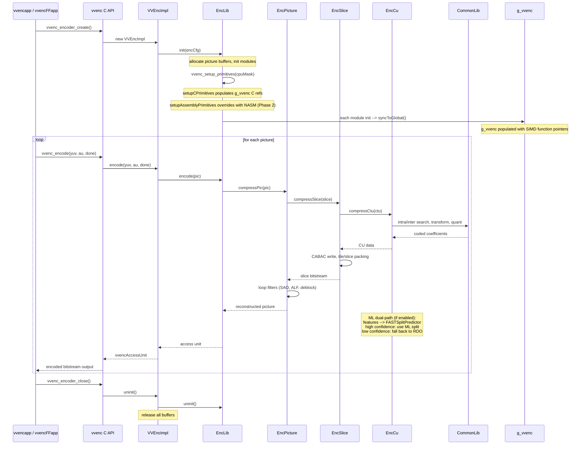

# Technical Specification: deepenc — AI-Driven VVenC Optimization Fork

HAS_SUB_MODULES=true

## Overview

deepenc is a fork of [VVenC](https://github.com/fraunhoferhhi/vvenc) (Fraunhofer Versatile Video Encoder) that integrates AI-driven kernel optimization capabilities. This document describes the modifications and instrumentation added to the VVenC C/C++ source code.

The ML-guided CU partitioning module follows the approach of **Taabane et al. (IEEE Access, 2024)** — see `deepenc-harness/technical-specification.md` for the full reference and `source/Lib/MLTools/` specs for implementation details.

## Scope

This specification covers the deepenc source fork only. The harness tooling (trace generation, optimization agent, test pyramid, etc.) is specified in `deepenc-harness/technical-specification.md`.

## Module Reference

| Module | Directory | Facade Class | Aggregate Spec | Internal Spec Files |
|---|---|---|---|---|---|
| CommonLib | `source/Lib/CommonLib/` | — | `CommonLib.spec.md` | 40 files (BitStream through asm-primitives) |
| Utilities | `source/Lib/Utilities/` | `NoMallocThreadPool` | — | 1 file |
| EncoderLib | `source/Lib/EncoderLib/` | `EncLib` | `EncoderLib.spec.md` | 25 files (BinEncoder through EncLib) |
| DecoderLib | `source/Lib/DecoderLib/` | `DecCu` | — | 1 file |
| MLTools | `source/Lib/MLTools/` | `FASTSplitPredictor` | `MLTools.spec.md` | 3 files (FASTSplitPredictor, CUFeatureExtractor, FakeModelFactory) |
| VVenC API | `source/Lib/vvenc/` | `VVEncImpl` | `VVenC.spec.md` | 3 files (vvencCfg, vvenc, vvencimpl) |
| vvencapp | `source/App/vvencapp/` | — | — | 1 file |
| vvencFFapp | `source/App/vvencFFapp/` | `EncApp` | — | 2 files (EncApp, encmain) |

**Total: 80 internal spec files across 8 modules.**

## 2. Centralized Primitive Dispatch

The deepenc fork introduces a **centralized SIMD/primitive dispatch table** (`g_vvenc`) that consolidates the 17 per-module function pointer tables into a single `VVencPrimitive` struct. This architecture mirrors the approach used by x265's `EncoderPrimitives` singleton, enabling future hand-written assembly optimization without modifying existing per-instance dispatch.

### 2.1 Architecture

The dispatch system has three layers:

| Layer | Component | Role | Status |
|-------|-----------|------|--------|
| **Global table** | `VVencPrimitive g_vvenc` | Central struct holding ~146 function pointers across 14 sub-structs | Implemented |
| **Per-instance tables** | `m_*` members in each module | Authoritative dispatch for production code — `syncToGlobal()` copies to `g_vvenc` | Unchanged (backward compat) |
| **Assembly registry** | `setupAssemblyPrimitives()` | Overrides `g_vvenc` entries with NASM functions | Stub (Phase 2) |

### 2.2 Setup Chain

```
vvenc_setup_primitives(cpuMask)
  → setupCPrimitives(g_vvenc)            // C scalar fallbacks
  → setupAssemblyPrimitives(g_vvenc, cpuMask)  // NASM overrides (Phase 2)
  → setupAliasPrimitives(g_vvenc)        // HBD/chroma aliases (Phase 3)
```

### 2.3 syncToGlobal Pattern

Each module that has function pointer dispatch tables exposes a `syncToGlobal()` method. This copies the per-instance function pointers to `g_vvenc`, keeping the global table in sync. The call chain is:

```
Module constructor → populates m_* with C defaults → syncToGlobal()
Module::init(true) → initModuleX86() → overrides m_* with SIMD → syncToGlobal()
```

### 2.4 Dispatch Table Catalog

The complete dispatch table — every function pointer in `g_vvenc`, its C scalar implementation, intrinsic override, and reserved NASM name — is specified in `source/Lib/CommonLib/Primitives.spec.md §3`.

| Sub-struct | Module | Entries | Perf Share | syncToGlobal |
|-----------|--------|---------|-----------|-------------|
| `interp` | InterpolationFilter | 23 | 3.0% | ✅ |
| `dist` | RdCost | 70 | 8.6% | ◐ (struct only) |
| `pelbuf` | PelBufferOps | 7 | <1% | ◐ (struct only) |
| `alf` | AdaptiveLoopFilter | 4 | 3.0% | ✅ |
| `tr` | TrQuant + TCoeffOps | 11 | 1.6% | ✅ |
| `affine` | AffineGradientSearch | 4 | 1.5% | ✅ |
| `intra` | IntraPrediction | 6 | 2.4% | ✅ |
| `bdof` | BDOF/PROF | 5 | 2.0% | ✅ |
| `sao` | SampleAdaptiveOffset | 5 | <0.5% | ✅ |
| `mctf` | MCTF | 2 | <0.5% | ✅ |
| `dq` | DepQuant | 5 | 21.7% | ✅ |
| `quant` | Quant | 2 | <0.5% | ✅ |
| `lf` | LoopFilter | 2 | <0.5% | ✅ |

### 2.5 NASM Assembly Support

The build system detects `nasm` and enables `.asm` file compilation in `source/Lib/CommonLib/x86/`. Assembly functions register into `g_vvenc` via `setupAssemblyPrimitives()`. When `nasm` is not found, assembly is gracefully disabled.

See `source/Lib/CommonLib/x86/asm-primitives.spec.md` for the assembly infrastructure specification.

## 3. System Architecture



## 4. Detailed Data Flow



## 5. C++ Coding Conventions

This section documents the C++ idioms, naming conventions, and patterns used throughout the deepenc codebase. All generated specifications and class declarations must follow these conventions.

### Language & Build

- **C++14** target (`-std=c++14`). No C++17 or later features.
- **Include guard**: `#pragma once` only (no `#ifndef`).
- **Namespace**: Everything lives in `namespace vvenc { ... }`.
- **Build system**: CMake (minimum 3.13) with a GNU Make convenience wrapper.
- **License header**: Clear BSD License block at the top of every file.

### Documentation

- **Doxygen**: `/** \file <name> \brief <summary> */` at the top of every file.
- **Method docs**: `\param[in]`, `\param[out]`, `\retval` tags.
- **Group tags**: `\ingroup VVEnc`, `\ingroup CommonLib`, `\ingroup EncoderLib`.

### Naming Conventions

| Category | Pattern | Example |
|---|---|---|
| Classes | PascalCase | `VVEncImpl`, `EncLib`, `NoMallocThreadPool` |
| Methods | PascalCase | `initEncoderLib()`, `encodePicture()` |
| Member variables | `m_` prefix | `m_pEncLib`, `m_eState`, `m_bInitialized`, `m_cErrorString`, `m_picSharedList` |
| Member pointer | `m_p` prefix | `m_pEncLib`, `m_preEncoder` |
| Member bool | `m_b` prefix | `m_bInitialized`, `m_accessUnitOutputStarted` |
| Member enum | `m_e` prefix | `m_eState` |
| Member string | `m_c` prefix | `m_cErrorString`, `m_cEncoderInfo` |
| Private helpers | `x` prefix | `xGetAccessUnitsSize()`, `xUninitLib()` |
| Constants | `static constexpr` | `MAX_CU_DEPTH`, `MAX_TB_SIZEY` |
| Macros | `UPPER_CASE` | `VVENC_MAX_GOP`, `ENABLE_SIMD_OPT`, `ENABLE_ASM` |
| C API types | `vvenc` prefix | `vvencEncoder`, `vvenc_config`, `vvencYUVBuffer` |
| C API functions | `vvenc_` prefix | `vvenc_encoder_create()`, `vvenc_encode()` |

### Class Structure

- **No inheritance** — plain classes with composition and forward declarations.
- **Virtual destructor** — always present (`virtual ~ClassName()`) even for non-polymorphic classes.
- **In-class member initialization** — prefer `Type m_member = value` over constructor init-lists.
- **Forward declarations** — used extensively for dependent classes (e.g., `class EncLib;`).
- **`explicit`** — used on single-argument constructors where applicable.
- **`syncToGlobal()` pattern** — modules with function pointer dispatch tables expose a `syncToGlobal()` method that copies per-instance `m_*` tables to the central `g_vvenc` dispatch table. Called at end of constructor and after SIMD init.

### Assembly Conventions

- **NASM/YASM** assembly files live in `source/Lib/CommonLib/x86/` alongside C++ SIMD intrinsics.
- **Function naming**: `vvenc_<operation>_<size>_<isa>` (e.g., `vvenc_hadamard_8x16_avx2`).
- **Registration**: Assembly functions are registered via `setupAssemblyPrimitives()` in `x86/asm-primitives.cpp`, overriding C/intrinsic entries in `g_vvenc`.
- **Build**: CMake `enable_language(ASM_NASM)` with automatic fallback when `nasm` is absent.

### ENABLE_ASM Flag

The per-module `ENABLE_SIMD_OPT_*` macros have been consolidated into a single `ENABLE_ASM` flag (defined in `TypeDef.h`). All existing per-module aliases resolve to this flag:

### Method Signatures

```cpp
// Return int for error codes (0 = success)
int init(vvenc_config* config);

// Output parameters via non-const pointers
int encode(vvencYUVBuffer* pcYUVBuffer, vvencAccessUnit* pcAccessUnit, bool* pbEncodeDone);

// Const-correctness on getters and read-only parameters
int getConfig(vvenc_config& rcVVEncCfg) const;
int checkConfig(const vvenc_config& rcVVEncCfg);

// Static factory/utility methods
static const char* getVersionNumber();
static std::string createEncoderInfoStr();

// Private helpers prefixed with x
int xGetAccessUnitsSize(const AccessUnitList& rcAuList);
```

### Constants & Enums

- **`static constexpr`** is preferred over `#define` for numeric constants.
- **Plain `enum`** inside class scope (not `enum class`):
  ```cpp
  class VVEncImpl {
  public:
    enum VVEncInternalState {
      INTERNAL_STATE_UNINITIALIZED = 0,
      INTERNAL_STATE_INITIALIZED   = 1,
    };
  };
  ```
- **`typedef enum`** in the C public API layer (C-compatible):
  ```c
  typedef enum { VVENC_OK = 0, VVENC_ERR_UNSPECIFIED = 1 } vvencErrCodes;
  ```
- **`union` with bitfields** for compact packed representations:
  ```cpp
  union MmvdIdx {
    using T = uint8_t;
    struct {
      T position : 2;
      T step     : 3;
    } pos;
    T val;
  };
  ```

### Memory Management

- **C++ code**: `new` / `delete`, `new[]` / `delete[]`.
- **C API wrappers**: `malloc()` / `free()`.
- **`nullptr`** used consistently (never `NULL`).
- **Guard deallocation** with `if (ptr) { delete ptr; ptr = nullptr; }`.

### Error Signaling

- `int` return code: `0` = success, negative/positive = error.
- Error messages retrieved via `getLastError()` / `getErrorMsg(int ret)`.
- Internal pattern: `setAndRetErrorMsg(int Ret)` stores the error string for retrieval.
- C API: `vvenc_get_last_error(enc)` returns `const char*`.

### STL & Threading

| Library | Usage |
|---|---|
| `std::vector` | Dynamic arrays, pipeline stage lists |
| `std::list` | Picture shared list (`PicShared*`) |
| `std::deque` | Access unit output queue |
| `std::string` | Error messages, encoder info |
| `std::function` | Callback registration (`setRecYUVBufferCallback`) |
| `std::mutex` + `std::condition_variable` | Pipeline stage synchronization |
| `std::pair` / `std::tuple` | Lightweight compound returns |

### Callback Pattern

```cpp
// Registration
std::function<void(void*, vvencYUVBuffer*)> m_recYuvBufFunc;
void*                                         m_recYuvBufCtx;

// C API callback typedef
typedef void (*vvencLoggingCallback)(void*, int, const char*, va_list);
```

### Test Conventions

- **C API tests** (`test/vvencinterfacetest/`): Plain `.c` files with `printf`/`return` pattern.
- **C++ SDK tests** (`test/vvenclibtest/`): Custom macros:
  ```cpp
  #define TEST(x)   { int res = x; g_numTests++; g_numFails += res; }
  #define TESTT(x,w){ int res = x; g_numTests++; g_numFails += res; }
  #define ERROR(w)  { g_numTests++; g_numFails++; }
  ```
- **Global counters**: `int g_numTests`, `int g_numFails`.
- **Manual runner**: `int main(int argc, char* argv[])` with `switch(testId)`.
- **Unit tests** (`test/vvenc_unit_test/`): Template-based comparison helpers:
  ```cpp
  template<typename T>
  static inline bool compare_value(const std::string& context, const T ref, const T opt);
  ```
- **Strict comparison**: `ref == opt` checks, verbose `std::cerr` on failure, no test framework dependency.

### Preprocessor Conventions

- Feature toggles use `#if ENABLE_FEATURE` / `#endif` pattern.
- All feature toggles default to `0` (disabled) and are overridable via CMake or compiler flags.
- Platform detection uses compiler-defined macros (`__linux__`, `_WIN32`, `__aarch64__`, etc.).

### Regression Test Baseline

The following test files comprise the project's immutable regression suite. These files MUST NOT be modified under any circumstances. All new tests must be added to new files.

| File | CTest Registration | Type | Scope |
|---|---|---|---|
| `test/vvencinterfacetest/vvencinterfacetest.c` | `Test_vvencinterfacetest` | C API | encoder create/open/encode/close lifecycle |
| `test/vvenclibtest/vvenclibtest.cpp` | `Test_vvenclibtest-parameter_range`<br>`Test_vvenclibtest-calling_order`<br>`Test_vvenclibtest-input_params`<br>`Test_vvenclibtest-sdk_default`<br>`Test_vvenclibtest-sdk_stringapi_interface`<br>`Test_vvenclibtest-timestamps` | C++ SDK | parameter ranges, calling order, invalid input, default behavior, string API, timestamps |
| `test/vvenc_unit_test/vvenc_unit_test.cpp` | `Test_vvenc_unit_test` | C++ unit | ALF, MCTF, RdCost, IntraPrediction, InterPrediction, DepQuant, TrQuant |
| `cmake/modules/vvencTests.cmake` | `Test_vvencapp-*`, `Test_vvencFFapp-*`, `Test_compare_output-*`, `Cleanup_remove_temp_files` | Integration | encoder presets, 2-pass RC, stats files, low-delay, scalar SIMD, output comparison |

When adding tests:
1. Create new `.cpp` or `.c` files in the appropriate `test/` subdirectory.
2. Register them via `add_test()` in the corresponding `CMakeLists.txt`.
3. Never add tests to or modify any file listed in the table above.
